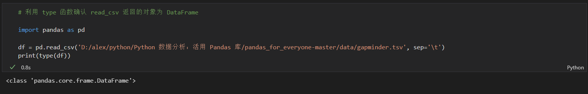
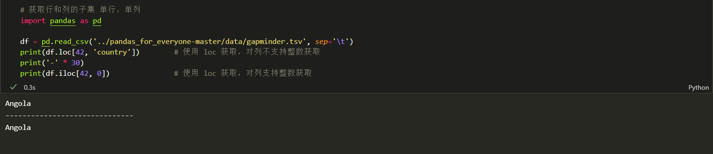

<!-- code_chunk_output -->
- [1.1 简介](#11-简介)
  - [概念一栏](#概念一栏)
  - [目标](#目标)
- [1.2 加载数据集](#12-加载数据集)
  - [示例代码（加载数据集）](#示例代码加载数据集)
  - [利用 type 函数检查 read_csv 返回的对象是否是 DataFrame](#利用-type-函数检查-read_csv-返回的对象是否是-dataframe)
  - [利用 shape 属性，获取 DataFrame 的行数和列数](#利用-shape-属性获取-dataframe-的行数和列数)
  - [利用 columns 属性得到 DataFrame 的列名](#利用-columns-属性得到-dataframe-的列名)
  - [获取每列数据类型](#获取每列数据类型)
  - [获取每列更多数据信息](#获取每列更多数据信息)
  - [表1-1 Pandas 数据类型和 Python 数据类型](#表1-1-pandas-数据类型和-python-数据类型)
- [1.3 查看列、行和单元格](#13-查看列行和单元格)
  - [1.3.1 获取列子集](#131-获取列子集)
    - [1.3.1.1 根据名称获取列子集](#1311-根据名称获取列子集)
      - [显示指定列最后 5 行](#显示指定列最后-5-行)
        - [根据列名指定多列](#根据列名指定多列)
    - [1.3.1.2 在 Pandas v0.20 中通过索引位置获取列子集](#1312-在-pandas-v020-中通过索引位置获取列子集)
      - [通过索引位置来获取指定列](#通过索引位置来获取指定列)
  - [1.3.2 获取行子集](#132-获取行子集)
    - [表1-2 获取行子集的不同方法](#表1-2-获取行子集的不同方法)
    - [1.3.2.1 通过索引标签获取行子集：loc](#1321-通过索引标签获取行子集loc)
      - [利用 DataFrame 的 loc 属性基于索引标签获取行子集](#利用-dataframe-的-loc-属性基于索引标签获取行子集)
      - [获取最后一行代码](#获取最后一行代码)
      - [利用tail方法获取最后一行](#利用tail方法获取最后一行)
      - [查看 loc、head 与 tail 返回的数据类型](#查看-lochead-与-tail-返回的数据类型)
      - [选取多行](#选取多行)
    - [1.3.2.2 通过行号获取行：iloc](#1322-通过行号获取行iloc)
      - [通过传入-1获取最后一行数据](#通过传入-1获取最后一行数据)
      - [使用相对位置也可](#使用相对位置也可)
    - [1.3.2.3 Pandas v0.20 不再支持使用 ix 获取行](#1323-pandas-v020-不再支持使用-ix-获取行)
  - [1.3.3 混合](#133-混合)
    - [1.3.3.1 获取列子集](#1331-获取列子集)
      - [通过 `df.loc[:, [列]]` `df.iloc[:, [列]]` 获取列子集](#通过-dfloc-列-dfiloc-列-获取列子集)
    - [1.3.3.2 通过范围选择列子集](#1332-通过范围选择列子集)
      - [通过范围选择列子集](#通过范围选择列子集)
    - [1.3.3.3 使用切片语法获取列子集](#1333-使用切片语法获取列子集)
      - [使用切片语法获取列子集](#使用切片语法获取列子集)
    - [1.3.3.4 获取行和列的子集](#1334-获取行和列的子集)
    - [1.3.3.5 获取多行和多列](#1335-获取多行和多列)
      - [获取多行多列](#获取多行多列)
- [1.4 分组和聚合计算](#14-分组和聚合计算)
  - [1.4.1 分组方式](#141-分组方式)
    - [计算每年的平均预期寿命](#计算每年的平均预期寿命)
    - [使用多个变量对数据进行分组和分层](#使用多个变量对数据进行分组和分层)
    - [reset_index示例](#reset_index示例)
  - [1.4.2 分组频率计数](#142-分组频率计数)
- [1.5 基本绘图](#15-基本绘图)
  - [基本绘图示例](#基本绘图示例)
- [1.6 小结](#16-小结)

# 1.1 简介

- Pandas 是一个用于数据分析的开源 Python 库
- 让 Python 能处理电子表格等数据，提供了数据快速加载、操作、对齐与合并等功能。
- 这些增强特性是通过引入两种数据实现的：Series 和 DataFrame。
  - Series 是 DataFrame 的单列。
  - DataFrame 可以看做由 Series 对象组成的字典或集合
&nbsp;

- 为什么要用 Python 这样的编程语言和 Pandas 这样的工具来处理数据？
  - 为了实现自动化和再现性

## 概念一栏

1. 预备知识（附录）：
   1. 相对目录
   2. 调用函数
   3. 点表示法
   4. 原生 Python 容器
   5. 变量赋值
&nbsp;

2. 主要内容:
   1. 加载数据
   2. 取数据子集
   3. 切片
   4. 过滤
   5. 基本 Pandas 数据结构（Series、DataFrame）
   6. 类 Python 容器（list、numpy.ndarray）
   7. 基本索引

## 目标

1. 加载带分隔符的简单数据文件
2. 计算加载的行数和列数
3. 确定加载哪类数据
4. 通过取行和列的子集来查看数据的不同部分

# 1.2 加载数据集

- 当给定一个数据集时，首先要加载它并查看其结构和内容
  - 查看数据集最简单的方法是检查特定的行和列，并对他们取子集
  - 可以查看每列中存储信息的类型，并通过聚合描述性统计来发现模式
&nbsp;

- 导入 Pandas 库之后，我们可以调用 read_csv 函数来加载 CSV 数据文件

## 示例代码（加载数据集）

```python
# 利用 read_csv 读取文件头

import pandas

df = pandas.read_csv('D:/alex/python/Python 数据分析：活用 Pandas 库/pandas_for_everyone-master/data/gapminder.tsv', sep='\t')
print(df.head())
```

运行结果：


## 利用 type 函数检查 read_csv 返回的对象是否是 DataFrame

```python
# 利用 type 函数确认 read_csv 返回的对象为 DataFrame

import pandas as pd

df = pd.read_csv('D:/alex/python/Python 数据分析：活用 Pandas 库/pandas_for_everyone-master/data/gapminder.tsv', sep='\t')
print(type(df))
```

运行结果：



- 当处理多个 Python 对象，并且想知道当前处理的是哪个对象时，type 函数会非常有用

## 利用 shape 属性，获取 DataFrame 的行数和列数

```python
# 利用 shape 属性，获取 DataFrame 对象的行数和列数

import pandas as pd

df = pd.read_csv('D:/alex/python/Python 数据分析：活用 Pandas 库/pandas_for_everyone-master/data/gapminder.tsv', sep='\t')
print(df.shape)
```

运行结果：


- shape 属性会返回一个元祖，第一个值是行数，第二个值是列数。
  - 即此 gapminder 文件有 1704 行，6 列
&nbsp;

- 首次查看数据集，往往要了解数据集中的行数和列数。
- 可以通过 DataFrame 的 columns 属性来得到列名

## 利用 columns 属性得到 DataFrame 的列名

```python
# 获取列名

import pandas as pd

df = pd.read_csv('D:/alex/python/Python 数据分析：活用 Pandas 库/pandas_for_everyone-master/data/gapminder.tsv', sep='\t')
print(df.columns)
```

运行结果：


- 每列的数据类型必须相同（类似数据库里的表，字段）
- 可以使用 DataFrame 的 dtypes 属性或 info 方法来验证每列的数据类型

## 获取每列数据类型

```python
# 获取每列的数据类型，即 dtypes 属性

import pandas as pd

df = pd.read_csv('D:/alex/python/Python 数据分析：活用 Pandas 库/pandas_for_everyone-master/data/gapminder.tsv', sep='\t')
print(df.dtypes)
```

运行结果：


## 获取每列更多数据信息

```python
# 获取更多数据信息，即 info

import pandas as pd

df = pd.read_csv('D:/alex/python/Python 数据分析：活用 Pandas 库/pandas_for_everyone-master/data/gapminder.tsv', sep='\t')
print(df.info())
```

运行结果：


## 表1-1 Pandas 数据类型和 Python 数据类型

|Pandas 类型|Python 类型|说明|
|:----|:----|:----|
|object|string|最常用的数据类型|
|int64|int|整型（64，不是指64字节|
|float64|float|带小数的数字|
|datetime64|datetime|Python 标准库包含 datetime，但默认不加载，需要导入才能使用|

# 1.3 查看列、行和单元格

- 查看数据的最佳方法是分别查看数据的各个子集
- 可以选择查看数据特定行、列或值

> Python 容器：Python中，可包含其他对象的对象，称之为“容器”。容器是一种数据结构。
> 常用的容器主要划分为两种：序列（如：列表、元组等）和映射（如：字典）。
> 序列中，每个元素都有下标，它们是有序的。映射中，每个元素都有名称（又称“ 键 ”），它们是无序的。
> 除了序列和映射之外，还有一种需要注意的容器——“ 集合 ”。

## 1.3.1 获取列子集

- 可以通过名称、位置或范围来查看指定列的数据

### 1.3.1.1 根据名称获取列子集

- 把要访问的列名放入 DataFrame[] 对象的方括号中，类似字典的引用

```python
# 仅获取 country 列，并将其保存到一个变量中

import pandas as pd

df = pd.read_csv('D:/alex/python/Python 数据分析：活用 Pandas 库/pandas_for_everyone-master/data/gapminder.tsv', sep='\t')
country_df = df['country']  # 利用字典来理解，即键为 country，值为对应列的数据，因此通过 对象[健名] 的方式可以截取出指定列的数据
print(country_df.head())
```

运行结果：


#### 显示指定列最后 5 行

```python
# 仅获取 country 列，显示其最后 5 行

import pandas as pd

df = pd.read_csv('D:/alex/python/Python 数据分析：活用 Pandas 库/pandas_for_everyone-master/data/gapminder.tsv', sep='\t')
country_df = df['country']  # 利用字典来理解，即键为 country，值为对应列的数据，因此通过 对象[健名] 的方式可以截取出指定列的数据
print(country_df.tail())
```

运行结果：


---

- 通过列名指定多列，需要传入一个包含列名的 Python 列表

##### 根据列名指定多列

```python
# 查看 country、continent、year 列

import pandas as pd

columns = ['country', 'continent', 'year']
df = pd.read_csv('D:/alex/python/Python 数据分析：活用 Pandas 库/pandas_for_everyone-master/data/gapminder.tsv', sep='\t')
subset = df[columns]  # 直接传入列表，会出现中括号里面嵌入中括号的情况，也不方便修改，因此将列表赋值给变量，再传入变量
print(subset.head())
print('-' * 30)
print(subset.tail())
```

运行结果：


### 1.3.1.2 在 Pandas v0.20 中通过索引位置获取列子集

- 将 DataFrame 的所有列的集合，看做一个列表，通过列表的取值，来获取对应的列数据
- v0.20 开始，无法通过传入整数列表来获取列子集

#### 通过索引位置来获取指定列

```python
# 通过索引位置来获取指定列

import pandas as pd

df = pd.read_csv('D:/alex/python/Python 数据分析：活用 Pandas 库/pandas_for_everyone-master/data/gapminder.tsv', sep='\t')
subset1 = df[lambda df: df.columns[0]]                 # 传入索引位置，可以获取指定列，方法从博客来，后面需要多注意写法
print(subset1)
print('-' * 30)

try:
    subset2 = df[lambda df: df.columns[0,2]]           # 传入整数列表，会报错
    print(subset2)
except IndexError:
    print('无法通过整数列表获取指定列子集')
```

运行结果：


## 1.3.2 获取行子集

- 获取行子集有多种方法，可以通过行名或行索引

### 表1-2 获取行子集的不同方法

|获取行子集的方法|说明|
|:---|:---|
|loc|基于索引标签获取行子集（行名）|
|iloc|基于行索引获取子集（行号）|
|ix（Pandas v0.20 不再支持|基于索引标签或行索引获取行子集|

### 1.3.2.1 通过索引标签获取行子集：loc

- 可以把索引标签看做行名
- 默认情况下，Pandas 会使用行号填充标签索引，计数从 0 开始
- 如果处理时间序列，索引标签将是某种时间戳

#### 利用 DataFrame 的 loc 属性基于索引标签获取行子集

```python
# 通过索引位置来获取指定行

import pandas as pd

df = pd.read_csv('D:/alex/python/Python 数据分析：活用 Pandas 库/pandas_for_everyone-master/data/gapminder.tsv', sep='\t')
print(df.loc[0])
print('-' * 30)
print(df.loc[99])
print('-' * 30)
try:                        
    print(df.loc[-1])                                   # 使用 -1 来获取最后一行会报错，示例中不存在这样的标签（与实际的列表有区别）
except KeyError:
    print('无法使用 -1 获取最后一行！！！')
```

运行结果：


- 要获取最后一行，需要编写 python 代码来计算行数，再将最后一行的行数传递给 loc

#### 获取最后一行代码

```python
# 准确获取最后一行

import pandas as pd

df = pd.read_csv('D:/alex/python/Python 数据分析：活用 Pandas 库/pandas_for_everyone-master/data/gapminder.tsv', sep='\t')
# 通过 shape 的第一个值获取总行数
number_of_rows = df.shape[0]
# 总行数减 1，得到最后一个索引值，赋值给变量 last_row_index
last_row_index = number_of_rows - 1
# 将最后一行索引值传递给 loc 属性
print(df.loc[last_row_index])
```

运行结果：


- 也可以使用 tail 方法返回最后一行，tail 方法默认返回最后 5 行
- 向其传入 1 即可返回最后一行

#### 利用tail方法获取最后一行

```python
# 利用 tail 方法获取最后一行
import pandas as pd

df = pd.read_csv('D:/alex/python/Python 数据分析：活用 Pandas 库/pandas_for_everyone-master/data/gapminder.tsv', sep='\t')
print(df.tail(n=1))  # 输出最后一行
```

运行结果：


- tail() 与 loc 以不同的方式返回结果
- 通过 type 方法查看返回的数据类型

#### 查看 loc、head 与 tail 返回的数据类型

```python
# 查看 loc、head 和 tail 返回的数据类型
import pandas as pd

df = pd.read_csv('D:/alex/python/Python 数据分析：活用 Pandas 库/pandas_for_everyone-master/data/gapminder.tsv', sep='\t')
subset_loc = df.loc[0]
subset_head = df.head(n=1)
subset_tail = df.tail(n=1)

print(type(subset_loc))         # 使用 loc 获取一行数据返回的数据类型
print(type(subset_head))        # 使用 head 获取一行数据返回的数据类型
print(type(subset_tail))        # 使用 tail 获取一行数据返回的数据类型
```

运行结果：


- 可以通过传入列表的方式，选取多行

#### 选取多行

```python
# 选取第1、100 和 1000 行
# 使用传入列表的方式
import pandas as pd

df = pd.read_csv('D:/alex/python/Python 数据分析：活用 Pandas 库/pandas_for_everyone-master/data/gapminder.tsv', sep='\t')
print(df.loc[[0, 99, 999]])
```

运行结果：


### 1.3.2.2 通过行号获取行：iloc

- iloc 与 loc 功能相同，但是 iloc 使用行索引号来获取行
- 索引标签 不限于行号
- 获取第1行、第100行，iloc 和 iloc 的代码可以一直
- 但 iloc 可以传入 -1 来获取最后一行数据

#### 通过传入-1获取最后一行数据

```python
# 通过传入-1获取最后一行数据，更换了文档位置，所以路径发生改变
import pandas as pd

p = 'C:/Users/Administrator/Documents/GitHub/xunhuanke/python/Python 数据分析：活用 Pandas 库/pandas_for_everyone-master/data/'
df = pd.read_csv(p + 'gapminder.tsv', sep='\t')
print(df.iloc[-1])
```

#### 使用相对位置也可

```python
# 通过传入-1获取最后一行数据
import pandas as pd

df = pd.read_csv('../pandas_for_everyone-master/data/gapminder.tsv', sep='\t')
print(df.iloc[-1])
```

运行结果：


### 1.3.2.3 Pandas v0.20 不再支持使用 ix 获取行

内容略

## 1.3.3 混合

- loc 和 iloc 属性可用于获取列、行或二者的子集
- loc 和 iloc 的一般语法是使用带逗号的方括号
  - 逗号左边是待取子集的行值
  - 逗号右边是待取子集的列值
  - 即 `df.loc[[行], [列]]` 或 `df.iloc[[行], [列]]`

### 1.3.3.1 获取列子集

- Python 切片语法使用（:），如果只用一个冒号，则会取出所有数据
- 可通过 `df.loc[:, [列]]` `df.iloc[:, [列]]` 获取列子集

#### 通过 `df.loc[:, [列]]` `df.iloc[:, [列]]` 获取列子集

```python
# 通过 `df.loc[:, [列]]` `df.iloc[:, [列]]` 获取列子集
import pandas as pd

df = pd.read_csv('../pandas_for_everyone-master/data/gapminder.tsv', sep='\t')
subset1 = df.loc[:, ['year', 'pop']]
print(subset1.head())
print('-' * 30)

subset2 = df.iloc[:, [2, 4, -1]]        # iloc 支持使用整数来获取列，-1 表示获取最后一列
print(subset2.head())
```

运行结果：


- 如果 loc 和 iloc 的指定错了，会引发错误

### 1.3.3.2 通过范围选择列子集

- 可以使用 Python 内置的 range 函数创建一个值的范围
  - 在这种情况下，可以指定起始值和结束值，Python 会自动创建介于两者之间的值
  - 默认情况，起始值、结束值之间的值都会创建，包含左侧值，不包含右侧值
&nbsp;

- Python 3 中，range 函数会返回一个生成器
- iloc 只能通过整数列表对列取子集，因此需要将 range 函数返回的生成器，转换为列表

#### 通过范围选择列子集

```python
# 通过范围选择列子集
import pandas as pd

df = pd.read_csv('../pandas_for_everyone-master/data/gapminder.tsv', sep='\t')

small_range = list(range(5))            # 获取 0-4 的整数，包括0和4
subset = df.iloc[:, small_range]        # 使用 range 取 DataFrame 子集
print(subset.head())
```

运行结果：


> 这种把生成器转换为列表的做法略显笨拙，可以使用 Python 的切片语法来解决该问题

### 1.3.3.3 使用切片语法获取列子集

- Python 的切片语法（:）与 range 函数的语法类似
- 使用 range 函数时，用逗号把起始值、结束值和步长隔开，而在切片语法中使用冒号来分割

#### 使用切片语法获取列子集

```python
# 通过切片语法选择列子集
import pandas as pd

df = pd.read_csv('../pandas_for_everyone-master/data/gapminder.tsv', sep='\t')

small_range = list(range(5))                # 获取 0-4 的整数，包括0和4
subset1 = df.iloc[:, small_range]           # 使用 range 取 DataFrame 子集
print(subset1.head())

print('-' * 30)

subset2 = df.iloc[:, :5]                    # 使用切片语法获取列子集
print(subset2.head())
```

运行结果：


### 1.3.3.4 获取行和列的子集

- 要选择特定的行或特定列，可以拔要选的行放在逗号左边，把要选的列放在逗号右边

```python
# 获取行和列的子集 单行，单列
import pandas as pd

df = pd.read_csv('../pandas_for_everyone-master/data/gapminder.tsv', sep='\t')
print(df.loc[42, 'country'])        # 使用 loc 获取，对列不支持整数获取
print('-' * 30)
print(df.iloc[42, 0])               # 使用 loc 获取，对列支持整数获取
```

运行结果：



### 1.3.3.5 获取多行和多列

- 可以把获取单行和单列的语法与获取多行和多列的语法结合起来，用以获取数据的各种切片

#### 获取多行多列

```python
# 获取多行多列
import pandas as pd

df = pd.read_csv('../pandas_for_everyone-master/data/gapminder.tsv', sep='\t')
print(df.iloc[[0, 99, 999], [0, 3, 5]])                             # 通过 iloc 获取多行多列
print('-' * 30)
print(df.loc[[0, 99, 999], ['country', 'lifeExp', 'gdpPercap']])    # 通过 loc 获取多行多列
```

运行结果：


# 1.4 分组和聚合计算

- 思考问题
  - 1. 数据中每年的平均预期寿命是多少？平均预期寿命、人口和 GDP 是多少？
  - 2. 如果按州对数据进行分层，并进行同样的计算，结果会怎样？
  - 3. 每个州列出了多少个国家和地区？

## 1.4.1 分组方式

- 对于上述问题，需要进行分组计算（即聚合），在 SQL 中的聚合，GROUP BY 方法，可以分组求平均数、总数等
- 可以把分组计算看作“分隔-应用-组合”（split-apply-combine）的国产
  - 首先把数据分割成若干部分
  - 然后把选择的函数（或计算）应用于各部分
  - 最后把所有独立的分隔计算组合成一个 DataFrame
- 可以使用 DataFrame 的 groupby 方法完成分组/聚合计算

### 计算每年的平均预期寿命

```python
# 计算每年的平均预期寿命
# 按照年份对数据进行分组，然后获取 lifrExp 列，计算平均值

import pandas as pd

df = pd.read_csv('../pandas_for_everyone-master/data/gapminder.tsv', sep='\t')

print(df.groupby('year')['lifeExp'].mean())
```

运行结果：


代码解析：

- 第一步，创建一个分组对象，即 `df.groupby('year')`
- 第二步，选择需要的列，好做计算，`df.groupby('year')['lifeExp]`
- 第三步，进行计算，由于 lifeExp 列的数据类型是 float64 可以计算数字向量的平均值
  - 即 `df.groupby('year')['lifeExp].mean()`

### 使用多个变量对数据进行分组和分层

```python
# 在 python 中，可以使用反斜杠 把一个长行分割为多行

import pandas as pd

df = pd.read_csv('../pandas_for_everyone-master/data/gapminder.tsv', sep='\t')

# 方式1
multi_group_var1 = df.\
    groupby(['year', 'continent'])\
    [['lifeExp', 'gdpPercap']].\
    mean()
print(multi_group_var1)
print('-' * 50)

# 方式2
multi_group_var2 = df.groupby(['year', 'continent'])[['lifeExp', 'gdpPercap']].mean()
print(multi_group_var2)
```

运行结果：


- 上面输出按照年份和州进行了分组
  - 针对每个 “年份-州” 对，计算相应的平均预期寿命和平均 GDP
- 这些年份和州的“列名”不在同一行
- 年份和州的行索引之间存在某种层级结构
- 如果想平铺 DataFrame ，可以使用 reset_index 方法
  
### reset_index示例

```python
# reset_index 方法示例

import pandas as pd

df = pd.read_csv('../pandas_for_everyone-master/data/gapminder.tsv', sep='\t')

multi_group_var = df.groupby(['year', 'continent'])[['lifeExp', 'gdpPercap']].mean()
flat = multi_group_var.reset_index()

print(flat.head(15))
```

运行结果：


## 1.4.2 分组频率计数

- nunique 方法或 value_counts 方法来获取 Pandas Series 的唯一值计数和频率计数

```python
# 使用 nunique() 方法计算 Series 中唯一值的数目
import pandas as pd

df = pd.read_csv('../pandas_for_everyone-master/data/gapminder.tsv', sep='\t')
print(df.groupby('continent')['country'].nunique())
print('-' * 50)
print(df.groupby('continent')['country'].value_counts())
```

运行结果：


- nunique 方法计算，得出的是 大洲中国家数目
- value_counts 方法计算，得出的是 按大洲、国家分组，获得每个国家被提及的次数

# 1.5 基本绘图

- 可视化在数据处理的每个步骤都非常重要
  - 在理解或清理数据时，可视化有助于识别数据的趋势，并展示最终的发现
  
## 基本绘图示例

```python
# 基本绘图示例
import pandas as pd

df = pd.read_csv('../pandas_for_everyone-master/data/gapminder.tsv', sep='\t')
global_yearly_life_expectancy = df.groupby('year')['lifeExp'].mean()
global_yearly_life_expectancy.plot()

```


# 1.6 小结

- 介绍了如何加载简单的数据集，并查看特定结果
- ==做数据分析时，目标是产生可复用的结果，避免执行重复性的任务，而借助脚本语言可以灵活实现==
