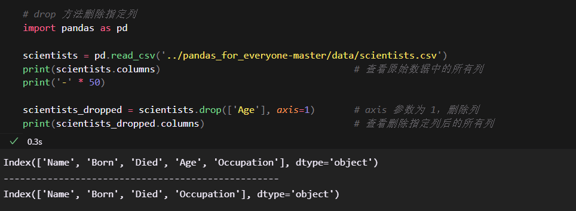

<!-- @import "[TOC]" {cmd="toc" depthFrom=1 depthTo=6 orderedList=false} -->
<!-- code_chunk_output -->
- [2.1 简介](#21-简介)
  - [2.1.1 概念一览](#211-概念一览)
  - [2.1.2 目标](#212-目标)
- [2.2 创建数据](#22-创建数据)
  - [2.2.1 创建 Series](#221-创建-series)
    - [创建 Series 示例](#创建-series-示例)
    - [为Series的值指定名称](#为series的值指定名称)
  - [2.2.2 创建 DataFrame](#222-创建-dataframe)
    - [创建 DataFrame 示例](#创建-dataframe-示例)
    - [指定列顺序示例](#指定列顺序示例)
    - [OrderedDict函数示例](#ordereddict函数示例)
- [2.3 Series](#23-series)
  - [输出Series对象索引和值](#输出series对象索引和值)
  - [利用属性获取第一个索引（key）](#利用属性获取第一个索引key)
  - [表2-1 Series 的一些属性](#表2-1-series-的一些属性)
  - [2.3.1 类似于 ndarray 的 Series](#231-类似于-ndarray-的-series)
    - [2.3.1.1 Series 方法](#2311-series-方法)
      - [Series方法示例](#series方法示例)
    - [表2-2 Series 的一些方法](#表2-2-series-的一些方法)
  - [2.3.2 布尔子集：Series](#232-布尔子集series)
    - [describe方法示例](#describe方法示例)
    - [获取大于平均值的年龄](#获取大于平均值的年龄)
    - [测试 ages > ages.mean()](#测试-ages--agesmean)
  - [2.3.3 操作自动对齐和向量化（广播）](#233-操作自动对齐和向量化广播)
    - [2.3.3.1 同长度向量](#2331-同长度向量)
    - [2.3.3.2 向量和整数（标量）运算](#2332-向量和整数标量运算)
    - [2.3.3.3 不同长度向量间的运算](#2333-不同长度向量间的运算)
    - [2.3.3.4 带有常见索引标签的向量（自动对齐）](#2334-带有常见索引标签的向量自动对齐)
      - [依据索引标签自动对齐](#依据索引标签自动对齐)
- [2.4 DataFrame](#24-dataframe)
  - [2.4.1 布尔子集：DataFrame](#241-布尔子集dataframe)
    - [使用布尔向量获取部分数据行](#使用布尔向量获取部分数据行)
    - [表2-3 获取 DataFrame 子集的一些方法](#表2-3-获取-dataframe-子集的一些方法)
  - [2.4.2 操作自动对齐和向量化（广播）](#242-操作自动对齐和向量化广播)
    - [2.4.2.1 第一步：从 scientists DataFrame 获取两个子集](#2421-第一步从-scientists-dataframe-获取两个子集)
      - [示例代码（获取两个子集）](#示例代码获取两个子集)
    - [2.4.2.1 第二步：DataFrame 和标量进行运算](#2421-第二步dataframe-和标量进行运算)
      - [示例代码（DataFrame 和标量进行运算）](#示例代码dataframe-和标量进行运算)
- [2.5 更改 Series 和 DataFrame](#25-更改-series-和-dataframe)
  - [2.5.1 添加列](#251-添加列)
    - [把Born列格式转化为datetime](#把born列格式转化为datetime)
    - [创建新列](#创建新列)
  - [2.5.2 直接更改列](#252-直接更改列)
    - [查看Age列原始值](#查看age列原始值)
    - [把值打乱](#把值打乱)
    - [把Age列打乱两次](#把age列打乱两次)
    - [计算在世天数](#计算在世天数)
    - [使用astype方法把天数转换成年](#使用astype方法把天数转换成年)
  - [2.5.3 删除值](#253-删除值)
  - [drop 方法删除指定列](#drop-方法删除指定列)
- [2.6 导出和导入数据](#26-导出和导入数据)
  - [2.6.1 保存数据](#261-保存数据)
    - [2.6.1.1 Series](#2611-series)
      - [to_pickle 方法保存数据](#to_pickle-方法保存数据)
    - [2.6.1.2 DataFrame](#2612-dataframe)
    - [2.6.1.3 读取 .pickle 文件](#2613-读取-pickle-文件)
  - [2.6.2 CSV](#262-csv)
    - [2.6.2.1 删除行号](#2621-删除行号)
    - [2.6.2.2 导入 CSV 数据](#2622-导入-csv-数据)
  - [2.6.3 Excel](#263-excel)
    - [2.6.3.1 Series](#2631-series)
    - [2.6.3.2 DataFrame](#2632-dataframe)
  - [2.6.4 feather 文件格式](#264-feather-文件格式)
  - [2.6.5 其他数据输出格式](#265-其他数据输出格式)
- [2.7 小结](#27-小结)
<!-- code_chunk_output -->

# 2.1 简介

- 第1章介绍了 Pandas 的 DataFrame 对象和 Series 对象
  - 这些数据结构与 Python 中用于索引和标签的原生数据容器（列表和字典）类似
  - 也具备一些其他特性，便于数据处理

## 2.1.1 概念一览

1. 预备知识
   1. 容器
   2. 使用函数
   3. 取子集和建索引
&nbsp;

2. 加载人工数据
&nbsp;

3. Series
   1. 创建 Series
      1. dict
      2. ndarray
      3. scalar
      4. lists
   2. 切片
&nbsp;

4. DataFrame

## 2.1.2 目标

1. 加载人工数据
2. 了解 Series 对象
3. 掌握 Series 对象的基本操作
4. 了解 DataFrame 对象
5. 有条件地获取子集以及切片和建索引
6. 存储数据

# 2.2 创建数据

- 无论是手动输入数据还是创建小型测试示例，都需要了解如何在不从文件加载数据的情况下创建 DataFrame
- 当遇到关于 StackOverFlow 错误的问题时，会很有用

## 2.2.1 创建 Series

- 在 Pandas 中，Series 是一维容器，类似于 Python 内置的列表
  - 这种数据集类型标识 DataFrame 中的每一列
  - 在 DataFrame 中每一列的数据类型必须相同
&nbsp;

- 可以把 DataFrame 看作由 Series 对象组成的字典，其中每个键都是列名，值是 Series
&nbsp;

- 与 NumPy 库中的 ndarray 表现出的行为是相同的
&nbsp;

- 创建 Series 最简单的方法是传入一个 Python 列表
  - 如果传入是混合类型的列表，将会使用最常见的类型，通常 dtype 为对象（object）
  - 类似于 SQL 中 VARCHAR，是一个字符串，什么都可以包含

### 创建 Series 示例

```python
# 创建 Series
import pandas as pd

s = pd.Series(['banana', 42])
print(s)
```

运行结果:


- 左边的行号实际是 Series 的索引
- 可以为 Series 中的值指定一个“名称”

### 为Series的值指定名称

```python
# 为Series的值指定名称
import pandas as pd

s = pd.Series(['Wes Mckinney', 'Creator of Pandas'], index=['Person', 'Who'])
print(s)
```

运行结果:


## 2.2.2 创建 DataFrame

- 字典是创建 DataFrame 最常用的方法
  - 键 代表列名
  - 值 是列的内容

### 创建 DataFrame 示例

```python
# 创建 DataFrame
import pandas as pd

scientists = pd.DataFrame({
    'Name': ['Rosaline Franklin', 'William Gosset'],
    'Occupation': ['Chemist', 'Statistician'],
    'Born': ['19920-07-25', '1876-06-13'],
    'Died': ['1958-04-16', '1937-10-16'],
    'Age': [37, 61]
})

print(scientists)
```

运行结果:


- 这里输出的时候，顺序不是固定的，实际上是随机排序
- 可以使用 columns 参数指定列的顺序
- 如果要把 name 列作为索引可以使用 index 参数

### 指定列顺序示例

```python
# 指定列顺序，指定 name 为索引
import pandas as pd

scientists = pd.DataFrame(
    data={
        'Occupation': ['Chemist', 'Statistician'],
        'Born': ['1920-07-25', '1876-06-13'],
        'Died': ['1958-04-16', '1937-10-16'],
        'Age': [37, 61]},
    index=['Rosaline Franklin', 'William Gosset'],
    columns=['Occupation', 'Born', 'Died', 'Age'])

print(scientists)
```


- 上面输出的顺序无法保障，因为 Python 字典本身没有顺序
- 如果想用有序字典，就需要使用 collections 模块中的 OrderedDict
- 实操中，不能只使用 OrderedDict 函数包装字典，因为创建字典并将其传递到 OrderedDict 函数中的时候，顺序已经变了

### OrderedDict函数示例

```python
# OrderedDict 函数后面跟着圆括号，圆括号中又有中括号，而后每个圆括号包含一列的内容
import pandas as pd
from collections import OrderedDict

scientists = pd.DataFrame(OrderedDict([
    ('Name', ['Rosaline Franklin', 'William Gosset']),
    ('Occupation', ['Chemist', 'Statistician']),
    ('Born', ['1920-07-25', '1876-06-13']),
    ('Died', ['1958-04-16', '1937-10-16']),
    ('Age', [37, 61])
    ])
)
print(scientists)
```

运行结果:


# 2.3 Series

- 使用 DataFrame 的 loc 属性获取 scientists 的第一行，就会得到一个 Series 对象

```python
# Series 示例
import pandas as pd

# 创建名为 scientists 的 DataFrame，带有索引标签
scientists = pd.DataFrame(
    data={
        'Occupation': ['Chemist', 'Statistician'],
        'Born': ['1920-07-25', '1876-06-13'],
        'Died': ['1958-04-16', '1937-10-16'],
        'Age': [37, 61]
    },
    index=['Rpsaline Franklin', 'William Gosset'],
    columns=['Occupation', 'Born', 'Died', 'Age']
)

# 使用行索引标签进行选择
first_row = scientists.loc['William Gosset']
print(type(first_row))
print('-' * 50)
print(first_row)
```

运行结果:


- 从 type 可知，通过 loc 属性获取的 scientists 第一行数据，是一个 Series 对象
- 输出 Series 时，第一“列”输出索引，第二“列”输出值

## 输出Series对象索引和值

```python
# 输出 Series 对象索引和值
import pandas as pd

# 创建名为 scientists 的 DataFrame，带有索引标签
scientists = pd.DataFrame(
    data={
        'Occupation': ['Chemist', 'Statistician'],
        'Born': ['1920-07-25', '1876-06-13'],
        'Died': ['1958-04-16', '1937-10-16'],
        'Age': [37, 61]
    },
    index=['Rpsaline Franklin', 'William Gosset'],
    columns=['Occupation', 'Born', 'Died', 'Age']
)

# 使用行索引标签进行选择
first_row = scientists.loc['William Gosset']
print(first_row.index)      # 输出 Series 对象的索引
print('-' * 50)
print(first_row.keys())     # keys 是 Series 对象的一个方法，是 index 属性的别名
print('-' * 50)
print(first_row.values)     # 输出 Series 对象的值
```

运行结果:


- 关于属性、方法的更多内容，参考附录S
  - 属性指对象的特性
  - 方法是要执行的一些计算或操作
&nbsp;

- loc、iloc 的取子集语法由所有属性组成，取子集时并不用圆括号，而是方括号
- keys 是一个方法，想要获取第一个键，需要在调用该方法后再使用方括号

## 利用属性获取第一个索引（key）

```python
# 利用属性获取第一个索引（key）
import pandas as pd

# 创建名为 scientists 的 DataFrame，带有索引标签
scientists = pd.DataFrame(
    data={
        'Occupation': ['Chemist', 'Statistician'],
        'Born': ['1920-07-25', '1876-06-13'],
        'Died': ['1958-04-16', '1937-10-16'],
        'Age': [37, 61]
    },
    index=['Rpsaline Franklin', 'William Gosset'],
    columns=['Occupation', 'Born', 'Died', 'Age']
)
first_row = scientists.loc['William Gosset']

print(first_row.index[0])       # 利用属性获取第一个索引（key），index 属性实现
print('-' * 50)
print(first_row.keys()[0])      # 利用属性获取第一个索引（key），keys 方法实现
```

运行结果:


## 表2-1 Series 的一些属性

|属性|说明|
|:----|:----|
|loc|使用索引值取子集|
|iloc|使用索引位置取子集|
|ix|使用索引值或索引位置取子集|
|dtype 或 dtypes|Series 内容的类型|
|T|Series 的转置矩阵|
|shape|数据的维数|
|size|Series 中元素的数量|
|values|ndarray 或类似于 ndarray 的 Series|

## 2.3.1 类似于 ndarray 的 Series

- Series 是 Pandas 的一种数据结构，Series 也称“向量”

### 2.3.1.1 Series 方法

- 首先从 scientists DataFrame 获取 Age 列（这是一个 Series）
- NumPy 是一个科学计算库，常用于处理数字向量
  - 可以把 Series 看做 numpy.ndarray 的扩展
  - 它们的属性和方法有重叠
- 针对数字向量，可以进行一些常见的计算，例如描述性统计

#### Series方法示例

```python
# 获取 Age 列
import pandas as pd

# 创建名为 scientists 的 DataFrame，带有索引标签
scientists = pd.DataFrame(
    data={
        'Occupation': ['Chemist', 'Statistician'],
        'Born': ['1920-07-25', '1876-06-13'],
        'Died': ['1958-04-16', '1937-10-16'],
        'Age': [37, 61]
    },
    index=['Rpsaline Franklin', 'William Gosset'],
    columns=['Occupation', 'Born', 'Died', 'Age']
)
ages = scientists['Age']
print(ages)
print('-' * 50)

# 描述性统计
print('描述性统计如下：')
print('mean 方法求平均值：' + str(ages.mean()))
print('min 方法求最小值' + str(ages.min()))
print('max 方法求最大值' + str(ages.max()))
print('std 求标准方差' + str(ages.std()))
```

运行结果:


### 表2-2 Series 的一些方法

|Series 方法|说明|
|:----|:----|
|append|连接两个或多个 Series|
|corr|计算与另一个 Series 的相关系数|
|cov|计算与另一个 Series 的协方差|
|describe|计算概括统计量|
|drop_duplicates|返回一个不含重复项的 Series|
|equals|判断两个 Series 是否有相同的元素|
|get_values|获取 Series 的值，功能和 values 属性相同|
|hist|绘制直方图|
|isin|逐个检查 Series 中的每个元素是否存在于参数指定的序列中|
|min|返回最小值|
|max|返回最大值|
|mean|返回算术平均值|
|median|返回中位数|
|mode|返回众数|
|quantile|返回指定位置的四分位数|
|replace|用指定值代替 Series 中的值|
|sample|返回 Series 的随机采样值|
|sort_values|对值进行排序|
|to_frame|把 Series 转换为 DataFrame|
|transpose|返回转置矩阵|
|unique|返回由唯一值组成的 numpy.ndarray|

## 2.3.2 布尔子集：Series

- 用于取数据子集的行或索引往往不确定，通常需要寻找满足（或不满足）特定计算或观测值的值
- 为了探究这些方法，下面使用大型数据集
- 调用 describe 方法可以获得多项描述性统计数据

### describe方法示例

```python
# describe 方法示例
import pandas as pd

scientists = pd.read_csv('../pandas_for_everyone-master/data/scientists.csv')
ages = scientists['Age']

print(ages)
print('-' * 50)
print(ages.describe())
print('-' * 50)
```

运行结果:


### 获取大于平均值的年龄


### 测试 ages > ages.mean()


- 上面的语句返回一个 Series，且其 dtype 为 bool
  - 也就是说，不仅可以使用标签和索引获取值的子集，还可以提供布尔向量
  - Python 有许多函数和方法，根据实现方式的不同，他们会返回标签、索引或布尔值

*提供布尔向量获取某些数据：*

```python
# 提供布尔向量获取某些数据
import pandas as pd

scientists = pd.read_csv('../pandas_for_everyone-master/data/scientists.csv')
ages = scientists['Age']
# 获取索引 0、1、4、5、7
manual_bool_values = [True, True, False, False, True, True, False, True] 
print(ages[manual_bool_values])
```

运行结果:


## 2.3.3 操作自动对齐和向量化（广播）

- 许多 Series 方法（以及 DataFrame 方法）都是向量化的，即这些方法会同时处理整个向量
  - 这种方法让代码更易读，并且通常可以通过优化来加速计算

### 2.3.3.1 同长度向量

- 如果两个长度相同的向量之间执行计算，所得向量的每个元素是两个向量对应元素的计算结果

*同长度向量计算示例：*

```python
# 同长度向量计算示例
import pandas as pd

scientists = pd.read_csv('../pandas_for_everyone-master/data/scientists.csv')
ages = scientists['Age']
print(ages + ages)      # 同长度向量相加
print(ages * ages)      # 同长度向量相乘
```

运行结果:


### 2.3.3.2 向量和整数（标量）运算

- 当对向量和标量进行运算时，标量会与向量中每个元素逐一进行计算

```python
# 向量和整数（标量）运算示例
import pandas as pd

scientists = pd.read_csv('../pandas_for_everyone-master/data/scientists.csv')
ages = scientists['Age']
print(ages + 100)       # 向量加100，每个元素都会加100
print(ages * 2)         # 向量乘2，每个元素都会乘2
```

运行结果:


### 2.3.3.3 不同长度向量间的运算

- 处理不同长度的向量时，处理方式取决于向量的类型
  - 对于 Series，对向量的操作会根据索引进行
  - 结果向量的其余元素会被填充为“缺失”值，用 NaN 表示，指“非数值”
&nbsp;

- 这种处理方式称为“广播”，在不同语言中各有区别
  - Pandas 中的“广播”是指不同 shape 的数组之间的运算方式
&nbsp;

- shape 可理解为形状，numpy 中不同 shape 可以进行运算，只要后缘长度相等即可，具体不做展开

*不同长度向量间的运算示例(shape相同）：*

```python
# 不同长度向量间的运算示例，shape 相同
import pandas as pd

scientists = pd.read_csv('../pandas_for_everyone-master/data/scientists.csv')
ages = scientists['Age']
print(ages + pd.Series([1, 100]))       # 前两个元素会对应位置相加，后面的会用 NaN 填充，表示 “非数值”
```

运行结果:


*不同长度向量间的运算示例(shape不同）：*

```python
# 不同长度向量间的运算示例，shape 不同
import pandas as pd
import numpy as np

scientists = pd.read_csv('../pandas_for_everyone-master/data/scientists.csv')
ages = scientists['Age']
print(ages + np.array([1, 100]))        # 提示 一个shape 为（8,0）一个为（2,0）不能进行运算，都是一维数据
```

运行结果:


### 2.3.3.4 带有常见索引标签的向量（自动对齐）

- Pandas 基本会自动对其数据，执行操作时，数据会尽可能依据索引标签进行对齐

#### 依据索引标签自动对齐

```python
# 依据索引标签自动对齐
import pandas as pd

scientists = pd.read_csv('../pandas_for_everyone-master/data/scientists.csv')
ages = scientists['Age']
rev_ages = ages.sort_index(ascending=False)     # 按索引倒序排列
print(ages * 2)
print(ages + rev_ages)                          # 自动按索引进行对齐后相加，因此两个输出结果相等
```

运行结果:


# 2.4 DataFrame

- DataFrame 是 Pandas 中最常见的对象
  - 可以把它看做 Python 存储电子表格式数据的方式
  - Series 数据结构的许多特征同样存在于 DataFrame 中

## 2.4.1 布尔子集：DataFrame

- 可以借助布尔向量从 DataFrame 在获取子集

### 使用布尔向量获取部分数据行

```python
# 使用布尔向量获取部分数据行
import pandas as pd

scientists = pd.read_csv('../pandas_for_everyone-master/data/scientists.csv')
print(scientists[scientists['Age'] > scientists['Age'].mean()])         # 根据布尔向量获取年龄大于平均年龄的数据行
```

运行结果:


### 表2-3 获取 DataFrame 子集的一些方法

|方法|执行结果|
|:----|:----|
|df[column_name]|单列|
|df\[[column1, column2,...]] |多列|
|df.loc[row_label]|使用行索引标签（行名）获取数据行|
|df.loc\[[label1, label2, ...]]|使用索引标签获取多行|
|df.iloc[row_number]|使用行号获取数据行|
|df.iloc\[[row1, row2, ...]]|使用行号获取多行|
|df.ix[label_or_number]|使用索引标签或编号获取数据行|
|df.ix\[[lab_num1, lab_num2,...]]|使用索引标签或编号获取多行|
|df[boor]|使用布尔值获取行|
|df\[[bool1, bool2,...]]|使用布尔值获取多行|
|df[start:stop:step]|使用切片方法获取数据行|

## 2.4.2 操作自动对齐和向量化（广播）

- Pandas 支持广播，广播源自 Numpy 库
  - 广播 实际描述的时候在类数据对象（比如 Series 和 DataFrame）之间执行操作的效果
  - 这些行为取决于对象的类型、长度以及与对象关联的标签

### 2.4.2.1 第一步：从 scientists DataFrame 获取两个子集

#### 示例代码（获取两个子集）

```python
# 从 scientists DataFrame 获取两个子集
import pandas as pd

scientists = pd.read_csv('../pandas_for_everyone-master/data/scientists.csv')
first_half = scientists[:4]
second_half = scientists[4:]

print(first_half)
print(second_half)
```

运行结果:


### 2.4.2.1 第二步：DataFrame 和标量进行运算

#### 示例代码（DataFrame 和标量进行运算）

```python
# DataFrame与标量运算
import pandas as pd

scientists = pd.read_csv('../pandas_for_everyone-master/data/scientists.csv')
print(scientists * 2)
```

运行结果:


# 2.5 更改 Series 和 DataFrame

## 2.5.1 添加列

- Born 和 Died 列的类型是 object，表明它们是字符串
- 可以把字符串转换成合适的 datetime 类型
  - 这样可以执行常见的日期和时间的操作
  - 如果日期有特定格式，可以提供自定义的格式

### 把Born列格式转化为datetime

```python
# 把Born列格式转化为datetime
import pandas as pd

scientists = pd.read_csv('../pandas_for_everyone-master/data/scientists.csv')
born_datetime = pd.to_datetime(scientists['Born'], format='%Y-%m-%d')
print(born_datetime)        # 可以看到 dtype 即数据类型变成 datetime64 了
```

运行结果:


- 可以创建一组新列，其中包含 object（字符串）日期的 datetime 表示形式

### 创建新列

```python
# 创建新列
import pandas as pd

scientists = pd.read_csv('../pandas_for_everyone-master/data/scientists.csv')

scientists['born_dt'], scientists['died_dt'] = (born_datetime, died_datetime)
print(scientists.head())
print(scientists.shape)
```

运行结果:


## 2.5.2 直接更改列

- 还可以直接为现有列赋新值

### 查看Age列原始值

略

### 把值打乱

```python
# 把Age列的值打乱
import pandas as pd
import random

scientists = pd.read_csv('../pandas_for_everyone-master/data/scientists.csv')
random.seed(42)
random.shuffle(scientists['Age'])

print(scientists['Age'])
```

运行结果:


- SettingWithCopyWarning: A value is trying to be set on a copy of a slice from a DataFrame
  - 提示信息翻译为：试图在 DataFrame 中的切片副本上设置一个值

- 本例需要使用 reset_index 方法，因为 sample 方法只选择行索引
  - 因此，如果试图重新指派它或再次使用它，打乱的值，将自动与索引对齐
- reset_index 中的 drop=True 参数指示 Pandas 不要把索引插入到 DataFrame 列中，以便保留其值

### 把Age列打乱两次

```python
# 把Age列打乱两次
import pandas as pd
import random

scientists = pd.read_csv('../pandas_for_everyone-master/data/scientists.csv')
scientists['Age'] = scientists['Age'].\
    sample(len(scientists['Age']), random_state=24).\
        reset_index(drop=True)      # 值保持随机化

print(scientists['Age'])
```

运行结果:


- 可以使用 datetime 重新计算“真实”年龄

### 计算在世天数

```python
# 计算在世天数
import pandas as pd

scientists = pd.read_csv('../pandas_for_everyone-master/data/scientists.csv')
born_datetime = pd.to_datetime(scientists['Born'], format='%Y-%m-%d')
died_datetime = pd.to_datetime(scientists['Died'], format='%Y-%m-%d')
scientists['born_dt'], scientists['died_dt'] = (born_datetime, died_datetime)
scientists['age_days_dt'] = (scientists['died_dt'] - scientists['born_dt'])

print(scientists)
```

运行结果:


### 使用astype方法把天数转换成年

```python
# 使用astype方法把天数转换成年
import pandas as pd

scientists = pd.read_csv('../pandas_for_everyone-master/data/scientists.csv')
born_datetime = pd.to_datetime(scientists['Born'], format='%Y-%m-%d')
died_datetime = pd.to_datetime(scientists['Died'], format='%Y-%m-%d')
scientists['born_dt'], scientists['died_dt'] = (born_datetime, died_datetime)
scientists['age_days_dt'] = (scientists['died_dt'] - scientists['born_dt'])
scientists['age_years_dt'] = scientists['age_days_dt'].astype('timedelta64[Y]')
print(scientists)
```

运行结果：


> Pandas 中的许多函数和方法都有 inplace 参数，用于控制是否基于原对象进行修改
> 如果想直接修改原对象，要把该参数设置为 True。这会直接更改指定列，而不返回任何东西

## 2.5.3 删除值

- 删除列时，可以使用选取列子集的方法选择所有希望删除的列，也可以使用 DataFrame 的 drop 方法指定要删除的列

## drop 方法删除指定列

```python
# drop 方法删除指定列
import pandas as pd

scientists = pd.read_csv('../pandas_for_everyone-master/data/scientists.csv')
print(scientists.columns)                                   # 查看原始数据中的所有列
print('-' * 50)

scientists_dropped = scientists.drop(['Age'], axis=1)       # axis 参数为 1，删除列
print(scientists_dropped.columns)                           # 查看删除指定列后的所有列
```

运行结果：



# 2.6 导出和导入数据

- 数据处理时，也经常导出或保存数据集
  - 可以保存最终处理好的数据，或中间处理结果
- 后续可以将它们用于分析，或者把它们用作其他数据处理流程的输入

## 2.6.1 保存数据

### 2.6.1.1 Series

- Series 的许多导出方法同样适用于 DataFrame。
- NumPy 的 ndarrays 有个 save 方法，目前已废弃，其替代方法是 to_pickle

#### to_pickle 方法保存数据

```python
# to_pickle 方法保存数据
import pandas as pd

scientists = pd.read_csv('../pandas_for_everyone-master/data/scientists.csv')
names = scientists['Name']
print(names)
print('-' * 50)

names.to_pickle('../pandas_for_everyone-master/output/scientists_names_series.pickle')
```

运行结果：


- 调用 to_pickle 方法将以二进制格式保存数据，所以使用文本编辑器打开文档的时候看到的是乱码，这是正常的
- 如果要保存的对象是计算的中间结果，或者这些对象以后会在 Python 中复用，可以把对象保存为 .pickle 文件，这样做有利于节省磁盘存储空间

### 2.6.1.2 DataFrame

- to_pickle 方法也可以用于保存 DataFrame 对象

```python
# to_pickle 方法用于保存 DataFrame 对象
import pandas as pd

scientists = pd.read_csv('../pandas_for_everyone-master/data/scientists.csv')
scientists.to_pickle('../pandas_for_everyone-master/output/scientists_names_series.pickle')
```

运行结果：


### 2.6.1.3 读取 .pickle 文件

- 可以使用 pd.read_pickle 函数读取 .pickle 文件中的数据

```python
# 读取 pickle 文件
import pandas as pd

# 读取 Series
scientists_names_from_pickle = pd.read_pickle('../pandas_for_everyone-master/output/scientists_names_series.pickle')
print(scientists_names_from_pickle)
print('-' * 50)

# 读取 DataFrame
scientists_from_pickle = pd.read_pickle('../pandas_for_everyone-master/output/scientists_names_dataframe.pickle')
print(scientists_from_pickle)
```

运行结果：


> pickle 文件的扩展名可以是 .p、.pkl 或 .pickle

## 2.6.2 CSV

- CSV（逗号分隔值）是非常灵活的数据存储格式
  - 在 CSV 文件中，对于每一行，各列采用逗号分隔
  - 除了逗号，也可以使用其他类型的分隔符，比如有些文件使用制表符（TSV）或分号进行分隔
- CSV 是数据协作和共享的首选格式，因为任何程序都可以打开这种文件，包括文本编辑器
&nbsp;

- Series 和 DataFrame 都有 to_csv 方法，用于把数据写入 CSV 文件。

```python
# 保存 CSV 、TSV文件
import pandas as pd

scientists = pd.read_csv('../pandas_for_everyone-master/data/scientists.csv')
names = scientists['Name']
# 把 Series 保存到 CSV 文件中
names.to_csv('../pandas_for_everyone-master/output/scientists_names_series.csv')

# 把 DataFrame 保存到 TSV 文件中
scientists.to_csv('../pandas_for_everyone-master/output/scientists_df.tsv', sep='\t')
```

运行结果：


### 2.6.2.1 删除行号

- 打开创建好的 CSV 或 TSV 文件，会看到数据的第一列为 DataFrame 的行号
  - 很多时候不需要该列
  - 该列实际保存“行标签”，有时“行标签”很重要

```python
# 删除行号
import pandas as pd

scientists = pd.read_csv('../pandas_for_everyone-master/data/scientists.csv')

# 删除 TSV 文件的第一列的行号
scientists.to_csv('../pandas_for_everyone-master/output/scientists_df_no_index.tsv', index=False)
```

运行结果：


### 2.6.2.2 导入 CSV 数据

- 可以使用 pd.read_csv 函数导入 CSV 文件
- 更多函数参数，参考附录 O

## 2.6.3 Excel

- 如果必须使用 Excel，可以灵活地使用其脚本语言，以更可控和可重复的方式处理数据

### 2.6.3.1 Series

- Series 这种数据结构不支持 to_excel 方法
  - 如果要把 Series 导出到 Excel 文件，可以先把它转换成只含单列的 DataFrame

```python
# 保存 Series 到 excel

# 首先，把 Series 转换成 DataFrame
names_df = names.to_frame()

# 导出为 xls 文件，需要导入 xlwt 库
import xlwt

names_df.to_excel('../pandas_for_everyone-master/output/scientists_names_series_df.xls')

# 导出为 xlsx 文件，需要导入 openpyxl 库
import openpyxl

names_df.to_excel('../pandas_for_everyone-master/output/scientists_names_series_df.xlsx')
```

运行结果：


### 2.6.3.2 DataFrame

- DataFrame 可以直接使用 to_excel 方法进行转换
- 可以设置 index=False，删除行号

## 2.6.4 feather 文件格式

- feather 是一种文件格式，用于存储二进制对象，这些对象也可以加载到 R 语言中使用
  - 优点是在 Python 和 R 语言之间的读写速度要比 CSV 文件要快
  - 通常只用于中间数据格式，不用于长期存储
  - 也就是说，主要用于把数据传递给 R，不用于保存最终数据
&nbsp;

- 处理的库：feather-format
- 使用 DataFrame 的 to_feather 方法保存为 feather 对象
- 注意，不是所有 DataFrame 对象都可以转成 feather 对象

## 2.6.5 其他数据输出格式

表2-4 DataFrame 导出方法

|导出方法|说明|
|:----|:----|
|to_clipboard|把数据保存到系统剪贴板，方便粘贴|
|to_dense|把稀疏对象转换成标准密集形式|
|to_dict|把数据转换成 Python 字典|
|to_gbq|把数据转换成 Google BigQuery 表|
|to_hdf|把数据保存为 HDF 格式|
|to_msgpack|把数据保存为类似于 JSON 的便携二进制格式|
|to_html|把数据转换成 HTML 表|
|to_josn|把数据转换成 JSON 字符串|
|to_latex|把数据转换成 LaTex 表格环境|
|to_records|把数据转换成记录数组|
|to_string|在标准输出以字符串形式显示 DataFrame|
|to_sparse|把数据转换为 SparceDataFrame|
|to_sql|把数据保存到 SQL 数据库|
|to_stata|把数据转换成 Stata dta 文件|

- 对于更复杂和更常用的数据转换（不只是导出数据），可以使用 odo 库

# 2.7 小结

- 详解了 Pandas Series 和 DataFrame 对象在 Python 中的工作方式
- 下一章介绍使用 Python 和 Pandas 进行绘图的基础知识
  - 数据可视化不仅用于在分析结束后显示结果，在整个数据分析过程也经常使用。
