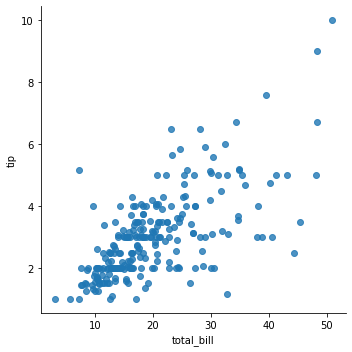

<!-- @import "[TOC]" {cmd="toc" depthFrom=1 depthTo=6 orderedList=false} -->
<!-- code_chunk_output -->

# 3.1 简介

- 借助数据可视化，能更直观地理解数据
- 数据可视化还有助于揭示数据中隐藏的模式，分析人员可以利用这些模式选择模型

## 概念一栏

1. 预备知识：
   1. 容器
   2. 使用函数
   3. 取子集和索引
   4. 类
2. matplotlib 库
3. seaborn 库
4. Pandas

## 目标

1. 使用 matplotlib
2. 使用 seaborn
3. 使用 Pandas 绘图
&nbsp;

## Anscombe 数据集

- 创建数据可视化的典型例子：Anscombe 四重奏，由英国统计学家 Frank Anscombe 创建，能说明统计图表的重要性
- Anscombe 数据集包含 4 组数据，每组数据包含两个连续变量。
  - 虽然每组数据的平均值、方差、相关性和回归线都相同
  - 但是将它们可视化后，会发现每组数据的模式明显不同
- 该列子很好地体现了可视化的优点，以及只查看汇总数据的不足

```python
# 在 seaborn 库中找到 Anscombe 数据集
import seaborn as sns

anscombe = sns.load_dataset('anscombe')
print(anscombe)
```

运行结果：


# 3.2 matplotlib

- matplotlib 是 Python 的基本绘图库
  - 非常灵活，允许用户控制图中所有元素
&nbsp;

- matplotlib 的导入方法和前面的导入方法有所不同
  - 可以看做是导入 matplotlib 包，所有的绘图工具都可以在子文件夹（或子包）pyplot 中找到

- 大多数基本图表的名字以 plt.plot 开头

```python
# 创建数据子集
# 只包含数据集 I
import matplotlib.pyplot as plt
import seaborn as sns

anscombe = sns.load_dataset("anscombe")
dataset_1 = anscombe[anscombe['dataset'] == 'I']
plt.plot(dataset_1['x'], dataset_1['y'])
# 传递参数“o”，绘制圆点图
plt.plot(dataset_1['x'], dataset_1['y'], 'o')
```

运行结果：


- matplotlib 可以指定最终绘图的维数，根据指定的维数放入更小的子图表
- 通过这种方式可以在单幅图中显示结果，而不必分成多幅图
&nbsp;

- subplot 方法有如下 3 个参数
  - 1. 子图的行数
  - 2. 子图的列数
  - 3. 子图的位置
    - 子图的位置是按顺序编号的，先从左到右，再从上到下

```python
# 创建数据子集
# 只包含数据集 I
import matplotlib.pyplot as plt
import seaborn as sns

anscombe = sns.load_dataset("anscombe")
dataset_1 = anscombe[anscombe['dataset'] == 'I']
dataset_2 = anscombe[anscombe['dataset'] == 'II']
dataset_3 = anscombe[anscombe['dataset'] == 'III']
dataset_4 = anscombe[anscombe['dataset'] == 'IV']

fig = plt.figure()                      # 创建画布，用于放置子图
axes1 = fig.add_subplot(2, 2, 1)        # 子图有两行两列，位置是1
axes2 = fig.add_subplot(2, 2, 2)        # 子图有两行两列，位置是2
axes3 = fig.add_subplot(2, 2, 3)        # 子图有两行两列，位置是3
axes4 = fig.add_subplot(2, 2, 4)        # 子图有两行两列，位置是4

# 调用各个轴的 plot 方法绘图
axes1.plot(dataset_1['x'], dataset_1['y'], 'o')
axes2.plot(dataset_2['x'], dataset_2['y'], 'o')
axes3.plot(dataset_3['x'], dataset_3['y'], 'o')
axes4.plot(dataset_4['x'], dataset_4['y'], 'o')

# 向各个子图添加标签，并使用 tight_layout 方法确保各个坐标轴彼此分开

# 向各个子图添加小标题
axes1.set_title("dataset_1")
axes2.set_title("dataset_2")
axes3.set_title("dataset_3")
axes4.set_title("dataset_4")

fig.suptitle("Anscombe Data")       # 为整幅图添加大标题
fig.tight_layout()                  # 使用紧凑布局
```

运行结果：


- Anscombe 数据可视化阐明了为什么只看汇总统计值会产生误导
  - 当把这些点可视化后，即使每个数据集有相同的汇总统计值，不同数据集的点之间也相差较大

- 关于图的组成部分，可以参考新版本 Parts of Figure


# 3.3 使用 matplotlib 绘制统计图

- 本节将使用 seaborn 库的 tips 数据集，其中包含某个餐厅服务员收集的顾客付小费的相关数据，涉及多个变量，包括总费用、聚餐人数、星期几和用餐时间等

```python
# 加载数据集 tips
import seaborn as sns

tips = sns.load_dataset("tips")
print(tips.head())
```

运行结果：


## 3.3.1 单变量

- 在统计学术语中，“单变量”（univariate）指单个变量

### 直方图

- 直方图 是观察单个变量最常用的方法
  - 这些数值是经过“装箱”（bin）处理的
  - 这意味着将它们分组后绘制成图来显示变量的分布状况

```python
# 直方图示例
import matplotlib.pyplot as plt
import seaborn as sns

tips = sns.load_dataset("tips")

fig = plt.figure()                              # 建立画布
axes1 = fig.add_subplot(1, 1, 1)                # 画布 1 行，1 列，位置 1     
axes1.hist(tips['total_bill'], bins=10)         # 设置直方需要装箱的数据，一个箱子的跨度为 10
axes1.set_title("Histogram of Total Bill")      # 设置图的标题
axes1.set_xlabel("Total Bill")                  # 设置 x 轴的标签
axes1.set_ylabel("Frequency")                   # 设置 y 轴的标签
fig.show()
```

运行结果：


## 3.3.2 双变量

- 在统计学术语中，“双变量”（bivariate）指两个变量

### 3.3.2.1 散点图

- 散点图 用于表示一个连续变量随另一个连续变量的变化所呈现的大致趋势

```python
# 散点图示例
import matplotlib.pyplot as plt
import seaborn as sns

tips = sns.load_dataset("tips")

scatter_plot = plt.figure()     # 创建一个画布
axes1 = scatter_plot.add_subplot(1, 1, 1)
axes1.scatter(tips['total_bill'], tips['tip'])      # x轴数据来源:total_bill, y轴数据来源：tip
axes1.set_title('Scatter of Total Bill vs Tip')     # 图标标题
axes1.set_xlabel('Total Bill')                      # x 轴标签
axes1.set_ylabel('Tip')                             # y 轴标签
scatter_plot.show()
```

运行结果：


### 3.3.2.1 箱线图

- 箱线图 用于展现一个离散变量随连续变量的变化而呈现的分布状况

```python
# 箱线图示例
import matplotlib.pyplot as plt
import seaborn as sns

tips = sns.load_dataset("tips")

boxplot = plt.figure()
axes1 = boxplot.add_subplot(1, 1, 1)
axes1.boxplot(
    # 箱线图的第一个参数是数据
    # 由于要绘制多块数据，因此必须把每块数据放入列表中
    [tips[tips['sex'] == 'Female']['tip'],          # 当 sex = Female 时，对应的 tip
     tips[tips['sex'] == 'Male']['tip']],           # 当 sex = Male 时，对应的 tip
    # 然后传入一个可选的标签参数，用来标记传递的数据
    labels=['Female', 'Male'])
axes1.set_xlabel('Sex')
axes1.set_ylabel('Tip')
axes1.set_title('Boxplot of Tips by Sex')
boxplot.show()
```

运行结果：


## 3.3.3 多变量数据

- 绘制多变量数据，没有简便方法或模板适用于所有情况
- 在前面散点图的基础上进行构建
  - 如果想添加另外一个变量，如性别（sex）
  - 可以根据第三个变量的值给点着色

```python
# 多变量数据示例
import matplotlib.pyplot as plt
import seaborn as sns

tips = sns.load_dataset("tips")

# 基于性别创建一个带颜色的变量
def recode_sex(sex):
    if sex == 'Female':
        return 0
    else:
        return 1

tips['sex_color'] = tips['sex'].apply(recode_sex)

scatter_plot = plt.figure()
axes1 = scatter_plot.add_subplot(1, 1, 1)
axes1.scatter(
    x=tips['total_bill'],
    y=tips['tip'],

    # 根据聚餐人数设置点的大小，乘上 10 以放大不同
    s=tips['size'] * 10,

    # 为 sex 设置颜色
    c=tips['sex_color'],

    # 设置 alpha 值，增加点的透明度，以表现重叠的点
    alpha=0.5)

axes1.set_title('Total Bill vs Tip Colored by Sex and Sized by Size')
axes1.set_xlabel('Total Bill')
axes1.set_ylabel('Tip')
scatter_plot.show()
```

运行结果：


# 3.4 seaborn

- matplotlib 库是 Python 的核心绘图工具，而 seaborn 基于 matplotlib 创建
  - 它为绘制统计图提供了更高级的接口
  - 使得只用少量代码就能生成更美观、更复杂的可视化效果

## 3.4.1 单变量

### 3.4.1.1 直方图

- 使用 sns.distplot 创建直方图

```python
import seaborn as sns
import matplotlib.pyplot as plt

tips = sns.load_dataset("tips")

hist, ax = plt.subplots()                    # 使用 subplots 函数创建画图，并在其中添加各个子图
ax = sns.distplot(tips['total_bill'])        # 使用 seaborn 的 distplot 函数绘图
ax.set_title('Total Bill Histogram with Density Plot')

plt.show()          # 任然需要使用 matplotlib.pyplot 显示图
```

运行结果：


- distplot 默认会同事绘制直方图和密度图（使用核密度估计法）
- 如果只想绘制直方图，可以把 kde 参数设置为 False

```python
import seaborn as sns
import matplotlib.pyplot as plt

tips = sns.load_dataset("tips")

hist, ax = plt.subplots()                               # 使用 subplots 函数创建画图，并在其中添加各个子图
ax = sns.distplot(tips['total_bill'], kde=False)        # 使用 seaborn 的 distplot 函数绘图, kde=False，仅绘制直方图
ax.set_title('Total Bill Histogram with Density Plot')

plt.show()          # 任然需要使用 matplotlib.pyplot 显示图
```

运行结果：


### 3.4.1.2 密度图（核密度估计）

－　密度图　是展现单变量分布的另一种方法，本质上是通过绘制以每个数据点为中心的正态分布，然后消除重叠的图，是曲线下的面积为１来创建的

```python
# 密度图示例
import seaborn as sns
import matplotlib.pyplot as plt

tips = sns.load_dataset("tips")

den, ax = plt.subplots()
ax = sns.distplot(tips['total_bill'], hist=False)
ax.set_title('Total Bill Density')
ax.set_xlabel('Total Bill')
ax.set_ylabel('Unit Probability')
plt.show()
```

运行结果：


> 如果只要密度图，可以使用 sns.kdeplot 函数

### 3.4.1.3 频数图

- 频数图（rug plot）是变量分布的一维表示，常与其他图一起使用，以增强可视化效果

```python
# 频数图与直方图
import seaborn as sns
import matplotlib.pyplot as plt

tips = sns.load_dataset("tips")

hist_den_rug, ax = plt.subplots()
ax = sns.distplot(tips['total_bill'], rug=True)
ax.set_title('Total Bill Histogram with Density and Rug Plot')
ax.set_xlabel('Total Bill')
plt.show()
```

运行结果：


### 3.4.1.4 计数图（条形图）

- 条形图与直方图很像，但他不通过对值分组来描述分布，而是对离散变量计数
- (仅分组计数，不聚合计算)

```python
# 计数图（条形图）
import seaborn as sns
import matplotlib.pyplot as plt

tips = sns.load_dataset("tips")

count, ax = plt.subplots()
ax = sns.countplot('day', data=tips)
ax.set_title('Count of days')
ax.set_xlabel('Day of the Week')
ax.set_ylabel('Frequency')
plt.show()
```

运行结果：


## 3.4.2 双变量数据

### 3.4.2.1 散点图

- 在 seaborn 中，创建散点图有多种方法，但没有名为 scatter 的函数
- 可以使用 regplot 函数
  - 不仅会绘制散点图，还会拟合回归线
  - 如果把 fit_reg 设置为 False，将只显示散点图

```python
# 双变量 散点图
import seaborn as sns
import matplotlib.pyplot as plt

tips = sns.load_dataset("tips")

scatter, ax = plt.subplots()
ax = sns.regplot(x='total_bill', y='tip', data=tips, fit_reg=False) # 设置 fit_reg=False，仅展示散点图
ax.set_title('Scatterplot of Total Bill and Tip')
ax.set_xlabel('Total Bill')
ax.set_ylabel('Tip')
plt.show()
```

运行结果：


- lmplot 函数和 regplot 函数类似，也可以用于创建散点图
  - lmplot 函数内部会调用 regplot
  - regplot 是更通用的绘图函数
  - 主要区别：
    - regplot 创建轴域
    - lmplot 创建图

```python
# 双变量 散点图 lmplot
import seaborn as sns
import matplotlib.pyplot as plt

tips = sns.load_dataset("tips")
fig = sns.lmplot(x='total_bill', y='tip', data=tips, fit_reg=False)
plt.show()
```

运行结果：



- 还可以使用 jointplot 在每个轴上创建包含单个变量的散点图
  - 与其他绘图函数的主要区别
    - 不返回轴域，无需创建带有轴域的画布来放置图
- jointplot 函数会创建并返回 JoinGrid 对象

```python
# 双变量 散点图 jointplot
import seaborn as sns
import matplotlib.pyplot as plt

tips = sns.load_dataset("tips")
joint = sns.jointplot(x='total_bill', y='tip', data=tips)
joint.set_axis_labels(xlabel='Total Bill', ylabel='Tip')

# 添加标题，设置字号
# 移动轴域上方的文字
joint.fig.suptitle('Joint Plot of Total Bill and Tip', fontsize=10, y=1.03)
```

运行结果：


### 3.4.2.2 蜂巢图

- 散点图 适用于比较两个变量，但图中点太多反而会失去意义
  - 解决该问题的一种方法就是把点装箱
- 蜂巢图（hexbin）可以对两个变量装箱，显示他们的频次分布状况
- 选用六边形是因为它是覆盖任意二位平面最有效的形状

```python
# 双变量 蜂巢图
import seaborn as sns
import matplotlib.pyplot as plt

tips = sns.load_dataset("tips")
hexbin = sns.jointplot(x='total_bill', y='tip', data=tips, kind='hex')
hexbin.set_axis_labels(xlabel='Total Bill', ylabel='Tip')
hexbin.fig.suptitle('Hexbin Joint Plot of Total Bill and Tip', fontsize=10, y=1.03)
```

运行结果：


### 3.4.2.3 2D 密度图

- 可以创建 2D 核密度图
  - 过程与 sns.kdeplot 的工作过程类似
  - 但 2D 核密度图是跨两个变量的
- 可以单独显示双变量图
- 也可以使用 jointplot 把两个单变量图放在一起

```python
# 2D 密度图
import seaborn as sns
import matplotlib.pyplot as plt

tips = sns.load_dataset("tips")

kde, ax = plt.subplots()
ax = sns.kdeplot(data=tips['total_bill'], data2=tips['tip'],
    shade=True)         # shade=True 阴影会填充空白部分
ax.set_title('Kernel Density Plot of Total Bill and Tip')
ax.set_xlabel('Total Bill')
ax.set_ylabel('Tip')
plt.show()   
```

运行结果：


```python
# 2D 密度图 与 单变量图
import seaborn as sns
import matplotlib.pyplot as plt

tips = sns.load_dataset("tips")

kde_joint = sns.jointplot(x='total_bill', y='tip', data=tips, kind='kde', shade=True)
plt.show()   
```

运行结果：


### 3.4.2.4 条形图

- 条形图也可以用于展现多个变量
  - barplot 默认会计算平均值，但可以把某个函数传递给 estimator 参数
  - 比如把 numpy.std 函数传给它来计算方差

```python
# 双变量 条形图
import seaborn as sns
import matplotlib.pyplot as plt

tips = sns.load_dataset("tips")

bar, ax = plt.subplots()
ax = sns.barplot(x='time', y='total_bill', data=tips)
ax.set_title('Bar plot of average total bill for time of day')
ax.set_xlabel('Time of day')
ax.set_ylabel('Average total bill')
plt.show()
```

运行结果：


### 3.4.2.5 箱线图

- 箱线图 用于显示多种统计信息：最小值、第一个四分位数、中位数、第三个四分位数、最大值
- 参数 y 是可选的，若省略，则绘图函数只在图中创建一个空框

```python
# 箱线图 双变量
import seaborn as sns
import matplotlib.pyplot as plt

tips = sns.load_dataset("tips")
box, ax = plt.subplots()
ax = sns.boxplot(x='time', y='total_bill', data=tips)
ax.set_title('Boxplot of total bill by time of day')
ax.set_xlabel('Time of day')
ax.set_ylabel('Total Bill')
plt.show()
```

运行结果：


### 3.4.2.6 小提琴图

- 小提琴图 能显示与箱线图相同的值，但是它把“箱线”绘制成核密度估计
- 有助于保留数据的更多可视化信息

```python
# 小提琴图 双变量
import seaborn as sns
import matplotlib.pyplot as plt

tips = sns.load_dataset("tips")
violin, ax = plt.subplots()
ax = sns.violinplot(x='time', y='total_bill', data=tips)
ax.set_title('Violin plot of total bill by time of day')
ax.set_xlabel('Time of day')
ax.set_ylabel('Total Bill')
plt.show()
```

运行结果：


### 3.4.2.7 成对关系

- 当数据大部分是数值时，可以使用 pairplot 函数把所有成对关系描绘出来
- 该函数会为每对变量绘制散点图，并且为单变量数据绘制直方图

```python
# 成对关系 pairplot
import seaborn as sns
import matplotlib.pyplot as plt

tips = sns.load_dataset("tips")
fig = sns.pairplot(tips)
```

运行结果：


- pairplot 的一个缺点是存在冗余信息，即图的上半部分和下半部分相同
- 可以使用 pairplot 手动指定图的上半部分和下半部分

```python
# 成对关系 pairplot 指定图的上半部分
import seaborn as sns
import matplotlib.pyplot as plt

tips = sns.load_dataset("tips")
pair_grid = sns.PairGrid(tips)
# 可以使用 plt.scatter 代替 sns.regplot
pair_grid = pair_grid.map_upper(sns.regplot)
pair_grid = pair_grid.map_lower(sns.kdeplot)
pair_grid = pair_grid.map_diag(sns.distplot, rug=True, kde=False)   # kde=False 是的直方图展示更高一点
plt.show()
```

运行结果：


## 3.4.3 多变量数据

### 3.4.3.1 颜色

- 使用 violinplot 函数是，可以通过 hue 参数按性别（sex）给图着色
- 可以为“小提琴”的左右两半着不同颜色，用于区分性别，以此减少冗余信息

```python
# 多变量颜色
import seaborn as sns
import matplotlib.pyplot as plt

tips = sns.load_dataset("tips")
violin, ax = plt.subplots()
ax = sns.violinplot(x='time', y='total_bill', hue='sex', data=tips, split=True)
plt.show()

ax = sns.violinplot(x='time', y='total_bill', hue='sex', data=tips, split=False)
plt.show()
```

运行结果：


- 其他绘图函数中也存在 hue 参数，lmplot 示例

```python
# lmplot 颜色示例
import seaborn as sns
import matplotlib.pyplot as plt

tips = sns.load_dataset("tips")
scatter = sns.lmplot(x='total_bill', y='tip', data=tips, hue='sex', fit_reg=False)
plt.show()
```

运行结果：


- 通过向 hue 参数传入一个类别变量，可以让成对图变得更有意义

```python
# 成对关系颜色示例
import seaborn as sns
import matplotlib.pyplot as plt

tips = sns.load_dataset("tips")
fig = sns.pairplot(tips, hue='sex')
plt.show()
```

运行结果：


### 3.4.3.2 大小和形状

- 还可以通过点的大小表示更多信息，但需谨慎，人眼并不擅长分辨大小
&nbsp;

- lmplot 的参数 scatter_kws 和 line_kws 都接收键值对
  - 键值对先传给 scatter_kws，然后传给 matplotlib 函数 plt.scatter
  - 可以通过这种方式访问 s 参数，来改变点的大小

```python
# 使用 seaborn 的 lmplot 函数绘制散点图
import seaborn as sns
import matplotlib.pyplot as plt

tips = sns.load_dataset("tips")
scatter = sns.lmplot(x='total_bill', y='tip', data=tips, 
                fit_reg=False, scatter_kws={'s': tips['size'] * 10})       # size * 10 把点的大小差异放大10倍
plt.show()
```

运行结果：


- 带有`hue='sex'` 和 `markers=['o', 'x']` 参数，会报错，目前无解

### 3.4.3.3 分面

- 如果想显示更多变量，或者确定了要实现的可视化图
- 但想基于一个分类变量画出多幅图
- 可以使用分面
&nbsp;

- 要使用分面，数据必须是“整洁数据”
  - 数据中的每一行都表示一个观测值
  - 每一列是一个变量

```python
# seaborn 绘制 anscombe 数据集
import seaborn as sns
import matplotlib.pyplot as plt

anscombe = sns.load_dataset('anscombe')
anscombe_plot = sns.lmplot(x='x', y='y', data=anscombe, 
            fit_reg=False, col='dataset', col_wrap=2)   # col 参数用于分面变量，col_wrap 用于指定图的每行包含两列
```

运行结果：


- lmplot 是图级函数，而在 seaborn 中很多图都是用轴域级函数创建的
  - 这意味着并不是每个绘图函数都有分面参数 col 和 col_wrap
- 必须先创建 FacetGird，它知道要在哪个变量上进行分面，然后为每个分面提供单独的绘图代码

```python
# 轴域级函数分面示例
import seaborn as sns
import matplotlib.pyplot as plt

tips = sns.load_dataset("tips")

# 创建 FacetGird
facet = sns.FacetGrid(tips, col='time')
# 针对每个用餐时间段，绘制总消费额直方图
facet.map(sns.distplot, 'total_bill', rug=True)
plt.show()
```

运行结果：


- 各个分面不限于单变量图

```python
# 分面双变量示例
import seaborn as sns
import matplotlib.pyplot as plt

tips = sns.load_dataset("tips")

facet = sns.FacetGrid(tips, col='day', hue='sex', col_wrap=2)
facet = facet.map(plt.scatter, 'total_bill', 'tip')
facet = facet.add_legend()
plt.show()
```

运行结果：


- 可以使用 lmplot 创建相同的图


- 还可以让一个变量在 x 轴上分面，一个变量在 y 轴上分面
- 可以通过传递 row 参数来实现

```python
# x轴y轴分别分面
import seaborn as sns
import matplotlib.pyplot as plt

tips = sns.load_dataset("tips")
facet = sns.FacetGrid(tips, col='time', row='smoker', hue='sex')
facet.map(plt.scatter, 'total_bill', 'tip')
plt.show()
```

运行结果：


- 如果不想让所有 hue 元素重叠，可以使用 sns.factorplot 函数

```python
# factorplot 函数示例
import seaborn as sns
import matplotlib.pyplot as plt

tips = sns.load_dataset("tips")
facet = sns.factorplot(x='day', y='total_bill', hue='sex',
                    data=tips, row='smoker', col='time', kind='violin')
```

运行结果：


# 3.5 Pandas 对象

- Pandas 对象本身都具有绘图功能，与 seaborn 一样，Pandas 中的绘图函数只是使用预设值包装了 matplotlib
- 通常需要使用 DataFrame.plot.PLOT_TYPE 或 series.plot.PLOT_TYPE

## 3.5.1 直方图

```python
import seaborn as sns
import matplotlib.pyplot as plt

tips = sns.load_dataset("tips")

# Series绘制直方图
fig, ax = plt.subplots()
ax = tips['total_bill'].plot.hist()
plt.show()

# DataFrame绘制直方图
fig, ax = plt.subplots()
ax = tips[['total_bill', 'tip']].plot.hist(alpha=0.5, bins=20, ax=ax)
plt.show()
```

运行结果：


## 3.5.2 密度图

- 可以使用 SeriesFrame.plot.kde 函数创建核密度估计图

```python
import seaborn as sns
import matplotlib.pyplot as plt

tips = sns.load_dataset("tips")

# Series核密度图(适用单变量)
fig, ax = plt.subplots()
ax = tips['tip'].plot.kde()
plt.show()
```

运行结果：


## 3.5.3 散点图

- 可以使用 DataFrame.plot.scatter 函数创建散点图（使用双变量）

```python
import seaborn as sns
import matplotlib.pyplot as plt

tips = sns.load_dataset("tips")

# DataFrame散点图
fig, ax = plt.subplots()
ax = tips.plot.scatter(x='total_bill', y='tip', ax=ax)
plt.show()
```

运行结果：


## 3.5.4 蜂巢图

- 可以使用 DataFrame.plt.hexbin 函数绘制蜂巢图
- 可以通过 girdsize 参数调整网格大小

```python
import seaborn as sns
import matplotlib.pyplot as plt

tips = sns.load_dataset("tips")

# DataFrame蜂巢图
fig, ax = plt.subplots()
ax = tips.plot.hexbin(x='total_bill', y='tip', ax=ax)
plt.show()

# girdsize参数示例
fig, ax = plt.subplots()
ax = tips.plot.hexbin(x='total_bill', y='tip', ax=ax, gridsize=10)
plt.show()
```

运行结果：


## 3.5.5 箱线图

- 可以使用 DataFrame.plot.box 函数绘制箱线图

```python
import seaborn as sns
import matplotlib.pyplot as plt

tips = sns.load_dataset("tips")

# DataFrame箱线图
fig, ax = plt.subplots()
ax = tips.plot.box(ax=ax)
plt.show()
```


# 3.6 seaborn 主题和样式

- 可以使用 sns.set_style 函数更改样式
  - 通常该函数会出现在代码顶部，并且只运行一次
  - 所有后续绘图都会采用这种形式
&nbsp;

- seaborn 有 5 种样式：darkgrid、whitegrid、dark、white 和 ticks

```python
import seaborn as sns
import matplotlib.pyplot as plt

tips = sns.load_dataset("tips")

# 未设置样式
fig, ax = plt.subplots()
ax = sns.violinplot(x='time', y='total_bill', hue='sex', data=tips, split=True)
plt.show()

# 设置样式darkgrid
sns.set_style('darkgrid')
fig, ax = plt.subplots()
ax = sns.violinplot(x='time', y='total_bill', hue='sex', data=tips, split=True)
plt.show()
```

运行结果：


```python
# 所有seaborn样式示例
import seaborn as sns
import matplotlib.pyplot as plt

tips = sns.load_dataset("tips")
fig = plt.figure()
seaborn_style = ['darkgrid', 'whitegrid', 'dark', 'white', 'ticks']     # 将5种样式写入列表
for idx, style in enumerate(seaborn_style):                             # idx 索引，style 值
    plot_position = idx + 1                                             # 在画布上的编号为 plot_position
    with sns.axes_style(style):
        ax = fig.add_subplot(2, 3, plot_position)                       # 画布2行，3列，plot_position 在画布上的位置
        violin = sns.violinplot(x='time', y='total_bill', data=tips, ax=ax)
        violin.set_title(style)                                         # 样式名称给图命名

fig.tight_layout()                                                      # 紧凑排列，都展示出来不重叠
plt.show()
```

运行结果：


# 3.7 小结

- seaborn 文档、Pandas 可视化文档和 matplotlib 文档都提供了进一步调整绘图的方法
  - 如：颜色、线条粗细、图例和图注
- 其他资源还包括 colorbrewer
  - 它有助于挑选配色方案
