<!-- code_chunk_output -->

# 10.1 简介

- 借助 “分割-应用-组合” 模式，分组操作可以有效地聚合、转换和过滤数据

1. 分割：基于键，把要处理的数据分割为小片段
2. 应用：分别处理每个数据片段
3. 组合：把处理结果组合成新数据集

- 使用分布式计算的“大数据”系统中，“分割-应用-组合” 模式也广泛应用
  - 数据分割成了独立的部分，并被发送到单独的服务器上
  - 在那里应用函数进行处理，然后把结果组合起来
&nbsp;

- 本章讲解的各种技术不依赖 groupby 方法也能完成
  - 聚合 可以通过在 DataFrame 上有条件地取子集来完成
  - 转换 可以通过把列传入单独的函数来完成
  - 过滤 可以通过有条件地取子集来完成
- 不过，使用 groupby 语句处理数据，代码运行更快，并且创建多个组时也更灵活，便于在分布式系统或并行系统上处理更大的数据集

## 目标

1. 通过分组操作对数据进行聚合、转换和过滤
2. 使用内置函数和自定义函数执行分组操作

# 10.2 聚合

- 聚合 是指获取多个值并返回单个值的过程

## 10.2.1 基本的单变量分组聚合

- 聚合也称 “汇总”（summarization）
  - 这两个术语都指某种形式的数据归约
- 可以人为 groupby 语句创建了一个子集，里面含有各列的唯一值（或者列的唯一对）
  - 例如可以获取各列唯一值的表

```python
# 读取数据集
import pandas as pd

df = pd.read_csv('../pandas_for_everyone-master/data/gapminder.tsv', sep='\t')

# 获取数据中年份唯一值的列表
years = df.year.unique()
print(years)

# 遍历每一年并取子集
y1952 = df.loc[df.year == 1952, :]
print(y1952)

# 向数据子集应用一个函数，计算 lifeExp 的平均值
y1952_mean = y1952.lifeExp.mean()
print(y1952_mean)
```

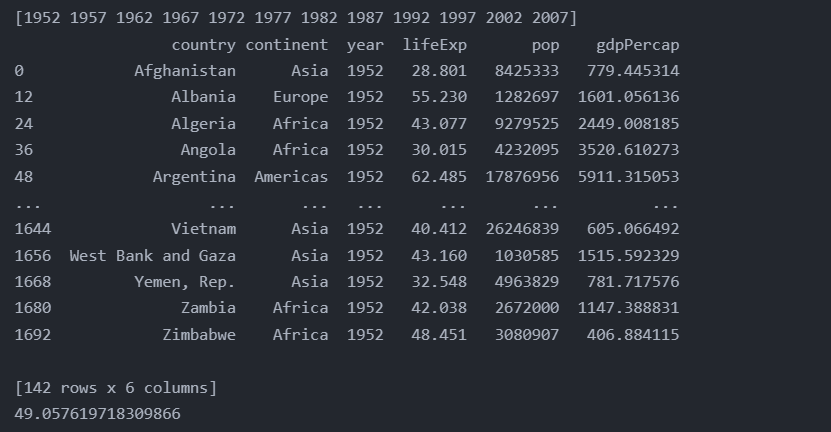

## 10.2.2 Pandas 内置的聚合方法

- 表10-1 可以与 groupby 一起使用的方法和函数

|Pandas方法|NumPy/SciPy函数|说明|
|:----|:----|:----|
|count|np.count_nonzero|频率统计（不包含 NaN 值）|
|size||频率统计（包含 NaN 值）|
|mean|np.mean|求平均值|
|std|np.std|样本标准差|
|min|np.min|最小值|
|quantile(q=0.25)|np.percentile(q=0.25)|较小四分位数|
|quantile(q=0.50)|np.percentile(q=0.50)|中位数|
|quantile(q=0.75)|np.percentile(q=0.75)|较大四分位数|
|max|np.max|求最大值|
|sum|np.sum|求和|
|var|np.var|无偏方差|
|sem|scipy.stats.sem|平均值的无偏标准差|
|describe|scipy.stats.describe|计数、平均值、标准差、最小值、25%、50%、75%和最大值|
|first||返回第一行|
|last||返回最后一行|
|nth||返回第 n 行（Python 从 0 开始计数|

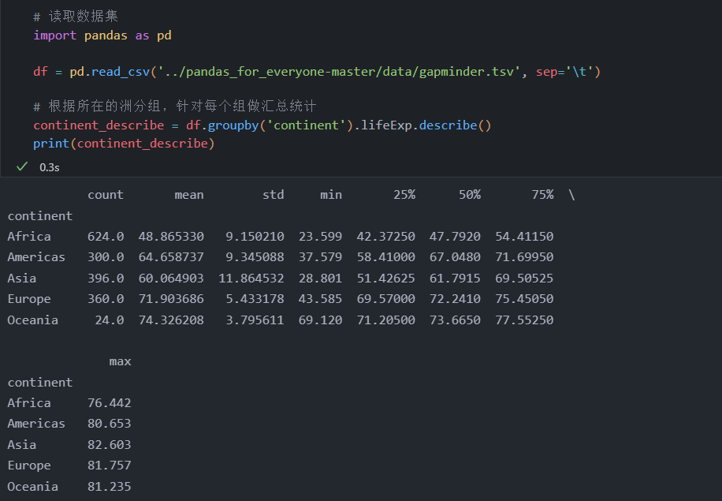

## 10.2.3 聚合函数

- 还可以调用 agg 方法或 aggregate 方法，传入想用的聚合函数
  - 使用 agg 方法或 aggregate 时，需要使用 表 10-1 “NumPy/SciPy函数” 列中列出的函数

### 10.2.3.1 其他库的函数

- 可以使用 NumPy 库的 mean 函数

```python
import numpy as np
import pandas as pd

df = pd.read_csv('../pandas_for_everyone-master/data/gapminder.tsv', sep='\t')

# 使用 np.mean 函数计算各州的平均预期寿命
cont_le_agg = df.groupby('continent').lifeExp.agg(np.mean)
print(cont_le_agg)

# 使用 aggregate 实现相同效果
cont_le_agg2 = df.groupby('continent').lifeExp.aggregate(np.mean)
print(cont_le_agg2)
```

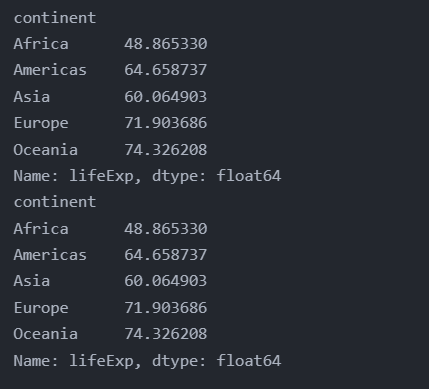

### 10.2.3.2 用户自定义函数

- 可以自定义一个函数，然后在 aggregate 中调用

```python
import pandas as pd

df = pd.read_csv('../pandas_for_everyone-master/data/gapminder.tsv', sep='\t')

# 定义一个求平均值的函数
def my_mean(values):
    """计算平均值"""
    # 获取数值个数，作为分母
    n = len(values)

    # 从 0 开始求和
    sum = 0
    for value in values:
        sum += value
    
    # 用总和除以总个数，得到平均值并返回
    return (sum / n)

agg_my_mean = df.groupby('year').lifeExp.aggregate(my_mean)
print(agg_my_mean)
```

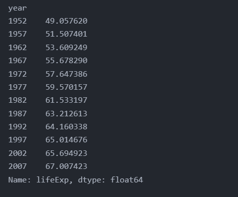

- 可以编写带有多个参数的函数
  - 只要第一个参数接收来自 DataFrame 的值序列，就可以把其他参数作为关键字传入 agg 或 aggregate 方法

```python
import pandas as pd

df = pd.read_csv('../pandas_for_everyone-master/data/gapminder.tsv', sep='\t')

# 计算平均值和 diff_value 之差
def my_mean_diff(values, diff_value):
    """计算平均值和 diff_value 之差"""
    n = len(values)
    sum = 0
    for value in values:
        sum += value
    
    mean = sum / n
    return (mean - diff_value)

# 计算全球平均预期寿命的平均值
global_mean = df.lifeExp.mean()
print(global_mean)

# 通过 agg 调用多个参数的自定义函数
agg_mean_diff = df.groupby('year').lifeExp.agg(my_mean_diff, diff_value=global_mean)
print(agg_mean_diff)
```

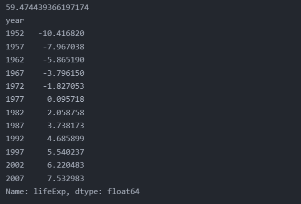

## 10.2.4 同时传入多个函数

- 如果想同时计算多个聚合函数，可以先把它们全部放入一个 Python 列表，然后把整个列表传入 agg 或 aggregate 中

```python
import numpy as np
import pandas as pd

df = pd.read_csv('../pandas_for_everyone-master/data/gapminder.tsv', sep='\t')

# 按洲计算 lifeExp 的非零个数、平均值和标准差
gdf = df.groupby('continent').lifeExp.agg([np.count_nonzero, np.mean, np.std])
print(gdf)
```

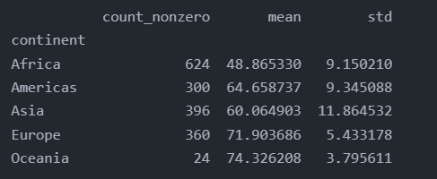

## 10.2.5 在 agg/aggregate 中使用字典

- 可以向 agg 传递 Python 字典
  - 但是根据聚合针对的是 DataFrame 还是 Series 对象，结果会有所不同
  - 对于后一种情况，不建议使用字典

### 10.2.5.1 针对 DataFrame

- 针对 DataFrame 指定 dict 时
  - 键 是 DataFrame 的列
  - 值 是聚合计算使用的函数
- 这种方法允许对一个或多个变量进行分组，对不同列同时使用不同的聚合函数

```python
import numpy as np
import pandas as pd

df = pd.read_csv('../pandas_for_everyone-master/data/gapminder.tsv', sep='\t')

# 对 DataFrame 使用字典聚合不同的列
# 对于每一年，计算平均值 lifeExp、中位数 pop 和中位数 gdpPercap
gdf_dict = df.groupby('year').agg({
    'lifeExp': 'mean',
    'pop': 'median',
    'gdpPercap': 'median'
})
print(gdf_dict)
```

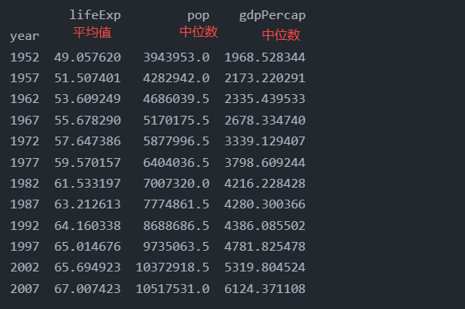

### 10.2.5.2 针对 Series

- 可以在 groupby 之后把一个 dict 传入 Series 中
  - 直接做汇总统计并将其返回
  - dict 的键，是新的列名
- 要在分组 Series 中显示用户自定义的列名，需要重命名列

```python
import pandas as pd

df = pd.read_csv('../pandas_for_everyone-master/data/gapminder.tsv', sep='\t')

gdf = df.groupby('year')['lifeExp'].agg([np.count_nonzero, np.mean, 
        np.std]).rename(columns={
            'count_nonzero': 'count',
            'mean': 'avg',
            'std': 'std_dev'
        }).reset_index()    # 返回一个普通的 dataframe

print(gdf)
```

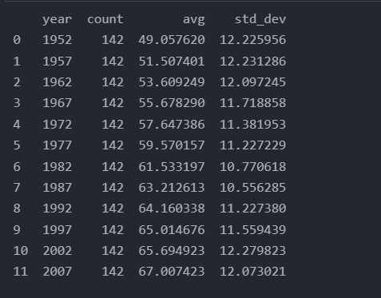

# 10.3 转换

- 转换数据时，需要把 DataFrame 中的值传递给一个函数，而后由该函数“转换”数据
- transform
  - 接收多个值
  - 返回的是与这些值一一对应的转换值
  - transform 不会减少数据量

## 10.3.1 计算 z 分数

- 计算 z 分数公式
  - $z = (x -u) / a$
    - x 为数据集中的一个数据点
    - u 为数据集的平均值
    - a 是标准差

```python
import pandas as pd

df = pd.read_csv('../pandas_for_everyone-master/data/gapminder.tsv', sep='\t')

# 编写一个计算 z 分数的函数
def my_zscore(x):
    """计算给定数据的 z 分数
    是一个向量或值序列"""
    a = (x - x.mean()) / x.std()
    return a

print('调用自定义函数按组转换数据')
# 原 DataFrame 和 transform_z 的行和数据的数量相同
transform_z = df.groupby('year').lifeExp.transform(my_zscore)
print(df.shape)
print(transform_z.shape)

# SciPy 库拥有zscore 函数，可以在 groupby transform 中使用
# 从 scipy.stats 导入 zscore 函数
from scipy.stats import zscore

# 计算分组的 zscore
sp_z_grouped = df.groupby('year').lifeExp.transform(zscore)

# 计算非分组的 zscore
sp_z_nogroup = zscore(df.lifeExp)

print('分组的 z 分数')
print(transform_z.head())

print('使用 SciPy 计算得到的分组 z 分数')
print(sp_z_grouped.head())

print('非分组的 z 分数')
print(sp_z_nogroup[:5])
```

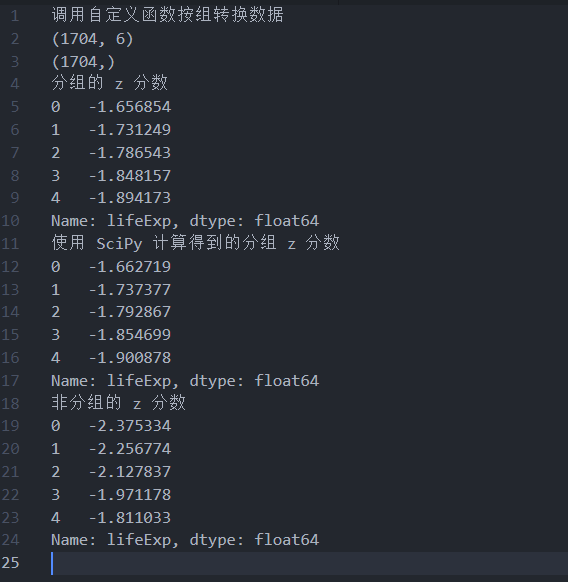

- 分组结果是相似的
- 但当计算 groupby 之外的 z 分数时，结果是基于整个数据集计算出来的，而非按组分出的数据

## 10.3.2 缺失值示例

- 对于有些数据集，根据特定组填充缺失数据会更好
- 使用 seaborn 库的 tips 数据集示例

```python
import seaborn as sns
import numpy as np

# 设置种子已确定结果
np.random.seed(42)

# 从 tips 中抽取 10 行
tips_10 = sns.load_dataset('tips').sample(10)

# 随机挑选 4 个 “total_bill” 值作为缺失值
tips_10.loc[np.random.permutation(tips_10.index)[:4], 'total_bill'] = np.NaN
print(tips_10)

"""
简单使用 total_bill 的平均值来填充缺失值可能不妥
可以使用 groupby 语句计算统计值以填充缺失值
此处不使用 agg 或 aggregate 方法，使用 transform 方法
"""

print('按 sex 统计非缺失值的数量')
count_sex = tips_10.groupby('sex').count()
print(count_sex)

def fill_na_mean(x):
    '''返回给定向量的平均值'''
    avg = x.mean()
    return (x.fillna(avg))

# 按 sex 计算 total_bill 平均值
total_bill_group_mean = tips_10.groupby('sex').total_bill.transform(fill_na_mean)

print('在原始数据中创建新列 fill_total_bill')
tips_10['fill_total_bill'] = total_bill_group_mean
print(tips_10)

print('如果只查看两个 total_bill 列，会发现 NaN 值被填充了不同的值')
print(tips_10[['sex', 'total_bill', 'fill_total_bill']])

```

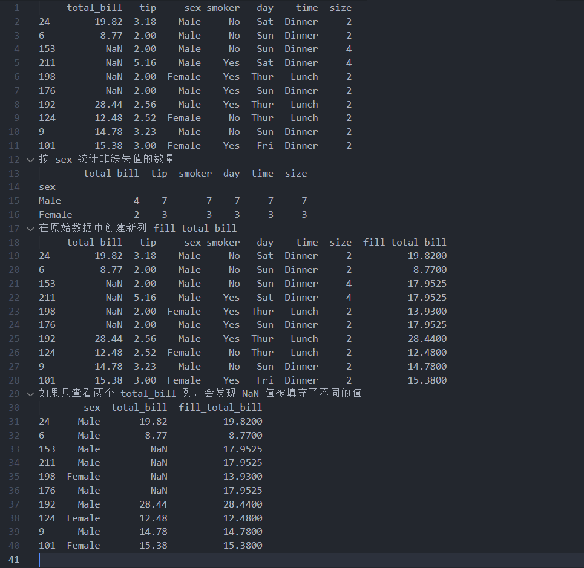

# 10.4 过滤器

- 使用 groupby 方法还可以过滤数据
- 支持按键拆分数据，然后对数据执行某种布尔子集运算

```python
# 加载 tips 数据集
import seaborn as sns

tips = sns.load_dataset('tips')

print('输出原始数据的行数')
print(tips.shape)

print('查看不同规模聚餐的次数')
print(tips['size'].value_counts())

# 从结果来看，1、5、6的分组下人数很少，需要过滤掉，使得每组的观测值有 30 个以上
# 过滤数据，使每组观测值在 30 个以上
tips_filtered = tips.groupby('size').filter(lambda x: x['size'].count() >= 30)
print(tips_filtered.shape)
print(tips_filtered['size'].value_counts())
```

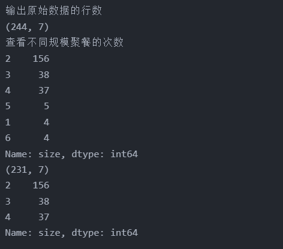

# 10.5 Pandas.core.groupby.DataFrameGroupBy 对象

- 本节介绍分组对象的一些内部工作方式
- 有关 groupby 的更多特性，可参考 groupby 文档

## 10.5.1 分组

- 本章会在 groupby 之后直接链接调用 aggregate、transform 或 filter 方法
- 但其实可以在执行这些方法之前先保存 groupby 的结果

```python
import seaborn as sns
import numpy as np

# 从 tips 中抽取 10 行
tips_10 = sns.load_dataset('tips').sample(10, random_state=42)

# 只保存分组对象
tips_groupby = tips_10.groupby('sex')

# 获得了一个 DataFrameGroupBy 对象及其内存位置
print(tips_groupby)

# 如果想查看计算过的分组，可以借助 groups 属性实现
# 查看 groupby 的十几分组
#  只返回索引
print(tips_groupby.groups)
```

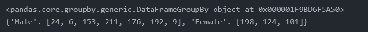

- 当向分组对象请求 groups 属性时，得到的也只是那个 DataFrame 的索引
- 可以把索引看做行数
- 这样做旨在提升优化性能（至此还未进行任何计算）

## 10.5.2 涉及多个变量的分组计算

- Python 的优点之一是遵循 EAFP 原则：“应取得原谅而非获得许可”
- 如果在 groupby 之后指定了计算，Python就会针对所有可能的列执行该计算，并静默删除其余列

```python
# 计算格列平均值
avgs = tips_groupby.mean()
print(avgs)

print('列出所有列')
print(tips_10.columns)
```

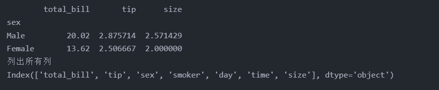

## 10.5.3 选择分组

- 如果想提取特定的组，可以使用 get_group 方法，并传入想要的组

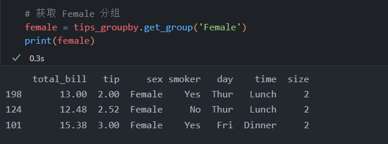

## 10.5.4 遍历分组

- 保存 groupby 对象便于逐个遍历分组
- 有时候使用循环解决问题更简单
- 有时实现功能应优先，实现代码可以后续优化，以提高运行速度
- 使用 for 循环遍历 groupby 对象值类似于遍历其他 Python 容器

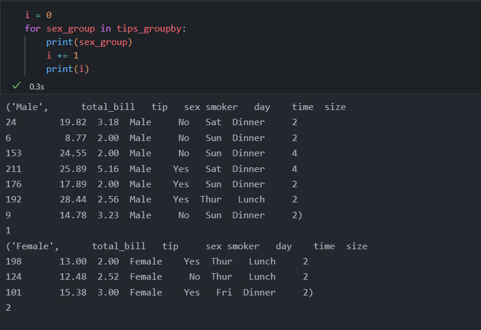

> 如果尝试从 groupby 对象中获取第一个元素，会得到一条错误信息
> 因为该对象仍然是 Pandas.core.groupby.DataFrameGroupBy 对象，而不是真正的 Python 容器

- 修改 for 循环，令其输出第一个元素以及想从 tips_groupby 对象获取的信息

```python
for sex_group in tips_groupby:
    # 获取对象的类型（元组）
    print('类型是：{}\n'.format(type(sex_group)))

    # 获取对象的长度（两个元素）
    print('长度是：{}\n'.format(len(sex_group)))

    # 获取第一个元素
    first_element = sex_group[0]
    print('第一个元素是：{}\n'.format(first_element))

    # 第一个元素的类型（字符串）
    print('第一个元素的类型是：{}\n'.format(type(sex_group[0])))

    # 获取第二个元素
    second_element = sex_group[1]
    print('第二个元素是：{}\n'.format(second_element))

    # 获取第二个元素的类型（DataFrame）
    print('第二个元素类型是：{}\n'.format(type(second_element)))

    # 输出 sex_group
    print(sex_group)

    # 只迭代一次
    break
```

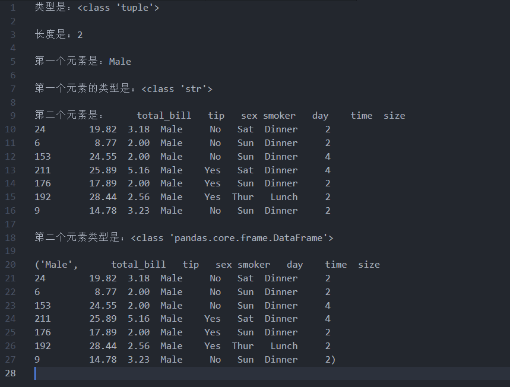

## 10.5.5 多个分组

- 其实可以在 groupby 语句中添加多个变量
- 可以以 Python 列表的形式传入，代替一直使用的单个字符串

```python
# 按照 sex 和 time 计算平均值
bill_sex_time = tips_10.groupby(['sex', 'time'])
group_avg = bill_sex_time.mean()
print(group_avg)
```

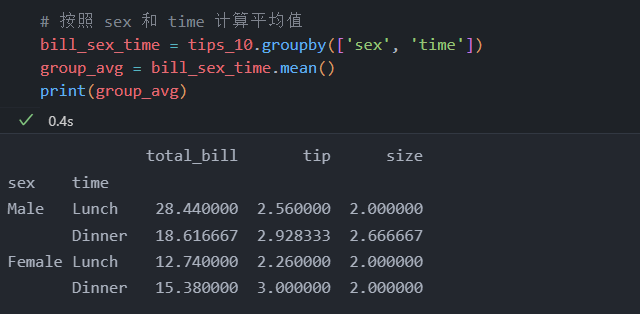

## 10.5.6 平铺结果

- 本节最后一个主题是 groupby 语句的结果

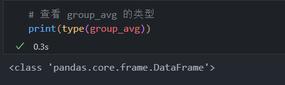

- 输出结果显示，group_avg 是一个 DataFrame

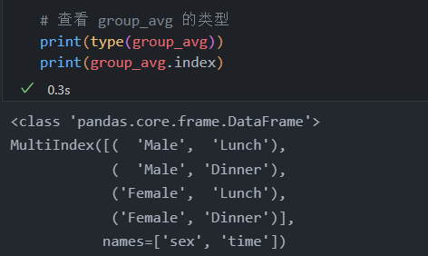

- 索引是混合索引，有两列数据

```python
# 通过调用 reset_index 获取一个普通的 DataFrame
group_method = tips_10.groupby(['sex', 'time']).mean().reset_index()
print(group_method)

# groupby 方法中使用 as_index=False 参数，默认为 True
group_method = tips_10.groupby(['sex', 'time'], as_index=False).mean()
print(group_method)
```

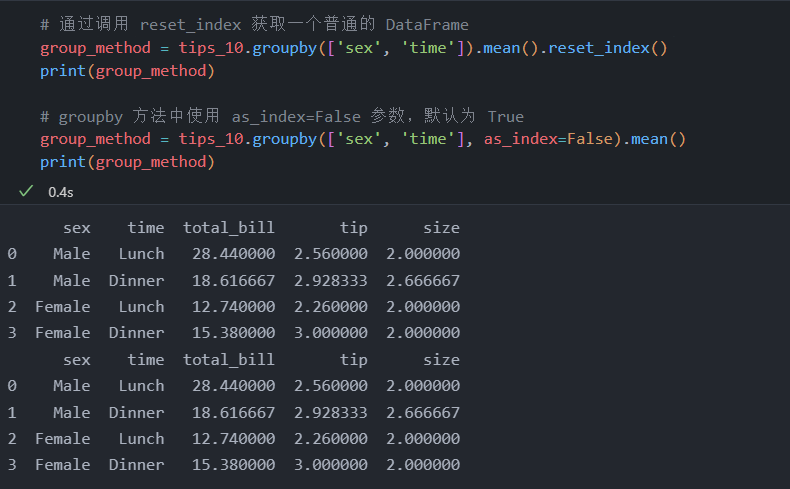

# 10.6 使用多级索引

- 有时需要在 groupby 语句之后调用计算相关的函数
- 无论何时，总是可以平铺结果，然后执行另一条 groupby 语句，但这可能不是执行计算的最高效的方式

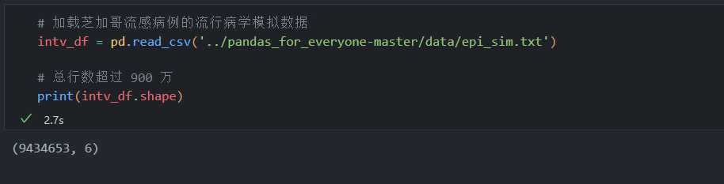

- 该数据集包含 6 列
  - ig_type: 边类型（网络中两个节点间的关系类型，比如“school”和“work”）
  - intervened: 模拟中对特定的人进行干预的时间（pid）
  - pid: 模拟人的 ID 编号
  - rep: 重复运行（每套模拟参数运行多次）
  - sid: 模拟 ID
  - tr: 流感病毒的传播值

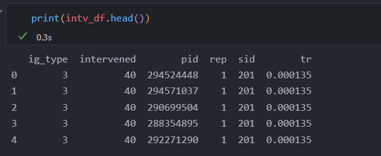

- 下面统计每次重复的干预次数、干预时间和治疗效果
- 这里随意计算 ig_type，因为只需要一个值来得到分组的观测数

```python
count_only = intv_df.groupby(['rep', 'intervened', 'tr'])['ig_type'].count()
print(count_only)
```

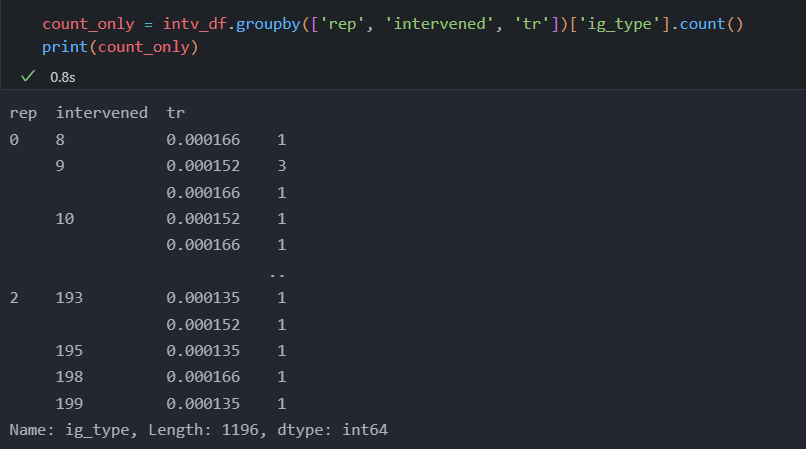

- 这样就完成了 groupby 计数
- 还可以执行一个额外的 groupby 来计算平均值
- 但最初的 groupby 返回的不是常见的 DataFrame
- 结果是多级索引 Series 的形式
  - 如果执行另一个 groupby 操作
  - 必须传入 levels 参数指明多级索引级别

```python
# 传入 [0, 1, 2] 分别指定第1级、第2级、第3级的索引
count_mean = count_only.groupby(level=[0, 1, 2]).mean()
print(count_mean.head())
```

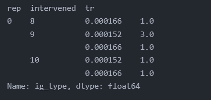

```python
# 把这些操作都放入一条语句中
count_mean = intv_df.groupby(['rep', 'intervened', 'tr'])['ig_type'].\
    count().groupby(level=[0, 1, 2]).mean()

# 结果如图
import seaborn as sns
import matplotlib.pyplot as plt

fig = sns.lmplot(x='intervened', y='ig_type', hue='rep', col='tr',
        fit_reg=False, data=count_mean.reset_index())
plt.show()
```

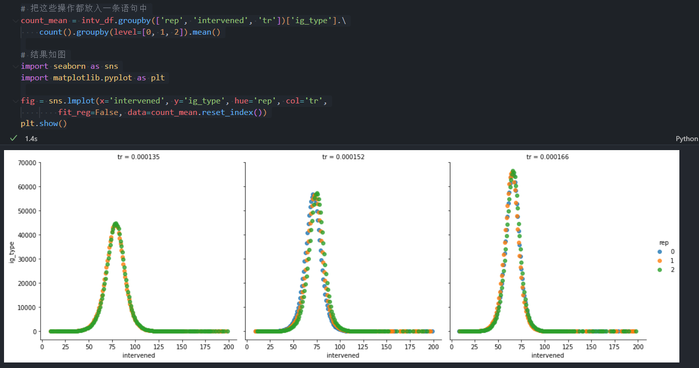

- 前面列子传入 level 参数来做额外的 groupby 计算
  - 可以传入整数
  - 也可以传入字符串，字符串会更易读

```python
# 把这些操作都放入一条语句中
cumulative_count = intv_df.groupby(['rep', 'intervened', 'tr'])['ig_type'].\
    count().groupby(level=['rep']).cumsum().reset_index()

# 结果如图
import seaborn as sns
import matplotlib.pyplot as plt

fig = sns.lmplot(x='intervened', y='ig_type', hue='rep', col='tr',
        fit_reg=False, data=cumulative_count.reset_index())
plt.show()
```

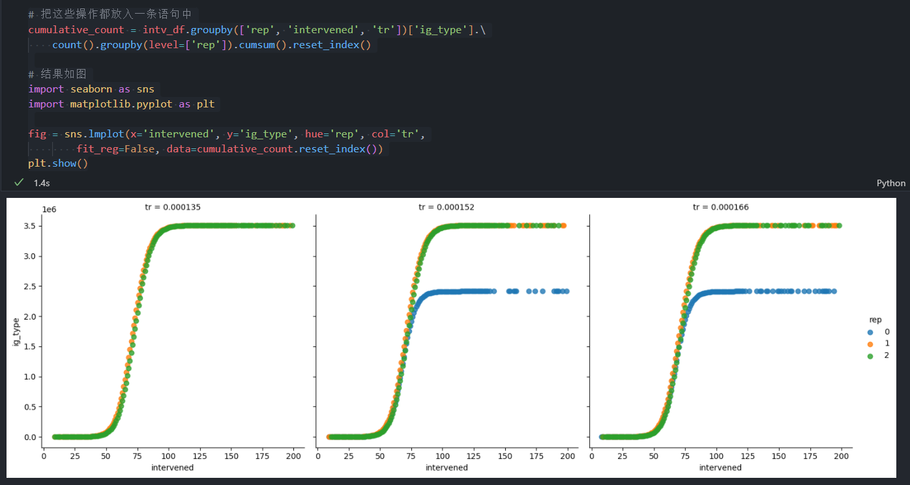

# 10.7 小结

- groupby 语句采用 “分割-应用-组合” 模式
- 建议阅读 groupby 方法的文档和 groupby 的通用文档
- 可以使用 grouby 语句做许多更复杂的事情
