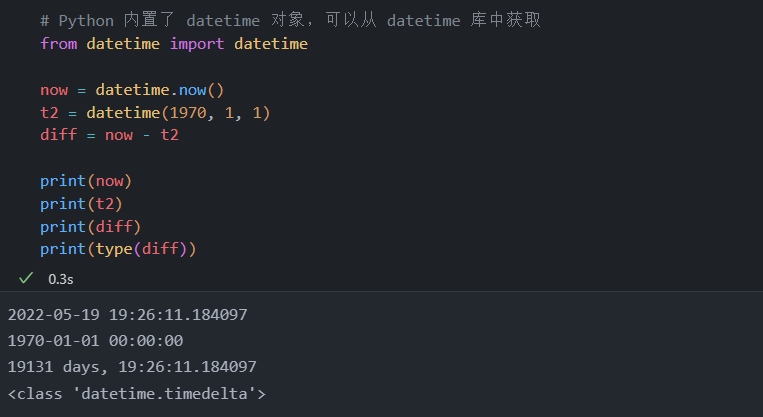
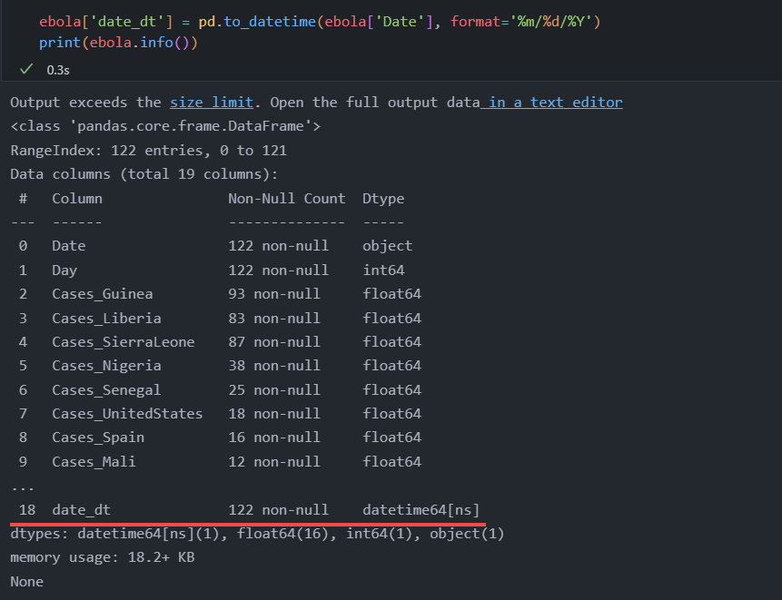
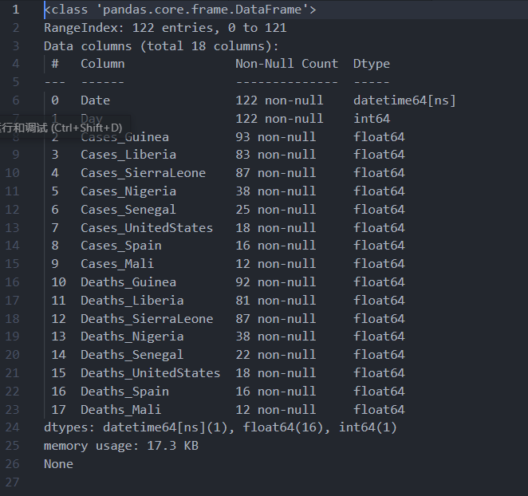
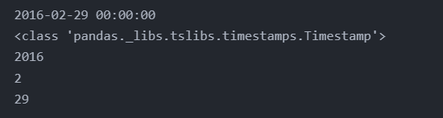
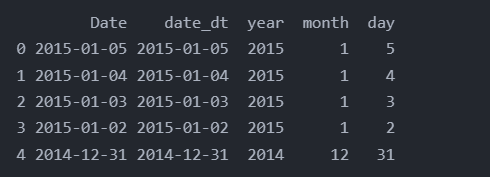
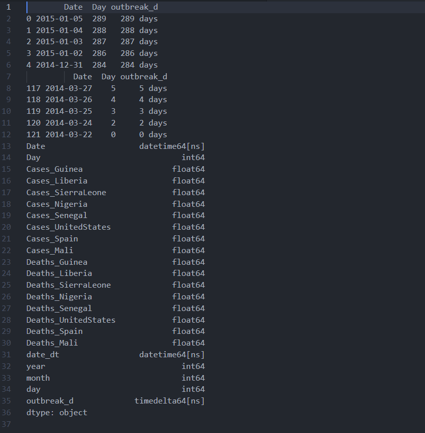
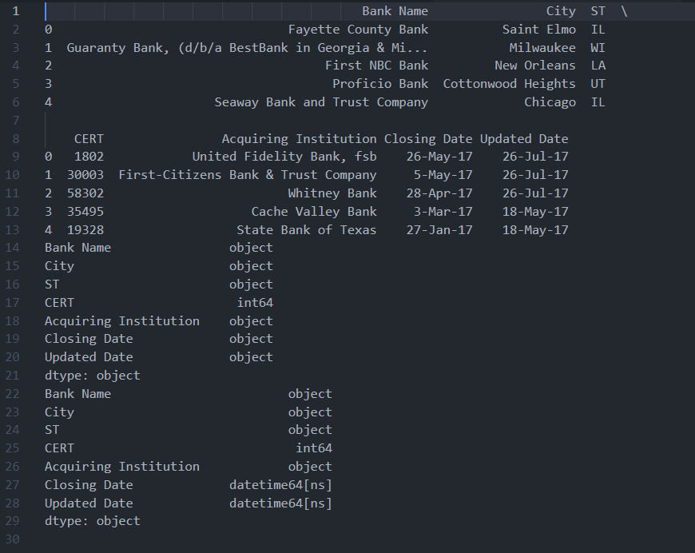
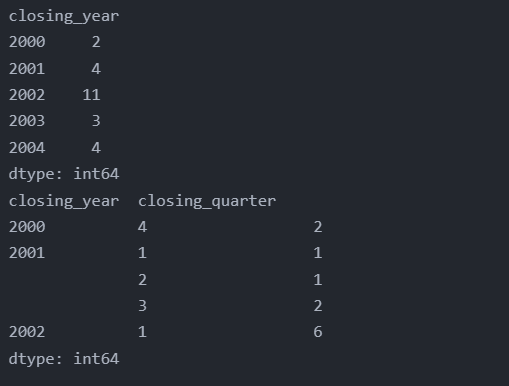
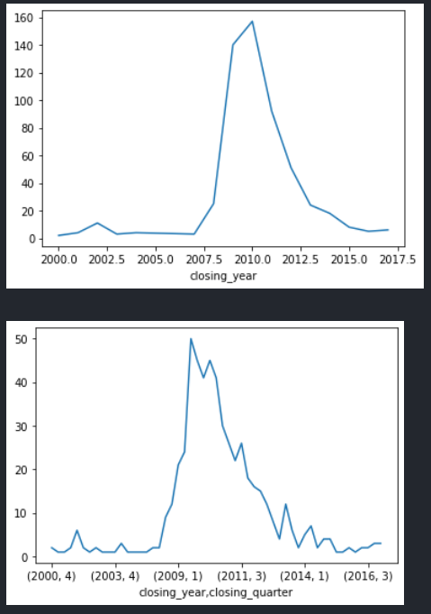

<!-- code_chunk_output -->

# 11.1 简介

## 目标

1. 使用 Python 内置的 datetime 库
2. 将字符串转换为日期
3. 格式化日期
4. 提取日期的各个部分
5. 执行日期运算
6. 处理 DataFrame 中的日期
7. 重新采样
8. 处理时区

# 11.2 Python 的 datetime 对象



# 11.3 转换为 datetime

- 可以使用 to_datatime 函数把一个对象转换为 datetime 类型

```python
# 加载 Ebola 数据集
import pandas as pd

ebola = pd.read_csv(r'../pandas_for_everyone-master/data/country_timeseries.csv')

# 获取左上角数据
print(ebola.iloc[:5, :5])

# date 列为日期，但数据类型为字符串
print(ebola.info())
```

!Ebola 数据集[](image/2022-05-20-15-55-59.png)

- 创建新列 date_dt，调用 to_datetime 方法把 Date 列转换为 datetime 后赋给 date_dt
- 
&nbsp;

- to_datetime 函数有许多参数
- 对于其他日期格式，可以使用 Python 的 strptime 语法手动指定表示方式
  - `time.strptime(string[, format])`
  - 参数
    - string -- 时间字符串
    - format -- 格式化字符串
  - 返回值
    - 返回 struct_time 对象
  - 说明：Python 中时间日期格式化符号
    - %y 两位数的年份表示（00-99）
    - %Y 四位数的年份表示（000-9999）
    - %m 月份（01-12）
    - %d 月内中的一天（0-31）
    - %H 24小时制小时数（0-23）
    - %I 12小时制小时数（01-12）
    - %M 分钟数（00-59）
    - %S 秒（00-59）
    - %a 本地简化星期名称
    - %A 本地完整星期名称
    - %b 本地简化的月份名称
    - %B 本地完整的月份名称
    - %c 本地相应的日期表示和时间表示
    - %j 年内的一天（001-366）
    - %p 本地A.M.或P.M.的等价符
    - %U 一年中的星期数（00-53）星期天为星期的开始
    - %w 星期（0-6），星期天为 0，星期一为 1，以此类推。
    - %W 一年中的星期数（00-53）星期一为星期的开始
    - %x 本地相应的日期表示
    - %X 本地相应的时间表示
    - %Z 当前时区的名称
    - %% %号本身

# 11.4 加载包含日期的数据

- read_csv 加载数据集时，可以直接在 parse_dates 参数中指定想要解析为日期的列

```python
ebola = pd.read_csv(r'../pandas_for_everyone-master/data/country_timeseries.csv', parse_dates=[0])
print(ebola.info())
```



# 11.5 提取日期的各个部分

```python
d = pd.to_datetime('2016-02-29')
print(d)

# 传入一个字符串会得到一个 TimeStamp 对象
print(type(d))

# 借助属性访问日期的各个部分
print(d.year)
print(d.month)
print(d.day)
```



- 对于 datetime 对象，可以执行类似字符串对象的操作
- 需要使用 dt 访问器访问 datetime 方法

```python
# 重建 date_dt 列
ebola['date_dt'] = pd.to_datetime(ebola['Date'])

# 基于 Date 列创建新列 year/month/day
ebola['year'] = ebola['date_dt'].dt.year
ebola['month'] = ebola['date_dt'].dt.month
ebola['day'] = ebola['date_dt'].dt.day
print(ebola[['Date', 'date_dt', 'year', 'month','day']].head())
```



# 11.6 日期运算和 Timedelta

- 获取 date 对象有助于进行日期运算

```python
# 疫情爆发的第一天（此数据集中最早的日期）
first_day = ebola['date_dt'].min()

# 创建新列计算疫情爆发天数
ebola['outbreak_d'] = ebola['date_dt'] - first_day
print(ebola[['Date', 'Day', 'outbreak_d']].head())
print(ebola[['Date', 'Day', 'outbreak_d']].tail())
print(ebola.dtypes) # 计算结果为 timedelta 对象
```



# 11.7 datetime 方法

- 加载银行数据集

```python
# 加载银行倒闭的数据
banks = pd.read_csv(r'../pandas_for_everyone-master/data/banklist.csv')
print(banks.head())
print(banks.dtypes)

banks = pd.read_csv(r'../pandas_for_everyone-master/data/banklist.csv', parse_dates=[5, 6])
print(banks.dtypes)
```



- 创建新列，表示银行破产的季度和年份

```python
import pandas as pd

# 加载银行倒闭的数据
banks = pd.read_csv(r'../pandas_for_everyone-master/data/banklist.csv', parse_dates=[5, 6])

# 创建银行破产季度与年份列
banks['closing_quarter'], banks['closing_year'] = (banks['Closing Date'].dt.quarter, banks['Closing Date'].dt.year)

# 计算每年破产的银行数量
closing_year = banks.groupby(['closing_year']).size()

# 计算每年每个季度的银行倒闭数量
closing_year_q = banks.groupby(['closing_year', 'closing_quarter']).size()

print(closing_year.head())
print(closing_year_q.head())
```



```python
# 绘制结果
import matplotlib.pyplot as plt

fig, ax = plt.subplots()
ax = closing_year.plot()
plt.show()

fig, ax = plt.subplots()
ax = closing_year_q.plot()
plt.show()
```



# 11.8 获取股票数据

- 股票价格是包含日期的常见数据类型
- Python 提供了相应的方法，可通过编写程序来获取这样的数据

# 11.9 基于日期获取子集

## 11.9.1 DatatimeIndex 对象

## 11.9.2 TimedeltaIndex 对象

# 11.10 日期范围

## 11.10.1 频率

## 11.10.2 偏移量

# 11.11 移动

# 11.12 重采样

# 11.13 时区

# 11.14 小结
