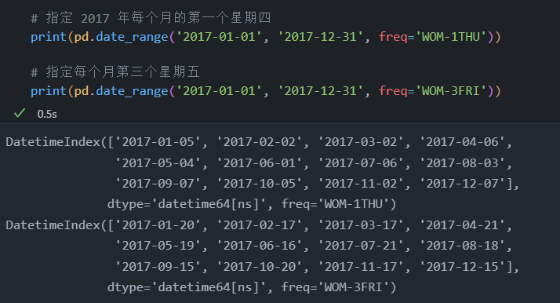

<!-- code_chunk_output -->

# 11.1 简介

## 目标

1. 使用 Python 内置的 datetime 库
2. 将字符串转换为日期
3. 格式化日期
4. 提取日期的各个部分
5. 执行日期运算
6. 处理 DataFrame 中的日期
7. 重新采样
8. 处理时区

# 11.2 Python 的 datetime 对象


# 11.3 转换为 datetime

- 可以使用 to_datatime 函数把一个对象转换为 datetime 类型

```python
# 加载 Ebola 数据集
import pandas as pd

ebola = pd.read_csv(r'../pandas_for_everyone-master/data/country_timeseries.csv')

# 获取左上角数据
print(ebola.iloc[:5, :5])

# date 列为日期，但数据类型为字符串
print(ebola.info())
```

!Ebola 数据集[](image/2022-05-20-15-55-59.png)

- 创建新列 date_dt，调用 to_datetime 方法把 Date 列转换为 datetime 后赋给 date_dt
- 
&nbsp;

- to_datetime 函数有许多参数
- 对于其他日期格式，可以使用 Python 的 strptime 语法手动指定表示方式
  - `time.strptime(string[, format])`
  - 参数
    - string -- 时间字符串
    - format -- 格式化字符串
  - 返回值
    - 返回 struct_time 对象
  - 说明：Python 中时间日期格式化符号
    - %y 两位数的年份表示（00-99）
    - %Y 四位数的年份表示（000-9999）
    - %m 月份（01-12）
    - %d 月内中的一天（0-31）
    - %H 24小时制小时数（0-23）
    - %I 12小时制小时数（01-12）
    - %M 分钟数（00-59）
    - %S 秒（00-59）
    - %a 本地简化星期名称
    - %A 本地完整星期名称
    - %b 本地简化的月份名称
    - %B 本地完整的月份名称
    - %c 本地相应的日期表示和时间表示
    - %j 年内的一天（001-366）
    - %p 本地A.M.或P.M.的等价符
    - %U 一年中的星期数（00-53）星期天为星期的开始
    - %w 星期（0-6），星期天为 0，星期一为 1，以此类推。
    - %W 一年中的星期数（00-53）星期一为星期的开始
    - %x 本地相应的日期表示
    - %X 本地相应的时间表示
    - %Z 当前时区的名称
    - %% %号本身

# 11.4 加载包含日期的数据

- read_csv 加载数据集时，可以直接在 parse_dates 参数中指定想要解析为日期的列

```python
ebola = pd.read_csv(r'../pandas_for_everyone-master/data/country_timeseries.csv', parse_dates=[0])
print(ebola.info())
```


# 11.5 提取日期的各个部分

```python
d = pd.to_datetime('2016-02-29')
print(d)

# 传入一个字符串会得到一个 TimeStamp 对象
print(type(d))

# 借助属性访问日期的各个部分
print(d.year)
print(d.month)
print(d.day)
```


- 对于 datetime 对象，可以执行类似字符串对象的操作
- 需要使用 dt 访问器访问 datetime 方法

```python
# 重建 date_dt 列
ebola['date_dt'] = pd.to_datetime(ebola['Date'])

# 基于 Date 列创建新列 year/month/day
ebola['year'] = ebola['date_dt'].dt.year
ebola['month'] = ebola['date_dt'].dt.month
ebola['day'] = ebola['date_dt'].dt.day
print(ebola[['Date', 'date_dt', 'year', 'month','day']].head())
```


# 11.6 日期运算和 Timedelta

- 获取 date 对象有助于进行日期运算

```python
# 疫情爆发的第一天（此数据集中最早的日期）
first_day = ebola['date_dt'].min()

# 创建新列计算疫情爆发天数
ebola['outbreak_d'] = ebola['date_dt'] - first_day
print(ebola[['Date', 'Day', 'outbreak_d']].head())
print(ebola[['Date', 'Day', 'outbreak_d']].tail())
print(ebola.dtypes) # 计算结果为 timedelta 对象
```


# 11.7 datetime 方法

- 加载银行数据集

```python
# 加载银行倒闭的数据
banks = pd.read_csv(r'../pandas_for_everyone-master/data/banklist.csv')
print(banks.head())
print(banks.dtypes)

banks = pd.read_csv(r'../pandas_for_everyone-master/data/banklist.csv', parse_dates=[5, 6])
print(banks.dtypes)
```


- 创建新列，表示银行破产的季度和年份

```python
import pandas as pd

# 加载银行倒闭的数据
banks = pd.read_csv(r'../pandas_for_everyone-master/data/banklist.csv', parse_dates=[5, 6])

# 创建银行破产季度与年份列
banks['closing_quarter'], banks['closing_year'] = (banks['Closing Date'].dt.quarter, banks['Closing Date'].dt.year)

# 计算每年破产的银行数量
closing_year = banks.groupby(['closing_year']).size()

# 计算每年每个季度的银行倒闭数量
closing_year_q = banks.groupby(['closing_year', 'closing_quarter']).size()

print(closing_year.head())
print(closing_year_q.head())
```


```python
# 绘制结果
import matplotlib.pyplot as plt

fig, ax = plt.subplots()
ax = closing_year.plot()
plt.show()

fig, ax = plt.subplots()
ax = closing_year_q.plot()
plt.show()
```


# 11.8 获取股票数据

- 股票价格是包含日期的常见数据类型
- Python 提供了相应的方法，可通过编写程序来获取这样的数据


- 因网络问题，无法通过 yahoo 获取特斯拉股票信息，故没有使用 pandas_datafreader 库

# 11.9 基于日期获取子集

```python
# 根据布尔值获取子集

tesla_2010_06 = tesla.loc[(tesla.Date.dt.year == 2010) & (tesla.Date.dt.month == 6)]
print(tesla_2010_06)
```


## 11.9.1 DatatimeIndex 对象

- 指定 Date 列为索引


- 将索引设置为日期对象后，可以直接使用日期来获取某些数据


## 11.9.2 TimedeltaIndex 对象

- 也可以使用 timedelta 来创建 TimedeltaIndex 对象

```python
# 创建一个 Timedelta delta 希腊字母常用语表示增量
tesla['ref_date'] = tesla['Date'] - tesla['Date'].min()

# 将 Timedelta 指派给 index
tesla.index = tesla['ref_date']
print(tesla.iloc[:5, :5])

# 基于 ref_date 选择数据
print(tesla['0 day': '5 day'].iloc[:5, :5])
```


# 11.10 日期范围

- 并非每个数据集的值都有对那个的频率
- 如果有日期缺失，通常的做法是创建一个日期范围来为数据集重建索引
  - 可以使用 date_range 函数实现

```python
# 为前几行创建一个日期范围

head_range = pd.date_range(start='2014-12-31', end='2015-01-05')
print(head_range)

ebola = pd.read_csv(r'../pandas_for_everyone-master/data/country_timeseries.csv')
ebola_5 = ebola.head()

# 要把 head_range 设置为 ebola_5 的索引，需要先把日期设置为 ebola_5 的索引
ebola_5.index = ebola_5['Date']
# 然后为数据重建索引
ebola_5.reindex(head_range)
print(ebola_5.iloc[:, :5])
```


## 11.10.1 频率

- 前面使用 date_range 函数创建了 head_range
  - date_range 函数有一个参数 freq，默认值为 D，表示日期范围内的值是逐日递增的
  - freq 可能的取值
    - B business day frequency 工作日频率
    - C custom business day frequency 自定义工作日频率
    - D calendar day frequency 日历日频率
    - W weekly frequency 每周频率
    - M month end frequency 月末频率
    - SM semi-month end frequency (15th and end of month) 半月结束频率（15日和月末）
    - BM business month end frequency 营业月结束频率
    - CBM custom business month end frequency 自定义营业月结束频率
    - MS month start frequency 月开始频率
    - SMS semi-month start frequency (1st and 15th) 半月开始频率（第1天和第15天）
    - BMS business month start frequency 营业月开始频率
    - CBMS custom business month start frequency 自定义营业月开始频率
    - Q quarter end frequency 四分之一结束频率
    - BQ business quarter end frequency 业务季度结束频率
    - QS quarter start frequency 季度开始频率
    - BQS business quarter start frequency 业务季开始频率
    - A, Y year end frequency 年终频率
    - BA, BY business year end frequency 业务年度结束频率
    - AS, YS year start frequency 年开始频率
    - BAS, BYS business year start frequency 营业年度开始频率
    - BH business hour frequency 营业时间频率
    - H hourly frequency 每小时频率
    - T, min minutely frequency 分钟的频率
    - S secondly frequency 秒钟的频率
    - L, ms milliseconds 毫秒
    - U, us microseconds 微妙
    - N nanoseconds 纳秒


## 11.10.2 偏移量

- 偏移量是在基本频率基础上做一点调整


- 通过在基本频率前加一个倍数值创建出了该偏移量
- 还可以将偏移量和其他基本频率结合使用



# 11.11 移动

- 各国疫情的暴发日期不同
  - 因此当日后出现新疫情时，很难比较各国疫情的暴发情况
&nbsp;

- 对于本例，最好所有日期都从 0 天开始
  - 由于有些日期每月列出来，因此需要为数据集的所有日期创建一个日期范围
  - 需要计算数据集中最早日期和每列最早有效日期之间的差值
  - 根据计算结果移动每列

```python
# 读取 ebola 数据集的一个副本
# 将 Date 列解析为 date 对象
# 把该日期指派给 index
import pandas as pd

ebola = pd.read_csv(r'../pandas_for_everyone-master/data/country_timeseries.csv', index_col='Date', parse_dates=['Date'])
print(ebola.head().iloc[:, :4])
print(ebola.tail().iloc[:, :4])

# 创建日期范围以填充数据中所有缺失的日期
new_idx = pd.date_range(ebola.index.min(), ebola.index.max())
print('查看 new_idx 日期顺序并不理想')
print(new_idx)

print('将 new_idx 顺序反转')
new_idx = reversed(new_idx)

print('为数据集重建索引，如果不存在索引，则会创建 NaN 行')
ebola = ebola.reindex(new_idx)

print('查看数据的头部和尾部，会看到原来没有列出的日期已经添加到了数据集中')
print('此外，date 列会被填充 NaT 值，表示日期缺失值')
print(ebola.head().iloc[:, :4])
print(ebola.tail().iloc[:, :4])
```


- 接下来计算数据集中的最早日期和每列最早有效日期之间的差值
  - 可以使用 Series 的 last_valid_index 方法执行这种计算
    - 它返回最后一个非缺失值或非空值的索引值

```python
# 使用 last_valid_index 获取所有列的第一个非缺失值或非空值的索引值
last_valid = ebola.apply(pd.Series.last_valid_index)
print(last_valid)

print('获取数据集中最早的日期')
earliest_date = ebola.index.min()
print(earliest_date)

print('用每个 last_valid 日期减去最小日期')
shift_values = last_valid - earliest_date
print(shift_values)

print('遍历各列，根据 shift_values 中相应的值使用 shift 方法把列下移')
print('shift_values 中的值都是整数，如果是负数，该操作会把值上移')
ebola_dict = {}
for idx, col in enumerate(ebola):
    d = shift_values[idx].days
    shifted = ebola[col].shift(d)
    ebola_dict[col] = shifted

print('根据字典，使用 Pandas DataFrame 函数把它转换成 DataFrame')
ebola_shift = pd.DataFrame(ebola_dict)
print(ebola_shift.head())
```


```python
print('行索引已失效，可以删除，指定正确的索引，即日期')
print('Day 不代表一起爆发的第一天，而是代表特定国家疫情爆发的第一天')
ebola_shift.index = ebola_shift['Day']
ebola_shift = ebola_shift.drop(['Day'], axis=1)
print(ebola_shift.tail())
```


# 11.12 重采样

- 重采样会把 datetime 从一个频率转换为另一个频率
- 重采样有如下3类
  - 下采样：从高频率到低频率（比如从每天到每月）
  - 上采样：从低频率到高频率（比如从每月到每天）
  - 原样采样：采样频率不变（比如从每月的第一个星期四到每月的最后一个星期五）
&nbsp;

- resample 函数有一个 rule 函数，用于接收偏移量字符串

```python
# 下采样：从每天到每月
# 这里有多个值，需要把结果聚合起来
# 使用 mean 函数
down = ebola.resample('M').mean()
print(down.iloc[:5, :5])

# 对下采样的值进行上采样
# 请注意填充了多少确实日期
# 使用缺失值进行填充
up = down.resample('D').mean()
print(up.iloc[:5, :5])
```


# 11.13 时区

- 自己编写时区转换器很不可取
- Python 的 pytz 库专用于处理时区
- Pandas 还对该库进行了包装

```python
# 导入 pytz 库
import pytz
print(len(pytz.all_timezones))  # 该库包含很多时区

import re

# 查看美国的时区
regex = re.compile(r'^US')
selected_files = filter(regex.search, pytz.common_timezones)
print(list(selected_files))
```


- 在 Pandas 中处理时区，最简单的方法是使用 pytz.all_timezones 给出的字符串名

```python
# 东部时间上午 7 点
depart = pd.Timestamp('2017-08-29 07:00', tz='US/Eastern')
print(depart)

print('对时区编码的另一种方法是调用“空”时间戳的 tz_localize 方法')
arrive = pd.Timestamp('2017-08-29 09:57')
print(arrive)
arrive = arrive.tz_localize('US/Pacific')
print(arrive)

print('把航班到达事件转换回东部时区，看看到达的具体时间')
print(arrive.tz_convert('US/Eastern'))

print('计算航班飞行时间')
duration = arrive.tz_convert('US/Eastern') - depart
print(duration)
```


# 11.14 小结
