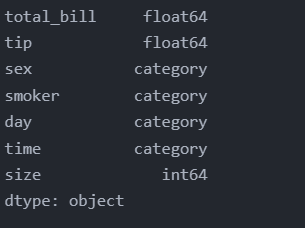
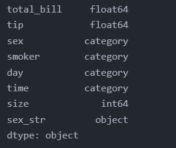
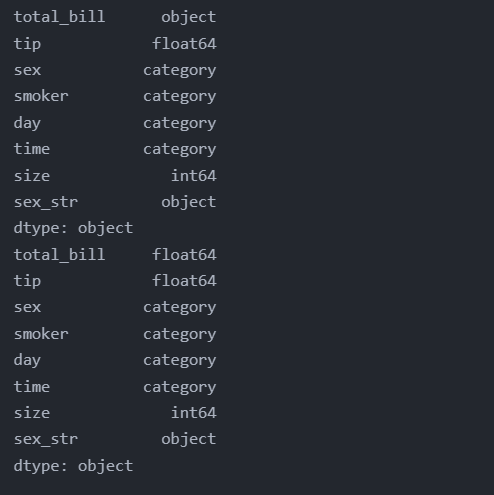
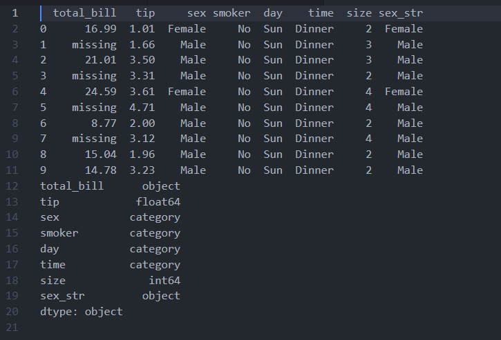
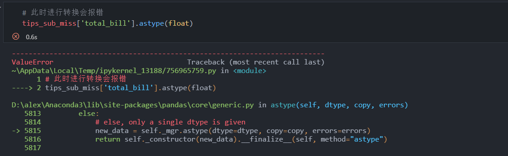
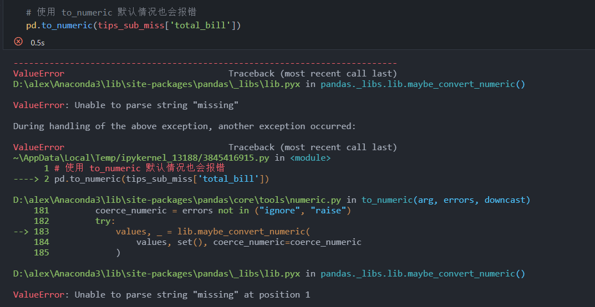
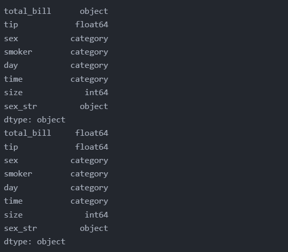
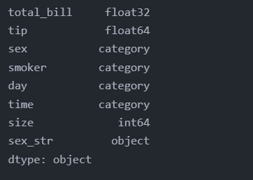
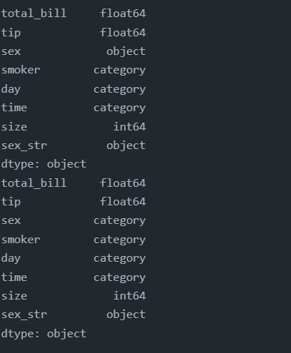

<!-- code_chunk_output -->

# 7.1 简介

- 数据类型决定了对变量（即“列”）的可能操作

## 目标

1. 查找 DataFrame 中“列”的数据类型
2. 转换数据类型
3. 分类数据

> 第 11 章会详述日期和时间数据的处理

# 7.2 数据类型

- 使用 seaborn 中的 tip 数据集来进行讲解

```python
# 导入tip数据集
import pandas as pd
import seaborn as sns

tips = sns.load_dataset('tips')
print(tips.dtypes)
```



- tips 数据集中的数据类型有 int64、float64 和 category
  - int64 和 float64 分别表示不带小数点和带小数点的数值数据，数值数据类型中的数字（即 64）表示保存数据所用位数
  - category 数据类型表示分类变量，它与存储任意字符串的普通 object 数据类型不同
    - 稍后会探讨这些差异

# 7.3 数据转换

- 首次获取数据，无需立即对所有数据类型进行转换
- 数据分析不是线性的过程，可以根据需要随时转换类型

## 7.3.1 转换为字符串对象

- 在 tips 数据集中，sex、smoker、day 和 time 变量都是 category 类型
  - 通常，如果变量不是数值类型，应先将其转换成字符串类型以便于后续处理
- 有些数据集中可能含有 id 列，id 的值虽然是数字，但对他们进行计算则没有任何意义
  - 唯一标识符或 id 编码通常都是这样
  - 在某些情况下，可能需要将它们转换为字符串对象类型
&nbsp;

- 把列值转换为字符串，可以使用 astype 方法
  - 该方法有个 dtype 参数，用于指定转换目标数据类型

```python
# 把sex变量转换为字符串对象类型（str）
tips['sex_str'] = tips['sex'].astype(str)
print(tips.dtypes)
```



- Python 内置了 str、float、int、complex 和 bool 几种数据类型
- 此外，还可以指定 NumPy 库支持的任何 dtype

## 7.3.2 转换为数值类型

- astype 方法是通用函数，可用于把 DataFrame 中的任何列转换为其他 dtype
- 对于 Series 对象，也可以用 astype 方法来进行转换

```python
# astype 示例
tips['total_bill'] = tips['total_bill'].astype(str)
print(tips.dtypes)

tips['total_bill'] = tips['total_bill'].astype(float)
print(tips.dtypes)
```



### 7.3.2.1 to_numeric 函数

- 如果想把变量转换为数值类型，还可以使用 Pandas 的 to_numeric 函数
  - 它擅长处理非数值类型数据
&nbsp;

- 由于 DataFrame 中每列的 dtype 必须相同，所以有时数值列的值会包含一些字符串
  - 例如，数值列可能使用字符串 missing 或 null 来代替缺失值
  - 这会让整列变成字符串对象类型，而不是数值类型

```python
# 获取 tips 子集
tips_sub_miss = tips.head(n=10)

# 添加一些缺失值
tips_sub_miss.loc[[1, 3, 5, 7], 'total_bill'] = 'missing'
print(tips_sub_miss)

# 查看 dtypes，会发现 total_bill 列变成了字符串对象类型
print(tips_sub_miss.dtypes)
```





- to_numeric 函数有一个参数 erroes，有如下3种可能的取值
  - raise: 这是 errors 参数的默认值，当 to_numeric 函数遇到无法转换为数值的值时，它会引发一个错误
  - coerce: 当 to_numeric 函数遇到无法转换为数值的值时，会返回 NaN
  - ignore: 当 to_numeric 函数遇到无法转换为数值的值时会放弃转换，直接返回整列（且什么都不做）
- 当已知某列数据确定是数值，但出于某种原因，包含了非数值数据时，该方法非常好用

```python
# 获取 tips 子集
tips_sub_miss = tips.head(n=10)

# 添加一些缺失值
tips_sub_miss.loc[[1, 3, 5, 7], 'total_bill'] = 'missing'

# errors示例
tips_sub_miss['total_bill'] = pd.to_numeric(tips_sub_miss['total_bill'], errors='ignore')   # 忽略非数值，什么也不做
print(tips_sub_miss.dtypes)

tips_sub_miss['total_bill'] = pd.to_numeric(tips_sub_miss['total_bill'], errors='coerce')   # 非数值返回 NaN
print(tips_sub_miss.dtypes)
```



### 7.3.2.2 to_numeric 向下转型

- to_numeric 还有一个 downcast 参数
  - 允许把列（或向量）转换为数值向量之后，把数值类型更改（即向下转型）为最小的数值类型
  - 默认情况下，downcast 的值为 None，其他可能的值有 “integer” “signed” “unsigned” 和 “float”

```python
# 设置 downcast 参数为 float 后，total_bill 的数据类型由 float64 变为 float32
tips_sub_miss['total_bill'] = pd.to_numeric(tips_sub_miss['total_bill'], errors='coerce', downcast='float')
print(tips_sub_miss.dtypes) 
```



- total_bill 的数据类型由 float64 变为 float32
- 意味着它占用的空间（内存）更小了

# 7.4 分类数据

- 并非所有数据都是数值
- Pandas 中有一种 category dtype，用于对分类值进行编码，有如下优点
  - 采用这种方法存储数据能显著节约内存，提高速度，尤其是当数据集中包含许多重复的字符串值时
  - 当一列值存在一定的顺序（如李克特量表）时，应转换成分类数据
  - 有些 Python 库可以处理分类数据（比如拟合统计模型）

## 7.4.1 转换为 category 类型

- 调用 astype 方法时，将 category 传递给它即可

```python
# 先把sex列转换为字符串对象
tips['sex'] = tips['sex'].astype('str')
print(tips.dtypes)

# 再把sex列转换为category
tips['sex'] = tips['sex'].astype('category')
print(tips.dtypes)
```



## 7.4.2 操作分类数据

- 分类 API 中有一个列表，给出了可以在分类 Series 上执行的操作
&nbsp;

- 表 7-1 分类 API

|属性或方法|说明|
|:----|:----|
|Series.cat.categories | 类别 |
|Series.cat.ordered | 类别是否有顺序 |
|Series.cat.codes | 返回类别的整数代码 |
|Series.cat.rename_categories() | 重命名类别 |
|Series.cat.reorder_categories() | 对类别重新排序 |
|Series.cat.add_categories() | 添加新类别 |
|Series.cat.remove_categories() | 删除类别 |
|Series.cat.remove_unused_categories() | 删除未使用的类别 |
|Series.cat.set_categories() | 设置新类别 |
|Series.cat.as_ordered() | 对类别排序 |
|Series.cat.as_unordered() | 使类别无序 |

# 7.5 小结

- 介绍了如何转换数据类型
- dtypes 控制着可以对列执行的操作
