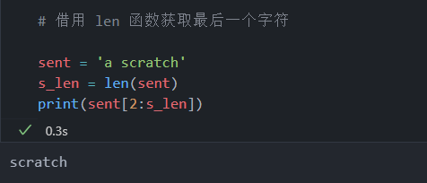

<!-- code_chunk_output -->

# 8.1 简介

## 目标

1. 对字符串取子串
2. 使用字符串方法
3. 字符串格式化
4. 使用正则表达式

# 8.2 字符串

## 8.2.1 取子串和字符串切片

- 可以把字符串视作字符的容器
- 在 python 中使用切片符号时，采用“左包含右排除”的原则，即包含冒号左侧索引值，而不包含右侧索引值

## 8.2.2 获取字符串的最后一个字符

- 借用 len 函数获取



# 8.3 字符串方法

- Python 提供了许多数据处理方法，详见“String Methods”文档页面
- [字符串方法文档页面](https://docs.python.org/3.10/library/stdtypes.html#string-methods)

# 8.4 更多字符串方法

## 8.4.1 join 方法

- str.join(iterable)
  - Return a string which is the concatenation of the strings in iterable. A TypeError will be raised if there are any non-string values in iterable, including bytes objects. The separator between elements is the string providing this method.

## 8.4.2 splitlines 方法

- str.splitlines(keepends=False)
  - Return a list of the lines in the string, breaking at line boundaries. Line breaks are not included in the resulting list unless keepends is given and true.

  - This method splits on the following line boundaries. In particular, the boundaries are a superset of universal newlines.

- 使用 splitlines 函数可以得到一个列表，列表中的每个元素是这段对话的一行

# 8.5 字符串格式化

- 格式化字符串允许为字符串指定一个通用模板，并向该模式插入变量
- 把字符串格式化有助于向控制台输出内容
  - 除了输出变量之外，还可以输出字符串，为输出值给出相关提示

## 8.5.1 自定义字符串格式

- 字符串格式化文档中描述了一种更新的字符串格式化方法，并且提供了大量示例？
  - 未提供文档及链接

## 8.5.2 格式化字符串

- 要格式化字符串，需要编写一个带有特殊占位符的字符串，并在字符串上调用 fromat 方法向占位符插入值

```python
# 占位符与 fromat 方法
var = 'flesh wound'
s = "It's just a {}"
print(s.format(var))
print(s.format('scratch'))

# 通过索引多次使用变量
a = """Black Knight: 'Tis but a{0}.
        King Arthur: A {0}? Your arm's off!"""
print(a.format('scratch'))

# 也可以给占位符一个变量

b = 'Hayden Planetarium Coordinates: {lat}, {lon}'
print(b.format(lat='40.7815', lon='73.9733'))
```


## 8.5.3 格式化数字

```python
# 数字格式化
print('Some digits of pi: {}'.format(3.14159))

# 使用千位分隔符
print("In 2005, Lu Chao of China recited {:,} digits of pi".format(67890))

# 格式化为百分数
# {0:.4} 和 {0:.4%} 中的 0 表示索引值，4 表示保留多少位小数
# 如果加上 % 则表示把小数格式化为百分数
print("I remember {0:.4} or {0:.4%} of what Lu Chao recited".format(7/67890))
```


- 可以通过字符串格式使用 0 来填充数字，工作方式类似于 zfill
- 处理数据中的 ID 编号时，该方法会非常有用


## 8.5.4 C printf 格式化风格

- 在 Python 中，格式化字符串的另一种方法是使用运算符“%”
  - 这遵循的是 C printf 格式化风格


## 8.5.5 Python 3.6+ 中的格式化字符串

- 格式化字符串（f-strings）是 Python 的新特性
  - 区别在于必须以字母 f 开头，告知 Python 此处有格式化字符串
  - 然后可以直接在占位符 {} 中使用变量，而无需调用 format 方法
  - 好处在于，可读性更好、执行速度更快、性能更高


# 8.6 正则表达式

- 做模式搜索时，如果基本的 Python 字符串方法不够用，可以使用正则表达式(RegEx)
- 正则表达式功能极其强大，提供了一种重要的方法来查找和匹配字符串中的模式
&nbsp;

- 学习正则表达式的网站：[正则表达式](https://regex101.com/)
- Python 中的正则表达式则要用到 re 模块

## 8.6.1 匹配模式

- 匹配 10 位数字的模式


- 查看输出的 match 对象就会发现，如果存在匹配
  - span 会给出匹配字符串的索引
  - match 会给出精确匹配到的字符串
- 很多时候，以某个模式匹配字符串时，只需要一个 True 或 False 值，用于指出是否存在匹配
  - 对于这种情况，使用内置的 bool 函数即可
  - 在 if 语句中，无需进行 bool 类型转换


- 如果想获取匹配对象的某些值，比如索引位置或实际匹配到的字符串
  - 可以使用 match 对象的一些方法


- 当数字中有空格，前面的匹配模式失效

```python
# 可以把 RegEx 模式看作单独的变量
# 因为它有可能变得很长，让对实际匹配函数的调用难以阅读
tele_num_spaces = '123 456 7890'

p1 = '\d{3}\s?\d{3}\s?\d{4}'
m1 = re.match(pattern=p1, string=tele_num_spaces)
print(m1)

# 也可以使用圆括号把区号括起来，并在7个主要数字之间加短划线
tele_num_spaces_paren_dash = '(123) 456-7890'
p2 = '\(?\d{3}\)?\s?\d{3}\s?-?\d{4}'
m2 = re.match(pattern=p2, string=tele_num_spaces_paren_dash)
print(m2)

# 电话号码前可能有国家代码
cnty_tele_num_spaces_paren_dash = '+1 (123) 456-7890'
p3 = '\+?1\s?\(?\d{3}\)?\s?\d{3}\s?-?\d{4}'
m3 = re.match(pattern=p3, string=cnty_tele_num_spaces_paren_dash)
print(m3)
```


## 8.6.2 查找模式

- 可以使用 findall 函数来查找模式中的所有匹配项


## 8.6.3 模式替代

```python
# 模式替代
multi_str = """Guard: What? Ridden on a hourse?
King Arthur: Yes!
Guard: You're using coconuts!
King Arthur: What?
Guard: You've got ... cocount[s] and you're bangin' 'em togother
"""

p = '\w+\s?\w+:\s'

s = re.sub(pattern=p, string=multi_str, repl='')
print(s)
```


## 8.6.4 编译模式

- 处理数据的时候，很多操作通常是按行或列进行的
- Python 的 re 模块支持对模式进行编译，以便复用它
  - 可能会提升性能，特别是当数据集很大时，性能提升会很显著
- 语法和前面的几乎相同
  - 首先编写好正则表达式模式，但不将它直接保存在变量中，而是把模式字符串传递到 compile 函数中并保存结果
  - 然后在这个编译好的模式上调用其他 re 函数

```python
# 编译模式 match
p = re.compile('\d{10}')
s = '1234567890'
m = p.match(s)
print(m)

# findall
p = re.compile('\d+')
s = "13 Jodie Whittaker, war John Hurt, 12 Peter Capaldi, "\
    "11 Matt Smith, 10 David Tennant, 9 Christopher Eccleston"
m = p.findall(s)
print(m)

# sub 替换
p = re.compile('\w+\s?\w+:\s')
s = "Guard: You're using coconuts!"
m = p.sub(string=s, repl='')
print(m)
```


- Python 办公自动化，直接教的就是 编译模式

# 8.7 regex 库

- re 库是 Python 应用最广泛的正则表达式库，是 Python 内置和默认的正则表达式引擎
- 正则表达式的重度用户可能会觉得 regex 库比 re 库好，功能更全面
- regex 库和 re 库是向后兼容的


> 关于 regex 库的更多详细讲解及示例：[regex](www.rexegg.com)

# 8.8 小结

- 以文本形式存在的数据非常普遍
- 掌握如何处理文本字符串是数据科学家的一项基本技能
