<!-- code_chunk_output -->

# 9.1 简介

- “应用”（apply）是数据清理的基础
  - “应用”是指把函数同时“作用于” DataFrame 的每一行或每一列
  - 它类似于编写一个跨每行或每列的 for 循环，并同时调用 apply 函数
  - 通常，这是跨 DataFrame 应用函数的首选方法，因为它往往比在 Python 中编写 for 循环要快得多

## 目标

1. 认识函数
2. 跨行或列应用函数

# 9.2 函数

- 函数是编写 apply 语句的核心元素
  - 函数是对 Python diamante进行分组和复用的一种方法
  - 如果某段代码会被多次使用，并且使用时只需做少量修改，这时就应该考虑把这段代码放入一个函数中
- 在使用函数之前，需要先“定义”它，其基本定义形式如下

```python
# 函数定义形式
def my_function():
    # 缩进4个空格
    # 函数代码在此
```

# 9.3 使用函数

- 如何在 pandas 中使用函数？
- 当处理 DataFrame 时，可能需要把一个函数应用于多行或多列数据

```python
# 创建一个两列的 DataFrame
import pandas as pd

df = pd.DataFrame({'a': [10, 20, 30], 'b': [20, 30, 40]})

# 直接计算无需调用前面定义的函数
print(df['a'] ** 2) #
```

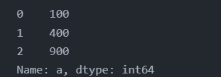

## 9.3.1 Series 的 apply 方法

- 在 Pandas 中，当从一个 DataFrame 取其中一列或一行时，返回的对象类型是 Series
- Series 有一个 apply 方法
  - 该方法有一个 func 参数
  - 当传递给它一个函数之后，apply 方法就会把传入的函数应用于 Series 的每个元素

```python
# 求方法函数
def my_sq(x):
    """求平方"""
    return x ** 2

# 把平方函数应用于列a
sq = df['a'].apply(my_sq)
print(sq)
```


> 当把 my_sq 传递给 apply 时，不要在 my_sq 后面加上圆括号

- 基于 my_sq 新建函数 my_exp 用于幂运算
  - 具有两个参数，一个是幂运算的底数，一个是指数
- 当把 my_exp 函数应用于一个 Series 时
  - 除了要把 my_exp 传递给 apply 之外
  - 还要多传递一个参数，用于设置指数的大小

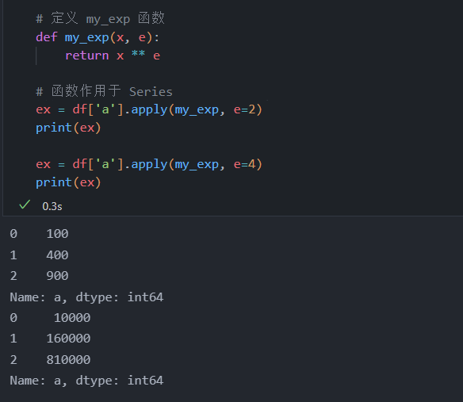

## 9.3.2 DataFrame 的 apply 方法

- DataFrame 通常至少有两个维度
  - 因此，当向 DataFrame 应用一个函数时，首先需要指定应用该函数的轴
    - 例如逐行或者逐列
- 如果按列应用函数，需设置 DataFrame.apply 方法的 axis 参数为0
- 按行应用，axis 为 1

### 9.3.2.1 按列应用


- 当向 DataFrame 应用一个函数时，整个轴会传递到函数的第一个参数中

```python
# 定义一个 3 参数函数
def avg_3(x, y, z):
    return (x + y + z) / 3

# 引发错误，由错误信息可知缺少了2个参数的值
print(df.apply(avg_3))  # axis 默认为 0 
```


- 需对函数进行调整

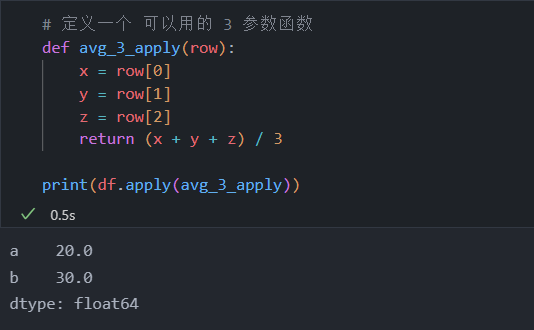

### 9.3.2.2 按行应用

- 与按列应用类似，针对的轴不同

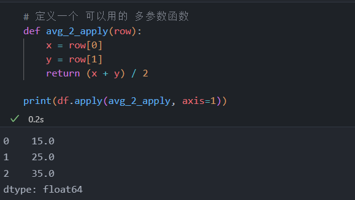

# 9.4 apply 高级用法

- 以 seaborn 库内置的 titanic 数据集举例

1. 引用数据集，查看数据集信息
   1. 该数据集共有 891 行和 15 列
   2. 在 891 个案例中，age 值都存在的有 714个
   3. deck 值都存在的有 203 个
2. 编写几个函数待使用

```python
# 引用数据集
import seaborn as sns

titanic = sns.load_dataset('titanic')
print(titanic.info())       # 查看数据集基本特征
```

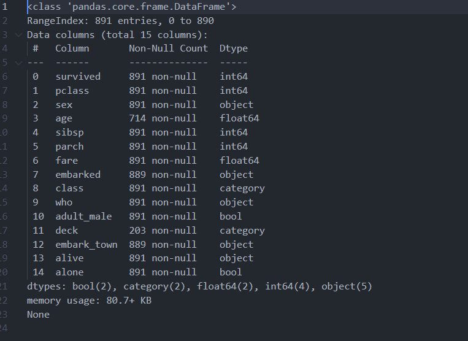

```python
# 缺失值数
# 使用 NumPy 库的 sum 函数
import numpy as np

def count_missing(vec):
    """计算一个向量中的缺失值的个数"""
    # 根据值是否缺失获取一个由 True/False 值组成的向量
    null_vec = pd.isnull(vec)
    # 得到 null_vec 中 null 值的个数
    # null 值对应 True，True 为 1
    null_count = np.sum(null_vec)
    
    # 返回向量中缺失值的个数
    return null_count

# 缺失值占比
def prop_missing(vec):
    """向量中缺失值的占比"""
    # 计算缺失值的个数
    # 这里使用刚刚编写的 count_missing 函数
    num = count_missing(vec)

    # 获得向量中元素的个数
    # 也需要统计缺失值的个数
    dem = vec.size

    # 返回缺失值的占比
    return num / dem

# 完整值所占比例
def prop_complete(vec):
    """向量中非缺失值（完整值）的占比"""
    # 先计算缺失值的占比
    # 然后用 1 减去缺失值的占比
    return 1 - prop_missing(vec)
```

- NumPy 和 Pandas 有很多函数可以处理向量
- 这些向量化函数（参见9.5节）可以应用于多个“向量”，处理任意数量的数据

## 9.4.1 按列应用

```python
# 把前面定义好的函数应用于列
cmis_col = titanic.apply(count_missing)
pmis_col = titanic.apply(prop_missing)
pcom_col = titanic.apply(prop_complete)

print(cmis_col)
print(pmis_col)
print(pcom_col)
```

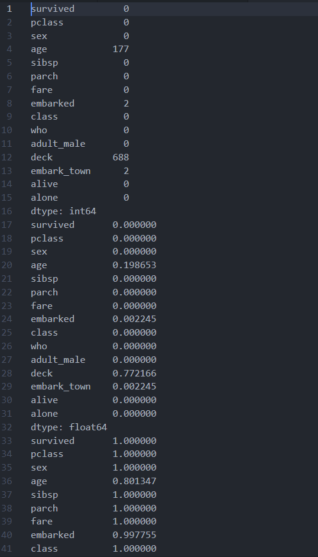

- 知道了缺失值个数，就可以判断某列是否适用于分析

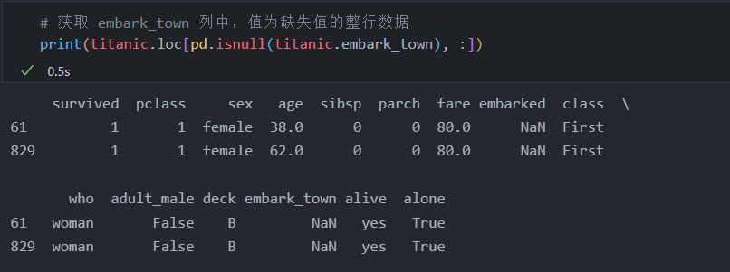

## 9.4.2 按行应用

```python
# 直接应用于多行，无需修改函数
cmis_row = titanic.apply(count_missing, axis=1)
pmis_row = titanic.apply(prop_missing, axis=1)
pcom_row = titanic.apply(prop_complete, axis=1)

print(cmis_row)
print(pmis_row)
print(pcom_row)
```

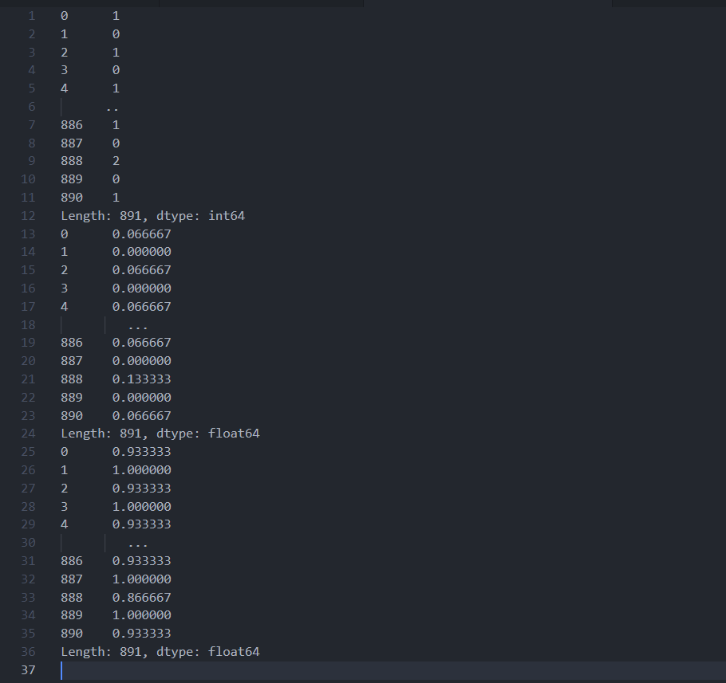

- 按行使用的情况下，可以创建一个包含这些值的新列

```python
print('创建包含这些值的新列')
titanic['num_missing'] = titanic.apply(count_missing, axis=1)
print(titanic.head())

print('查看包含多个缺失值的行，举例 10 行')
print(titanic.loc[titanic.num_missing > 1, :].sample(10))
```

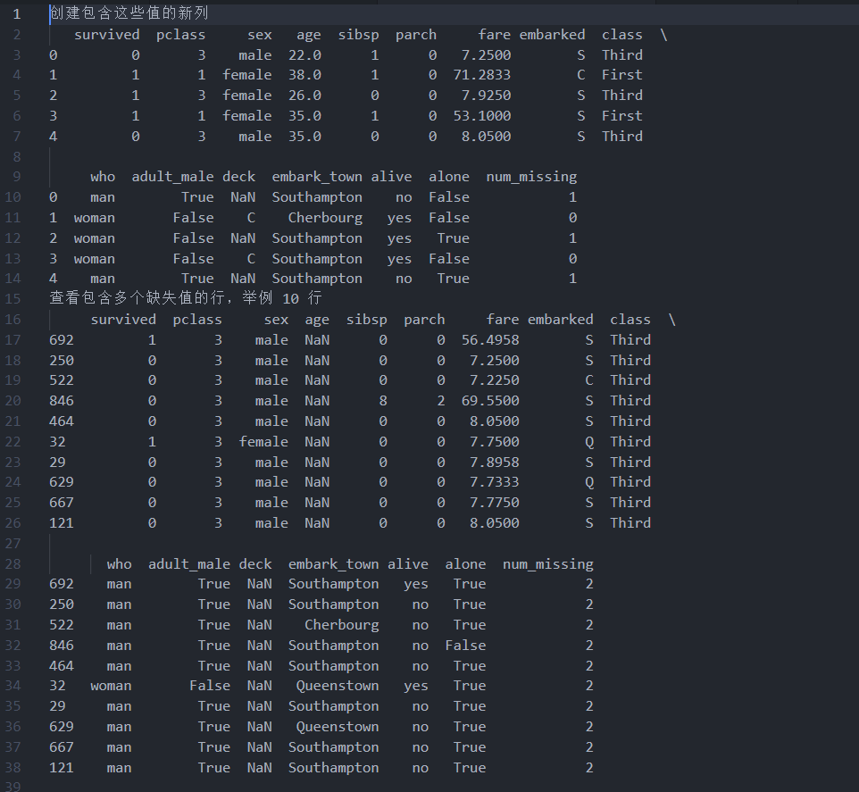

# 9.5 向量化函数

- 使用 apply 时，可以按行或按列应用函数
  - 如果想应用自定义函数，必须重写它（9.3节）
  - 但是有时这种重写方式是不可行的
- 这时，可以利用向量化函数和装饰器对所有函数进行向量化
- 对代码进行向量化，也可以提升运行性能

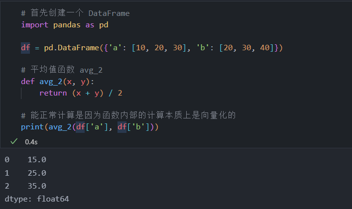

```python
import numpy as np

def avg_2_mod(x, y):
    """当 x 不等于 20 时，计算平均值"""
    if (x == 20):
        return(np.NaN)
    else:
        return (x + y) / 2

# 发送错误
print(avg_2_mod(df['a'], df['b']))
```

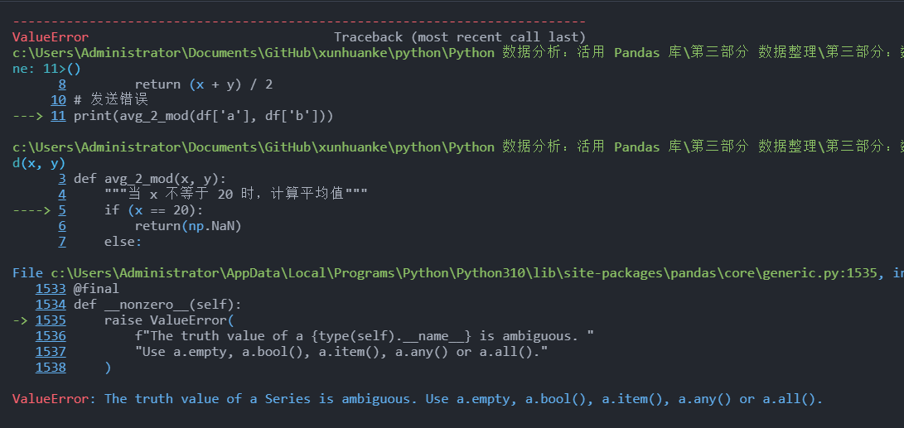

## 9.5.1 使用 NumPy

- 下面更改函数，当给它一个值向量时，它会逐个元素执行计算
- 可以使用 NumPy 库的 vectorize 函数来实现
  - 把要向量化的函数传递给 np.vectorize，创建新的函数

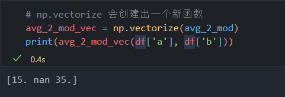

- 如果没有某个函数的源代码，可以如上所示使用 np.vectorize 将其向量化
- 但是，如果该函数是自定义的，可以使用 Python 装饰器 “自动” 把函数向量化，并且无须创建新函数
- 装饰器是函数，它们以其它函数为输入并修改其行为

```python
# 为了使用 vectorize 装饰器，要在函数定义之前使用 @ 符号
@np.vectorize
def v_avg_2_mod(x, y):
    """当 x 不等于 20 时，计算平均值，
        和前面一样，但这里使用 vectorize 装饰器"""
    if (x == 20):
        return(np.NaN)
    else:
        return (x + y) / 2

# 然后，可以直接使用向量化的函数，不必创建新函数
print(v_avg_2_mod(df['a'], df['b']))
```

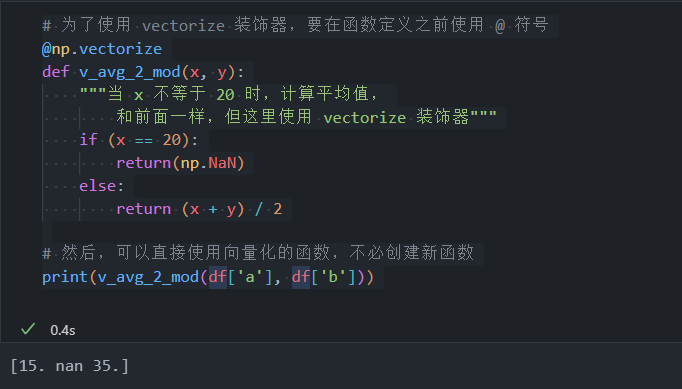

## 9.5.2 使用 numba

- numba 库是为优化 Python 代码而设计的，尤其针对进行科学计算的数组计算
- 类似于 NumPy，numba 有一个 vectorize 装饰器

== 由于版本问题容易导致报错，此节跳过==

# 9.6 lambda 函数

- 有时候 apply 方法中使用的函数非常简单，无须单独创建
- 可以编写一个模式，从数据行提取所有字母，并把它们赋给新的 name 列

```python
# 读取数据 docs，此数据集只有一列
docs = pd.read_csv('../pandas_for_everyone-master/data/doctors.csv', header=None)

# 编写函数取出字母
import regex

p = regex.compile('\w+\s+\w+')

def get_name(s):
    return p.match(s).group()

# 生成新列 name
docs['name_func'] = docs[0].apply(get_name)
print(docs)
```

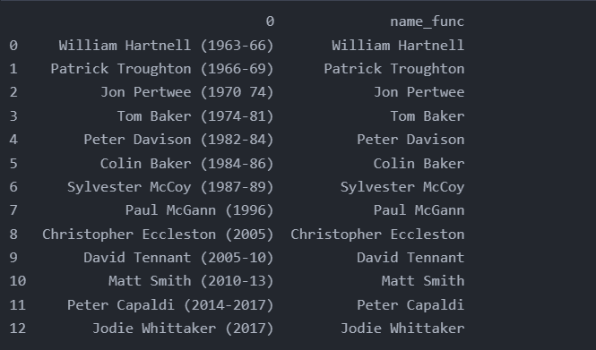

- get_name 函数其实很简单，仅有一行代码
- 这种情况下，通常直接把这行代码写到 apply 方法中
  - 即运用 lambda 函数

```python
# 读取数据 docs，此数据集只有一列
import pandas as pd 
docs = pd.read_csv('../pandas_for_everyone-master/data/doctors.csv', header=None)

# 编写函数取出字母
import regex

p = regex.compile('\w+\s+\w+')

# 使用 lambda 函数重写上面代码
docs['name_func'] = docs[0].apply(lambda x: p.match(x).group())
print(docs)
```

- 结果同上
&nbsp;

- 编写 lambda 函数要使用 lambda 关键字
  - 由于 apply 函数会把整行或整列作为第一个参数传递过来，所以 lambda 函数只有一个参数 x
  - 然后就可以直接编写函数，而不必定义它了，而且计算结果会自动返回
- 虽然可以编写复杂的 lambda 函数（包含多行代码），但通常只在需要单行计算时才会使用
- lambda 函数包含过多代码，会难以阅读

# 9.7 小结

- 本章讲了一个非常重要的概念，即创建可应用于目标数据的函数
- 并非所有数据清理或处理工作都可以使用内置函数完成
- 很多时候，必须自定义函数来处理和分析数据
