<!-- code_chunk_output -->

# 4.1 简介

- 本章主要介绍各种数据清理工作
- 首先将各种数据集组合成待分析的数据集

## 概念一栏

- 预备知识
  - 加载数据
  - 获取数据子集
  - 函数和类方法

## 目标

- 整理数据
- 链接数据
- 合并数据集

# 4.2 整理数据

- Hadley Wickham，提出了“整洁数据”的概念
- “整洁数据”指对数据集进行结构化处理
  - 使其易于分析
- 这是数据清理的主要目标
&nbsp;

- 何为“整洁数据”
  - 每个观测值成一行
  - 每个变量成一列
  - 每种观测单元构成一张表格

## 组合数据集

- 数据整理好之后，可能要把不同表格组合起来才能回答某个问题
- 意味着数据分析师必须自己组合相关数据来回答问题

# 4.3 连接

- 组合数据的一种比较简单的方法是使用“连接”（concatenation）
  - 指把某行或某列追加到数据中
- 可以使用 Pandas 中的 concat 函数执行连接操作

## 4.3.1 添加行

```python
# 加载几个数据集，展示如何连接数据集
import pandas as pd

df1 = pd.read_csv('../pandas_for_everyone-master/data/concat_1.csv')
df2 = pd.read_csv('../pandas_for_everyone-master/data/concat_2.csv')
df3 = pd.read_csv('../pandas_for_everyone-master/data/concat_3.csv')

print(df1)
print('-' * 50)
print(df2)
print('-' * 50)
print(df3)
```

运行结果：

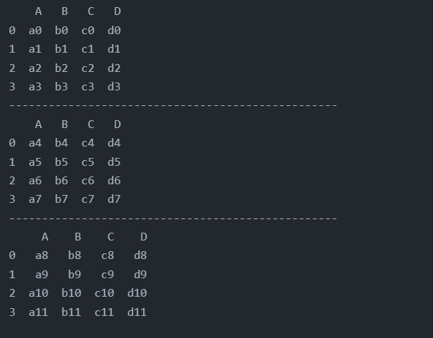

- 可以使用 Pandas 中的 concat 函数把上面3个 DataFrame 连接起来
- 需要把3个 DataFrame 放入一个列表中

```python
# concat示例
import pandas as pd

df1 = pd.read_csv('../pandas_for_everyone-master/data/concat_1.csv')
df2 = pd.read_csv('../pandas_for_everyone-master/data/concat_2.csv')
df3 = pd.read_csv('../pandas_for_everyone-master/data/concat_3.csv')

row_concat = pd.concat([df1, df2, df3])
print(row_concat)
```

运行结果：

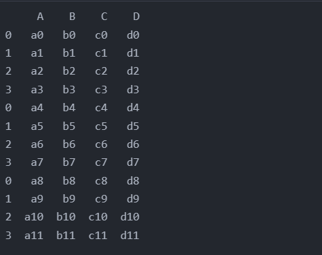

- 当采用 iloc["索引行号"] 时 iloc[3] 只会显示第4行数据
- 当采用 loc["索引行名"] 时 iloc[3] 只会显示3行数据，分别是第4行、第8行、第12行

- 新建一个 Series 并将其加到一个 DataFrame 中，追加操作会出问题

```python
import pandas as pd

df1 = pd.read_csv('../pandas_for_everyone-master/data/concat_1.csv')
new_row_series = pd.Series(['n1', 'n2', 'n3', 'n4'])    # 新建一行数据
a = pd.concat([df1, new_row_series])                    # 尝试向 DataFrame 中添加新行
print(a)
```

运行结果：

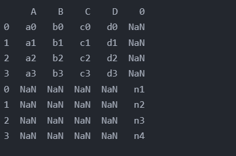

- 可以看到包含 NaN 值，这是 Python 表示“缺失值”的方法
- 解决方法：
  - 可以把 Series 转换为 DataFrame，此 DataFrame 包含一行数据，
  - 并使用 columns 参数指定要绑定的列名

```python
# series加入dataframe
import pandas as pd

df1 = pd.read_csv('../pandas_for_everyone-master/data/concat_1.csv')
# 注意使用了两个方括号，这样 shape 是 [1, 4], 一个方括号，shape 是 [4, 1]
new_row_df = pd.DataFrame([['n1', 'n2', 'n3', 'n4']],  
                        columns=['A', 'B', 'C', 'D'])
print(pd.concat([df1, new_row_df]))
```

运行结果：

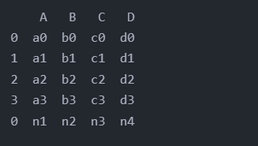

- concat 是通用函数，可以同时连接多个对象
- 如果只需向现有的 DataFrame 追加一个对象，完全可以使用 append 函数来实现

```python
import pandas as pd

df1 = pd.read_csv('../pandas_for_everyone-master/data/concat_1.csv')
df2 = pd.read_csv('../pandas_for_everyone-master/data/concat_2.csv')
print(df1.append(df2))          # 添加一个dataframe

data_dict = {'A': 'n1', 'B': 'n2', 'C': 'n3', 'D': 'n4'}
# 使用 Python 字典添加数据行
# 需设置参数 ignore_index=True 忽略掉索引
print(df1.append(data_dict, ignore_index=True))    
```

运行结果：

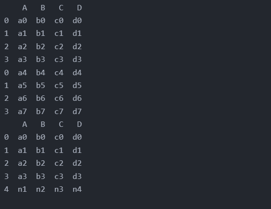

### 忽略索引

- 当向 DataFrame 添加一个字典时，必须使用参数 `ignore_index=True`
  - 仔细观察可以发现索引增加了1，并且没有重复先前的索引
- 如果只是简单的连接或追加数据，可以使用 `ignore_index=True` 参数重置连接后的索引

```python
# ignore_index示例
import pandas as pd

df1 = pd.read_csv('../pandas_for_everyone-master/data/concat_1.csv')
df2 = pd.read_csv('../pandas_for_everyone-master/data/concat_2.csv')
df3 = pd.read_csv('../pandas_for_everyone-master/data/concat_3.csv')

row_concat_i = pd.concat([df1, df2, df3], ignore_index=True)
print(row_concat_i)
```

运行结果：

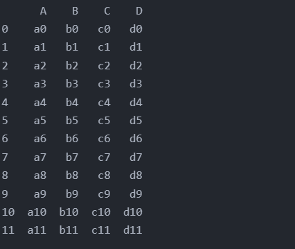

## 4.3.2 添加列

- 连接列与连接行的参数非常相似，主要区别在于 concat 函数中的轴参数
  - axis 的默认值为0，按行连接数据
  - 如果把 axis=1 传递给 concat 函数，它将按列连接数据

```python
# 按列连接数据
import pandas as pd

df1 = pd.read_csv('../pandas_for_everyone-master/data/concat_1.csv')
df2 = pd.read_csv('../pandas_for_everyone-master/data/concat_2.csv')
df3 = pd.read_csv('../pandas_for_everyone-master/data/concat_3.csv')

row_concat_i = pd.concat([df1, df2, df3], ignore_index=True, axis=1)
print(row_concat_i)
```

运行结果：

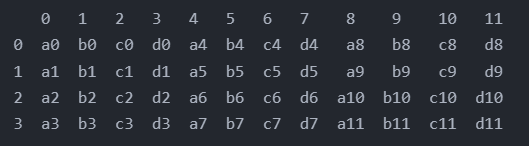

- 当尝试按列取子集时，结果类似于按列连接并根据行索引取数据子集

```python
# 按列名取子集
import pandas as pd

df1 = pd.read_csv('../pandas_for_everyone-master/data/concat_1.csv')
df2 = pd.read_csv('../pandas_for_everyone-master/data/concat_2.csv')
df3 = pd.read_csv('../pandas_for_everyone-master/data/concat_3.csv')

col_concat = pd.concat([df1, df2, df3], axis=1)
print(col_concat['A'])
```

运行结果：

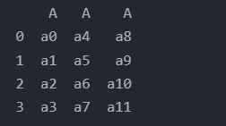

- 可以直接向 DataFrame 添加一列，而无须使用任何 Pandas 函数

```python
# 添加列
import pandas as pd

df1 = pd.read_csv('../pandas_for_everyone-master/data/concat_1.csv')
df2 = pd.read_csv('../pandas_for_everyone-master/data/concat_2.csv')
df3 = pd.read_csv('../pandas_for_everyone-master/data/concat_3.csv')

col_concat = pd.concat([df1, df2, df3], axis=1)
col_concat['new_col_list'] = ['n1', 'n2', 'n3', 'n4']
print(col_concat)
```

运行结果：

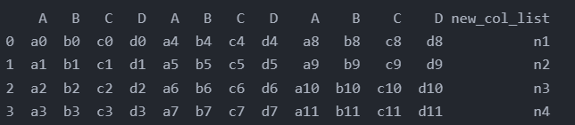

```python
# 添加列series方法
import pandas as pd

df1 = pd.read_csv('../pandas_for_everyone-master/data/concat_1.csv')
df2 = pd.read_csv('../pandas_for_everyone-master/data/concat_2.csv')
df3 = pd.read_csv('../pandas_for_everyone-master/data/concat_3.csv')

col_concat = pd.concat([df1, df2, df3], axis=1)
col_concat['new_col_series'] = pd.Series(['n1', 'n2', 'n3', 'n4'])
print(col_concat)
```

运行结果：

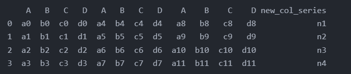

## 4.3.3 不同索引下的连接操作

### 4.3.3.1 连接具有不同列的行

```python
# 连接具有不同列的行
import pandas as pd

df1 = pd.read_csv('../pandas_for_everyone-master/data/concat_1.csv')
df2 = pd.read_csv('../pandas_for_everyone-master/data/concat_2.csv')
df3 = pd.read_csv('../pandas_for_everyone-master/data/concat_3.csv')

# 调整 DataFrame 的列
df1.columns = ['A', 'B', 'C', 'D']
df2.columns = ['E', 'F', 'G', 'H']
df3.columns = ['A', 'C', 'F', 'H']

# 只保留共有的列，使用 join 参数实现
print(pd.concat([df1, df2, df3], join='inner')) # 此处会返回空，因为上面3个DataFrame 无共有列

# 连接 DataFrame 有相同的列
print(pd.concat([df1, df3], ignore_index=False, join='inner'))
```

运行结果：

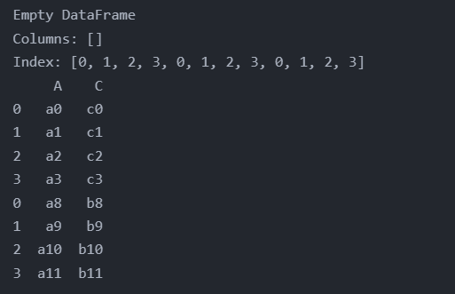

### 4.3.3.2 连接具有不同行的列

```python
# 连接具有不同行的列
import pandas as pd

df1 = pd.read_csv('../pandas_for_everyone-master/data/concat_1.csv')
df2 = pd.read_csv('../pandas_for_everyone-master/data/concat_2.csv')
df3 = pd.read_csv('../pandas_for_everyone-master/data/concat_3.csv')

# 调整 DataFrame 的行索引
df1.index = [0, 1, 2, 3]
df2.index = [4, 5, 6, 7]
df3.index = [0, 2, 5, 7]

# 只保留索引匹配的结果，参数 join='inner'
print(pd.concat([df1, df3], axis=1, join='inner'))
```

运行结果：

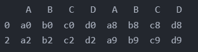

# 4.4 合并多个数据集

- 在数据库中会用到 join='inner' 和默认的 join='outer' 参数
- 除了使用行索引或列索引进行连接之外，也可以依据共有数据值把两个或多个 DataFrame 组合起来
  - 这种操作称为 join
- pd.join 命令
  - 依据索引合并 DataFrame 对象
&nbsp;

- 预览几个数据集

```python
# 预览几个数据集
import pandas as pd

person = pd.read_csv('../pandas_for_everyone-master/data/survey_person.csv')
site = pd.read_csv('../pandas_for_everyone-master/data/survey_site.csv')
survey = pd.read_csv('../pandas_for_everyone-master/data/survey_survey.csv')
visited = pd.read_csv('../pandas_for_everyone-master/data/survey_visited.csv')

print(person)
print(site)
print(survey)
print(visited)
```

运行结果：

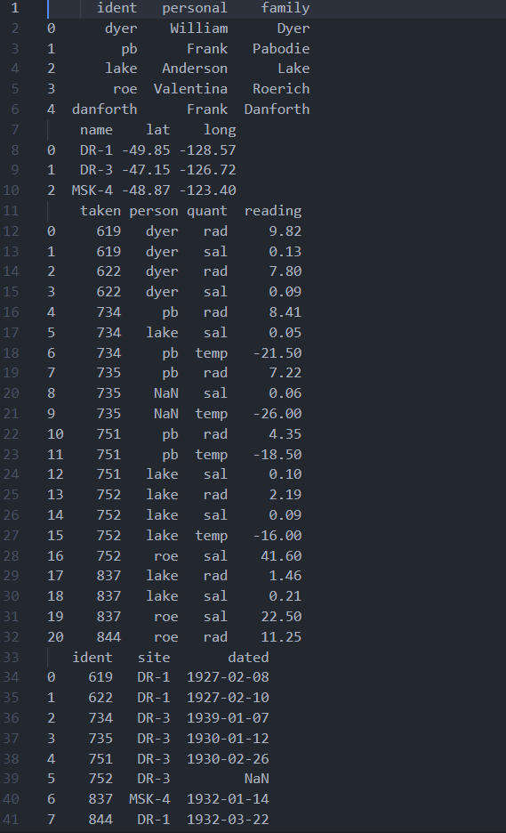.

- 数据被分为了多个观测单元
  - 如果想查看每个站点的日期即该站点的经纬度信息，必须把多个 DataFrame 组合起来
  - 类似于 SQL 的连表查询
- 可以使用 Pandas 的 merge 函数，是 DataFrame 方法
  - 被调用的 DataFrame 称为“左 DataFrame”
  - 第一个参数称为“右 DataFrame”
  - 随后一个参数影响最终合并结果的外观
  - 设置 on 参数，指定要匹配的列
  - 如果左边的列与右边的列名称不同，可以使用参数 left_on 和 right_on 代替
&nbsp;

- 表4-1 Pandas 参数和 SQL 的对应关系

|Pandas|SQL|描述|
|:----:|:----:|:----|
|left|left outer|从左侧保留所有键|
|right|right outer|从右侧保留所有键|
|outer|full outer|从左右两侧保留所有键|
|inner|inner|只保留左右两个都有的键|

- 左侧为A，右侧为B
  - left： A
  - right: B
  - outer: A交B
  - inner：A并B

## 4.4.1 一对一合并

- 最简单的合并只涉及两个 DataFrame

```python
# 一对一合并
# 修改 visited DataFrame 使其不含重复的 site 值
visited_subset = visited.loc[[0, 2, 6], ]

# merge 函数的参数 how 默认值为 inner
# 这里无需专门指定
o2o_merge = site.merge(visited_subset, left_on='name', right_on='site')
print(o2o_merge)
```

运行结果：

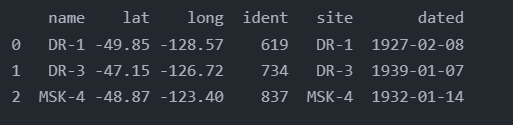

> SQL 中，用于匹配的列称为“键”

## 4.4.2 多对一合并

- 使用 visited 进行合并，这样的合并就是多对一的合并
  - 其中一个 DataFrame 的键值是重复的
  - 合并中会复制包含单个观测值的 DataFrame

```python
m2o_merge = site.merge(visited, left_on='name', right_on='site')
print(m2o_merge)
```

运行结果：

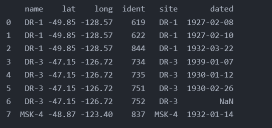

## 4.4.3 多对多合并

- 有时需要基于多列进行匹配

```python
# 合并生成 ps、vs 两个 DataFrame
ps = person.merge(survey, left_on='ident', right_on='person')
vs = visited.merge(survey, left_on='ident', right_on='taken')

# 将要匹配的多列，以列表形式传入 merge 函数
ps_vs = ps.merge(vs, left_on=['ident', 'taken', 'quant', 'reading'], right_on=['person', 'ident', 'quant', 'reading'])
print(ps_vs)
```

运行结果：

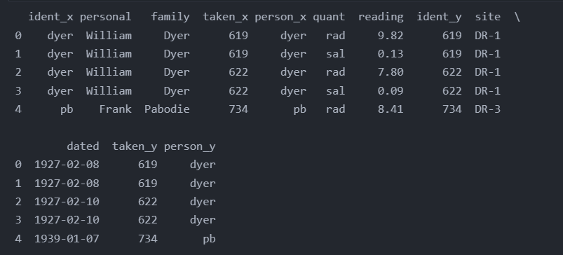

- 如果列名存在冲突，Pandas 会自动向列名后添加后缀
  - 带 '_x' 的列值来自左 DataFrame
  - 带 '_y' 的列值来自右 DataFrame

# 4.5 小结

- 有时需要根据要回答的问题组合数据的不同部分或多个数据集
  - 但就存储而言，用于分析的数据不一定具有最理想的形态
- 调查数据
  - 符合整洁数据的定义中的“每种观测单元构成一张表格”
