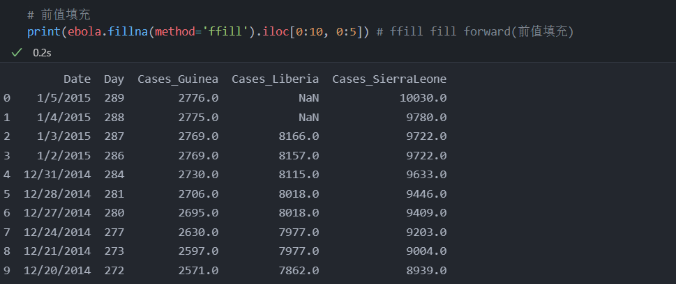
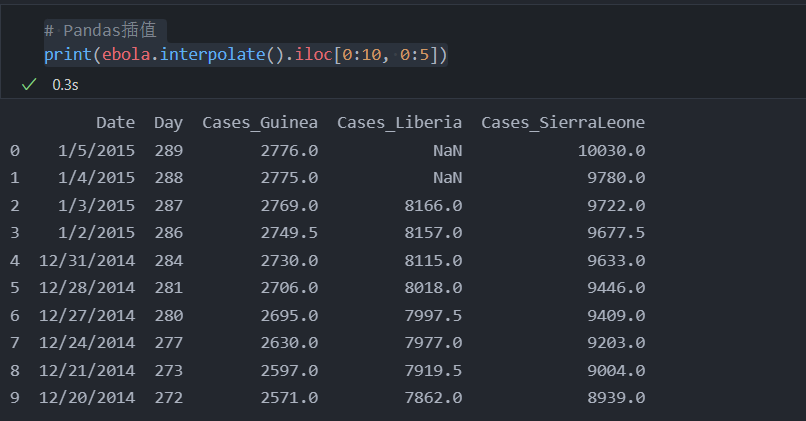

<!-- code_chunk_output -->

# 5.1 简介

- 几乎任何一个数据集都含缺失数据
- 缺失数据有多种表示形式

## 概念一栏

- 预备知识
  - 导入库
  - 数据分片和索引
  - 使用函数和方法
  - 使用函数参数

## 目标

- 认识缺失值
- 创建缺失值
- 对缺失值重新赋值和计算

# 5.2 何为 NaN 值

- Pandas 中的 NaN 值来自 NumPy 哭
- 在 NumPy 中，缺失值有几种表示形式
  - NaN
  - NAN
  - nan

- 缺失值和其他类型的数据不同，实际上它们无意义
- 数据缺失了，也就无所谓等于和不等于
- NaN 也不等同于 0 或空字符串

```python
# 从 NumPy 导入缺失值
from numpy import NaN, NAN, nan

print(NaN == True)      # 缺失值不等于 True，输出 False
print(NaN == False)     # 缺失值也不是 False，输出 False
print(NaN == 0)         # 缺失值也不是 0，输出 False
print(NaN == '')        # 缺失值也不是 空字符串，输出 False
print(NaN == NaN)       # 一个缺失值也不等于另一个缺失值，输出 False
```


- Pandas 提供了 isnull 方法，用于测试某个值是否为缺失值
  


# 5.3 缺失值从何而来

- 缺失值有两个来源
  - 一是包含缺失值的数据集
  - 二是数据整理过程

## 5.3.1 加载数据

- 在 read_csv 函数中，有3个参数与缺失值的读取有关: na_values、keep)default_na 和 na_filter
  - na_values 参数允许指定额外的缺失值或 NaN 值。 读取文件时，可以传入 Python str 或列表对象，自动将其编码为缺失值
  - keep)default_na 参数是布尔值，它允许指定是否要把其他任何值视为确实是之
    - 默认情况下，参数为 True，这意味着使用 na_values 参数额外指定的缺失值都会追加到缺失值列表中
    - 也可以设置为 False，这样只使用 na_values 中指定的缺失值
  - na_filter 参数也是布尔值，用于指定某些值是否会被解读成“缺失值”
    - 默认情况下，na_filter=True 表示缺失值会被编码为 NaN,
    - 如果设置 na_filter=False, 那么不会将任何值重新编码为“缺失值”
    - 可以把该参数看作关闭 na_values 和 keep_default_na 参数设置的一种方法

```python
# 指定数据位置
visited_file = '../pandas_for_everyone-master/data/survey_visited.csv'

# 使用默认值加载数据
print(pd.read_csv(visited_file))
print('-' * 50)

# 加载数据，不包含默认缺失值
print(pd.read_csv(visited_file, keep_default_na=False))
print('-' * 50)

# 手动指定缺失值
print(pd.read_csv(visited_file, na_values=[''], keep_default_na=False))
```


## 5.3.2 合并数据

- 第 4 章介绍了如何组合数据集，其中一些例子的输出就包含了缺失值

```python
# 合并数据产生缺失值
visited = pd.read_csv('../pandas_for_everyone-master/data/survey_visited.csv')
survey = pd.read_csv('../pandas_for_everyone-master/data/survey_survey.csv')

vs = visited.merge(survey, left_on='ident', right_on='taken')   
print(vs)
```


## 5.3.3 用户输入值

- 用户也可以自行创建缺失值，比如依据计算或人工向量来创建值向量
- 对于 Series 和 DataFrame 来说， NaN 是有效值

```python
# Series 包含缺失值
num_legs = pd.Series({'goat': 4, 'amoeba': nan})
print(num_legs)
print('-' * 50)

# DataFrame 包含缺失值
scientists = pd.DataFrame({
    'Name': ['Rosaline Franklin', 'William Gosset'],
    'Occupation': ['Chemist', 'Statistician'],
    'Born': ['1920-07-25', '1876-06-13'],
    'Died': ['1958-04-16', '1937-10-16'],
    'missing': [NaN, nan]
})
print(scientists)
print('-' * 50)

# 直接把一列缺失值赋给 DataFrame
scientists = scientists = pd.DataFrame({
    'Name': ['Rosaline Franklin', 'William Gosset'],
    'Occupation': ['Chemist', 'Statistician'],
    'Born': ['1920-07-25', '1876-06-13'],
    'Died': ['1958-04-16', '1937-10-16'],
})

scientists['missing'] = nan
print(scientists)
```


## 5.3.4 重建索引

- 另一种把缺失值引入数据的方法是为 DataFrame 重建索引
  - 如果想向 DataFrame 添加新索引，并且希望保留其原始值，该方法会非常有用
  - 常见使用场景是：在一个 DataFrame 中，其索引表示某段时间，而你想向该 DataFrame 中添加更多日期

- 在 1.5 节所示的数据图中，如果只想查看 2000 年至 2010 年的数据，可以执行分组操作，对数据取自己，然后为它重建索引

```python
gapminder = pd.read_csv('../pandas_for_everyone-master/data/gapminder.tsv', sep='\t')

life_exp = gapminder.groupby(['year'])['lifeExp'].mean()
print(life_exp)
```


- 获取不存在的索引数据，将报错，而不是返回缺失值

```python
# 加入 loc 进行切片
gapminder = pd.read_csv('../pandas_for_everyone-master/data/gapminder.tsv', sep='\t')

life_exp = gapminder.groupby(['year'])['lifeExp'].mean()
y2000 = life_exp[life_exp.index > 2000]
print(y2000)

# 调用 reindex 方法
print(y2000.reindex(range(2000, 2010))) # 此方法相当于重建了新的索引，所以可以展示新索引对应的缺失值
```


# 5.4 处理缺失数据

## 5.4.1 查找和统计缺失数据

- 对于缺失值的个数，可以使用 count 函数来统计

```python
# 读取数据集 country_timeseries.csv
ebola = pd.read_csv('../pandas_for_everyone-master/data/country_timeseries.csv')

# 统计非缺失值的个数
print(ebola.count())
print('-' * 50)

# 总行数减去不包含缺失值的行数
num_rows = ebola.shape[0]
num_missing = num_rows - ebola.count()
print(num_missing)
```


- 如果要统计数据中缺失值的总数，或者特定列中缺失值的个数，可以使用 NumPy 中的 count_nonzero 函数和 isnull 方法

```python
# NumPy 统计缺失值
import numpy as np

ebola = pd.read_csv('../pandas_for_everyone-master/data/country_timeseries.csv')
print(np.count_nonzero(ebola.isnull()))                     # 统计缺失值总数
print(np.count_nonzero(ebola['Cases_Guinea'].isnull()))     # 统计'Cases_Guinea' 列中缺失值个数
```


- 也可以使用 Series 的 value_counts 方法获取缺失值个数
  - 该方法会输出值得频率表
  - 使用 dropna 参数也可以获得缺失值得个数

```python
# value_counts 方法获取缺失值个数
import numpy as np

ebola = pd.read_csv('../pandas_for_everyone-master/data/country_timeseries.csv')
print(ebola.Cases_Guinea.value_counts(dropna=False))
```


## 5.4.2 清理缺失数据

- 处理缺失数据的方法有多种
  - 用其他值替换缺失数据
  - 使用现有数据填充缺失值
  - 将其从数据集中删除

### 5.4.2.1 重新编码/替换

- 使用 fillna 方法把缺失值重新编码为其他值

```python
# 把缺失值重新编码为 0
print(ebola.fillna(0).iloc[0:10, 0:5])
```


- 开启该参数意味着直接在原始数据上进行改动，并不会新建副本
- 对于大型数据，若想保持代码高效，可以使用该参数

### 5.4.2.2 前值填充

- 对于缺失值，可以使用内置方法做前值填充或后值填充
  - 将按照前一个值填充缺失值，这样缺失值就会被最后得已知值或被记录的值所替代
- 如果某一列以缺失值开始，那么该缺失值会继续存在，因为它前面没有值，也就无法执行前值填充

```python
# 前值填充
print(ebola.fillna(method='ffill').iloc[0:10, 0:5]) # ffill fill forward(前值填充)
```



### 5.4.2.3 后值填充

- 同前值填充，如果某列以缺失值结束，那么该缺失值会继续存在

```python
# 后值填充
print(ebola.fillna(method='bfill').iloc[:, 0:5].tail()) # bfill fill backward(后值填充)
```


### 5.4.2.4 插值

- 插值使用现有值来填充缺失值
  - Pandas 中得插值方法默认以线性方式填充缺失值
  - 他会把缺失值视为等距分隔值
- interpolate 方法带有参数 method 参数，用于指定插值方式

```python
# Pandas插值
print(ebola.interpolate().iloc[0:10, 0:5])
```



### 5.4.2.5 删除缺失值

- 处理缺失数据的另一种方法是删除含有缺失数据的观测值或变量
- 不同的数据集包含的缺失数据数量不同
  - 对于某些数据集，如果只保留完整数据，那么最终得到的数据集很可能是无用的
  - 或许确实数据不是随机的，删除缺失值后，会得到有偏差的数据集
  - 只保留完整数据也可能导致数据不足，无法开展分析
&nbsp;

- 使用 dropna 方法删除缺失数据，并且可以通过设置参数控制删除方式
  - how 用于指定行或列的删除条件
    - any ，只要包含 NA 值即删除
    - all ，全为 NA 值才删除
  - thresh 参数允许在删除行或列之前指定非 NaN 值得数量

```python
# 读取 ebola 数据集的形状
print(ebola.shape)

# 删除含有 NA 的行或列后得到的数据集形状
ebola_dropna = ebola.dropna()
print(ebola_dropna.shape)
print(ebola_dropna)
```


## 5.4.3 缺失值计算

- 如果要看多个国家的病例统计，可以把多个国家的病例数相加，生成包含病例统计数的新列
  - 只有在需要计算的数据不包含缺失值时，才会返回计算值
  - 如果计算的数据包含缺失值，那么返回的计算结果也是缺失值
  - 如果调用方法忽略缺失值，就另当别论

```python
# 生成包含病例统计数的新列
ebola['Cases_multiple'] = ebola['Cases_Guinea'] + \
                        ebola['Cases_Liberia'] + \
                        ebola['Cases_SierraLeone']

# 查看前10行的计算结果
ebola_subset = ebola.loc[:, ['Cases_Guinea', 'Cases_Liberia', 'Cases_SierraLeone', 'Cases_multiple']]
print(ebola_subset)
```


# 5.5 小结

- 几乎所有的数据都包含缺失值，因此掌握处理缺失值的方法很重要
- 即使处理的数据是完整的，整理数据的过程中也可能产生缺失值
- 通过查看数据并列出缺失值，可以评估数据质量是否足以支持做决策和推断
