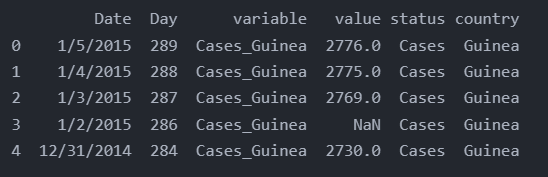

<!-- code_chunk_output -->

# 6.1 简介

- 数据整理
  - 是指对数据集进行结构化处理，使其易于分析和可视化
  - 它是数据清理的主要目标
- 整洁数据有助于简化数据分析、可视化和收集工作
&nbsp;

- 何为“整洁数据”
  - 每个观测值成一行
  - 每个变量成一列
  - 每种观测单元够成一张表格

## 概念一栏

- 预备知识
  - 函数和方法调用
  - 获取数据子集
  - 循环
  - 列表推导

## 本章内容

- 数据重塑
  - 列转行/列名转变量/聚合
  - 数据透视/转换/展开
  - 取子集
  - 组合
    - 通配符
    - 连接

## 目标

- 把列转换为行、数据融合及聚合
- 把行转换为列、数据转换及展开
- 把 DataFrame 拆分成多个部分以规范数据
- 组合多个部分的数据

# 6.2 包含值而非变量的列

## 6.2.1 固定一列

- 查看美国收入和宗教信仰数据 `pew = pd.read_csv('../pandas_for_everyone-master/data/pew.csv')`


- 查看该数据集，可以看到并非每列都是变量
  - 与收入相关的值分布在多列中（类似做了收入分布的直方图）
  - 对于在表格中展示数据而言，这种格式很好
  - 对于数据分析来说，需要重塑表格，从而得到宗教、收入和计数3个变量
&nbsp;

- 这种数据试图也称“宽”数据
- 要想将其转换成整洁的“长”数据格式，必须对 DataFrame 做“逆透视”/融合/聚合（unpivot/melt/gather）处理
- Pandas 的 melt 函数可以把 DataFrame 重塑成整洁的数据格式
&nbsp;

- melt 函数有如下几个参数
  - id_vars: 该参数是一个容器（列表，元组或 ndarray），所表示的变量会保持原样
  - value_vars: 指定向“融合”（或转换为行的列）。它默认会“融合”未在 id_vars 参数中指定的所有列
  - var_name: 该字符串用于指定 value_vars 融合后的新列名。默认为 variable
  - value_name: 该字符串为新列名，代表 var_name 的值，默认为 value

```python
import pandas as pd

pew = pd.read_csv('../pandas_for_everyone-master/data/pew.csv')

# 不指定 value_vars，因为想对除“religion”列以外的所有列进行透视
pew_long = pd.melt(pew, id_vars='religion')
print(pew_long.head())  # 打印前5行
print(pew_long.tail())  # 打印后5行
print('-' * 50)

# 更改默认值，以便命名进行融合、逆透视的列
pew_long = pd.melt(pew, id_vars='religion', var_name='income', value_name='count')
print(pew_long.head())
print(pew_long.tail()) 
```


## 6.2.2 固定多列

- 当对其余列做“逆透视”时，并非每个数据集都有一列可以固定不动
- billboard 数据集中
  - 每周都对应一列
  - 需要融合数据
    - 创建一个展现周排行的分面图
    - 所用的分面变量就需要时 DataFrame 中的一列
  - 简单来说，就是前面5列，固定不动，然后将后面的列进行逆透视
- 分面
  - 分面的作用是在一个页面上自动放置多幅画像
  - 它先将数据划分为多个不同的子集，然后分别将每个子数据集会知道页面的小图形面板中

```python
# 固定多列
# 导入数据集 billboard
import pandas as pd

billboard = pd.read_csv('../pandas_for_everyone-master/data/billboard.csv')
print(billboard.head())
print('-' * 50)

billboard_long = pd.melt(
                billboard,                                                          # 数据集为 billboard
                id_vars=['year', 'artist', 'track', 'time', 'date.entered'],        # 需要固定的多个列
                var_name='week',                                                    # 逆透视的列融合而成的数据，列名为 week
                value_name='rating'                                                 # 放置逆透视融合数据的值的组成的列，列名为 rating
                )
print(billboard_long.head())
print(billboard_long.tail())
```


# 6.3 包含多个变量的列

- 有时，数据集中的列可能表示多个变量

```python
# 包含多个变量的列
import pandas as pd

ebola = pd.read_csv('../pandas_for_everyone-master/data/country_timeseries.csv')
print(ebola.columns)        # 查看数据集 ebola 的字段名（列名）
print(ebola.iloc[:5, [0, 1, 2, 3, 10, 11]]) # 查看数据集的前5行，及选定的列
```


- 可以看出列名 Cases_Guinea 、 Cases_Liberia 分别有两列数据
- 且数据还以“宽”格式排列，需要做逆透视

```python
import pandas as pd

ebola = pd.read_csv('../pandas_for_everyone-master/data/country_timeseries.csv')
ebola_long = pd.melt(ebola, id_vars=['Date', 'Day'])    # 对数据集进行逆透视
print(ebola_long.head())
print(ebola_long.tail())
```


## 6.3.1 单独拆分和添加列（简单方法）

- 理论上来说，可以依据列名中的下划线（_）拆分感兴趣的列。
  - 第一部分是新的状态列
  - 第二部分是新的国家列
- 访问字符串方法需要使用 str 访问器（更多详见第 8 章）
  - 通过它可以访问 Python 字符串方法，以及处理整列

```python
# 获取 variable 列
# 访问字符串方法
# 依据分隔符拆分列
variable_split = ebola_long.variable.str.split('_')     # 将 variable 列按照分隔符（_）进行拆分
print(variable_split[:5])                               # 打印拆分后的列的前5行
print(variable_split[-5:])                              # 打印拆分后的列的后5行

print(type(variable_split))                             # 打印拆分后的列的数据类型
print(type(variable_split[0]))                          # 打印容器中的第一个元素的类型
```


- 列拆分好后，需要把拆分得到的部分指派给一个新列
- 在此之前需要将所有的值分别提取出来，方便赋值给新列
  - 第 0 号元素，设置列名为 status
  - 第 1 号元素，设置列名为 country

```python
# 提取拆分列得到的部分
status_values = variable_split.str.get(0)
country_values = variable_split.str.get(1)

print(status_values[:5])
print(status_values[-5:])

print(country_values[:5])
print(country_values[-5:])
```


```python
# 将所得部分赋值到新列
ebola_long['status'] = status_values
ebola_long['country'] = country_values

print(ebola_long.head())
```



## 6.3.2 在单个步骤中拆分和组合（简单方法）

- 下面的讲解基于这样一个事实（前提）
  - 返回的向量的顺序和数据的顺序相同
  - 可以连接新向量或原始数据

```python
# 在单个步骤中进行拆分和组合
# 因为拆分组合的2次，所以有2个status和country列

variable_split = ebola_long.variable.str.split('_', expand=True)
variable_split.columns = ['status', 'country']
ebola_parsed = pd.concat([ebola_long, variable_split], axis=1)
print(ebola_parsed.head())
print(ebola_parsed.tail())
```


## 6.3.3 在单个步骤中进行拆分和组合（复杂方法）

- 下面的讲解依然基于上述事实（前提）
- 拆分返回的是包含两个元素的列表，且每个元素都是新列
  - 利用这一点，可以在单个步骤中得到相同的结果
  - 可以使用内置的 zip 函数把拆分项列表组合在一起
- zip 函数接受一组迭代器（比如列表或元组）
  - 创建一个由输入迭代器组成的新容器
  - 每个新容器都拥有和输入容器相同的索引

```PYTHON
# zip函数示例
contants = ['pi', 'e']
values = ['3.14', '2.718']

# 为了显示 zip 对象的内容，必须使用列表把 zip 函数包裹起来
# 在 Python3 中，zip 函数返回一个迭代器
print(list(zip(contants, values)))
```


- 在 Python3 中，zip 函数返回一个迭代器
  - 其中每个元素都由一个常量与对应值组成
  - 从概念上讲，每个容器就像拉链的一对齿扣，当把容器打包时，就会匹配并返回索引
- 可以把 zip 函数的功能理解为：
  - zip 函数把每个传入容器堆叠起来，创建各种 DataFrame，然后以元组形式逐列返回值
&nbsp;

- 可以使用 `ebola_long.variable.str.split('')` 拆分列值
  - 不过由于结果是容器（Series对象），需要先将其拆包（unpack）
  - 这样得到的才是容器内容（每个状态-国家列表），而非容器本身
- 在 Python 中，可以使用星号操作符（*）对容器拆包
  - 当对未打包的容器应用 zip 函数时，其效果与之前创建 status 值和 country 值时相同
  - 然后进行多重赋值把向量同时赋给列

```python
ebola_long['status'], ebola_long['country'] = zip(*ebola_long.variable.str.split('_'))
print(ebola_long.head())
```


# 6.4 行与列中的变量

- 有时数据会被格式化，变量同时出现在行和列中
- 整理这些数据的大多数方法前面已经提过
- 接下来介绍当某列数据实际包含两个变量的情形
- 对于这种情况，必须将变量转换为单独的列

```python
# 查看weather数据集
weather = pd.read_csv('../pandas_for_everyone-master/data/weather.csv')
print(weather.iloc[:5, :11])
```


- element 列包含的变量需要转换才能成为新的列（行需要转换成列）
- 而 day 变量需要“融合”成行值（列需要融合成行）

```python
# 首先对 day 值进行融合/逆透视
weather_melt = pd.melt(weather, 
                id_vars=['id', 'year', 'month', 'element'],
                var_name='day',
                value_name='temp')
print(weather_melt.head())
print(weather_melt.tail())

# 将 element 列在存储的变量展开，类似透视过程
weather_tidy = weather_melt.pivot_table(
                    index=['id', 'year', 'month', 'day'], 
                    columns='element',
                    values='temp'
)
weather_tidy_flat = weather_tidy.reset_index()
print(weather_tidy_flat.head())

# 可以不使用中间 DataFrame 而直接使用此方法
weather_tidy = weather_melt.pivot_table(
            index=['id', 'year', 'month', 'day'],
            columns='element',
            values='temp').reset_index()
print(weather_tidy.head())
```


# 6.5 一张表中的多个观测单元（归一化）

- 了解一张表中是否有多个观测单元，最简单的方法是查看每一行，并记录行间重复的所有单元或值
- 以 billboard 数据集为例

```python
# 以 billboard 数据集为例
print(billboard_long.head())
print(billboard_long[billboard_long.track == 'Loser'].head())
```


- 该表实际上包含两类数据：
  - 歌曲信息
  - 周排行
- 最好把歌曲信息存储在单独的表中，这样保存在 year、artist、track 和 time 列在的信息就不会在数据集中重复出现了
- 这种情况下，需要将 year、artist、track、time 和 date.entered 放入一个新的 DataFrame 中
  - 给每组值分配唯一的 ID
  - 然后在另一个 DataFrame 中使用这些 ID
- 可以把整个过程看作连接和合并数据步骤的逆步骤

```python
# 获取单独的歌曲 DataFrame
billboard_songs = billboard_long[['year', 'artist', 'track', 'time']]
print(billboard_songs.shape)

billboard_songs = billboard_songs.drop_duplicates() # 删除数据集中的重复行
print(billboard_songs.shape)        # 对比形状的变化，可知不重复的行仅有317行，而总行数有24092行

billboard_songs['id'] = range(len(billboard_songs)) # 根据行数分配唯一的id，与SQL中默认id相似，但以0开始
print(billboard_songs.head(n=10))
```


```python
# 把歌曲 DataFrame 合并到原数据集
billboard_ratings = billboard_long.merge(
                    billboard_songs, on=['year', 'artist', 'track', 'time'])
print(billboard_ratings.shape)
print(billboard_ratings.head())

# 取出想要放入排行 DataFrame 中的列子集
billboard_ratings = billboard_ratings[['id', 'date.entered', 'week', 'rating']]
print(billboard_ratings.head())
```


# 6.6 跨多张表的观测单元

- 数据整理的最后一部分内容是关于同类型数据分散在多个数据集中的问题
  - 一方面出于文件大小的考虑
  - 一方面与数据的收集过程有关
&nbsp;

- 下面简单介绍加载多个数据源并把它们组合在一起的技术
- 选用纽约市出租车和优步（Uber）数据来进行讲解
  - 整个数据集包含的数据来自纽约市的出租车和优步网约车
  - 数据分成了 140 多个文件
- 当相同数据分成多个部分后，这些部分通常会有相应的结构化命名模式
&nbsp;

- 首先下载数据
  - 下载代码中的细节不重要
  - raw_data_urls.txt 文件包含了一个 URL 列表
  - 其中每个 URL 都是指向部分出租车数据的下载链接

```python
# 数据下载代码
# 只下载前5个数据集
import os, urllib

with open('../pandas_for_everyone-master/data/raw_data_urls.txt', 'r') as data_urls:
    for line, url in enumerate(data_urls):
        if line == 5:
            break
        fn = url.split('/')[-1].strip()
        fp = os.path.join('..', 'pandas_for_everyone-master', 'data', fn)
        print(url)
        print(fp)
        urllib.request.urlretrieve(url, fp)
```

- 本例中，所有数据文件的名称格式都相同：
  - fhv_tripdata_YYYY_XX.csv
  - 其中 YYYY 表示年份
  - XX 表示文件编号
- 在 Python 中可以使用 glob 库中简单的模式匹配函数来获取与特定模式匹配的所有文件名

```python
# 获取要加载的文件名列表
import glob, pprint

# 从 nyc_taxi 数据文件夹获得 csv 文件列表
nyc_taxi_data = glob.glob('../pandas_for_everyone-master/data/fhv_*')
pprint.pprint(nyc_taxi_data)

# 把这些文件都加载到 DataFrame 中
taxi1 = pd.read_csv(nyc_taxi_data[0])
taxi2 = pd.read_csv(nyc_taxi_data[1])
taxi3 = pd.read_csv(nyc_taxi_data[2])
taxi4 = pd.read_csv(nyc_taxi_data[3])
taxi5 = pd.read_csv(nyc_taxi_data[4])

print('查看各数据集: ')
print(taxi1.head(n=2))
print(taxi2.head(n=2))
print(taxi3.head(n=2))
print(taxi4.head(n=2))
print(taxi5.head(n=2))

print('查看各数据集shape: ')
print(taxi1.shape)
print(taxi2.shape)
print(taxi3.shape)
print(taxi4.shape)
print(taxi5.shape)

print('连接 DataFrame')
taxi = pd.concat([taxi1, taxi2, taxi3, taxi4, taxi5])
print(taxi.shape)
```


## 6.6.1 使用循环加载多个文件

- 加载多个文件时，更简便的做法是先创建一个空列表，然后循环遍历每个 CSV 文件
- 将其加载到 DataFrame 中
- 再把 DataFrame 追加到列表中
- 最终的数据类型是 DataFrame 列表，可以使用 concat 函数来连接

```python
# 创建一个待添加元素的空列表
list_taxi_df = []

# 循环遍历每个 CSV 文件名
for csv_filename in nyc_taxi_data:
    # 可以选择输出文件名以便调试
    print(csv_filename)

    # 把 CSV 文件加载到 DataFrame 中
    df = pd.read_csv(csv_filename)

    # 把 DataFrame 添加到列表中
    list_taxi_df.append(df)

# 列表中 DataFrame 的个数
print(len(list_taxi_df))

# 第一个元素的类型
print(type(list_taxi_df[0]))

# 查看第一个DataFrame的前5行数据
print(list_taxi_df[0].head())

# 将列表中的 DataFrame 连接在一起
taxi_loop_concat = pd.concat(list_taxi_df)
print(taxi_loop_concat.shape)

# 判断手动加载连接与循环加载连接得到的结果是否一致
print(taxi.equals(taxi_loop_concat))
```


## 6.6.2 使用列表推导加载多个文件

- Python 有一个用于遍历某些内容并将其添加到列表中的“惯用语”，叫“列表推导式”（list comprehension）
- 可以用列表推导式重写前面的循环代码

```python
# 使用列表推导式重写
list_taxi_df_comp = [pd.read_csv(data) for data in nyc_taxi_data]
print(type(list_taxi_df_comp))
taxi_loop_concat_comp = pd.concat(list_taxi_df_comp)

# 最终结果是否一致
print(taxi_loop_concat_comp.equals(taxi_loop_concat))
```


## 列表推导式

- 提供了一种简明扼要的方法来创建列表
- 它的结构是在一个中括号里包含一个表达式，然后是一个for语句，然后是0个或多个for或者if语句
- 那个表达式可以是任意的，意思是你可以在列表中放入任意类型的对象。
- 返回结果将是一个新的列表，在这个以if和for语句为上下文的表达式运行完成之后产生。

### 规范

`variable = [out_exp for out_exp in input_list if out_exp == 2]`

```python
# 列表推导式示例
multiples = [i for i in range(30) if i % 3 is 0]
print(multiples)
```


- 这将对快速生成列表非常有用
- 列表推导式在有些情况下超赞，特别是当你需要使用for循环来生成一个新列表

```python
# for 循环生成新列表
squared1 = []
for x in range(10):
    squared1.append(x**2)
print(squared1)

# 列表推导式生成新列表
squared2 = [x**2 for x in range(10)]
print(squared2)
```


# 6.7 小结

- 介绍了如何把数据重塑为便于分析、可视化和收集的格式
  - 降到整洁数据相关的概念
  - 介绍了重塑数据的各种函数和方法
- 数据重塑很重要
  - 因为有些函数需要数据组织成某种形式（无论整洁与否）才能对其操作
- 对于数据科学家和分析师来说，重塑数据是一项重要的技能
