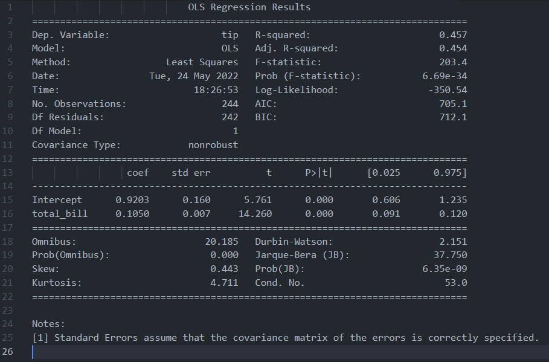
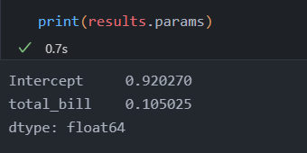
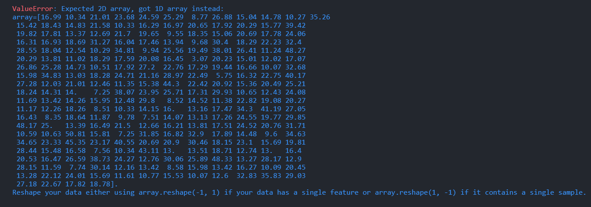
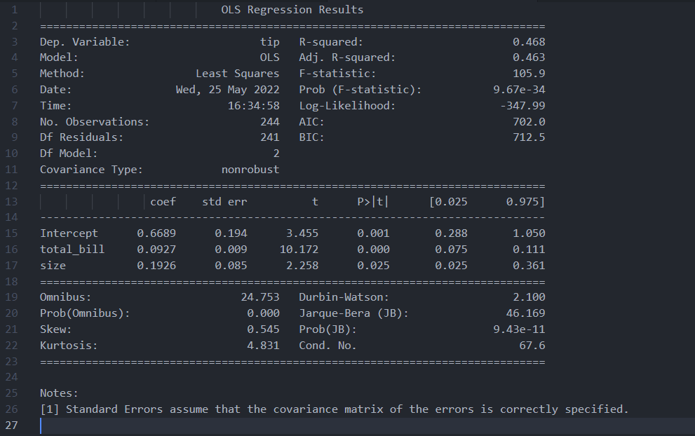
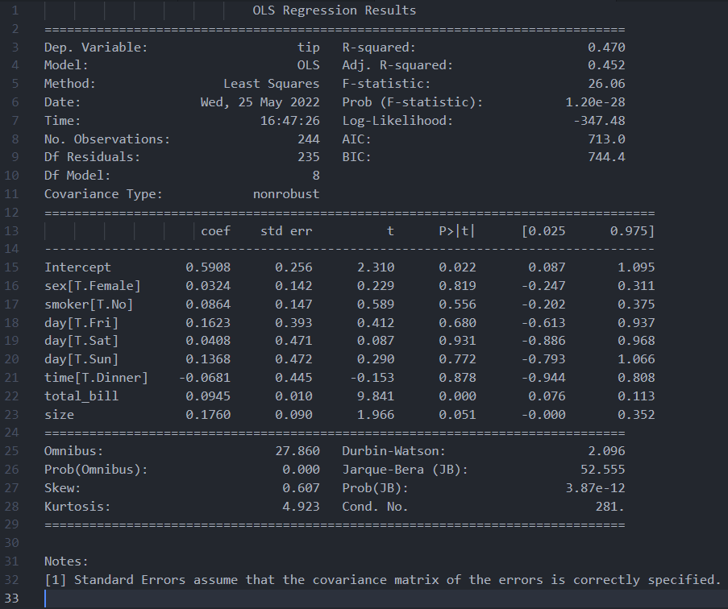
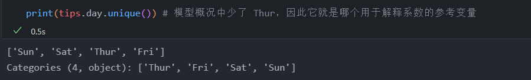
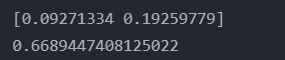
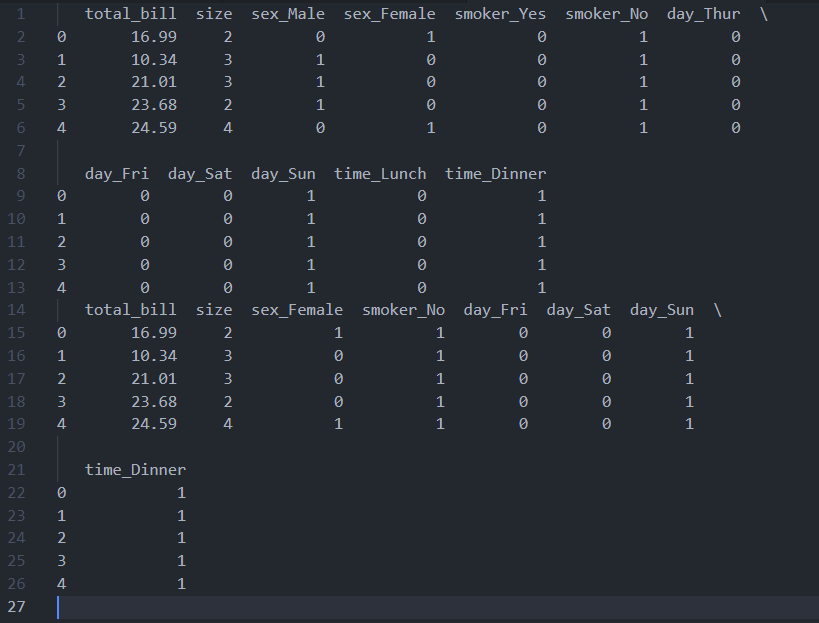
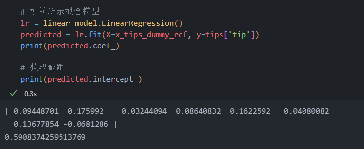
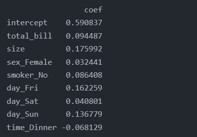

<!-- code_chunk_output -->

# 12.1 简介

- 本章会介绍许多基本的建模技术，相当于数据分析、机器学习的入门知识
- 参考了一些其他书
  - 《Python 机器学习基础教程》
  - Python Machine Learning

# 12.2 简单线性回归

- 线性回归的目标是描述响应变量（也称“结果”或“因变量”）和预测变量（也称“特征”“协变量”或“自变量”）之间的直线关系
- 以 tips 数据集为例

## 12.2.1 使用统计模型库

- 可以使用 statsmodels 库来实践简单的线性回归
- 下面使用 statsmodels 库的 formula API
- 使用 ols 函数计算普通最小二乘值，它是线性回归中估计参数的一种方法
- 直线公式：y = mx + b
  - y 响应变量
  - x 自变量
  - b 截距
  - m 斜率，即要估计的参数

```python
# 以 tips 数据集为例
import pandas as pd
import seaborn as sns
import statsmodels.formula.api as smf

tips = sns.load_dataset('tips')

# 公式由两部分组成，以波浪线（~）隔开，左边是响应变量，右边是自变量
model = smf.ols(formula='tip ~ total_bill', data=tips)

# 指定好模型后，调用 fit 方法用数据拟合模型
results = model.fit()

# 调用 results 的 summary 方法来查看结果
print(results.summary())
```



- 结果包含模型的 Intercept (截距) 和 total_bill
  - 直线方程为 y = 0.105x + 0.920
  - 即 total_bill 每增加一个单位，小费就增加 0.105 个单位
- 如果只想要系数，可以借助 results 的 params 属性来获得
  - 

## 12.2.2 使用 sklearn 库

- 还可以使用 sklearn 库来拟合各种机器学习模型

```python
# 导入 sklearn 库的 linear_model 模块
from sklearn import linear_model

# 创建线性回归对象 LinearRegression
lr = linear_model.LinearRegression()

# 注意 X 是大写， y 是小写
# 因为 X 只有一个变量，所以会失败
predicted = lr.fit(X=tips['total_bill'], y=tips['tip'])
```



- 由于 sklearn 接收的是 NumPy 数组，所以有时需要处理数据，以便把 DataFrame 传入 sklearn
- 上面的报错信息实际是告知传入矩阵的形状不对，需要重塑输入
- 根据是否只有一个变量或者一个样本（多重观测），要分别指定 reshape(-1,1) 或 reshape(1,-1)
- 为了正确重塑数据，必须使用 values 属性
  - 当使用 Pandas DataFrame 或 Series 的 values 属性时，需要用 NumPy ndarray 来表示数据

```python
# 导入 sklearn 库的 linear_model 模块
from sklearn import linear_model

# 创建线性回归对象 LinearRegression
lr = linear_model.LinearRegression()

# 注意 X 是大写， y 是小写
# 重塑数据，使其符合 sklearn 的要求
predicted = lr.fit(X=tips['total_bill'].values.reshape(-1,1), y=tips['tip'])
print(predicted.coef_)
```


- sklearn 并没有像 statsmodels 那样绘制出美观的汇总表
  - 主要反映了两个库背后不同的指导思想
  - 即统计学与计算机科学/机器学习
- 在 sklearn 中，可以通过拟合模型的 coef_ 属性来获得系数
- 通过 intercept_ 属性获得截距

# 12.3 多元回归

- 简单线性回归中，自变量在连续响应变量上线性回归
- 也可以使用多元回归把多个自变量放入模型中

## 12.3.1 使用 statsmodels 库

- 使用多元回归模型拟合数据集与拟合简单的线性回归模型非常相似
- 在 formula 参数中，可以轻松地把其他协变量“添加”到波浪线右边
- 此处类似于解 二元一次方程中的系数
  - z = ax + by + c
    - total_bill coef = a = 0.0927
    - size coef = b = 0.1926

```python
# 以 tips 数据集为例
import pandas as pd
import seaborn as sns
import statsmodels.formula.api as smf

tips = sns.load_dataset('tips')

# 使用 statsmodels 库的多元回归
model = smf.ols(formula='tip ~ total_bill + size', data=tips).fit()
print(model.summary())
```



## 12.3.2 使用 statsmodels 和 分类变量

- 对分类变量建模时，必须创建虚拟变量，即分类中的每个唯一值都变成了新的二元特征
  - 如 数据中的 sex 可以是  Female 或 Male
- statsmodels 会自动创建虚拟变量
  - 为了避免多重共线性，通常会删除其中一个虚拟变量
  - 例如有一列用于指明某人是否为女性，那么就知道此人不是女性就是男性（在该数据中）
  - 这种情况下，可以删除代表男性的虚拟变量，信息保持不变

```python
# 模型实用到了数据中的所有变量

model = smf.ols(formula='tip ~ total_bill + size + sex + smoker + day + time', data=tips).fit()
print(model.summary())
```



- 对分类变量的解释必须和参考变量（即从分析中删除的虚拟变量）联系起来
  - 例如 sex[T.Female]，解释该值时要与参考值（male）联系起来
  - 当 sex 从 Male 变为 Female 是，tip 增加了 0.0324

```python
print(tips.day.unique()) # 模型概况中少了 Thur，因此它就是哪个用于解释系数的参考变量
```



## 12.3.3 使用 sklearn 库

- 在 sklearn 中，多元回归语法与库中的简单线性回归语法非常相似
- 为了向模型添加更多特征，可以把要使用的列传入模型

```python
from sklearn import linear_model
lr = linear_model.LinearRegression()

# 由于执行的是多元回归，所以无需重塑 X 值
predicted = lr.fit(X=tips[['total_bill', 'size']], y=tips['tip'])

print(predicted.coef_)          # 获取系数
print(predicted.intercept_)     # 获取截距
```



## 12.3.4 使用 sklearn 和分类变量

- 必须手动为 sklearn 创建虚拟变量，可以使用 Pandas 的 get_dummies 函数实现
  - 该函数会自动把所有分类变量转换为虚拟变量
  - 所以不必再逐个传入各列了
- sklearn 中的 OneHotEncoder 函数与之类似

```python
# sklearn 和分类变量
tips_dummy = pd.get_dummies(tips[['total_bill', 'size', 'sex', 'smoker', 'day', 'time']])
print(tips_dummy.head())

# 可以向 get_dummies 函数传入 drop_first = True 来删除参考变量
x_tips_dummy_ref = pd.get_dummies(tips[['total_bill', 'size', 'sex', 'smoker', 'day', 'time']], drop_first=True)
print(x_tips_dummy_ref.head())
```



```python
# 如前所示拟合模型
lr = linear_model.LinearRegression()
predicted = lr.fit(X=x_tips_dummy_ref, y=tips['tip'])
print(predicted.coef_)
```



# 12.4 保留 sklearn 的索引标签

- 在尝试解释 sklearn 模型时，一个棘手的问题是模型的系数不带标签，原因是 NumPy ndarray 无法存储这类元数据
- 如果想让输出结果 statsmodels 类似，需要手动存储标签，并添加系数

```python
import numpy as np

# 创建模型并拟合
lr = linear_model.LinearRegression()
predicted = lr.fit(X=x_tips_dummy_ref, y=tips['tip'])

# 获取截距以及其他系数
values = np.append(predicted.intercept_, predicted.coef_)

# 获取值的名称
names = np.append('intercept', x_tips_dummy_ref.columns)

# 把所有项放入一个带标签的 DataFrame 中
results = pd.DataFrame(values, index=names, columns=['coef'])
print(results)
```



# 12.5 小结

- 介绍了使用 statsmodels 库和 sklearn 库来拟合模型的基础知识
- 拟合模型时，经常需要向模型中添加多个特征和创建虚拟变量
- 本章主要介绍了如何拟合线性模型
  - 其中涉及的响应变量是连续变量
  - 之后拟合模型时，涉及的响应变量将不再是连续变量
