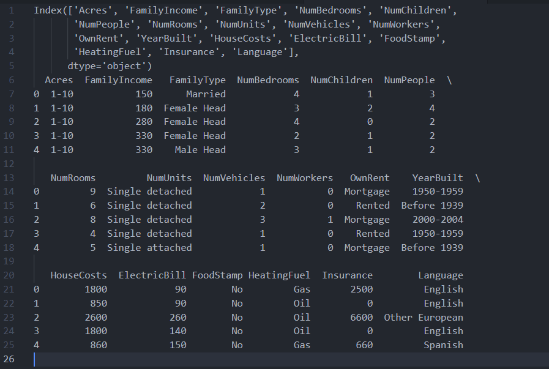
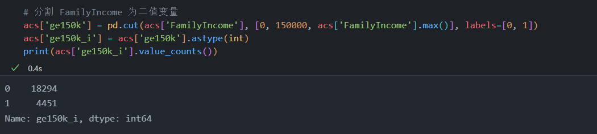
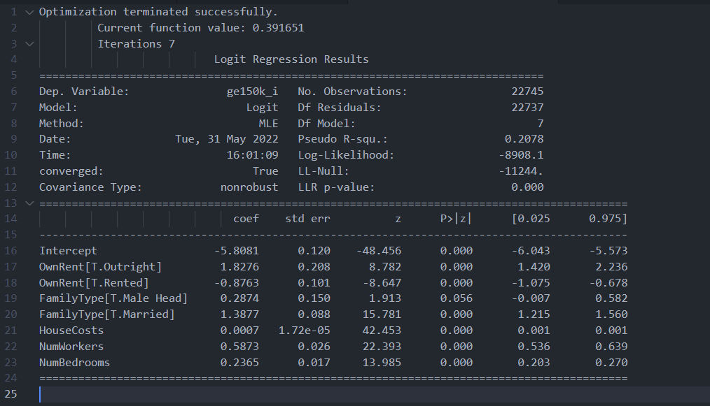
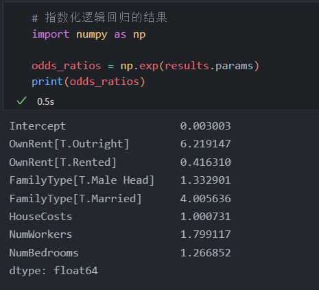
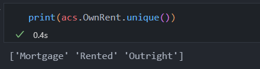
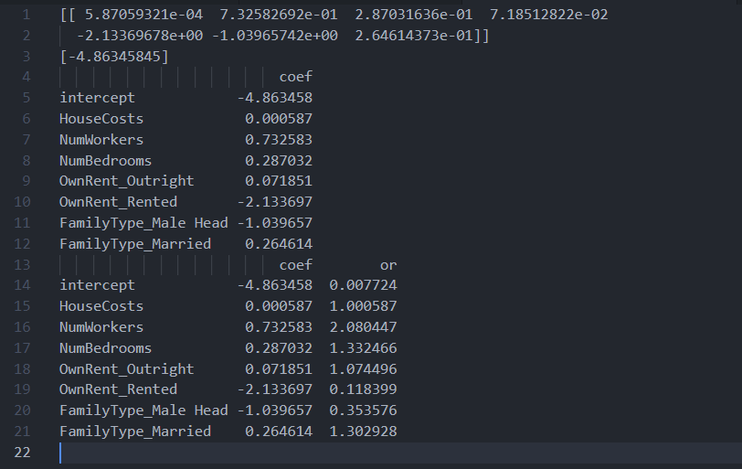

<!-- code_chunk_output -->

# 13.1 简介

- 并非每个响应变量都是连续的，线性回归模型也并不适用于所有情况
- “广义线性模型”（GLM）的模型可用于解释这类数据，而它使用的仍是自变量的线性组合

# 13.2 逻辑回归

- 当响应变量为二值响应变量时，经常使用逻辑回归对数据建模
&nbsp;

- 获取美国社区调查对纽约的一些调查数据

```python
import pandas as pd

acs = pd.read_csv(r'../pandas_for_everyone-master/data/acs_ny.csv')
print(acs.columns)
print(acs.head())
```



- 要对这些数据建模，首先要创建一个二值响应变量
  - 这里把 FamilyIncome 变量分割成 二值变量（此变量有2个值）

```python
# 分割 FamilyIncome 为二值变量
acs['ge150k'] = pd.cut(acs['FamilyIncome'], [0, 150000, acs['FamilyIncome'].max()], labels=[0, 1])
acs['ge150k_i'] = acs['ge150k'].astype(int)
print(acs['ge150k_i'].value_counts())
```



## 13.2.1 使用 statsmodels

- 可以使用 logit 函数执行逻辑回归

```python
import statsmodels.formula.api as smf

model = smf.logit('ge150k_i ~ HouseCosts + NumWorkers + OwnRent + NumBedrooms + FamilyType', 
            data=acs)
results = model.fit()

print(results.summary())
```



- 解释逻辑回归的结果并不像线性回归那样简单
  - 与所有广义线性模型一样，都需要使用连接函数执行一定的转换，而解释结果时需要回到转换之前的状态
  - 为解释逻辑模型
  - 首先要把结果指数化
  - 然后，把这些值解释为 “比值比”
    - 可以把 “比值比” 看做结果 “成真” 的概率的倍数
- 对下方结果数字的一个解释是
  - NumBedrooms 每增加一个单元，FamilyIncome 超过 150 000 的概率就会增加 1.27 倍
  - 也可以如此解释分类变量
  - 分类变量总是根据参考变量来进行解释
    - 可以解释为：相比于以房屋抵押贷款的家庭，那些拥有房屋完全产权的家庭的 FamilyIncome 超过 150 000 的概率就会增加 1.82 倍

```python
# 指数化逻辑回归的结果
import numpy as np

odds_ratios = np.exp(results.params)
print(odds_ratios)
```




## 13.2.2 使用 sklearn

- 使用 sklearn 需要手动创建虚拟变量

```python
# 使用 sklearn 需手动创建虚拟变量
predictors = pd.get_dummies(
    acs[['HouseCosts', 'NumWorkers', 'OwnRent', 'NumBedrooms', 'FamilyType']],
    drop_first=True)

# 使用 linear_model 模块的 LogisticRegression 对象
from sklearn import linear_model
lr = linear_model.LogisticRegression()

# 调用 fit 方法拟合模型，这和拟合线性回归模型的方法相同
results = lr.fit(X = predictors, y = acs['ge150k_i'])

# 通过 coef_ 属性获得系数
print(results.coef_)

# 通过 intercept_ 属性获取截距
print(results.intercept_)

# 格式优化
values = np.append(results.intercept_, results.coef_)
# 得到值的名称
names = np.append('intercept', predictors.columns)
# 全部放入一个带标签的 DataFrame 中
results = pd.DataFrame(values, index=names, columns=['coef'])
print(results)

# 将值指数化
results['or'] = np.exp(results['coef'])
print(results)
```



# 13.3 泊松回归

- 当响应变量涉及计数数据时，就需要用到泊松回归

## 13.3.1 使用 statsmodels

- 可以使用 statsmodels 库提供的 poisson 函数执行泊松回归

```python
results = smf.poisson(
    'NumChildren ~ FamilyIncome + FamilyType + OwnRent',
    data=acs).fit()
print(results.summary())
```

## 13.3.2 负二项回归

# 13.4 更多 GLM

# 13.5 生存分析

# 13.6 小结

---

- **按照书中代码操作，出现部分报错信息，数值差异过大**
- **而笔者对于模型与机器学习不是很懂，无法处理这些错误，故暂停13-16章的学习**
- **待入门机器学习后，再来完善这几章的学习**
