# 2.1 urllib 的使用

- Python库，urllib：
  - 利用它可以实现 HTTP 请求的发送，而且不需要关心 HTTP 协议本身甚至更底层的实现
  - 我要做的是指定请求的 URL 、请求头、请求体等信息

---
**urllib 库** 包含如下4个模块：

1. **request**：这是最基本的 HTTP 请求模块，可以模请求的发送。
2. **error**：异常处理模块。
   1. 如果出现请求异常，我们可以捕获这些异常，并进行重试或其他操作，保证程序不会意外终止
3. **parse**：一个工具模块。提供了很多 URL 的处理方法，例如 *拆分、解析、合并等*。
4. **robotparser**：主要用来识别网站的 tobots.txt 文件，然后判断哪些网站可以爬，哪些网站不可以，实际用的较少。

## 2.1.1 发送请求

> 使用 urllib 库的 request 模块，可以方便地发送请求并得到响应。

### urlopen

- *urllib.request* 模块
  - 提供了最基本的构造 HTTP 请求的方法，利用这个模块 可以模拟浏览器的请求发起过程
  - 同时还具有处理授权验证（Authentication）、 重定向（Redirection）、浏览器 Cookie 以及其他一些功能

```python
import urllib.request

response = urllib.request.urlopen('https://www.python.org')
print(response.read().decode('utf-8'))
```

*运行结果：*

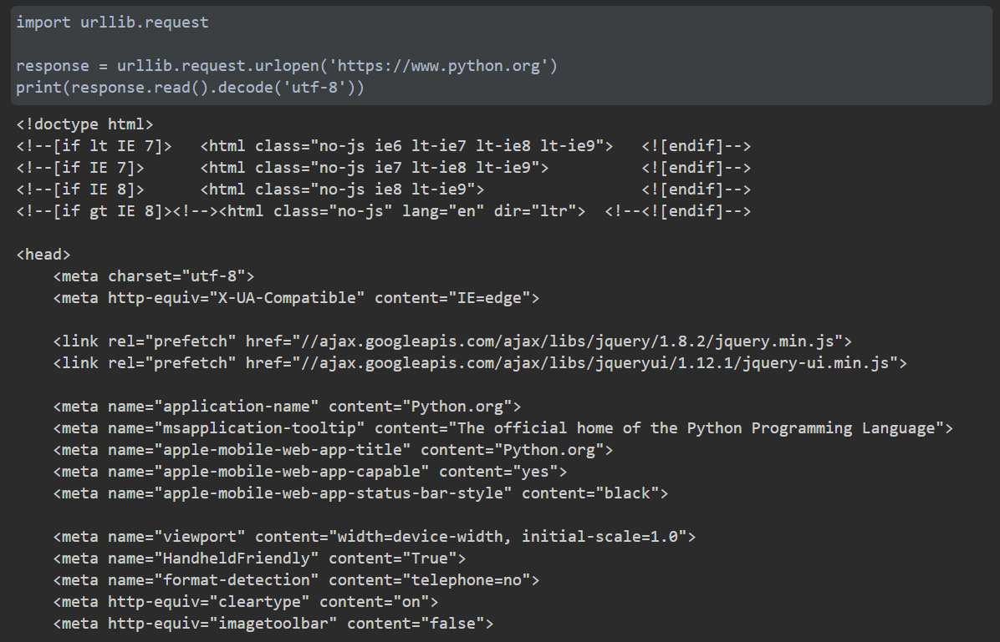

- 这里我们只用了两行代码，便完成了 Python 官网的抓取，输出了其网页的源代码

---
**利用 type 方法** 输出响应的类型
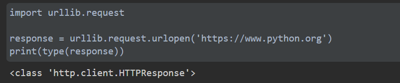

- 可以看出，响应是一个 HTTPResponse 类型的对象
  - 主要包含 read 、readinto 、getheader 、getheaders 、fileno 等方法
  - 以及 msg 、 version 、 status 、reason 、 debuglevel 、 closed 等属性

---

```python
import urllib.request

response = urllib.request.urlopen('https://www.python.org')

print(response.status)
print(response.getheaders())
print(response.getheader('Server'))
```

*运行结果：*

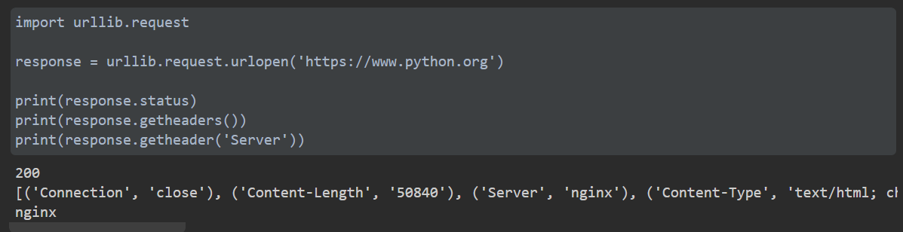

- 其中前两个输出分别是响应的状态码和响应的头信息
- 最后一个调用 getheader 方法，并传入参数 Server ，获取了响应头中 Server 的值，结果是 nginx ，意思为服务器是用 Nginx 搭建的。
  
---

#### urlopen 方法的 API

> urllib.request.urlopen(url, date=None, [timeout,]*, cafile=None, capath=None, cadefault=False, context=None)

#### data 参数

- data 参数是可选的。
- 在添加该参数时，需要使用 *bytes* 方法将参数转化为字节流编码格式的内容，即 bytes 类型
- 如果传递了这个参数，那么它的请求方式就不是 GET ，而是 POST

```python
import urllib.parse
import urllib.request

data = bytes(urllib.parse.urlencode({'name': 'germey'}), encoding='utf-8')
response = urllib.request.urlopen('https://www.httpbin.org/post', data=data)
print(response.read().decode('utf-8'))
```

*代码解析：*

- 传递了参数 name ，值为 germey ，需要将它转码成 bytes 类型
- 转码时采用了 bytes 方法
  - 第一参数必须是 str 类型，，因此用 urllib.parse 模块里的 urlencode 方法将字典参数转化为字符串
  - 第二个参数用于指定编码格式，这里指定为 utf-8
- 此处我们请求的站点是 www.httpbin.org，它可以提供 HTTP 请求测试
  - 请求的 URL 为 www.httpbin.org/post ，这个链接可以用来测试 POST 请求
  - 能够输出请求的一些信息，其中包含我们传递的 data 参数

*运行结果：*

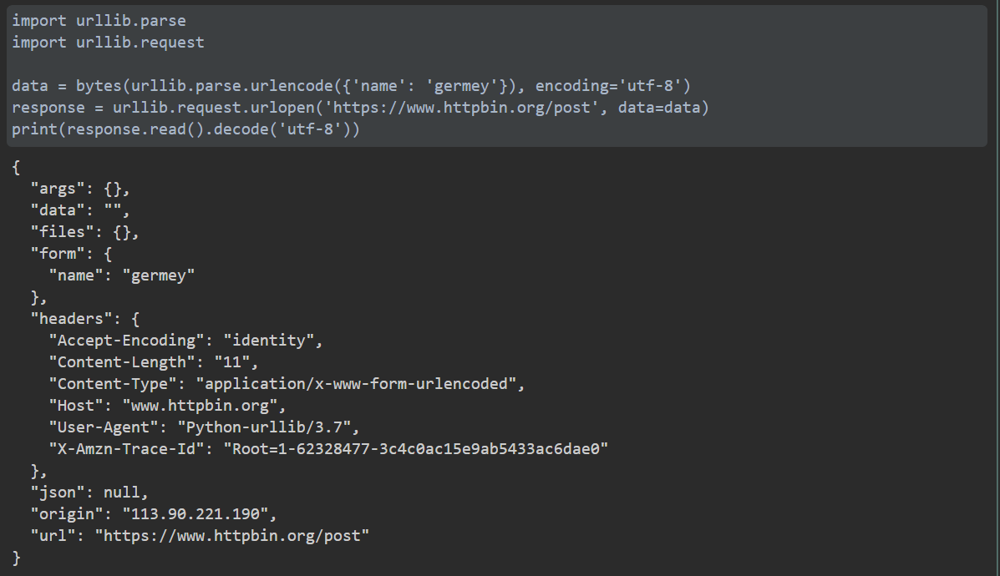

- 提交的参数出现在 form 字段中，这表明是模拟表单提交，以 POST 方式传输数据
  
#### timeout 参数

- timeout 参数，用于设置超时时间，单位为秒
  - 意思是如果请求超出了设置的这个时间，还没有得到响应，就会抛出异常。
  - 如果不指定该参数，则会使用全局默认事件。

*实例：*

```python
import urllib.request

response = urllib.request.urlopen('https://www.httpbin.org/get', timeout=0.1)
print(response)
```

*运行结果：*


*结果解析：*

- 这里我们设置超时间为 0.1 秒。
- 程序运行  0.1 秒后，服务器没有响应，于是抛出了 URLError 异常
- 该异常属于 urllib.error 模块，错误原因是超时

---
因此可以设置这个超时时间，实现当一个网页长时间未响应的时候，就跳过对它的抓取。

*利用 try except 语句实现，代码如下：*

```python
import socket
import urllib.request
import urllib.error

try:
  response = urllib.request.urlopen('https://www.httpbin.org/get', timeout=0.1)
except urllib.error.URLError as e:
  if isinstance(e.reason, socket.timeout):
    print('TIME OUT')
```

*代码解析：*

- 捕获到 URLError 这个异常
- 并判断异常类型是 socket.timeout ，意思是 超时异常
- 因此得出确实是因为超时而报错的结论，最后打印输出 TIME OUT

*运行结果：*

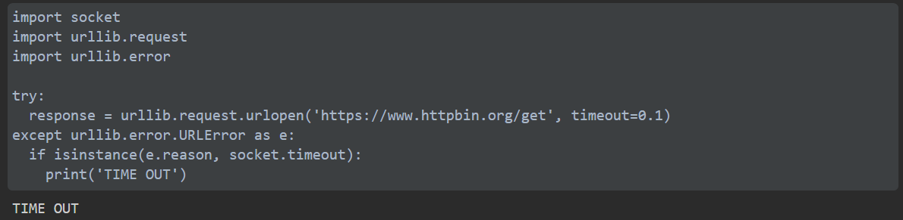

#### 其他参数

- 除了 data 参数 和 timeout 参数，urlopen 方法还有 context 参数，该参数必须是 ssl.SSLContext 类型，用来指定 SSL 参数
- cafile 和 capath 两个参数分别用来指定 CA 证书 和其路径，这两个在请求 HTTPS 链接时会有用
- cadefault 参数现已弃用，默认值为 False

### Request

*实例：*

```python
import urllib.request

request = urllib.request.Request('https://python.org')
response = urllib.request.urlopen(request)
print(response.read().decode('utf-8'))
```

*代码解析：*

- 依然使用 urlopen 方法来发送请求，只不过这次该方法的参数不再是 URL ，而是一个 Request 类型对象
- 通过构造这个数据结构，一方面可以将请求独立成一个对象，另一方面可以更加丰富和灵活地配置参数

---
**Request 类，构造方法如下：**

```python
class urllib.request.Resquest(url, data=None, headers={}
                        origin_req_host=None, unverifiable=False, method=None)
```

*解析：*

1. 第一个参数 url 用于请求 URL，这是必传参数，其他的都是可选参数
2. 第二个参数 data 如果要传数据，必须传 bytes 类型的，如果数据是字典，可以先用 urllib.parse 模块里的 urlencode 方法进行编码
3. 第三个参数 headers 是一个字典，这就是请求头，我们在构造请求时，既可以通过 headers 参数直接构造此项，也可以通过调用请求实例的 add_header 方法添加
   1. 添加请求头最常见的方式就是通过修改 User-Agent 来伪装浏览器。默认的 User-Agent 是 Python-urllib，我们可以通过修改这个值来伪装浏览器
   2. 伪装成火狐浏览器，需要把 User-Agent 设置为：
      1. Mozilla/5.0 (X11; U; Linux i686) Gecko/20071127 Firefox/2.0.0.11
4. 第四个参数 origin_req_host 指的是请求方的 host 名称或者 IP 地址
5. 第五个参数 unverifiable 表示请求是无法验证的，默认取值是 False，意思是用户没有足够的权限来接收这个请求的结果。
   1. 例如：请求一个 HTML 文档中的图片，但是没有自动抓取图像的权限，这时 unverifiable 的值就是 True
6. 第六个参数 method 是一个字符串，用来只是请求使用的方法
   1. 例如：GET 、POST 、PUT 等
  
---

*传入多个参数构建 Request 类：*

```python
from urllib import request, parse

url = 'https://www.httpbin.org/post'
headers = {
  'User-Agent': 'Mozilla/4.0 (compatible; MSIE 5.5; Windows NT)',
  'Host': 'www.httpbin.org'
}
dict = {'name': 'germey'}
data = bytes(parse.urlencode(dict), encoding='utf-8')
req = request.Request(url=url, data=data, headers=headers, method='POST')
response = request.urlopen(req)
print(response.read().decode('utf-8'))
```

*运行结果：*

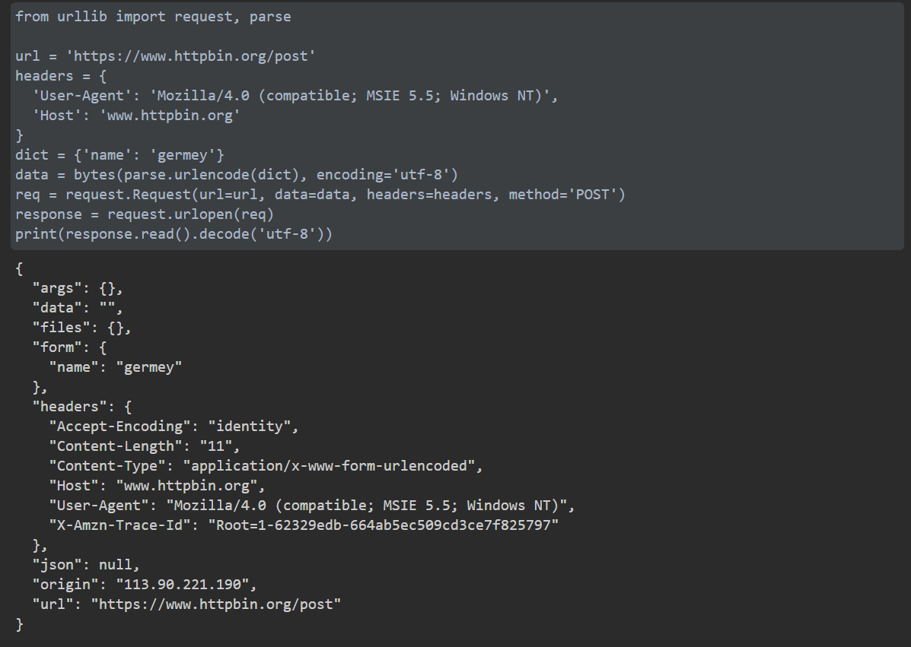

观察结果，发现成功设置了 data 、headers 、和 method。

---
*通过 add_header 方法添加 headers 的方式如下：*

```python
from urllib import request, parse

url = 'https://www.httpbin.org/post'
headers = {
  'User-Agent': 'Mozilla/4.0 (compatible; MSIE 5.5; Windows NT)',
  'Host': 'www.httpbin.org'
}
dict = {'name': 'germey'}
data = bytes(parse.urlencode(dict), encoding='utf-8')
req = request.Request(url=url, data=data,  method='POST')
req.add_header('User-Agent', 'Mozilla/4.0 (compatible; MSIE 5.5; Windows NT)')
response = request.urlopen(req)
print(response.read().decode('utf-8'))
```

*运行结果：*

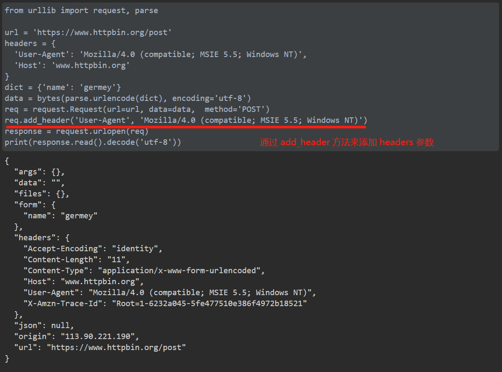

---

### 高级用法

**Handler** ：

- 可以理解为各种处理器，有专门处理登录验证的、处理 Cookie 的，处理代理设置的。
- 利用这些 Handler，几乎可以实现 HTTP 请求中所有的功能

> urllib.request 模块里的 BaseHandler 类，是其他所有 Handler 类的父类，它提供了最基本的方法

**OpenerDirector / Opener**：

> 另一个比较重要的类是 OpenerDirector，可以称之为 Opener

- 之前用过的 urlopen 方法，实际上就是 urllib 库为我们提供的一个 Opener
- 引入 Opener 可以实现更高级的功能
- Opener 类可以提供 open 方法，该方法返回的响应类型和 urlopen 方法如出一辙
- 可以利用 Handle 类来构建 Opener 类

---
*通过实例来看 Handle 类和 Opener 类的用法：*

---

#### 验证

【info】：在访问某些网站时，会弹出认证窗口（登录窗口）

- 遇到这种情况，表示网站启用了基本身份认证，英文叫做 HTTP Basic Access Authentication
- 这是一种登录验证方式，允许网页浏览器或其他客户端程序在请求网站时提供用户名和口令形式的身份凭证
  
*爬虫如何请求这样的页面?*

- 借助 HTTPBasicAuthHandler 模块可以完成
  
*代码如下：*

```python
from urllib.request import HTTPPasswordMgrWithDefaultRealm, HTTPBasicAuthHandler, build_opener
from urllib.error import URLError

username = 'admin'
password = 'admin'
url = 'https://ssr3.scrape.center/'

p = HTTPPasswordMgrWithDefaultRealm()
p.add_password(None, url, username, password)
auth_handler = HTTPBasicAuthHandler(p)
opener = build_opener(auth_handler)

try:
    result = opener.open(url)
    html = result.read().decode('utf-8')
    print(html)
except URLError as e:
    print(e.reason)
```

*代码解析：*

1. 首先实例化了一个 HTTPBasicAuthHandler 对象 auth_handler ，其参数是 HTTPPasswordMgrWithDefaultRealm  对象
   1. 它利用 add_password 方法添加用户名和密码，这样就建立了一个用来处理验证的 Handler 类。
2. 然后将建立的 auth_handler 类当作参数，传入 build_opener 方法，构建一个 Opener
   1. 这个 Opener在发送请求时，就相当于已经验证成功了
3. 最后利用 Opener 类中的 open 方法打开链接，即可完成验证
   1. 这里获取的结果就是验证成功后的页面源码内容
  
*运行结果：*

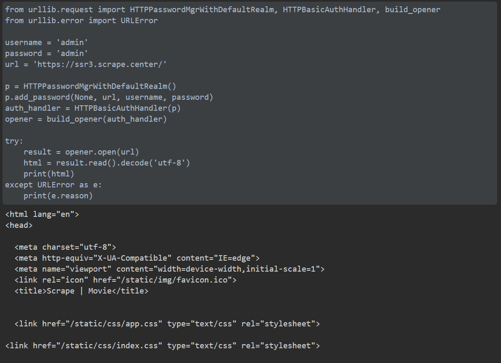

---

#### 代理

*如需添加代理，代码如下：*

```python
from urllib.error import URLError
from urllib.request import ProxyHandler, build_opener

proxy_handler = ProxyHandler({
    'http': 'http://127.0.0.1.8080',
    'https': 'https://127.0.0.1.8080'
})
opener = build_opener(proxy_handler)
try:
    response = opener.open('https://www.baidu.com')
    print(response.read().decode('utf-8'))
except URLError as e:
    print(e.reason)
```

*代码解析：*

- 需要事先在本地搭建一个 HTTP 代理，并让其运行在  8080 端口上[^1]
- 上面使用了 ProxyHandler，其参数是一个字典，键名是协议类型（如 HTTP 或者 HTTPS 等），键值是代理链接，可以添加多个代理
- 利用这个 Handler 和 build_opener 方法构建了一个 Opener，之后发送请求即可
  
---

#### Cookie

- 处理 Cookie 需要用到相关的 Handler
  
*获取网站 Cookie，代码如下：*

```python
import http.cookiejar, urllib.request

cookie = http.cookiejar.CookieJar()                   # 首先声明一个 CookieJar 对象
handler = urllib.request.HTTPCookieProcessor(cookie)  # 利用 HTTP...ssor 构建一个 Handler
opener = urllib.request.build_opener(handler)         # 最后，利用 build_opener 方法构建 Opener
response = opener.open('https://www.baidu.com')       # 执行 open 函数
for item in cookie:
    print(item.name + "=" + item.value)
```

*运行结果：*

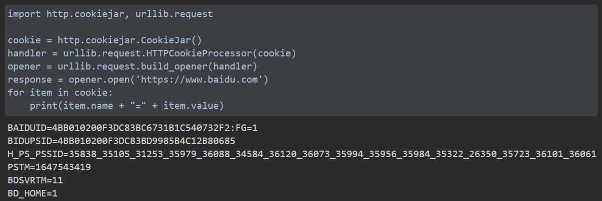

*Cookie 输出为文件格式：*

```python
import urllib.request, http.cookiejar

filename = 'cookie.txt'
cookie = http.cookiejar.MozillaCookieJar(filename)
handler = urllib.request.HTTPCookieProcessor(cookie)
opener = urllib.request.build_opener(handler)
response = opener.open('https://www.baidu.com')
cookie.save(ignore_discard=True, ignore_expires=True)
```

*代码解析：*

- 需要将 CookieJar 换成 MozillaCookieJar，它会在生成文件时用到，是 CookieJar 的子类，可以用来处理跟 Cookie 和文件相关的事件
- 可以将 Cookie 保存成 Mozilla 型浏览器的 Cookie 格式

*运行结果：*

生成如下txt文件：

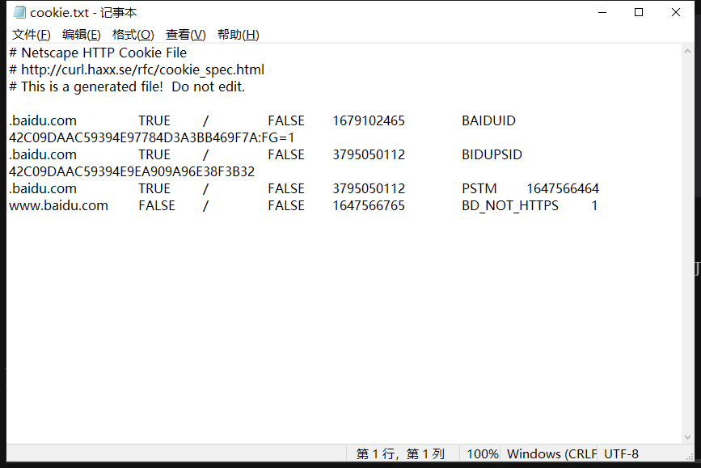

- 另外， LWPCookieJar 同样可以读取和保存 Cookie，只是 Cookie 文件的保存格式和 MozillaCookieJar 不一样，它会保存成 LWP(libwwww-perl) 格式
- 要保存 LWP 格式的 Cookie 文件，可以在声明时就进行修改：

*需要修改的代码如下：*

```python
cookie = http.cookiejar.LWPCookieJar(filename)
```

*生成 LWP 格式 Cookie 文件完成文件，代码如下：*

```python
import urllib.request, http.cookiejar

filename = 'cookie.txt'
cookie = http.cookiejar.LWPCookieJar(filename)
handler = urllib.request.HTTPCookieProcessor(cookie)
opener = urllib.request.build_opener(handler)
response = opener.open('https://www.baidu.com')
cookie.save(ignore_discard=True, ignore_expires=True)
```

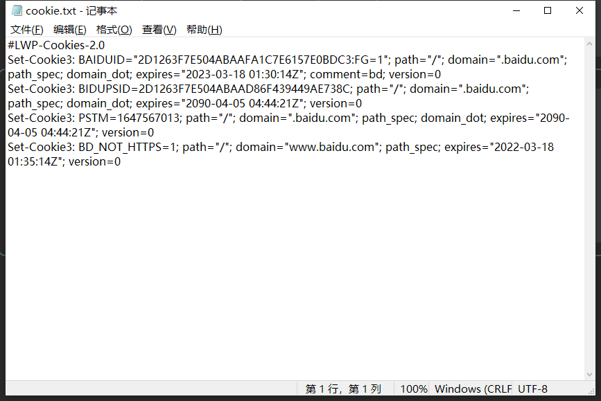

> 不同格式的 Cookie 文件，差异较大

---
【思考】生成 Cookie 文件后，怎样从其中读取内容并加以利用呢？

*以 LWP 格式为例的 Cookie 利用，代码如下：*

```python
# 以 LWP 格式为例，利用 Cookie 文件
import urllib.request, http.cookiejar

cookie = http.cookiejar.LWPCookieJar()
cookie.load('cookie.txt', ignore_discard=True,ignore_expires=True) 
# 调用 load 方法来读取本地的 Cookie 文件，读取 Cookie 内容
# 前提是已存在 LWP 格式的 Cookie 文件
handler = urllib.request.HTTPCookieProcessor(cookie)
opener = urllib.request.build_opener(handler)
response = opener.open('https://www.baidu.com')
print(response.read().decode('utf-8'))            # 运行结果正常，会输出百度网页源代码
```

*运行结果：*

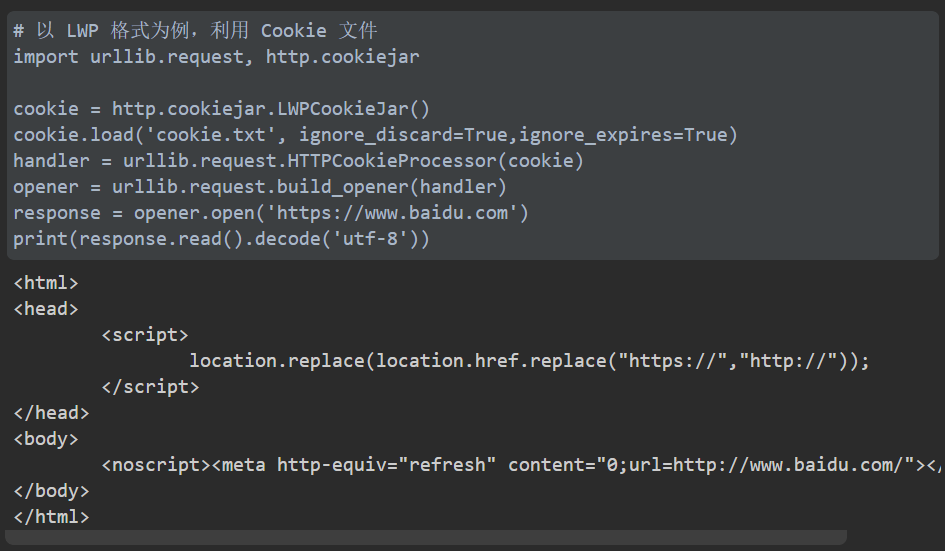

## 2.1.2 处理异常

- urllib 库中的 error 模块定义了由 request 模块产生的异常
- 当出现问题时，request 模块便会抛出 error 模块中定义的异常

### URLError

【定义】URLError 类来自 urllib 库的 error 模块

- 承自 OSError 类，是 error 异常模块的基类
- 由 request 模块产生的异常 都可以通过捕获这个类来处理
- 具有一个属性 reason，即返回错误的原因

*实例代码如下：*

```python
# URLError 实例代码
from urllib import request, error

try:
    response = request.urlopen('https://cuiqingcai.com/404')
except error.URLError as e:
    print(e.reason)
```

- 打开一个不存在的网页，理论上会报错，但我们捕获了 URLError 异常
- 因此程序没有直接报错，而是输出了错误原因
  - 可以避免程序异常终止
  - 同时异常得到了有效处理

*运行结果：*

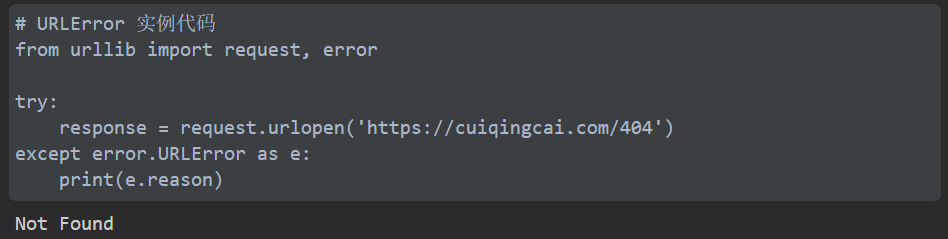

### HTTPError

【定义】HTTPError 是 URLError 的子类，专门用来处理 HTTP 请求错误

具有如下3个属性：

1. **code**：返回 HTTP 状态码
2. **reason**：同父类一样，用于返回错误原因
3. **headers**：返回请求头

*实例代码如下：*

```python
# HTTPError 捕获此错误的实例代码1
# 捕获 HTTPError 异常，输出 reason、code、headers 属性

from urllib import request, error

try:
    response = request.urlopen('https://cuiqingcai.com/404')
except error.HTTPError as e:
    print(e.reason, e.code, e.headers, sep='\n') 
```

*运行结果：*


---

【优化思路】因为 URLError 是 HTTPError 的父类，所以可以先选择捕获子类的错误，再捕获父类的错误。

- 子类有错则输出子类错误，子类无错，则看看父类有没有错，均没错，才可以判断成功爬取了网页信息

*优化代码1：*

```python
# 捕获 HTTPError、URLError 错误的实例代码2
# 此处执行 except error.HTTPError as e: 后的代码块

from urllib import request, error

try:
    response = request.urlopen('https://cuiqingcai.com/404')
except error.HTTPError as e:
    print(e.reason, e.code, e.headers, sep='\n')
except error.URLError as e:
    print(e.reason)
else:
    print('Request Successfully!')
```

*运行结果：*


---

reason 属性返回的不一定是字符串，也可能是一个对象！（此处为 timeout 异常时）

*代码如下：*

```python
# reason 即错误为对象时？用于排查超时错误

import socket, urllib.response, urllib.error

try:
    response = request.urlopen('https://www.baidu.com', timeout=0.01)
    # 打开百度网页超过0.01秒，就会报超时错误
except urllib.error.URLError as e:
    print(type(e.reason))  # 输出 reason 属性的数据类型，可以发现为对象 socket.timeout
    if isinstance(e.reason, socket.timeout):
        # 如果 e.reason 为 socket.timeout 对象，执行 if 后的代码块
        print('TIME OUT')
```

*运行结果：*

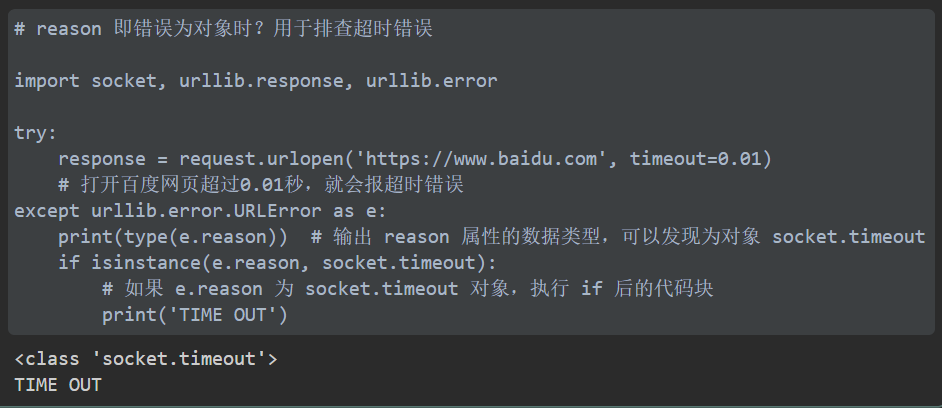

> 本节，讲述 error 模块的相关用法，通过合理地捕获异常可以做出更准确的异常判断，使程序更加稳健

## 2.3 解析链接

- urllib 库里提供了 parse 模块，这个模块定义了处理 URL 的标准接口，例如实现 URL 各部分的抽取、合并以及链接转换。
- 支持如下协议的 URL 处理：file、ftp、gopher、hdl、http、https、imap、mailto、mms、news、nntp、prospero、rsync、rtsp、rtspu、sfip、sip、sips、snews、svn、svn+ssh、telnet 和 wais。

> 下面介绍 parse 模块中的常用方法

### urlparse

- 此方法，可以实现 URL 的识别的分段

*示例代码如下：*

```python

# urlparse 进行 URL 的识别和分段 示例代码

from urllib.parse import urlparse

result = urlparse('https://www.baidu.com/index.html;user?id=5#comment')
print(type(result))
print(result)
```

*运行结果：*


### urlunparse

### urlsplit

### urlunsplit

### urljoin

### urlencode

### parse_qs

### parse_qsl

### quote

### unquote

## 2.4 分析 Robots 协议

### Robots 协议

### 爬虫名称

### robotparse

## 2.5 总结

- 介绍了 urllib 库的 request、error、paese、robotpaeser 模块的基本用法
- 代码详见：[本章代码](https://github.com/Python3WebSpider/UrllibTest)


[^1]:不知如何搭建 HTTP 代理，故此处代码运行失败，提示无法解析链接
