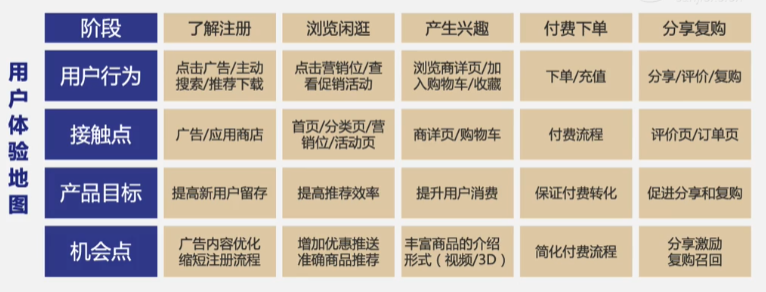

# 搭建电商[[标签体系]]实现精细化运营

## 1 导读

### 1.1 目标

1. 了解标签体系的作用
2. 了解搭建标签体系的前提
3. 掌握完善[[标签体系]]的搭建要诀
4. 学会应用标签体系，实现精细化运营

### 1.2 课程大纲

1. 认识[[标签体系]]：用户运营的利器
   1. 标签是什么
   2. 标签体系是什么
   3. 标签体系的作用
   4. 标签体系的前提
2. 搭建标签体系：全方位拆解用户
   1. 第一步：拆解业务/用户 梳理用户数据
   2. 第二步：定义用户标签 形成标签体系
3. 应用标签体系：个性精细化运营
   1. 正向：利用标签提升策略效果
   2. 反向：利用标签挖掘优化策略
   3. RFM 模型

## 2 认识标签体系：用户运营的利器

### 2.1 标签是什么

- 概括特征的词汇
- 用户标签
  - 对用户信息和特征的抽象概括，能够描述用户特征，区分用户群体 

### 2.2 标签体系是什么

- 用户标签体系
  - 狭义上：是指基于业务目标和用户数据形成的包含完善用户标签的标签库
  - 广义上：除丰富完善的用户标签库之外，还包括标签管理、标签分析、智能运营等多模块
  
### 2.3 标签体系的作用

- 用户洞察
  - 了解产品用户，指导业务发展
- 数据分析
  - 丰富分析维度，提升分析效率
- 精细化运营
  - 基于用户分群，差异化精细化运营
- 产品化应用
  - 数据产品基础，推荐系统、CRM

### 2.4 标签体系的前提

1. 产品用户规模较大，具有精细化运营空间
2. 用户特征属性多样，具备标签分类基础
3. 产品提供较多内容，适合精准分发推荐
   1. 如果不能给不同的用户推送不同的内容，就不需要做标签体系了，无法体现不同用户的差异化运营

## 3 搭建标签体系：全方位拆解用户

### 3.1 第一步：拆解业务/用户 梳理用户数据

- 用户标签源于用户数据
  - 
  - 用户标签源自于用户数据，服务于业务目标，从业务目标和用户流程触发，梳理用户业务数据，能够保证后续用户标签的完善度和可落地性

#### 3.1.1 OSM 模型：以电商产品为例

- 业务角度-OSM 模型：我们在做什么
  - OSM 模型是业务分析的常用模型
  - 业务目标（Objective）
    - 公司/业务/产品的目标是什么
  - 业务策略（Strategy）
    - 为了达成业务目标采取什么策略
  - 业务度量（Measurement）
    - 用于反应目标达成情况、策略有效程度的指标

#### 3.1.2 用户角度-UJM 模型：用户在做什么

- UJM 即用户体验地图，又叫用户旅程地图（User Journey Map），利用 UJM 能够有效拆解用户使用产品的流程，分析了解用户的关键场景及行为

|要素|内涵|
|:----:|:----|
|阶段|用户使用产品的流程阶段划分|
|用户目标|用户在各阶段下要完成的任务/达成的目标|
|用户行为|用户在各阶段下为达成目标进行的具体行为|
|想法/情绪|用户在各阶段下进行行为时的想法情绪变化|
|接触点|用户在各阶段下与产品互动的接触点|
|产品目标|产品期望用户在各阶段下进行的行为/达成的目标|
|痛点/机会点|结合用户模板/行为/想法和产品目标，可优化机会点|

- UJM 模型：以电商产品为例
  - 

#### 3.1.3 OSM & UJM: 梳理用户业务数据

- 业务和用户两个角度梳理用户数据，互相补充，形成用户业务数据基础

#### 3.1.4 电商产品用户业务数据

- 基础数据
  - 年龄/性别
  - 星座/生日
  - 地址/设备
  - 注册日期
  - 注册来源
- 活跃/行为数据
  - 访问时长/频次
  - 浏览活动/商品
  - 收藏/关注
  - 评价/分享
  - 等级/会员
  - 积分/优惠券
- 消费数据
  - 购物金额/频次
  - 购物日期/地区
  - 购物品类/品牌
  - 支付成功率
  - 商品复购
  - 退货/取消订单

### 3.2 第二步：定义用户标签 形成标签体系

- 标签体系主要是符合业务目标的多维度多类型用户标签的集合
- 搭建标签体系需从合理定义每一个用户标签开始

#### 3.2.1 用户标签的定义流程：如何基于用户数据定义用户标签

- 用户数据是定义用户标签的基础
- 基于用户数据信息定义用户标签流程如下
  - 结合业务目标 明确标签需求
  - 明确标签分类 选取数据维度
  - 确定数据属性 准确定义标签

##### 3.2.1.1 结合业务目标 明确标签需求

- 用户标签服务于业务目标和策略，每个标签都应该匹配具体或潜在的应用场景
- 

##### 3.2.1.2 明确标签分类 选取数据维度

- 明确需求后，需要判断标签分类，进一步分析能够准确定义标签的数据维度
- 
&nbsp;

1. 用户标签-属性标签
   1. 示例
      1. 男性/女性
      2. 90后/80后
      3. 一二线城市
   2. 属性标签
      1. 主要由基础数据定义
      2. 定义了用户最基础的特征
      3. 定义宽泛，多结合其他类型的标签进行应用
2. 用户标签-统计标签
   1. 示例
      1. 消费次数 > 5
      2. 消费金额超 1000 元
      3. 注册超 1 年用户
      4. 最近 7 日活跃用户
   2. 统计标签
      1. 主要由活跃数据和消费数据定义
      2. 定义了用户最直观的数据特征
      3. 多在应用时直接创建，并且经过分析验证后更多演变成模型标签
3. 用户标签-模型标签
   1. 示例
      1. 活跃用户/忠诚用户
      2. 高消费/低消费
      3. 新手妈妈/小镇青年
      4. 数码爱好者
         1. 累计消费数码产品 > 3000 元
         2. 近一年消费数码产品 > 4 个订单
      5. 优惠敏感用户
         1. 近 30 天访问领劵中心 > 3次
         2. 订单最多的活动类型是满减
   2. 模型标签
      1. 主要由消费数据和活跃数据定义
      2. 准确定义需结合产品特征、业务目标及数据分析，无法直接指定
      3. 灵活性强，更直观体现用户多方面特征，是用户标签的主要类型
4. 用户标签-预测标签
   1. 示例
      1. 流失风险
         1. 最后 1 次购物距今 > 30 天
         2. 最后 1 次访问距今 > 15 天
      2. 母婴潜在
         1. 最近 30 天访问/搜索母婴商品 > 3次
         2. 历史母婴商品订单 = 0
      3. 待复购
   2. 预测标签
      1. 主要由活跃数据和消费数据定义
      2. 对用户潜在的关键行为倾向进行预测，实现难度较大，多借助算法支持，并且需要动态验证调整

##### 3.2.1.3 确定数据属性 准确定义标签

- 准确定义用户标签，需要确定已选择数据维度的具体数据属性
  - 

- 标签数据属性的确认
  - 直接定义
    - 标签数据属性明确能够直接判断定义
      - 小镇青年
      - 母婴用户
  - 分布分析
    - 标签数据属性模糊，需要进一步分析确定
      - 高消费用户
      - 品牌忠诚用户
&nbsp;

- 分布分析定义标签
  - 如何定义高消费用户？
    - 第一步：高消费主要与消费金额有关，可根据用户累计消费金额数据定义
    - 第二步：多少消费金额才算高消费？大于 2000 元？ 大于 10000 元？
  - 用户数据分布分析
    - 排除干扰用户，如新注册用户、早期流失用户
    - 计算用户消费金额数据分布，按递增排列数据
    - 按照 25%、50%、75% 分布划分用户消费能力
&nbsp;

- 标签体系的使用
  - 基于用户数据，可以进行多种类型标签的定义，但是还不足以称为标签体系。
  - 理想状态下，标签体系应该包含满足业务方需求的丰富用户标签，方便运营、产品、数据等各方灵活使用，但标签随着业务目标、具体策略和用户特征不断演变，用户标签仍然需要优化和丰富
- 结合 *业务目标/具体策略/用户特征* 新建或调整 **标签库**
- 运营、产品、数据团队根据业务需求灵活使用

#### 3.2.2 用户标签的四种类型：标签体系中用户标签的四种类型

- 此节内容已在 3.2.1.2 提及

#### 3.2.3 标签体系的四大维度：标签体系中的标签应覆盖的内容

- 完善的标签体系应该覆盖如下维度，满足常用标签需求
  - 生命周期
  - 用户价值
  - 活跃特征
  - 用户偏号
&nbsp;

- 标签体系的四大维度
  
|维度|定义|作用|标签示例|
|:----:|:----|:----|:----|
|生命周期|用户在产品内所处的生命周期阶段|明确用户所处周期阶段，掌握阶段特征和运营重点|新用户/首购用户/活跃用户/忠诚用户/沉默用户/流失用户|
|用户价值|用户给产品带来的收益即用户的商业价值|区分用户的商业价值，决定运营投入和重点|高价值用户/中等价值用户/低价值用户/RFM分类|
|活跃特征|用户使用产品时行为、时间、渠道特征|了解用户使用产品特征辅助针对性运营时机、策略|夜间用户/下午用户/上午用户/优惠券敏感用户/大促用户|
|用户偏号|用户对品类/品牌/商品/活动/商家/功能等的偏好|了解用户需求和偏好针对性提供内容提升转化率|母婴用户/小米粉丝/国货用户/小众商品用户|

&nbsp;

- 四大维度的应用价值
  - 是否投入资源？重点和目标是什么？
    - 生命周期
      - 用户什么周期阶段？
      - 运营重点是什么？
      - 主要特征是什么？
    - 用户价值
      - 用户价值高不高？
      - 能变更高吗？
      - 值得投入多少资源？
  - 具体怎么做？如何最大化效果？
    - 活跃特征
      - 行为特征是什么？
      - 什么时候活跃？
      - 什么平台活跃？
    - 用户偏好
      - 用户喜欢什么商品？
      - 喜欢什么活动？
      - 最近有没有消费？

#### 3.2.4 标签体系的持续维护：形成完善标签体系后的持续维护

- 标签体系是业务的武器，在丰富使用的同时，要进行运营维护，保证标签体系的准确性和可用性
  - 通用标签和临时标签区分管理，方便查找使用
  - 设计新增标签时避免单点思维，重视系统化
  - 结合标签实际应用的反馈优化标签设计和定义

### 3.3 小结：搭建标签体系

- 第一步
  - 拆解 *业务/用户* 梳理用户数据
    - 业务角度- OSM 模型，解决产品关注什么的问题
    - 用户角度- UJM 模型，拆解用户真实的行为流程
- 第二步
  - 定义用户标签 形成标签体系
    - 定义用户标签，标签需求——标签类型——标签属性
    - 完善标签体系，用户生命周期/价值/活跃/偏好

## 4 应用标签体系：个性精细化运营

### 应用标签体系-简单直接应用

- 筛选目标用户
- 目标用户偏好
- 具体运营动作

- 案例：促销活动营销位的定向展示
- 筛选目标用户
  - 服装品类用户
  - 沉默回访用户
- 目标用户偏好
  - 换季新款服饰
  - 低价/优惠商品
- 具体运营动作
  - 服饰优惠活动
  - 限时优惠活动

### 应用标签体系-双向驱动运营

- 标签体系是精细化运营的利器，能够大大提升精细化运营的效率效果
- 本质上是以数据分析为基础的用户细分运营，个性化满足用户需求
- 两种应用思路
  - 正向
    - 提升策略效果
  - 反向
    - 挖掘需求策略

### 4.1 正向：利用标签提升策略效果

- 流程如下：
  - 结合业务目标 明确整体策略
    - 实现什么目标？
    - 面向多少用户？
    - 方法是什么？
  - 基于用户标签 分析挖掘用户
    - 5W1H
    - 用户偏号/价值
    - 用户活跃特征
    - 用户消费特征
  - 结合用户特征 调整策略动作
    - 针对不同用户标签形成分层用户设计细化策略
  - 精细化实施 监控分析效果
    - 针对不同用户实施不同运营策略和动作，关注分析数据结果

- 案例：利用标签提升优惠卷发放效果
  - 
  - 给谁发？
    - 消费频次
    - 活跃特征
    - 优惠券敏感度
  - 发什么劵？
    - 用户偏好品牌
    - 用户偏好品类
    - 用户偏好商品
    - 消费订单金额
  - 什么时机发？
    - 消费活跃时间
    - 消费主要场景
  - 

### 4.2 反向：利用标签挖掘优化策略

- 流程如下：
  - 基于用户标签 全面拆解用户
    - 从价值/生命周期/偏好/活跃维度切入，拆解出用户标签
  - 对比用户特征 发现优化空间
    - 关注相同维度用户标签下用户的特征、分布，寻找优化空间
  - 差异化设计策略
    - 确定运营优化重点和方向，设计差异化的运营策略和动作
  - 精细化实施监控分析效果
    - 针对不同用户实施不同运营策略和动作，关注分析数据结果

- 案例：利用标签挖掘母婴用户策略
  - 
  - 
  - 

### 4.3 RFM 模型

- 三个标签维度
  - Recency - 最近一次消费时间
    - 用户最近一次消费距今的时间间隔
    - 最近一次消费时间越短，用户**活跃度**越高
  - Frequency - 消费频次
    - 一定时期内用户消费的次数
    - 消费频次越高，用户**忠诚度**越高
  - Monetary - 消费金额
    - 一定时期内用户消费的金额
    - 消费金额越大，用户的**价值**越大

- RFM 模型的应用目标
  - 其他分层用户 —— 差异化策略 —— 理想态-高R高F高M
  - 

- RFM模型-应用事项
  - 优先投入运营维护重要价值/发展/保留/挽回用户
  - 关注八类用户标签人群流转，保持稳定合理用户结构
  - 实际运营时进一步结合标签分析判断用户偏好特征

### 4.4 小结：应用标签体系

- 利用标签提升策略效果和利用标签挖掘需求策略都是“投其所好”
- 挖掘用户特征需求，结合业务目标规划，精细化运营提升用户的行为转化率
- 
&nbsp;

## 5 课程总结
