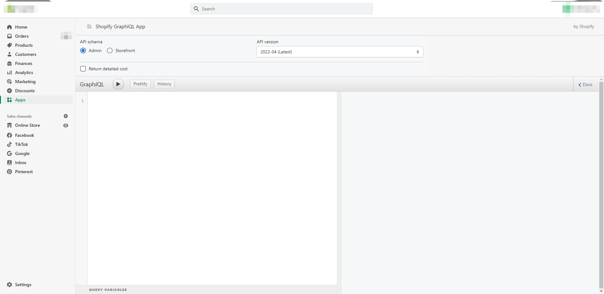

# 第 3 章：GraphQL 查询语言

- SQL
  - Structured Query Language 结构化查询语言
  - 是特定的语言，用于访问、管理和操作数据库中的数据
&nbsp;

- SQL 可以运行的命令非常精简
  - SELECT
  - INSERT
  - UPDATE
  - DELETE
- 数据只能被增加、删除、更改和查询
  - 要求我们根据这四种基本数据操作使用的不同的 HTTP 方法
  - GET
  - POST
  - PUT
  - DELETE
- 但是指定通过 REST 读取或更改数据类型的唯一方法是通过端点 URL，而非实际的查询语言
&nbsp;

- 尽管都是查询语言，但 GraphQL 与 SQL 完全不同
  - 适用于完全不同的环境
    - SQL 查询语句发到数据库
    - GraphQL 查询语句发到 API
    - SQL 存储在数据表中
    - GraphQL 数据可以存储在任何地方：单个数据库、多个数据库、文件系统、RESTful API、WebSockets，甚至是其他 GraphQL API
    - SQL 是一种数据库的查询语言
    - GraphQL 则是一种互联网的查询语言
  - 语法完全不同
    - GraphQL 使用查询（Query）字段取请求数据而非 SELECT
    - 查询字段是我们使用 GraphQL 操作的核心
    - 不同于 INSERT、UPDATE、DELETE，GraphQL 将所有这些数据整合成一种数据类型：变更（Mutation）
  - 因为 GraphQL 是为互联网而生的，具备订阅功能，可以用来监听 socket 连接上的数据的变动
&nbsp;

- 查询字段仅仅是发送到 GraphQL 端的 POST 请求体中的字符串

```GraphQL
# GraphQL 查询字段示例
{
    allLifts{
        name
    }
}
```

- 可以使用 curl 将该查询字段发送到 GraphQL 端

```GraphQL
curl 'http://sonwtooth.herokuapp.com/'
    -H 'Content-Type: application/json'
    --data {"query":"{allLifts{name}}"}
```

- 假设 GraphQL schema 支持这种形式的查询，你将直接收到相应的 JSON
  - JSON 中包含你在名为 data 的字段中请求的数据，或者出错的时候返回的报错信息

- 更改数据，我们可以发送变更（mutation）
  - 变更和查询字段颇为相似，而它是用来修改数据的，类似于 SQL 的 UPDATE
  - 执行更改所需的数据可以和变更一起直接发送

```GraphQL
mutation{
    setliftStatus(id: "panorama" status: OPEN){
        name
        status
    }
}
```

- 上面的变更是采用 GraphQL 查询语言编写的，可以假设它想要把 id 为panorama 的 lift 状态改为 OPEN
- 同样可以使用 curl 将该操作发送到 GraphQL 服务器

> 本章重点介绍如何使用 GraphQL 来构成查询（query）、变更（mutation）和订阅（subscription）。

## GraphQL API 工具

- 介绍两款最常用的针对 GraphQL API 的 GraphQL 查询字段测试工具
  - GraphiQL
  - GraphQL Playground

### GraphiQL

- 是 Facebook 创建的浏览器内的集成开发环境（IDE），方便开发人员查询和浏览 GraphQL API
- 提供语法高亮显示、代码完成和错误警告，它使你可以在浏览器中直接运行并查看查询结果
- 许多公共 API 提供了 GraphiQL 接口，可以使用该接口查询实时数据



- 我们的查询流程从使用 GraphQL 查询语言编写的文本开始
  - 我们将此文本称为 *查询文本*
- 将查询文本写入左侧面板
  - 在 GraphQL 文档中可以定义一个或多个操作
    - 比如查询、变更或是订阅
- 单击播放按钮进行查询
  - 在右侧面板中会返回得到的 JSON 格式的响应结果
- 点击右上角打开 Docs 窗口，这里显示了与当前服务交互所需了解的全部内容
- 该文档会自动添加到 GraphQL，因为它是从服务的 schema 中读取的
- schema 定义了服务上可用的数据，并且 GraphQL 通过 schema 进行自检查询来自动构建文档

> 通常来说，你是通过 GraphQL 服务主机本身的 URL 来访问 GrapiQL 的，如果你构建自己的 GraphQL 服务，那么可以增加一个路由来渲染 GraphQL 接口，一遍你的用户可以浏览公开的数据

### GraphQL Playground

- 因 shopify 采用的是 GraphiQL，此段略过

### 公共 GraphQL API 

- 略

## GraphQL 查询字段

- 可以使用查询操作从 API 请求数据
  - 查询字段 就是你希望从 GraphQL 服务器获取的数据
  - 在发送查询时，会按字段请求数据
  - 你从服务器接收到的 JSON 数据响应中的相同字段会自动进行映射

```GraphQL
# 发送 allLifts 查询字段请求名称和状态
# 会收到一个 JSON 响应，其中包含 allLifts 的数组以及每个电梯 name 和 status 的对象字符串

query{
    allLifts{
        name
        status
    }
}
```

- **错误处理**
  - 成功的查询将返回一个 JSON 文档，它会包含“data”键
  - 如果查询失败，会返回一个包含“errors”键的 JSON 文档，错误信息会作为值
  - JSON 中是可以同时包含“data”键和“errors”键的
&nbsp;

- 可以向查询文档添加多个查询，但是一次只能运行一个操作
- 当按下“play”按钮时，GraphQL Playground 将会要求你在两个操作之间选择一个
- 如果想在一个请求中查询所有数据，那么久需要将全部字段放在同一个查询中

```GraphQL
# 分开查询
query lifts{
    allLifts{
        name
        status
    }
}

query trails{
    allTrails{
        name
        difficulty
    }
}
```

```GraphQL
# 集中查询
query liftsAndTrails{
    liftCount(status: OPEN)
    allLifts{
        name
        status
    }
    allTrails{
        name
        difficulty
    }
}
```

- 这就是 GraphQL 展示优势的时候
  - 可以在一次查询中接收各种不同的数据
- query 是 GraphQL 的类型
  - 我们称其为根类型 root type
  - 因为它可以将操作进行映射，而操作代表了查询文档的根节点
  - 我们已经在 API schema 中定义了可以查询的 GraphQL 字段
  - 文档将告诉我们可以在查询类型上选择哪些字段
&nbsp;

- 编写查询时，把需要的字段用大括号括起来
  - 这些块被称为 *选择集* （selection set）
  - 在选择集内定义的字段和 GraphQL 的类型直接相关
- 选择集之间可以相互嵌套
  - 