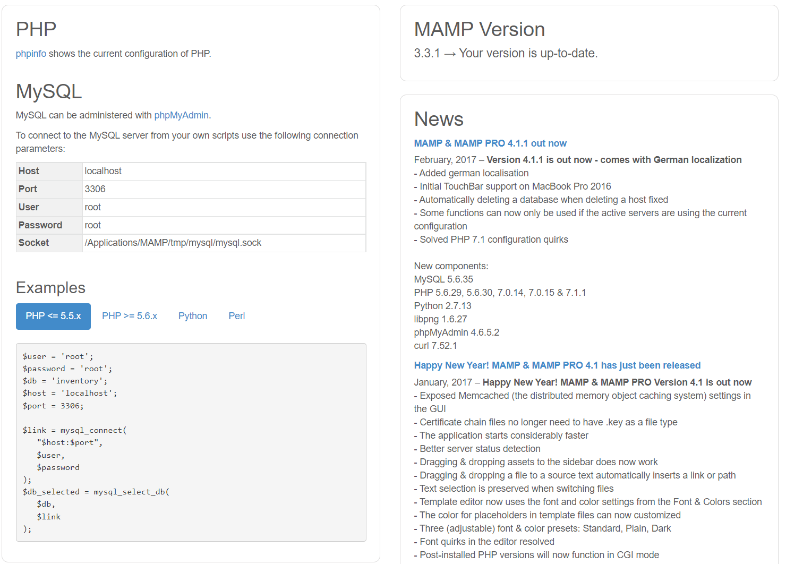

# 2.1 本书使用的软件

本书使用的软件主要包括以下几个：

1. MySQL (RDBMS)
2. Apache (Web 服务器)
3. PHP (编程语言)

- 建议使用可以轻松构建 MySQL + Apache + PHP 运行环境的 MAMP

> 通过 MAMP 构建的环境主要以开发为目的，并没有达到能够在互联网上实际发布的安全级别。
> 如果要实际发布到互联网上，需要事先做好充足的准备
-  [[专栏]] XAMPP
	- XAMPP 和 MAMP 一样，是一个可以轻松构建 MySQL + Apache + PHP 运行环境的软件

[XAMPP](https://www.apachefriends.org/zh_cn/index.html)

# 2.2 学习 MySQL 前的准备

## 2.2.1 关于本书使用的 MAMP

- 本书使用 MAMP 版本为 3.3.5 安装文件在 图灵社区下载资料中

## 2.2.2 安装 MAMP

- 端口 80 与 3306 被占用将运行失败
  - 解决办法
    - 找出 占用端口的程序的 pid 号
    - 通过 pid 号，在 任务管理器-详细信息中找到 对应的程序
    - 右键，结束进程树，即可禁用此端口，而后 MAMP 程序顺利打开
  - 找出 pid 号的代码
    - netstat  -ano | findstr 0.0.0.0:80[^1]
- 旧版本的 Apache 和 MySQL 有残留也会失败
  - 卸载后，删除文件，MAMP 运行成功

> 参考链接：[Windows下80端口被进程System占用的解决方法](https://www.cnblogs.com/firstdream/p/8057646.html)

## 2.2.3 MAMP 的启动和设置

- 动手过程，按书中即可

## 2.2.4 确认开始页

已确认，开始页截图如下：

## 2.2.5 构成 MAMP 的文件夹

- 已按照书中进行确认

# 2.3 MySQL 的路径设置

- 对 MySQL 监视器进行设置（Windows 10 按书中步骤操作即可）

# 2.4 关于中文的设置

- 在 UTF-8 的情况下，字符集和字符编码 都称为 UTF-8
- 另外，很多时候字符编码也用“字符代码”来表示，本书统一使用“字符编码”这个名称

## 2.4.1 MySQL 的字符编码设置

- 本书中，存储在 MySQL 在的数据使用了字符编码 UTF-8，主要是为了方便与 PHP 结合起来开发 Web 应用程序
- 通过 Web 程序，我们可以把输入的数据存储到数据库，再从数据库读出数据显示在 Web 画面上
- 在 Web 的世界中默认使用的字符编码是 UTF-8 ，所以如果数据库的字符编码 也是 UTF-8 ，就不需要进行字符编码的转换了

## 2.4.2 修改 my.ini

- 已按照书中更改，确认需等待学会 启动监视器之后再确认

# 2.5 本书中使用的表

## 2.5.1 销售信息表 tb（按员工号统计的月销售额）

略

## 2.5.2 员工信息表 tb1（各员工号代表的员工的姓名、年龄）

略

# 2.6 总结

本章介绍以下内容

1. [x] MAMP 的按照
2. [x] 到 MySQL 启动为止的设置
3. [x] MySQL 中中文编码的设置
4. [x] 书中使用的员工信息表 tb1 和 tb 的内容

-  [[专栏]] 关于 macOS 版的 MAMP
	- MAMP 原本是面向 macOS 开发的软件，windows 版是后面开发的

与 windows 版本的不同（略过）

[^1]: 找出 80 端口占用程序，对应的 PID 号
