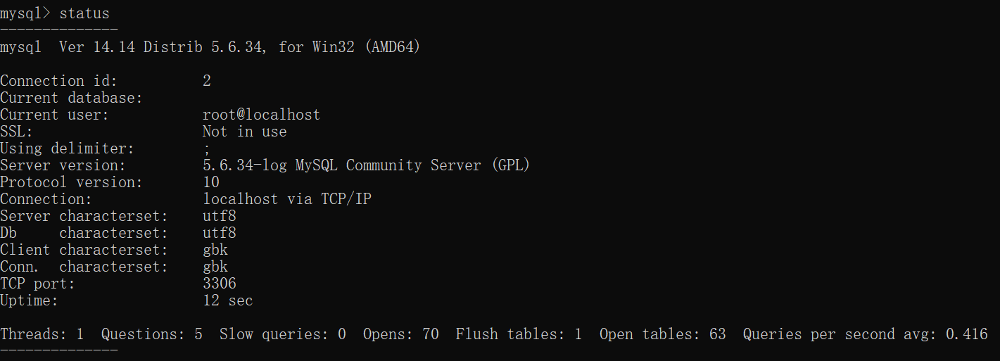

# 3.1 创建数据库前的准备事项

- [x] 安装好 MySQL
- [x] 设置好 MySQL 安装文件夹的路径
- [x] 完成 MySQL 的中文设置

# 3.2 什么是 MySQL 监视器

- [[MySQL 监视器]]

# 3.3 启动 MySQL 监视器

## 3.3.1 启动终端软件

- MySQL 监视器需要使用终端软件
  - windows 的终端，即 win+r 输入 cmd 后运行的程序

## 3.3.2 启动 MySQL 监视器

- 在命令提示符中输入 mysql 命令，就可以启动 MySQL 监视器

```base
mysql -u 用户名 -p 密码
mysql -u root -proot
```

[[专栏]] 命令提示符的 UTF-8 设置

- 本书以“命令提示符端使用字符编码 GBK 进行数据的输入和输出，而数据库则使用 UTF-8 存储数据“
- 也可以把命令提示符端的字符编码设置成 UTF-8

```base
chcp 65001
```

- chacp
  - 此命令用于修改命令提示符的字符编码
  - 65001 代表 UTF-8
  - 如采用此方法，需要一遍一遍地执行这个命令，在某些环境中可能会发生画面显示崩溃的情况，故不采用

## 3.3.3 当 MySQL 监视器无法启动时

- 略

## 3.3.4 确认 MySQL 中字符编码的设置情况

- 在 MySQL 监视器中执行 status 命令，查看字符编码设置等信息
  - 
- 还可以通过在 MySQL 监视器中输入 `SHOW VARIABLES LIKE 'char%'` 来确认

# 3.4 MySQL 监视器的退出操作和密码设置

## 3.4.1 退出 MySQL 监视器

- 提示符状态下，输入 exit 或 quit，然后按下 Enter 键来退出 MySQL 监视器

## 3.4.2 使用历史命令

- 在命令提示符或终端上输入命令，通常会作为输入历史残留下来
  - 我们可以通过输入 方向上键 下键 把过去的历史按顺序显示出来

## 3.4.3 安全地输入密码

- 在命令提示符状态下输入 `mysql -u root -p`，就会看到要求输入密码的提示
- 可以避免通过命令历史盗取密码
- MySQL 监视器中的命令，也可以通过 方向上键 下键 显示输入历史

[[专栏]] MySQL 命令选项

- 在启动 MySQL 监视器的时候，输入了 `mysql -u root -proot`
  - 此命令其实是在 mysql 命令的基础上添加了 -u -p 两个选项
  - 通过给命令添加选项，就可以指定命令完成设置的各种处理
- 主要有以下两种方法
  - 给“-”指定选项名，然后加上设置的值 `-u root`，这种情况，选项名只占用一个字符
  - 在“--选项名=”后加上设置的值 `mysql --user=root --password=root`

# 3.5 设置 MySQL 管理员 root 密码

## 3.5.1 修改 root 用户的密码

- `SET PASSWORD FOR root@localhost=PASSWORD('199503')`
- 这样，root 密码就改成了 1234，可以退出 mysql 监视器了

## 3.5.2 修改 MMAP 的设置

- 在修改了 root 用户密码的情况下，如果不修改 MAMP 的设置文件内容，就无法退出和启动 MySQL 服务器
- 用文本编辑器打开 MAMP 文件夹中的 MAMP.exe.config 文件，将代码中的
  - --password=root 中 root 改为 199503

## 3.5.3 修改 phpMyAdmin 的设置

- 修改 MAMP\bin\phpMyAdmin 文件夹中 config.inc.php 文件
- `$cfg['Servers'][$i]['password'] = '199503';`

# 3.6 [[总结]]

- 介绍了以下内容
  - [X] MySQL 监视器的使用方法
  - [X] 连接和退出 MySQL 的方法
  - [X] 历史命令和相关内容
  - [X] 修改密码的方法
&nbsp;

- [[自我检查]]
  - [x] 能够启动和退出 MySQL 监视器
  - [x] 能够在不泄露密码的情况下启动 MySQL 监视器
  - [x] 能够利用选项启动 MySQL 监视器
  - [x] 能够使用历史命令
&nbsp;

- [[练习题]]
  - 问题1：
    - 创建新用户
      - `CREATE USER 新用户名 IDENTIFIED BY '密码';`
    - 设置用户权限
      - `GRANT 赋予的权限 ON 数据库名.表名 TO 用户名;`
  - 可以使用 root 的权限执行 `DROP USER 用户名` 来删除用户

[[专栏]] PowerShell 和命提示符

- 命令提示符的下一代版本是 Windows PowerShell
- PowerShell
  - 向前兼容命令提示符，所以也可以在 PowerShell 中启动 MySQL 监视器，操作数据库
  - 拥有很多高级功能，但它和命令提示符之间存在很多细微的差异，使用过程中需注意
