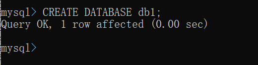
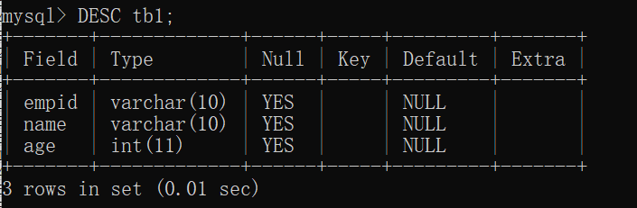
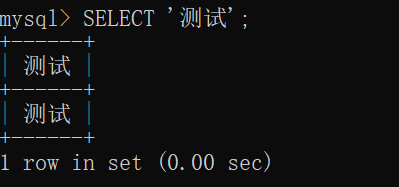
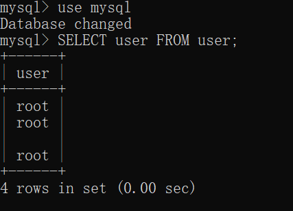

# 4.1 创建数据库

- 试着创建一个名为 db1 的数据库来存储本书使用的所有表

## 4.1.1 创建数据库

- 创建数据库命令 `CREATE DATABASE 数据库名;`
  - 
  - 显示 Query OK 代表命令执行成功，在执行 SQL 语句时，一定要确认结果中是否出现了此信息

> 本书 SQL 语句的命令统一使用大写字母来记述
> 基本使用小写字母来表示数据库名、表名、列名
> 虽然可以使用中文来命名数据库名、表名、列名，但是这样会增大问题发送的概率，所以最好不使用中文

- 发送错误的情况
  - 先确认一下命令的最后是否忘记输入“;”(分隔符)
  - 如果显示了 You have an error in SQL syntax (你的 SQL 语句的语法有问题)之类的信息
    - 确认命令的拼写是否有误
  - 显示 Can't create database 'db1'; databse exists (db1 已经存在，无法再次创建)
    - 表示数据库 db1 已经被创建了，MySQL 中无法创建多个同名的数据库

[[专栏]] 在租赁服务器上使用 MySQL

- 在使用租赁的服务器时，数据库名通常是事先决定好的，所以并不是在所有的情况下都需要创建数据库或者可以给数据库随意取名字，需注意。

# 4.2 确认创建的数据库

## 4.2.1 确认数据库

- SHOW 命令用于确认数据库的信息
  - 大部分信息能通过 SHOW 命令显示出来

- 显示数据库一览
  - `SHOW DATABASES;`
  - 创建好的数据库会显示出来
  - 以文本形式表示的方格框架的下方显示了一些内容，其中包括刚刚创建的 db1
  - 最下面一行会显示 xx rows in set 这种输出行数的信息
  - 当输出内容无法容纳在 MySQL 监视器的一个屏幕中时，我们只要确认这个行数信息即可

## 4.2.2 test 和 mysql 数据库

- 在安装 MySQL 的时候会自动创建一个名为 test 的数据库
  - 这个数据库中没有任何表
- mysql 数据库
  - 负责存储 MySQL 各种信息的数据库
  - 保存了管理用户信息的表 user等
  - 除此之外，还保存了存储 MySQL 信息的数据库及示例数据库

# 4.3 指定使用的数据库

- 成功创建数据库后，尝试在数据库中创建表
- 在 MySQL 中，并不是启动后就能立即使用数据库，还需要显式地声明使用什么数据库
- 一些 RDBMS 要求在启动 MySQL 监视器的同事指定数据库，但 MySQL 并没有对此提出要求

## 4.3.1 指定数据库

- 使用 use 命令指定数据库
  - `use 数据库名`
  - 执行 use 命令后，结果中会显示 Database changed（数据库改变了）
  - 此命令可以不加分隔号
  - 可以使用 \u 代替 use
- 显示当前使用的数据库
  - `SELECT DATABASE();`

[[专栏]] 选择数据库启动 MySQL 监视器

- 可以直接指定数据库启动 MySQL 监视器
  - `mysql db1 -u root -proot`
  - 通过在命令提示符中指定数据库名来执行 mysql 命令

# 4.4 创建表 tb1

## 4.4.1 列和字段

- 在创建表时，需要事先指定数据的类型是什么、列名是什么等
- 数据库中也有分开使用术语的情况，比如构成表的项目称为字段（field），构成记录的各项目的数据称为列

## 4.4.2 数据类型

- 列中保存的数据的类型称为数据类型
  - INT 表示能够存储 1、2、3 这样的整数数据
  - VARCHAR 表示能够存储字符数据
- 另外，VARCHAR 的后面会紧跟 (10) 这样的内容，他表示允许最多输入 10 个字符
&nbsp;

- 创建表的结构
  - 创建包含 3 个列的表，各列对数据类型也有一定要求
  - empid VARCHAR(10)
  - name VARCHAR(10)
  - age INT
- 虽然表名或列名可以使用中文，但是使用中文会发生各种各样的问题，因此最好不使用中文

## 4.4.3 创建表

- 可以使用 CREATE TABLE 命令创建表,在 () 内使用空格分开列名和数据类型，各列之间使用 “,” 分割
  - `CREATE TABLE 表名(列名1 数据类型1, 列名2， 数据类型2...);`
  - `CREATE TABLE tb1(empid VARCHAR(10), name VARCHAR(10), age INT);`
  - 显示 Query OK 就表示成功

[[专栏]] 使用 `` 把数据库名括起来

- 数据库名、表名和列名可以用 `` (反引号) 括起来使用
- 输入到列中的字符串的值需要用 '' （单引号）或者 "" （双引号）括起来

# 4.5 显示所有的表

## 4.5.1 显示所有的表

- SHOW TABLES 命令
  - `SHOW TABLES`

- 指定字符编码创建表
  - 在 CREATE TABLE 命令中加上 CHARSET=utf8 选项
  - `CREATE TABLE tb1(empid VARCHAR(10), name VARCHAR(10), age INT) CHARSET=utf8;`

[[专栏]] 访问其他数据库

- 使用 use 选择数据库的状态下，也可以操作其他数据库中的表
  - `数据库名.表名`
  - 用 “.” 连接起来

# 4.6 确认表的结构

## 4.6.1 确认表的结构

- DESC 或 DESCRIBE 显示表的列结构
  - `DESC 表名;`
  - 

[[专栏]] 特殊的 SHOW

- SHOW
  - 在其他 RDBMS 中没有，是 MySQL 特有的命令

# 4.7 向表中插入数据

## 4.7.1 插入数据

- INSERT INTO 命令
  - `INSERT INTO 表名 VALUES(数据1, 数据2..)`
  - 在 VALUES 后面的 () 中，需要按照列的顺序用 “,” 来区分各数据
  - 数值数据可以直接插入，字符串数据需要用 "" 或 '' 括起来
  - `INSERT INTO tb1 VALUES('A101', '佐藤', 40);`

> MySQL 中即使输入多于指定字符数的数据也不会报错，而是会忽略无法插入的字符

## 4.7.2 向表 tb1 中添加第2条记录

- 略

## 4.7.3 指定列名插入记录

- 可以忽略列的顺序，指定列名来插入记录
  - `INSERT INTO 表名(列名1, 列名2...) VALUES(数据1, 数据2...);`
  - `INSERT INTO tb1(age, name, empid) VALUES(23, '渡边', 'A104');`

## 4.7.4 一次性输入记录

- `INSERT INTO 表名(列名1, 列名2...) VALUES(数据1, 数据2...), (数据1, 数据2...), (数据1, 数据2...)...;`
- 虽然较长的 SQL 语句也可以在中间换行输入，但是 VALUES 等关键字如果不在一行，就会发送错误，此外数据中间也不能换行

# 4.8 显示数据

## 4.8.1 显示数据

- SELECT 语句
  - `SELECT 列名1, 列名2... FROM 表名;`
  - `SELECT * FROM 表名`
- 使用 SELECT 输出指定的值
  - 还能用于显示与数据库无关的值
  - `SELECT '测试'`
  - 
  - 适用于确认函数的值或计算结果

# 4.9 （准备）复制表 tb1

- `CREATE TABLE tb1A SELECT * FROM tb1;`

# 4.10 [[总结]]

- 介绍的内容
  - [x] 创建数据库的方法
  - [X] 创建表的方法
  - [X] 显示列结构的方法
  - [X] 插入数据的方法
  - [X] 显示所有数据的方法
- 自我检查
  - [x] CREATE DATABASE...
  - [X] CREATE TABLE...
  - [X] DESC...
  - [X] INSERT INTO...
  - [X] SELECT * FROM...
- 练习题
  - 使用一行命令显示2次表tb1的所有数据
    - `SELECT * FROM tb1; SELECT * FROM tb1;`
  - 数据库 mysql 的表 user 中包含了用户信息，请显示这个信息
    - 
    - `SELECT user FROM mysql.user;`

[[专栏]] MySQL 的文档

- [MySQL_5.6参考手册](https://dev.mysql.com/doc/refman/5.6/en/)
- [MySQL_8.0参考手册](https://dev.mysql.com/doc/refman/8.0/en/)
