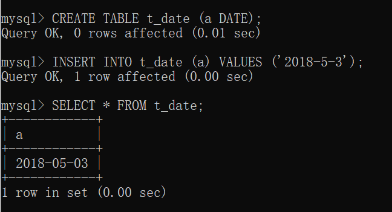
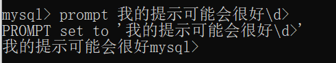

> 数据库中一旦设置了数据类型，之后再修改就会很麻烦

# 5.1 什么是数据类型

- 数据库的表中只能输入各个列指定格式的数据
- 数据类型具有降低输入错误数据的可能性、保证数据库整体可信赖性的特点
- MySQL 和其他 RDBMS 相比，数据输入的检查功能相对趋于宽松

# 5.2 数值类型

## 5.2.1 数值类型的种类

|类型|大小|范围（有符号）|范围（无符号）|用途|
|----|----|----|----|----|
|TINYINT|1 Bytes|(-128，127)|(0，255)|小整数值|
|SMALLINT|2 Bytes|(-32 768，32 767)|(0，65 535)|大整数值|
|MEDIUMINT|3 Bytes|(-8 388 608，8 388 607)|(0，16 777 215)|大整数值|
|INT或INTEGER|4 Bytes|(-2 147 483 648，2 147 483 647)|(0，4 294 967 295)|大整数值|
|BIGINT|8 Bytes|(-9,223,372,036,854,775,808，9 223 372 036 854 775 807)|(0，18 446 744 073 709 551 615)|极大整数值|
|FLOAT|4 Bytes|(-3.402 823 466 E+38，-1.175 494 351 E-38)，0，(1.175 494 351 E-38，3.402 823 466 351 E+38)|0，(1.175 494 351 E-38，3.402 823 466 E+38)|单精度浮点数值|
|DOUBLE|8 Bytes|(-1.797 693 134 862 315 7 E+308，-2.225 073 858 507 201 4 E-308)，0，(2.225 073 858 507 201 4 E-308，1.797 693 134 862 315 7 E+308)|0，(2.225 073 858 507 201 4 E-308，1.797 693 134 862 315 7 E+308)|双精度浮点数值|
|DECIMAL|对DECIMAL(M,D) ，如果M>D，为M+2否则为D+2|依赖于M和D的值|依赖于M和D的值|小数值|

## 5.2.2 输入数值数据

- 输入数据时，可以加上正负号
- 数值也可以用指数表示法输入
  - 需要使用符号 E
  - O E+ P 表示 O 乘以 10 的 P 次方

# 5.3 字符串类型

## 5.3.1 字符串类型的种类

|类型|大小|用途|
|----|----|----|
|CHAR|0-255 bytes|定长字符串|
|VARCHAR|0-65535 bytes|变长字符串|
|TINYBLOB|0-255 bytes|不超过 255 个字符的二进制字符串|
|TINYTEXT|0-255 bytes|短文本字符串|
|BLOB|0-65 535 bytes|二进制形式的长文本数据|
|TEXT|0-65 535 bytes|长文本数据|
|MEDIUMBLOB|0-16 777 215 bytes|二进制形式的中等长度文本数据|
|MEDIUMTEXT|0-16 777 215 bytes|中等长度文本数据|
|LONGBLOB|0-4 294 967 295 bytes|二进制形式的极大文本数据|
|LONGTEXT|0-4 294 967 295 bytes|极大文本数据|

- 只需记住长度不超过 255 个字符的是 VARCHAR，超过 255个字符的是 TEXT 即可
- CHAR 是固定长度的字符串，在保存数据的时候，如果字符数没有达到()中指定的数量就会用空格填充，但是读取时这些被填充的空格会被自动删除
- VARCHAR 为可变长度字符串，保存数据时不会填充空格

## 5.3.2 输入字符串

- 当输入带 单引号 ' 的字符时，需用 \' 的方式输入
  - `INSERT INTO tb1B (name) VALUES('\'西泽\'');`
  - 输入 \ 时同理

## 5.3.3 VARCHAR 和 CHAR 的位数单位

- VARCHAR 的()中指定的位数单位是 “字符”，不是字节

# 5.4 日期与时间类型

## 5.4.1 日期与时间类型的种类

|类型|大小(bytes)|范围|格式|用途|
|----|----|----|----|----|
|DATE|3|1000-01-01/9999-12-31|YYYY-MM-DD|日期值|
|TIME|3|'-838:59:59'/'838:59:59'|HH:MM:SS|时间值或持续时间|
|YEAR|1|1901/2155|YYYY|年份值|
|DATETIME|8|1000-01-01 00:00:00/9999-12-31 23:59:59|YYYY-MM-DD HH:MM:SS|混合日期和时间值|
|TIMESTAMP|4|1970-01-01 00:00:00/2038 结束时间是第 2147483647 秒，北京时间 2038-1-19 11:14:07，格林尼治时间 2038年1月19日 凌晨 03:14:07|YYYYMMDD HHMMSS|混合日期和时间值，时间戳|

- 需记住 DATETIME 类型和 DATE 类型
- 神策中 date 和 time 字段分别为 DATE、DATETIME类型

## 5.4.2 输入日期与时间类型的数据

- 需要用引号括起来
- 在 MySQL 中
  - 日期必须以 YYYY-MM-DD 的格式输入
  - 时间必须以 HH:MM:SS 的格式输入
- 示例
  - 

[[专栏]] 修改提示符的字符串

- 在 MySQL 监视器运行的时候，我们能够在提示符“>”中指定自己想显示的内容
- 可以指定 `--prompt = 提示符内容` 选项设置提示符，但如果设置的提示符中包含中文就会发生乱码
- 可以通过 '\d' 设置数据库名，通过 '\h' 设置主机名，通过 '\u' 设置用户名
  - 

# 5.5 [[总结]]

- 介绍内容
  - 数据类型是什么
  - 能够设置的数据类型种类
  - 如何设置列的数据类型
- 自我检查
  - OK
- 练习题
  - 略
