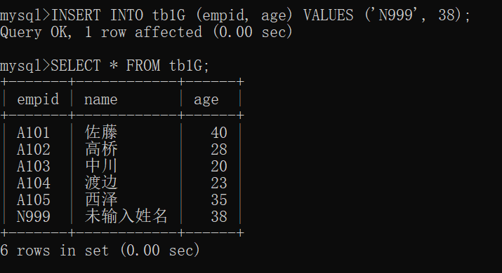
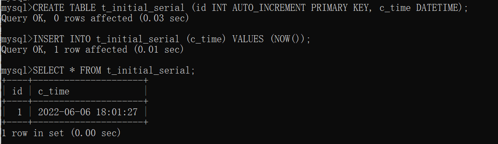

# 6.1 修改表的列结构

## 6.1.1 ALTER TABLE 命令

- 可以使用 ALTER TABLE 命令修改列的结构
- 根据修改的类型，分以下四种
  - 修改列的定义时：`ALETER TABLE ... MODIEY ...`
  - 添加列时：`ALTER TABLE ... ADD ...`
  - 修改列名和定义时：`ALTER TABLE ... CHANGE ...`
  - 删除列时：`ALTER TABLE ... DROP ...`

# 6.2 修改列的数据类型

- 数据类型的修改必须具有兼容性
  - 不具有兼容性的修改会导致错误发生
  - 即使是数据类型可以修改，也可能会发生数据变成没有意义的值、全部或部分数据丢失之类的情况
- 修改列的数据类型
  - `ALTER TABLE 表名 MODIFY 列名 数据类型;`
  - `ALTER TABLE tb1C MODIFY name VARCHAR(100);`
  - 

[[专栏]] 修改数据类型要慎重

- 存储了“开头不是 0 且仅由数值字符组成的数据”的列能按照 “INT - VARCHAR - INT”的方式进行修改
- 但是如果列中存在数据，原则上就不应该再修改数据类型了

# 6.3 添加列

- `ALTER TABLE 表名 ADD 列名 数据类型;`
  - 

## 6.3.1 添加员工信息记录

- `INSERT INTO tb1C VALUES('N111', '松田', 38, '1980-11-10');`
  - 
  - 使用了需要输入日期与时间的数据类型 DATETIME，所以没有输入的时间部分被自动设置成 '00:00:00'

# 6.4 修改列的位置

## 6.4.1 把列添加到最前面

- `ALTER TABLE ... ADD ...` 加上 FIRST，新建的列会添加到最前面
  - `ALTER TABLE tb1D ADD birth DATETIME FIRST;`
  - 

## 6.4.2 把列添加到任意位置

- 使用 AFTER 能够把列添加到指定的位置
  - `ALTER TABLE tb1E ADD birth DATETIME AFTER empid;`
  - 

## 6.4.3 修改列的顺序

- `ALTER TABLE tb1C MODIFY birth DATETIME FIRST;`
  - 把 birth 列调整到第一列
  - 

# 6.5 修改列名和数据类型

- 修改列 birth 的数据类型为 DATE 列名为 birthday

## 6.5.1 修改列的数据类型或位置的同时也修改列名

- `ALTER TABLE 表名 CHANGE 修改前的列名 修改后的列名 修改后的数据类型;`
- `ALTER TABLE tb1C CHANGE birth birthday DATE;`
  - 

# 6.6 删除列

- 对数据库和表进行删除时，都会用到 DROP 命令
- 删除列 `ALTER TABLE 表名 DROP 列名;`
  - `ALTER TABLE tb1C DROP birthday;`
  - 
  - 在删除的情况下，该列保存的数据也会被删除

[[专栏]] 故意输入超过指定数量的字符

- 在 MySQL 中即使字符溢出也不会发生错误
- 超过指定字符的部分都被自动删除了
- 需要注意避免出现输入的数据在不知不觉中丢失的情况

# 6.7 设置主键

## 6.7.1 什么是唯一

- 略

## 6.7.2 什么是主键

- 创建唯一记录时，会给列设置一个用于和其他列进行区分的特殊属性
- 这种情况下需要用到主键（PRIMARY KEY），主键是在多条记录中用于确定一条记录时使用的标识符
- 主键特征
  - 没有重复值
  - 不允许为空值（NULL）
- 格式 `CREATE TABLE 表名 (列名 数据类型 PRIMARY KEY ...);`

## 6.7.3 创建主键

- 示例
  - `CREATE TABLE t_pk (a INT PRIMARY KEY, b VARCHAR(10));`
  - 

## 6.7.4 确认主键

- 插入示例
  - `INSERT INTO t_pk VALUES(1,'啊');`  成功插入
    - 
  - `INSERT INTO t_pk (a) VALUES(1);` 因重复值报错
    - 
  - `INSERT INTO t_pk (a) VALUES(NULL);` 因空值报错
    - 
- 设置为主键的列中，不能使用 INSERT 或 UPDATE 命令输入已经存在的值

## 6.7.5 设置唯一键

- 还可以设置具有 “不允许重复” 这一限制属性的唯一键（unique key）
- 略

# 6.8 使列具有自动连续编号功能

## 6.8.1 具有自动连续编号功能的列的定义

- 要使列具有自动连续编号功能，就得在定义列的时候进行以下 3 项设置
  - 数据类型为 INT 等整数类型
  - 加上 AUTO_INCREMENT，用于声明连续编号
  - 设置 PRIMARY KEY，使列具有唯一性

## 6.8.2 创建具有自动连续编号功能的列

- `CREATE TABLE t_series (a INT AUTO_INCREMENT PRIMARY KEY, b VARCHAR(10));`
- 

[[专栏]] 其他 RDBMS 中自动连续编号功能的位置

- 自动连续编号功能的设置方法根据 RDBMS 的不同而不同
- MYSQL 通过定义列的 AUTO_INCREMENT
- Oracle 可以使用 CREATE SEQUENCE 等命令，通过创建能够自动生成等间隔的数值的序列（SEQUENCE）来实现自动连续编号功能
- PostgreSQL 中有可以生成连续编号的数据类型 SERIAL
  - 实际是通过序列功能生成连续编号的

# 6.9 使用自动连续编号功能插入记录

- 仅需在列 b 中插入数据
- `INSERT INTO t_series (b) VALUES('子'), ('丑'), ('寅');`
  - 

## 6.9.1 确认插入的记录

- 略

# 6.10 设置连续编号的初始值

## 6.10.1 连续编号的初始化

- 如果把表中所有记录都删除，然后重新输入记录，编号不会从 1 开始分配，而是从既有最大值 +1 开始分配
  - 
- 如果想要从 1 开始连续输入，需要对 AUTO_INCREMENT 的值进行初始化
  - `ALTER TABLE 表名 AUTO_INCREMENT=1;`
    - 即使向拥有自动连续编号功能的列中输入 0，0 也不会输入进去
    - 如果总数向拥有自动连续编号功能的列中输入 0，错误发生的概率就会降低

# 6.11 设置列的默认值

- `CREATE TABLE 表名 (列名 数据类型 DEFAULT 默认值 ...);`

## 6.11.1 修改列结构的定义

- `ALTER TABLE tb1G MODIFY name VARCHAR(10) DEFAULT '未输入姓名';`
- 

## 6.11.2 输入数据

- `INSERT INTO tb1G (empid, age) VALUES ('N999', 38);`
- 

[[专栏]] 数据库的实体是什么

- MySQL 创建的数据库到底保存在什么地方呢
- 本书的方法安装了 MAMP
  - 在其 MAMP\db\mysql 的文件夹内就会自动创建一个和数据库同名的文件夹，数据库的实体就保存在里面
  - 
  - 
&nbsp;

|文件名|说明|
|----|----|
|db.opt|记述默认字符编码等选项的文本文件|
|表名.frm|保存表的元数据（表定义等）的文件|
|表名.ibd|保存在表中的数据的实体|

> 仅仅复制这些文件并不能形成有效备份

- 如果在 data 文件夹内创建一个文件夹
  - 这个文件夹会作为数据库显示出来
  - 通过这种方式强制创建的数据库中，可以照常创建表

# 6.12 创建索引

## 6.12.1 什么是索引

- 当查找表中的数据时，如果数据量过于庞大，查找操作就会花费很多时间
- 这种情况下，最好在表上创建索引（index）
  - 如果事先创建了索引，查找时就不用对全表进行扫描，而是利用索引进行扫描
  - 可以缩短查找时间

## 6.12.2 创建索引

- `CREATE INDEX 索引名 ON 表名 (列名);`
  - `CREATE INDEX my_ind ON tb1G (empid);`
  - 

## 6.12.3 显示索引

- `SHOW INDEX FROM 表名;`
  - 结束的 分号 换成 \G 显示会更清晰
  - 

## 6.12.4 删除索引

- `DROP INDEX 索引名 ON 表名;`
- 

[[专栏]] 索引和处理速度的关系

- 创建索引不一定缩短查找时间
  - 根据查找条件的不同，有时候不需要用到索引
  - 有时候反而会花费更多的时间
  - 当相同值（重复值）较多的情况下，最好不要创建索引
  - 当创建了索引的表进行更新时，也需要对已经存在的索引信息进行维护
  - 即使创建过程中出现了错误，查找结果也不会受到任何影响。创建索引只会影响数据库整体的处理速度
- 索引的创建是影响整个数据库处理效率的重要问题
  - 把这种提高处理效率的对策称为调优（tuning）

# 6.13 [[总结]]

- 介绍内容
  - 如何修改表的列结构
  - 什么是主键
  - 如何设置拥有自动连续编号功能的列
  - 如何设置列的默认值
  - 索引的作用和创建方法
- 自我检查
  - 略
- 练习题
  - 创建表 t_initial_serial
  - 
