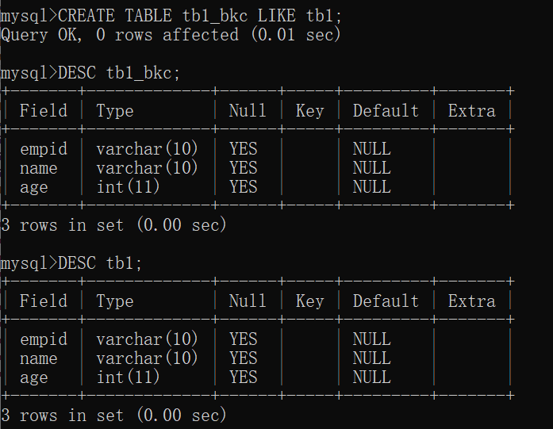
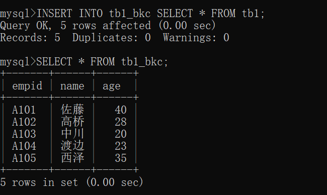
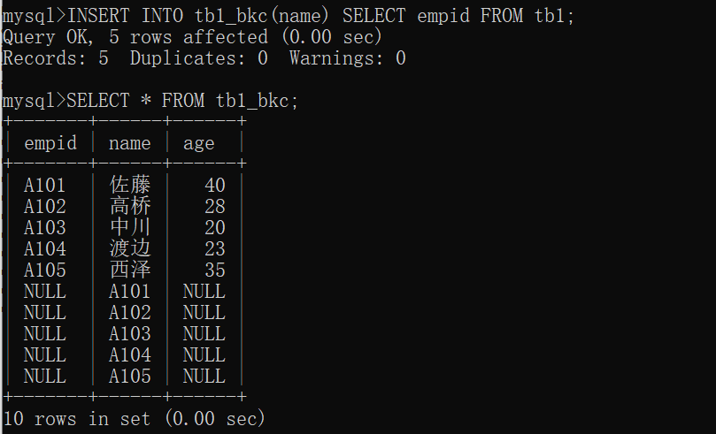
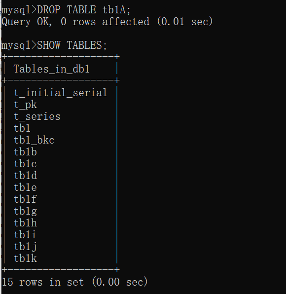
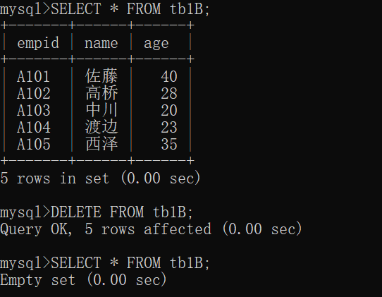
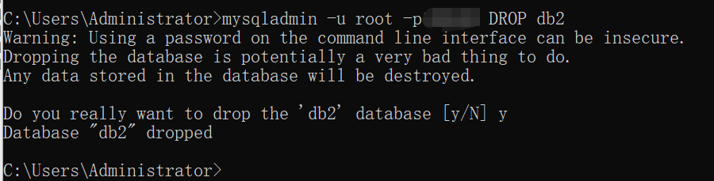
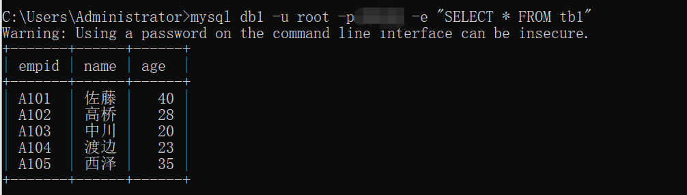
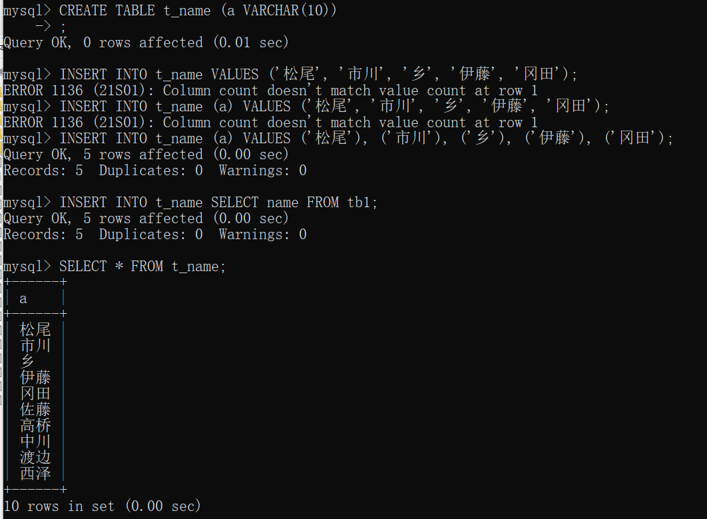

# 7.1 复制表的列结构和记录

- 3 种复制方法
  - 复制表的列机构和记录
  - 仅复制表的列结构
  - 仅复制记录

# 7.2 将表的列结构和记录整个复制过来

- 使用 SELECT 的结果复制列结构和记录，然后创建新的表
- 但是这种方法不能复制 AUTO_INCREMENT 等属性，需要在复制后再次进行设置

## 7.2.1 复制表的列机构和记录

- `CREATE TABLE 新表名 SELECT * FROM 元表名;`
- 还可以通过 WHERE 或 LIMIT 来限定需要的记录，指对需要的记录进行复制
- 这种方法可能会改变列的属性
- 还可能出现不复制元表索引的情况

# 7.3 仅复制表的列结构

## 7.3.1 仅复制表的列结构

- 在 CREATE TABLE 命令的表名后面加上 LIKE 指定复制的元素
  - `CREATE TABLE 新表名 LIKE 元表名;`
  - 
  - 该方法也会复制 AUTO_INCREMENT 和 PRIMARY KEY 等列的属性

# 7.4 复制其他表的记录

## 7.4.1 复制其他表的记录

- `INSERT INTO 表名 SELECT * FROM 元表名;`
  - 此方法复制具有相同列结构的表的记录
  - 

# 7.5 选择某一列进行复制

- 可以选择某一列记录进行复制，其他列中都输入了NULL
- `INSERT INTO tb1_bkc(name) SELECT empid FROM tb1;`
- 
- 如果数据类型不一致，复制操作可能会失败，这一点需要注意

# 7.6 删除表、数据库和记录

- 记录删除后大多无法复原，需慎重

# 7.7 删除表

- `DROP TABLE 表名;`
- 

## 7.7.1 当目标表存在时将其删除

- 在 DROP TABLE 后面加上 IF EXISTS 就表示如果表 tb1A 存在就将其删除
- `DROP TABLE IF EXISTS tb1A;`
- 一般情况下，如果要删除的对象不存在，删除命令会报错，但加上 IF EXISTS 后，不会报错，能够抑制错误发生

# 7.8 删除数据库

- `DROP DATABASE 数据库名;`

# 7.9 删除所有记录

- `DELETE FROM 表名;`
- 只删除表记录，不删除表自身
- 

[[专栏]] 不使用 MySQL 监视器操作 MySQL

- 可以直接从命令提示符或终端操作 MySQL
- 使用 mysqladmin 命令创建和删除数据库
  - 创建数据库
    - `mysqladmin -u 用户名 -p密码 CREATE 数据库名`
    - 
    - 
  - 删除数据库
    - `mysqladmin -u root -p密码 DROP db2`
    - 
- 使用 mysql 命令执行 SQL 语句
  - `mysql 数据库名 -u 用户名 -p密码 -e "命令"`
  - 

[[专栏]] 多行输入

- 如果每行都执行换行，不仅阅读起来更加方便，也更容易发现错误
- 写入文本文件时，也可以随意对其进行改写

# 7.10 [[总结]]

- 介绍内容
  - 如何通过复制其他表的列结构和记录来创建表
  - 如何通过复制其他表的列结构来创建表
  - 如何复制其他表的记录
  - 如何删除表、数据库和记录
- 自我检查
  - 略
- 练习题
  - 
