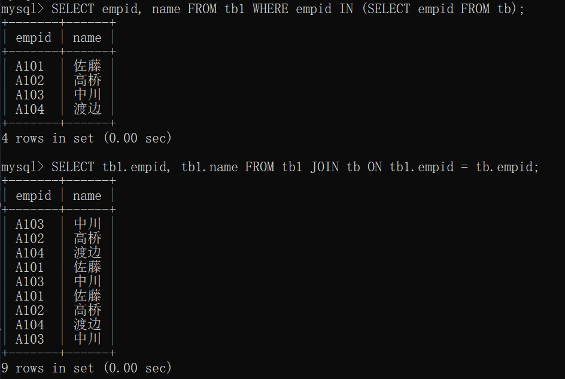

# 10.1 显示多个表的记录

## 10.1.1 确认本章示例中使用的多个表

- 已准备好

## 10.1.2 显示多条提取结果

- UNION
  - 一般来说，合并到一起显示的列，其数据类型需要一致
  - 不过，即使数据类型不同，很多时候 MySQL 也会对可以合并的记录进行合并
  - `SELECT 列名1 FROM 表名1 UNION SELECT 列名2 FROM 表名2;`
  - 
  - 为便于理解，也可以用()把各个 SELECT 括起来
  - `(SELECT 列名1 FROM 表名1) UNION (SELECT 列名2 FROM 表名2);`

## 10.1.3 使用 UNION 合并 3 个以上的表

- 略

## 10.1.4 按条件合并多条提取结果进行显示

- 当使用 UNION 合并提取多条记录时
  - 如果需要添加条件
  - 可以在各个命令的最后加上 WHERE 条件
  - 

## 10.1.5 合并显示多条提取结果（允许重复）

- UNION 默认消除了重复项
  - 如果数据量很大，消除重复项会产生一定的等待时间
  - 可以通过 UNION ALL 来省去消除重复记录的操作
  - 

# 10.2 连接多个表并显示（内连接）

## 10.2.1 使用其他表的记录进行处理

- 将多个表通过某个连接键连接在一起处理称为 “连接”
- 可以使用 JOIN 连接两个表
- `SELECT 列名 FROM 表1 JOIN 要连接的表2 ON 表1的列 = 表2的列;`
- `SELECT * FROM tb JOIN tb1 ON tb.empid = tb1.empid;`
- 
- 内连接
  - 把不同的表中相匹配的记录提取出来的连接方式称为内连接
  - 如果要明确指出某一处理是内连接，可以将 JOIN 部分分成 INNER JOIN

[[专栏]] 有“内连接”的话是不是也有“外连接”呢

- 与内连接相反，外连接是其中一个表的记录与其他表的记录在不匹配的情况下，也会提取出来

## 10.2.2 选择列进行显示

- 需要把列名写成 `表名.列名`

## 10.2.3 给表添加别命

- 略

## 10.2.4 使用 USING 使 ON ~ 的不能分更容易阅读

- 在使用相同列名进行指定的情况下，可以使用 USING (作为连接键的列名) 简单地进行记述
- `SELECT tb.empid, tb1.name, tb.sales FROM tb JOIN tb1 USING(empid);`
- 

## 10.2.5 通过 WHERE 设置条件从连接表中提取记录

- WHERE 子句在 UNION 表之后
- WHERE 子句的条件 列名一定要按照 `表名.列名` 格式写

## 10.2.6 提取多个表中的记录

- 可以使用 JOIN 连接多个表
- 但连接多个表会让处理时间变长，记述内容会变得难以理解
- `SELECT tb.empid, tb1.name, tb.sales, tb3.region FROM tb JOIN tb1 ON tb.empid = tb1.empid JOIN tb3 ON tb1.empid = tb3.empid;`
- 

# 10.3 显示多个表的所有记录（外连接）

## 10.3.1 什么是外连接

- 使用 JOIN （或者 INNER JOIN）的“内连接”只会提取与连接键相匹配的记录
- 即使与连接键不匹配，外连接也会提取另一个表中的所有记录

## 10.3.2 外连接的种类

- 左外连接（LEFT JOIN）
  - 与 Pandas 里的合并理解，左表有的数据全部保留，然后匹配右表有的数据
- 右外连接（RIGHT JOIN）
  - 与 Pandas 里的合并理解，右表有的数据全部保留，然后匹配左表有的数据

## 10.3.3 使用左外连接

- `SELECT 列名 FROM 表1 LEFT JOIN 要连接的表2 ON 表1的列 = 表2的列;`
- `SELECT tb.empid, tb1.name FROM tb LEFT JOIN tb1 ON tb.empid = tb1.empid;`
- 

## 10.3.4 使用右外连接

- `SELECT 列名 FROM 表1 RIGHT JOIN 要连接的表2 ON 表1的列 = 表2的列;`
- `SELECT tb.empid, tb1.name FROM tb RIGHT JOIN tb1 USING(empid);`
- 

## 10.3.5 避免混合使用左外连接和右外连接

- 可以通过调换连接的表来实现左外连接和右外连接的转换
- 混合使用左、右外连接会导致日后发生错误
- 作为数据库设计的一种技巧，不要混合使用左外连接和右外连接

[[专栏]] 加上 OUTER 后的书写方法

- LEFT JOIN 也可以写作 LEFT OUTER JOIN，其他同理

# 10.4 自连接

## 10.4.1 什么是自连接

- 将表与自身也就是和同名的表进行连接
- 连接时必须对定义表的别名
- `SELECT 列名 FROM 表名 AS 别名1 JOIN 表名 AS 别名2;`
- `SELECT * FROM tb1 AS a JOIN tb1 AS b;`
- 
- 尽量减少这样的连接，造成大量数据冗余

## 10.4.2 排序的技巧 其一

- `SELECT a.name, a.age, COUNT(*) FROM tb1 AS a JOIN tb1 AS b WHERE a.age <= b.age GROUP BY a.empid;`
- 

# 10.5 从 SELECT 的记录中 SELECT （子查询）

## 10.5.1 什么是子查询

- 使用子查询可以执行两个阶段的处理：执行查询，然后使用检索到的记录进一步执行查询
- 许多使用子查询的处理可以用其他方法取代，列入内连接
- 但是子查询的处理方式更容易理解，处理也更高效

## 10.5.2 显示最大值（返回值的子查询 其一）

- `SELECT * FROM tb WHERE sales IN (SELECT MAX(sales) FROM tb);`
- 

[[专栏]] GROUP BY 函数

- MAX、AVG、SUM 等聚合函数也称为 GROUP BY 函数
- 这类函数用于处理分组后的值
- 在没有 GROUP BY 的情况下，会将整个表作为一个组进行处理

## 10.5.3 提取大于等于平均值的记录（返回值的子查询 其二）

- `SELECT * FROM tb1 WHERE age >= (SELECT AVG(age) FROM tb1);`
- 

## 10.5.4 使用 IN（返回值的子查询）

- `SELECT 显示的列 FROM 表名 WHERE 列名 IN (通过子查询 SELECT 语句提取到的列)`
- `SELECT tb1.name FROM tb1 WHERE tb1.empid IN (SELECT tb.empid FROM tb WHERE tb.sales >= 200);`
- 

[[专栏]] 子查询和内连接的提取结果的差异（虽然相似但不同）

- `SELECT empid, name FROM tb1 WHERE empid IN (SELECT empid FROM tb);`
- `SELECT tb1.empid, tb1.name FROM tb1 JOIN tb ON tb1.empid = tb.empid;`
- 

## 10.5.5 使用 “=” 代替 IN 会报错吗

- 如果子查询只返回一个结果，那么可以使用 =
- 如果返回多个结果，会报错

## 10.5.6 使用 EXISTS，仅已存在的记录为对象

- 从表 tb 中提取有销售额的员工的记录，然后从表 tb1 中提取相对应的记录显示出来
  - `SELECT * FROM tb1`
  - `SELECT * FROM tb1 WHERE tb.empid = tb1.empid`
  - `SELECT * FROM tb1 WHERE EXISTS (SELECT * FROM tb WHERE tb.empid = tb1.empid);`
  - 
  - A105 在表 tb 中不存在相应的 empid，所以不显示出来

## 10.5.7 NOT EXISTS

- NOT EXISTS
  - 以子查询不存在的记录为对象进行处理
  - `SELECT * FROM tb1 WHERE NOT EXISTS (SELECT * FROM tb WHERE tb.empid = tb1.empid);`
  - 
  - 西泽不存在销售额，因此在子查询中并不会存在，而 NOT EXISTS 对于存在的子查询，不会进行处理

## 10.5.8 排序的技巧其二

- 对于 EXCEL 来说，排序很简单
- 但在 RDBMS 中，排序是一个很麻烦的处理
- 思路如下：
  - 向具有自动连续编号的功能的表中插入按照 sales 由高到低的顺序排列的记录
  - 自动输入的连续编号就是排名
  - 创建和表 tb 结构相同的表 tb_rank
  - 向表 tb_rank 中添加具有自动连续编号功能的列 c_rank
  - 对表 tb 执行按列 sales 由高到低排序的 SELECT 子查询
  - 将子查询的结果 INSERT 到表 tb_rank 中
- 
- 

# 10.6 总结

- 介绍内容
  - 合并显示多个表的方法
  - 通过内连接显示多个表的方法
  - 内连接和外连接的区别
  - 自连接的方法和排序的方法
  - 通过子查询实现两个阶段的提取
- 自我检查
  - 略
- 练习题
  - 在表 tb 中，按照 sales 由低到高的顺序排名，并从第一名开始显示员工号、销售额和排名
    - 略（答案由自连接实现）
  - 只从表 tb 中提取表 tb1 中存在的记录
    - `SELECT * FROM tb WHERE EXISTS (SELECT * FROM tb1 WHERE tb.empid = tb1.empid);`
    - 
