# 11.1 什么是视图

## 11.1.1 视图的真面目

- 将 SELECT 的结果像表一样保留下来的虚表就是视图
- 视图不是表，因此视图中并没有保存记录或者列中的数据
- 视图是一种信息，用于查询记录，比如在 XX 条件下收集 XX 表的 XX 列和 XX

## 11.1.2 视图的用途

- 视图虽然看起来像表，但它没有实体，只是一种信息
- 视图的便利之处在于，用户可以按照想要的条件收集某表中某列的数据
- 相同的提取操作以视图的方式执行，就可以将视图作为符合用户个人喜好的表来使用
- 视图也可以进行 SELECT 和 UPDATE
  - 如果更新视图的记录，基表的记录也会更新
  - 对于一些不能被修改的重要数据，可以只让管理员等具有特殊权限的人来操作相关的表
  - 同时再准备一个收集了无关紧要部分的视图

[[专栏]] 视图和 MySQL 的版本

- 视图只能在 MySQL 5 或更高的版本中使用

# 11.2 使用视图

## 11.2.1 创建视图

- `CREATE VIEW 视图名 AS SELECT 列名 FROM 表名 WHERE 条件;`
- 表示对 SELECT 的记录 创建视图
- `CREATE VIEW v1 AS SELECT name, age FROM tb1J;`
- 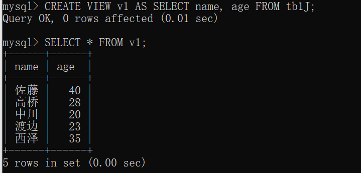

## 11.2.2 通过视图更新列的值

- 视图不仅是基表的一部分，它也是指向基表数据的窗口
- 如果更新视图的值，基表的值也会随之更新
- 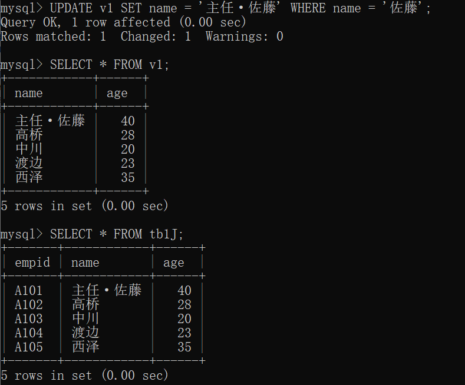

# 11.3 设置条件创建视图

## 11.3.1 设置条件创建视图

- `CREATE VIEW v2 AS SELECT tb.empid, tb1J.name, tb.sales FROM tb JOIN tb1J USING(empid) WHERE tb.sales >= 100;`
- 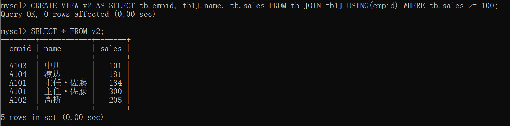

## 11.3.2 当更新基表时，视图会发生什么变化

- `UPDATE tb SET sales=777 WHERE sales=54;`
- 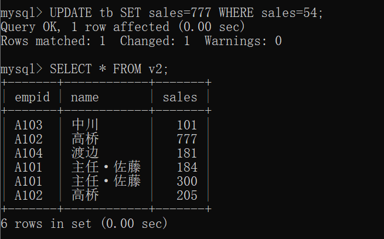
- 更新基表时，原先不满足视图条件的记录变为满足视图筛选条件，记录出现在了视图中

## 11.3.3 确认视图

- 确认视图
  - `SHOW TABLES;`
  - 视图会和表交织在一起显示出来
- 显示视图的列结构
  - `DESC 视图名`
  - 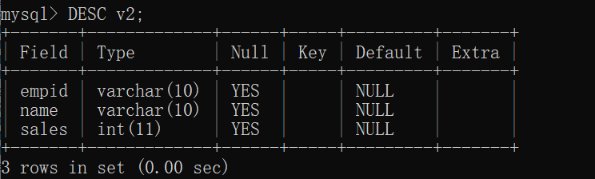
- 显示视图的详细信息
  - `SHOW CREATE VIEW 视图名;`
  - 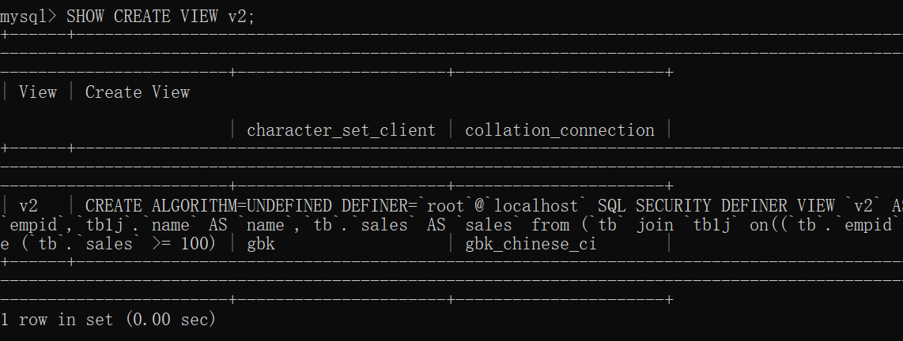

# 11.4 限制通过视图写入

## 11.4.1 对视图执行 INSERT 操作会出现什么样的结果

- 对视图执行 INSERT 操作是有限制的.
  - 在使用了 UNION、JOIN、子查询的视图中，不能执行 INSERT 和 UPDATE
  - 如果只是从一个表中提取了列，那么执行 INSERT 和 UPDATE 是没有任何问题的
- `INSERT INTO v1 VALUES ('临时工·石田', 18);`
  - 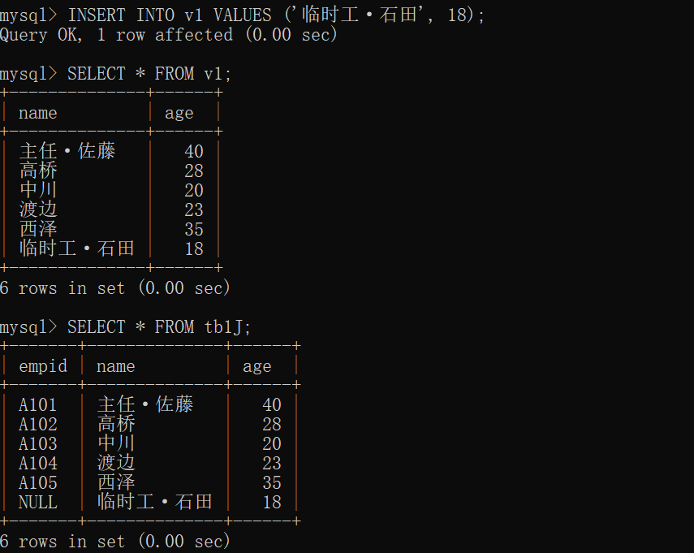
  - 对于表 tb1J 来说，视图中新增的两个数据都添加了，对于的 empid 未添加数据，因此为 NULL

## 11.4.2 设置了条件的基表中会发生什么变化

- 如果在设置了条件的视图中插入违反条件的数据，基表会发生什么变化？
- 创建视图 v3，以 sales >= 100 为条件，创建仅包括表 tb 的列 empid 和列 sales 的视图
  - `CREATE VIEW v3 AS SELECT empid, sales FROM tb WHERE sales >= 100;`
- 插入不符合视图条件的记录
  - `INSERT INTO v3 VALUES ('恶意刁难', 50);`
  - 显示 Query OK 输入成功
  - 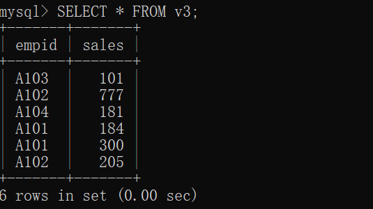
  - 视图中看不到插入的值
- 查看基表
  - 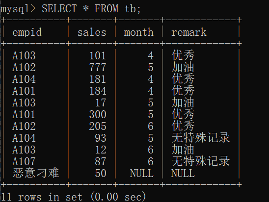
  - 基表中插入了这个值
  - 默认情况下，WHERE 条件会被忽略，数据会 INSERT 到基表中
  - 没有插入数据的列中会输入 NULL

## 11.4.3 当与视图的条件不匹配时报错

- 当通过视图 INSERT 记录时，即使与 WHERE 的条件不匹配，数据也会直接输入到基表中
- 对于有条件限制的视图，无视条件输入记录有时会带来一定的麻烦
- 可以将视图设置成 “不接受与条件不匹配的记录”
  - 为了防止输入与 WHERE 条件不匹配的记录，我们可以在使用 CREATE VIEW 创建视图时，加上 WITH CHECK OPTION
  - `CREATE VIEW v4 AS SELECT empid, sales FROM tb WHERE sales >= 100 WITH CHECK OPTION;`
  - `INSERT INTO v4 VALUES ('恶意刁难', 50);` 将报错
  - 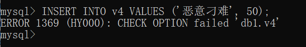

# 11.5 替换、修改和删除视图

## 11.5.1 替换视图

- 当存在同名的视图时，如何对其进行替换呢？
  - 当执行 CREATE VIEW 时，如果已经有同名的视图存在，该命令会报错
  - 可以使用 `CREATE OR REPLACE VIEW ...` 替换视图
  - 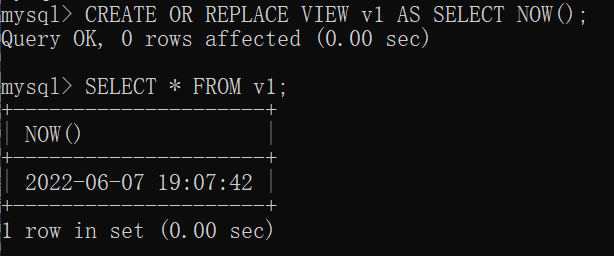

## 11.5.2 修改视图结构

- `ALTER VIEW 视图名 AS SELECT 列名 FROM 表名;`
- 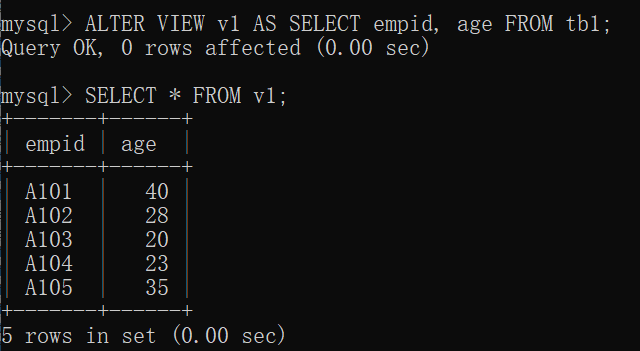

## 11.5.3 删除视图

- `DROP VIEW 视图名;`
- 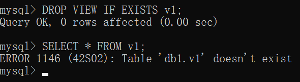

[[专栏]] 什么是复制

- 复制（replication）这项技术作为提高数据库处理效率和进行备份的手段，在实际工作中不可或缺
- 什么是复制？
  - replica 是指复制品，亦即制作副本
  - 数据库中的复制是指创建原始数据库的副本，通过灵活使用原始数据库和数据库副本来有效进行处理的技术
- 原始数据库称为主库（master），通过复制创建的副本称为从库（slave）
- 作为备份使用
  - 从库的内容基本上和主库一样，所以可以作为备份使用
  - 主库发生故障的情况下，如果切换到从库执行所有的处理，能够在短时间内重新启动系统
- MySQL 复制的特征
  - 通过复制来创建数据库的副本，可以提高处理效率，因为可以进行分布式工作
  - 分布式处理是在主库进行 UPDATE 和 INSERT 等写入处理
  - 在从库进行 SELECT 等读取处理
  - 要想构建复制的架构，主库和从库的数据必须相同
  - MySQL 基本是通过把主库的二进制日志发送到从库来使主库和从库的内容相同的
  - 所谓二进制日志，简单来说就是通过处理的记录来描述 “更新 XX 的表为 XX” 这样的内容
  - 以这个记录为基础，如果从库能够如实地重现该处理，就可以使主库和从库的内容相同
  - 复制分同步和异步模式两种类型
    - 同步模式中
      - 主库和从库保持着联系，采取“停止工作（等待）直到彼此的内容完全相同”的策略
      - 所以主库和从库的数据总是相同的，但是整体处理也会延迟很多
    - 异步模式中
      - 主库和从库不会保持这样的联系，所以主库和从库的内容也不一定相同
      - MySQL 采用的是异步模式，二进制日志会单方面从主库发送到从库
- 半同步复制
  - 半同步复制的情况下，二进制日志传送给从库后，从库会向主库发送响应消息
  - 为了向主库发送响应信息，在主库发送信息到从库之前主库和从库需要同步
  - 但是从库中数据的写入操作是异步的，因此称为半同步
  - 半同步复制与异步复制相比，数据可靠性更强，但整体处理时间变长了
- 无损半同步复制
  - 版本 5.7 开始
  - MySQL 使用的无损半同步复制则是发送二进制日志，收到从库的响应后在主库上完成数据的写入
  - 主库在收到从库的响应后才写入数据，这就保证了主库中写入的内容一定发送给了从库

# 11.6 总结

- 介绍内容
  - 视图与表不同，它没有实体
  - 视图的优点
  - 创建视图的方法
  - 如何对设置了条件的视图进行更新，以及该操作对基表的影响
- 自我检查
  - 略
- 练习题
  - 以 tb 表为基础创建视图 v_sales。以列 sales 大于等于 50 的记录为对象，按照 empid 分组，并降序显示各组 sales 平均值大于等于 120 的记录
  - 
