# 12.1 什么是存储过程

## 12.1.1 可用的版本

- MySQL 版本需要高于 5.0

## 12.1.2 什么是存储过程

- 将多个 SQL 语句组合成一个只需要使用命令 `CALL XX` 就能执行的集合，该集合就称为存储过程（stored procedure）
- 存储（stored）表示保存
- 过程（procedure）表示步骤
- 也就是说，存储过程是将一系列步骤归纳并存储起来的集合
&nbsp;

- 可以自动执行很多事先准备好的命令，所以效率很高
- 但是存储了重要数据的数据库中，执行没有经过充分验证的存储过程是非常危险的

# 12.2 使用存储过程

## 12.2.1 创建存储过程

```mysql
CREATE PROCEDURE 存储过程名()
BEGIN
    SQL 语句1
    SQL 语句2 ...
END
```

- 从 BEGIN 到 END 为止的内容是存储过程的主体
- 因为存储过程的内容是“普通 SQL 语句”，所以需要在命令的末尾添加分隔符
  - 但是这种情况会造成 存储过程执行不完整
  - 因为 MySQL 监视器中一旦输入了分隔符内容如，不管是什么内容，都会执行分隔符之前的部分
&nbsp;

- 修改分隔符的设置
  - 在创建存储过程中，需要将分隔符从 “ ; ” 修改为其他符号，一般用 “ // ”
  - 可以使用 delimiter 命令将分隔符修改为 “ // ”
- 如果将分隔符设置为 “ // ”，那么即使在创建存储过程中输入了 “ ; ” 也不会发生任何问题
- 在 END 之后输入 “ // ”，这时就会执行 CREATE PROCEDURE 命令
- 存储过程创建结束后，使用 `delimiter ;` 将分隔符恢复为原始设置
- 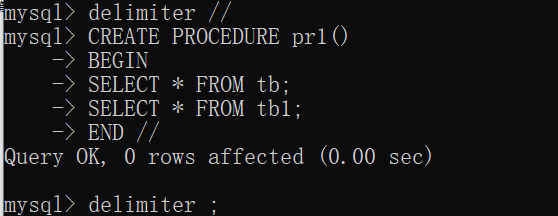
  - 最后的 `delimiter ;` 将分隔符恢复为原始设置，不可忘记
  - 创建存储过程名后加上 ()，之后会介绍将值作为参数放在存储过程中

## 12.2.2 执行存储过程

- `CALL 存储过程名`
- 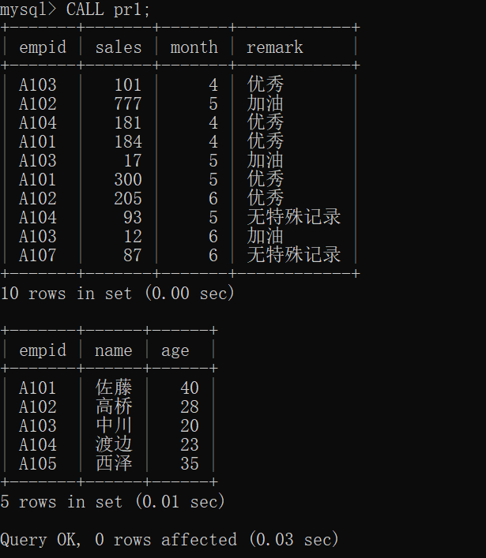

## 12.2.3 创建只显示大于等于指定值的记录的存储过程

- 将需要处理的数据指定为 () 中的参数，并执行存储过程
- 存储过程中参数的编写
  - `CREATE PROCEDURE 存储过程名(参数名 数据类型);`
- 显示表 tb 中 sales 大于等于参数 d 的记录
  - 存储过程 `CREATE PROCEDURE pr(d INT)`
  - SQL 语句 `SELECT * FROM tb WHERE sales >= d;`
&nbsp;

- 示例

```mysql
delimiter //
CREATE PROCEDURE pr2(d INT)
BEGIN
SELECT * FROM tb WHERE sales >= d;
END //
delimiter ;
```

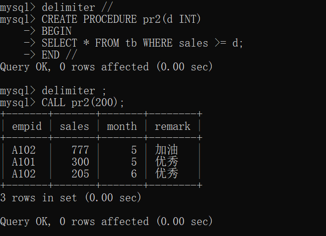

[[专栏]] 在参数中加上 IN 的例子

- 按照上述操作方法使用参数，在参数面前加上 IN 结果相同
- 如果想将处理的结果传给参数，则需加上 OUT （具体用法不明）

# 12.3 显示、删除存储过程

## 12.3.1 显示存储过程的内容

- `SHOW CREATE PROCEDURE 存储过程名`
- 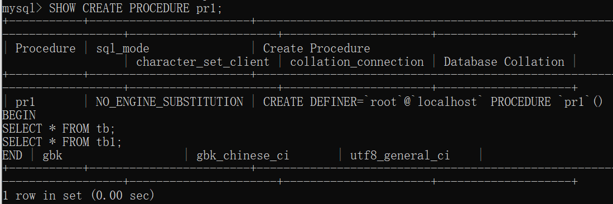

## 12.3.2 删除存储过程

- `DROP PROCEDURE 存储过程名`
- 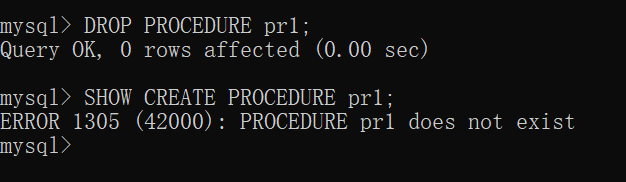

# 12.4 什么是存储函数

## 12.4.1 可用版本

## 12.4.2 什么是存储函数

- 存储函数的思考方式和操作方法与存储过程基本相同
- 唯一不同的点在于存储函数在执行后会返回一个值
- 存储函数可以作为函数使用
- 使用存储函数可以创建自定义函数
- 存储函数返回的值可以在 SELECT 和 UPDATE 等命令中和普通函数一样使用

```mysql
CREATE FUNCTION 存储函数名(参数 数据类型) RETURNS 返回值的数据类型
BEGIN
    SQL 语句
    RETURN 返回值·表达式
END
```

- 可以在 () 内指定参数

# 12.5 使用存储函数

## 12.5.1 使用存储函数之前

- 存储函数有可能对复制和数据的恢复产生影响
- 因此，参数 log_bin_trust_function_creators 的初始值被设置为 0 ，这样就不能使用存储函数了
- 故需要进行如下操作
  - 启动 MySQL 监视器，执行命令 `SET GLOBAL log_bin_trust_function_creators=1;`
  - 确认设置已正确修改  `SHOW VARIABLES LIKE 'log_bin_trust_function_creators'`
    - 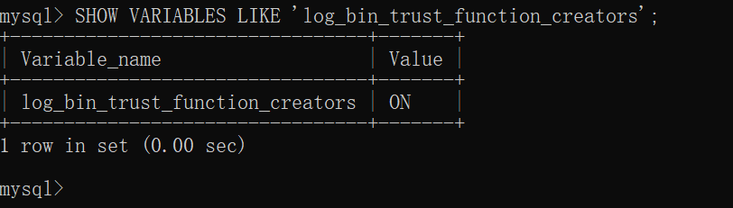
- 如果重新启动 MySQL，此参数的值会变为 OFF
  - 可以重新进行设置
  - 也可以在 MySQL 的配置文件中或者启动 MySQL 时指定相应的内容，让此参数的值，始终为 ON

## 12.5.2 使用存储函数计算标准体重

- 标准体重 = 身高（cm） \* 身高（cm）* 22 / 10000

```mysql
delimiter //
CREATE FUNCTION fu1(height INT) RETURNS DOUBLE
BEGIN
RETURN height * height * 22 / 10000;
END //
delimiter ;
```

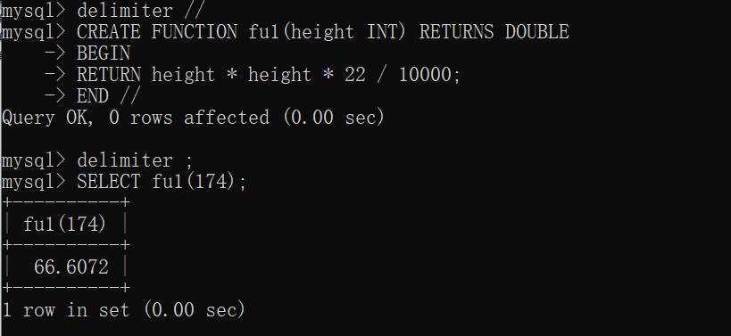

## 12.5.3 返回记录平均值的存储函数

```mysql
CREATE FUNCTION fu2() RETURNS DOUBLE    -- 定义存储函数 fu2 的返回值是 DOUBLE 类型
BEGIN
DECLARE r DOUBLE;                       -- 通过 DECLARE 定义变量
SELECT AVG(sales) INTO r FROM tb;
RETURN r;
END
```

- 定义变量 `DECLARE 变量名 数据类型;`

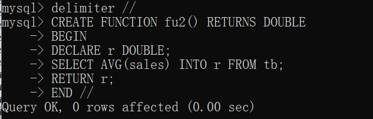
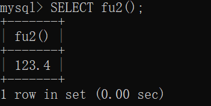

## 12.5.4 显示和删除存储函数

- 方法与存储过程的相同
- 删除存储函数 `DROP FUNCTION 存储函数名;`
- 显示存储函数的内容 `SHOW CREATE FUNCTION 存储函数名;`
  - 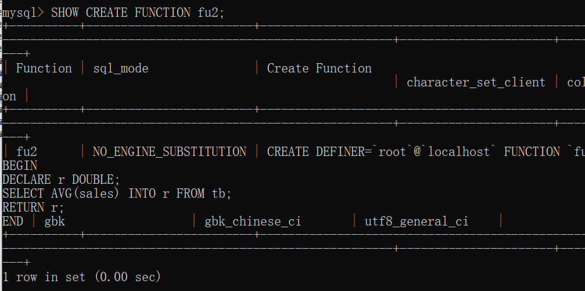

# 12.6 什么是触发器

## 12.6.1 什么是触发器

- 触发器是一种对表执行某操作后会触发执行其他命令的机制
- 如：创建一个触发器，当某表的记录发生更新时，就以此为契机将更新的内容记录到另一个表中
- 准备表 tb_from `CREATE TABLE tb_from LIKE tb1;`

# 12.7 创建触发器

## 12.7.1 触发器被触发的时机

- BEFORE 对表进行处理之前触发
- AFTER 对表进行处理之后触发
&nbsp;

- 对表进行处理之前的列值和对表进行处理之后的列值，可以通过 OLD.列名 NEW.列名 获取
  - OLD.列名 对表进行处理之前的列值
  - NEW.列名 对表进行处理之后的列值
- 根据命令的不同，有的列值可以取出来，有的列值不能取出来

|命令|执行前（OLD.列名）~ 使用 BEFORE|执行后（NEW.列名）~ 使用 AFTER|
|----|----|----|
|INSERT|X|O|
|DELETE|O|X|
|UPDATE|O|O|

## 12.7.2 创建触发器

```mysql
CREATE TRIGGER 触发器名 BEFORE(或者 AFTER) DELETE 等命令
ON 表名 FOR EACH ROW
BEGIN
    使用更新前(OLD.列名) 或者更新后（NEW.列名）的处理
END
```

- 在触发器追的描述中，各个命令的末尾需要加上 “ ; ”
- 创建将表 tb1 中删除的记录插入到表 tb1_form 中的触发器

```mysql
delimiter //
CREATE TRIGGER tr1 BEFORE DELETE ON tb1 FOR EACH ROW
BEGIN
    INSERT INTO tb1_from VALUES(OLD.empid, OLD.name, OLD.age);
END //
```

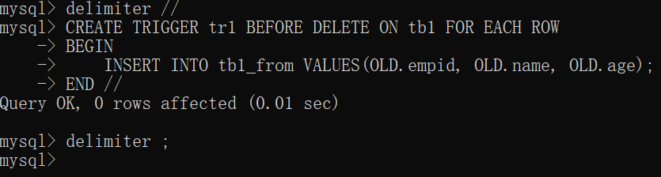

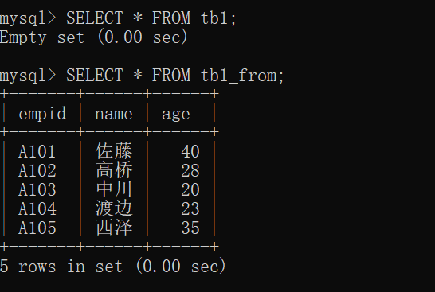

- 删除触发器 `DROP TRIGGER 触发器名;`

## 12.7.3 触发器的内容

- 略

# 12.8 确认和删除触发器

## 12.8.1 确认设置的触发器

- 触发器是自动启动的，为了避免无意间执行相关处理，需要在管理上多加注意
- `SHOW TRIGGERS;` 确认当前设置的触发器
- 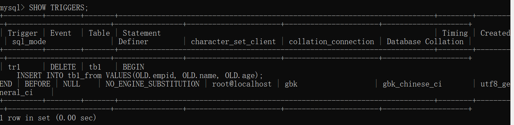

## 12.8.2 删除触发器

- `DROP TRIGGER 触发器名;`
- 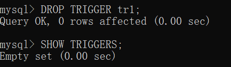

# 12.9 [[总结]]

- 介绍内容
  - 存储过程的含义和创建方法
  - 存储函数的含义和创建方法
  - 存储过程和存储函数中参数的处理方法
  - 触发器的含义和创建方法
  - 触发器能够提取到的数据种类和触发时机
- 自我检查
  - 略
- 练习题
  - 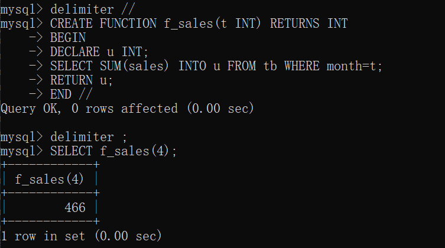
