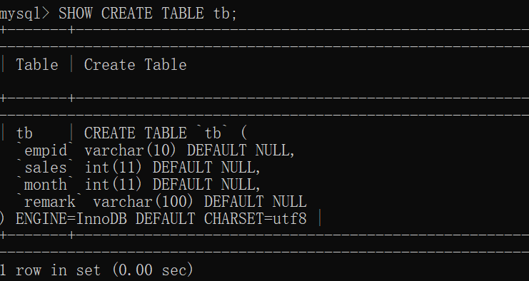
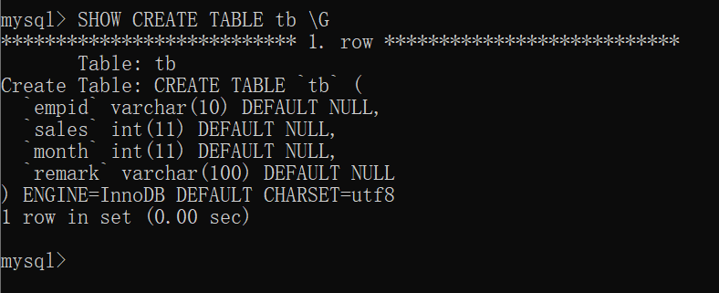
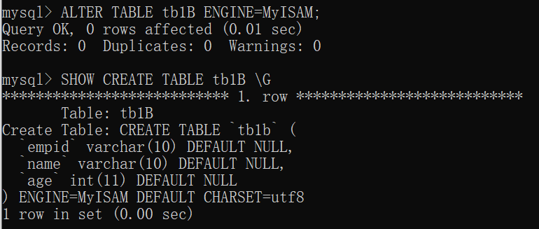
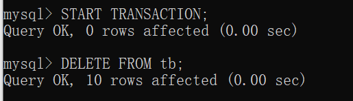
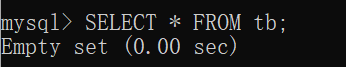
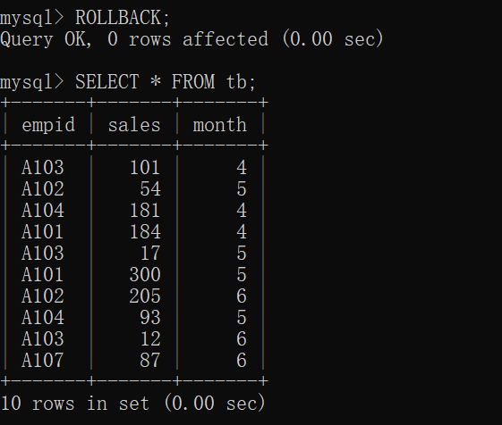
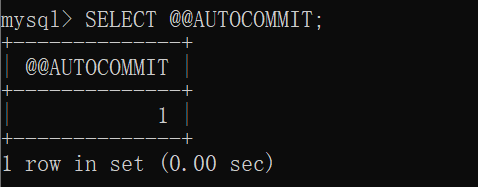
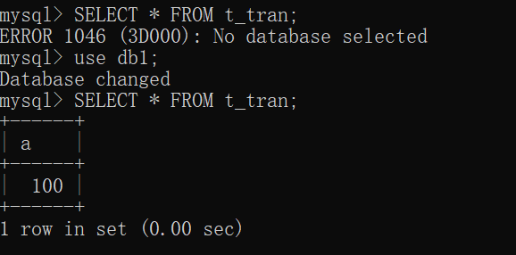

# 13.1 什么是存储引擎

## 13.1.1 什么是存储引擎

- MySQL 的功能大致分为两种
  - 连接客户端和提前检查 SQL 语句内容的功能，即数据库处理的“前台”部分
  - 根据前台部分的指示，完成查询和文件操作等工作的功能，即“后台”部分
  - 这个后台部分称为 存储引擎

## 13.1.2 存储引擎的种类

- MySQL 中预置了多个存储引擎，用户可以根据使用目的和个人喜好进行选择
- 每个表都可以单独指定存储引擎

|存储引擎|特征|
|----|:----|
|MyISAM|以前版本中的默认存储引擎，虽然能够高速运行，但不支持事务和外键|
|InnoDB|MySQL 5.5 或更高版本的默认存储引擎。是唯一一个支持事务的存储引擎|
|BLACKHOLE|写入的任何数据都会消失，查询始终返回空结果，主要用于复制|
|MERGE|将多个MyISAM 表作为一个表处理。也称为 MER_MyISAM|
|CSV|将数据的实体保存为 CSV (逗号分隔)的文本文件。该文件可以直接通过 Excel 等打开|
|MEMORY|因为数据全部存储在了内存中，所以处理速度非常快。主要作为从临时工作区和其他表中提取的数据的读取专用缓存使用。不支持事务|
|ARCHIVE|虽然可以通过压缩来存储大量数据，但是仅支持 INSERT 和 SELECT|

# 13.2 设置存储引擎

## 13.2.1 确认存储引擎

- `SHOW CREATE TABLE 表名;` 显示表的详细信息，确认表使用的引擎
- 

[[专栏]] 使用 ‘\G’ 替代 ‘;’

- 像 “ SHOW CREATE TABLE tb ” 这样的命令，1行中会显示很多数据
- 命令末尾使用 \G 替代 ;
- 结果会更易阅读
- 

## 13.2.2 修改存储引擎

- `ALTER TABLE 表名 ENGINE=MyISAM;`
  - 将表的存储引擎修改为 MyISAM
  - 

# 13.3 什么是事务

- 将多个操作作为单个逻辑工作单元处理的功能称为事务（transaction）
- 将事务开始之后的处理结果反映到数据库中的操作称为提交（commit）
- 不反映到数据库中而是恢复为原来状态的操作称为回滚（rollback）
- 在数据库中，除非开启了事务处理，否则数据修改之后是无法恢复原状的

# 13.4 使用事务

## 13.4.1 执行前的注意事项

- DROP 等命令是不能执行回滚操作的
- 存储引擎 MyISAM 无法使用事务功能

## 13.4.2 开启事务

- 开启事务 `START TRANSACTION;`
- 删除表 tb `DELETE FROM tb;`
  - 此时表的一部分功能会加锁（lock）其他会话中不能对该表执行 INSERT 等操作
  - 只有在开启了事务的 MySQL 监视器中执行了 `COMMIT;` 或 `ROLLBACK;` 才能进行其他的会话处理
- 

## 13.4.3 确认表的内容

- `SELECT * FROM tb;`
  - 
- 回滚（还原） `ROLLBACK;`
  - 

# 13.5 自动提交功能

- 在 MySQL 中执行命令，处理通常会直接提交
  - 也就是说所有命令都会自动 COMMIT
  - 这种自动进行提交的功能，称为 自动提交功能（auto commit）
- 默认状态下，自动提交功能处于开启状态
  - 当存储引擎为 InnoDB 时，如果执行了 START TRANSACTION (或 BEGIN)
  - 用户也可以强制将自动提交功能设置为关闭

## 13.5.1 关闭自动提交功能

- `SET AUTOCOMMIT=0;`
- 要想提交实际修改的数据，必须执行 `COMMIT;`
- 在自动提交功能关闭的状态下，如果没有进行 COMMIT 就退出 MySQL，工作内容就不会反映到数据库中

## 13.5.2 启动已关闭的自动提交功能

- `SET AUTOCOMMIT=1;`

[[专栏]] 如果确认当前自动提交功能的模式？

- `SELECT @@AUTOCOMMIT;`
  - 1 开启
  - 0 关闭
  - 

## 13.5.3 事务的使用范围

- 以下操作不可用复原
  - DROP DATABASE
  - DROP TABLE
  - DROP VIEW
  - ALTER TABLE

# 13.6 [[总结]]

- 介绍内容
  - 什么是存储引擎，都有哪些存储引擎
  - 什么是事务
  - 开启事务的方法
  - 提交和回滚的方法
  - 什么是自动提交功能
- 自我检查
  - 略
- 练习题
  - 
  - 未提交直接退出，更新未执行，修改的内容作废
  - 也就是在未提交的状态下关闭连接，事务将自动回滚
