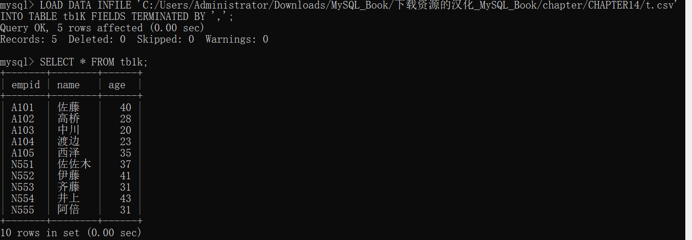
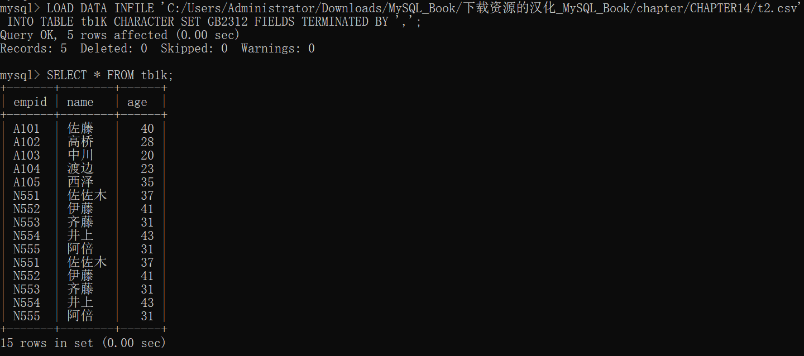
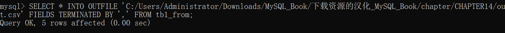
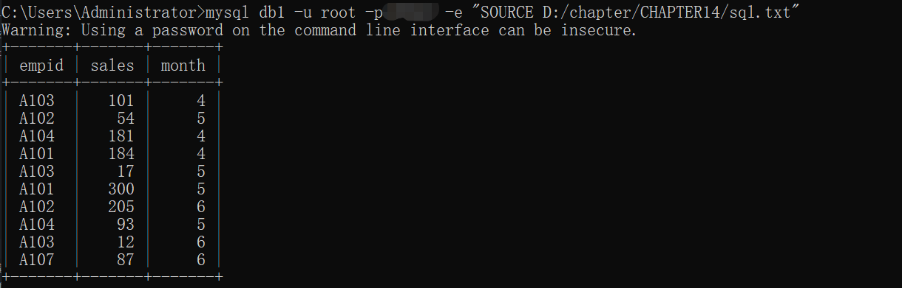
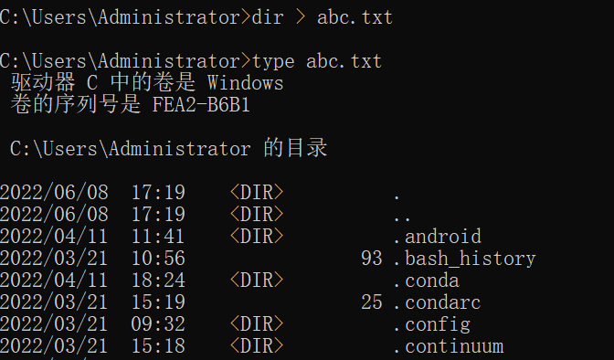
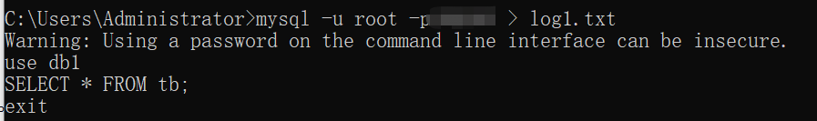
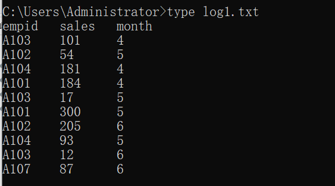
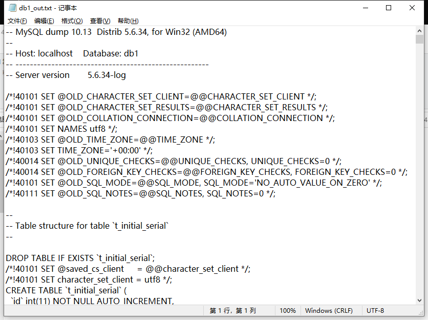

# 14.1 从文本文件中读取数据（导入）

- 在需要输入成千上万条数据的情况下，可以使用 CSV 格式的文本文件进行输入
- 这种读取文件的方式称为导入

## 14.1.1 CSV 文件

- 数据用逗号隔开
- 每条记录都通过换行符用单独的一行表示

## 14.1.2 导入和导出的准备

- 如果没有根据 MySQL 的版本更新配置文件，就无法导入或导出文件
- 如果在没有拥有相应权限的情况下对服务器上的文件进行读取和写入
- 按要修修改 my.ini
- 重启 MySQL 监视器后，执行命令 `SELECT @@global.secure_file_priv;`
  - 列上无内容，说明设置成功

## 14.1.3 导入文件

- `LOAD DATA INFILE '文件名' INTO TABLE 表名 选项的描述;`
- 数据格式的选项
  - `FIELDS TERMINATED BY 分隔符（默认是 '\t': Tab）`
  - `LINES TERMINATED BY 换行符（默认是 '\n': 换行）`
  - `IGNORE 最开始跳过的行 LINES （默认是 0）`
&nbsp;

- 使用 LOAD DATA INFILE 插入的文本的字符编码
  - 单纯使用 LOAD DATA INFILE 命令输入数据的情况下，一般会使用数据库的字符编码
- 导入文件 t.csv
  - `LOAD DATA INFILE 'C:/Users/Administrator/Downloads/MySQL_Book/下载资源的汉化_MySQL_Book/chapter/CHAPTER14/t.csv' INTO TABLE tb1K FIELDS TERMINATED BY ',';`
  - 

[[专栏]] 导入 GB 2312 的文本文件

- 如果要导入简体中文 GB 2312 的 CSV 文件，就需要在 LOAD DATA INFILE 的选项中加上 CHARACTER SET GB2312 来执行
- `LOAD DATA INFILE 'C:/Users/Administrator/Downloads/MySQL_Book/下载资源的汉化_MySQL_Book/chapter/CHAPTER14/t2.csv' INTO TABLE tb1K CHARACTER SET GB2312 FIELDS TERMINATED BY ',';`
- 

## 14.1.4 将数据写入文本文件（导出）

- `SELECT * INTO OUTFILE '文件名' 选项的描述 FROM 表名;`

## 14.1.5 导出文件

- `SELECT * INTO OUTFILE 'C:/Users/Administrator/Downloads/MySQL_Book/下载资源的汉化_MySQL_Book/chapter/CHAPTER14/out.csv' FIELDS TERMINATED BY ',' FROM tb1_from;`
- 
- 

# 14.2 从文件中读取并执行 SQL 命令

## 14.2.1 通过 MySQL 监视器执行编写在文件中的 SQL 语句

- 当执行复杂且冗长的 SQL 语句时，如果每次都在 MySQL 监视器上编写就会很麻烦
- 在执行复杂的 SQL 语句情况下，我们可以将其创建为文本文件，然后执行保存的文件
- 还可以显示创建成文本文件的 SQL 语句，并将其复制、粘贴到 MySQL 监视器上执行
- 在记事本等文本编辑器中事先准备好 SQL 语句，然后在 MySQL 监视器上执行 SOURCE 命令
  - `SOURCE 文本文件名`
- 如果执行的 SQL 语句中包含中文，就需要注意作为参数的文本文件的字符编码了
- `SOURCE D:/chapter/CHAPTER14/sql.txt`
  - 此处文本文件名无需被 引号包裹
  - SOURCE 不是 SQL 命令，不需要在行后添加分隔符 ;

[[专栏]] 将常用表的内容保存到文件中

- 使用 MySQL 监视器创建“需要多次创建的表” 或者 “复杂的表” 效率会很低
- 这种情况下，在文本中编写处理步骤，然后执行 SOURCE  命令来创建表

## 14.2.2 通过命令提示符执行编写在文件中的 SQL 命令

- 通过命令提示符执行 SQL 语句
  - `mysql 数据库名 -u 用户名 -p密码 -e "MySQL 监视器命令"`
    - 此处只能用双引号括起来
    - 如果文本中有指定数据库名，可以不写数据库名
  - 

[[专栏]] 在批处理文件中记录 SQL 命令

- 如果将可以通过命令提示符执行的命令汇总为文本文件，编写在一个扩展名为 “ .bat ” 的批处理文件中，使用起来就会非常方便
- 如果提前设置好 MySQL 的路径，就可以从任何地方对 MySQL 进行操作
- out_file.bat 的内容 必须用一行描述
- `mysql db1 -u root -proot -e "SELECT * INTO OUTFILE 'D:/chapter/CHAPTER14/out2.csv' FIELDS TERMINATED BY ',' FROM tb"`

# 14.3 将 SQL 的执行结果保存到文件中

- 在 MySQL 监视器上执行 tee 命令
- 使用重定向将结果输出到标准输出

## 14.3.1 通过重定向将 SQL 语句的执行结果输出到文本文件中

- 标准输入 和 标准输出 可以更改
  - 这个更改操作称为 重定向
  - 当进行重定向操作，需要使用 > 等符号
&nbsp;

- 通过命令提示符进行重定向
  - dir 显示文件和文件夹的信息
  - `$ dir > abc.txt` dir 的执行结果会写入文件 abc.txt 中
  - 
&nbsp;

- 通过 mysql 命令使用重定向
  - 启动 MySQL 监视器时，加上  > log.txt
  - `mysql -u root -proot > log.txt`
  - 
  - 

[[专栏]] 使用重定向输入 SQL 语句，并通过重定向将结果输出到文件

- 使用重定向输入文件时需要使用 \< 这样就可以使用重定向输入并执行文本文件的 SQL 语句
- 然后再通过重定向将结果输出到文本文件
- 这种方法下，就算 SQL 语句错误，我们也只能通过查看输出的文本文件得知
- `mysql -u root -proot < D:/chapter/CHAPTER14/sql.txt > D:/chapter/CHAPTER14/log3.txt`

## 14.3.2 使用 tee 命令将 SQL 语句的执行结果保存到文件中

- `tee 输出文件的名称`
  - 当在 MySQL 监视器中执行操作 `tee D:/chapter/CHAPTER14/log4.txt`
  - 会创建出一个空的文本文件 log4.txt
  - 以后输出结果不仅会显示在屏幕上，还会写入 log4.txt
- `notee`
  - 停止向文件中输出执行结果

# 14.4 备份和恢复数据库

## 14.4.1 备份和恢复的方法

- 可以将数据库的设置、表和列的定义、数据等数据库的所有信息作为文件导出
- 转储
  - 对数据库的所有内容执行导出的操作称为 转储（dump）
  - 如果使用转储文件，就可以在其他服务器上创建内容相同的数据库，也可以备份以应对紧急情况的发生
  - mysqldump 命令会将数据库的配置和数据本身作为 SQL 语句写出来
    - 也就是通过 CREATE TABLE ... 创建表，然后写出 INSERT INTO ...
  - 转储输出就是数据库本身
- 恢复
  - 把通过 mysqldump 命令导出的数据还原到数据库中的操作称为 恢复（restore）
  - 恢复意味着从头创建数据库，其实就是将包含 SQL 语句集合的文本文件 用 MySQL 命令进行重定向

## 14.4.2 使用 mysqldump 导出

- `mysqldump -u root -p密码 数据库名 > 输出文件的名称`
- `mysqldump -u root -p密码 db1 > D:/chapter/CHAPTER14/db1_out.txt`
- 
- 
- 因为 mysqldump 的执行结果是用 MySQL 服务器的默认字符编码输出的，所以在本书的环境中字符编码为 UTF-8
  - 因此使用 type db1_out.txt 确认内容，中文部分会有乱码

[[专栏]] 恢复作业失败的情况

- 如果在之后的恢复操作失败了，试着在转储时加上 `--default-character-set=utf8` 之类的字符编码的选项
- `mysqldump -u root -p密码 db1 > D:/chapter/CHAPTER14/db1_out.txt --default-character-set=utf8`

## 14.4.3 恢复转储文件

- 在命令提示符上使用重定向将文件还原到数据库
  - 必须提前准备一个用于填充的数据库，如果没有数据库就需要提前创建一个，不然会报错
- `mysql -u root -p密码 db2 < D:/chapter/CHAPTER14/db1_out.txt`
  - 
  - 

## 14.4.4 字符编码问题

- 如果单纯进行“转储——恢复”，像汉字这种需要占用两个字节的字符可能会出现问题
  - 因为在进行转储和恢复的时候，如果不指定字符编码，就会使用默认的字符编码输入和输出文件
- 如果发生错误而无法顺利进行，可以尝试指定字符编码
  - `--default-character-set=字符编码`

[[专栏]] 锁表

- `LOCK TABLES 表名 锁的类型`
  - LOCK 命令通过给指定的表加上某种类型的锁来限制对表的操作
- 锁的类型
  - READ
    - 所有客户端都值允许执行 SELECT 只读锁
  - READ LOCAL(如果是 InnoDB，则和 READ 相同)
  - WRITE
    - 没有加锁的客户端不能进行任何操作，拥有锁的客户端可以执行操作
- `LOCK TABLES my_table READ;`
- `UNLOCK TABLES;` 给所有的表解锁

# 14.5 [[总结]]

- 介绍的内容
  - 使用文本文件导入和导出数据的方法
  - 执行包含 SQL 语句的文件的方法
  - 将查询的结果保存到文件中的方法
  - 备份和恢复整个数据库的方法
- 自我检查
  - 略
- 练习题
  - 略
