# 8.1 设计列的显示内容并执行 SELECT

## 8.1.1 准备表 tb

- 

## 8.1.2 改变列显示顺序

- 略

## 8.1.3 使用别名

- 略

# 8.2 计算列值或处理字符串之后显示列

## 8.2.1 使用列值进行计算并显示

- 略

## 8.2.2 使用函数进行计算

- 略

## 8.2.3 用于显示各种信息的函数

- 显示圆周率的函数
  - `SELECT PI();`
- 显示 MySQL 服务器版本
  - `SELECT VERSION();`
- 显示当前使用的数据库
  - `SELECT DATABASE();`
- 显示当前用户
  - `SELECT USER();`
- 显示由参数指定的字符的字符编码
  - `SELECT CHARSET('这个字符');`

[[专栏]] 计算圆的面积

- 如果使用保存了半径的列 r 的值计算面积，就可以将语句编写为 `SELECT r * r * PI() FROM ...`

## 8.2.4 连接字符串

- CONCAT 函数
  - `SELECT CONCAT(empid, name, '先生') FROM tb1;`
  - 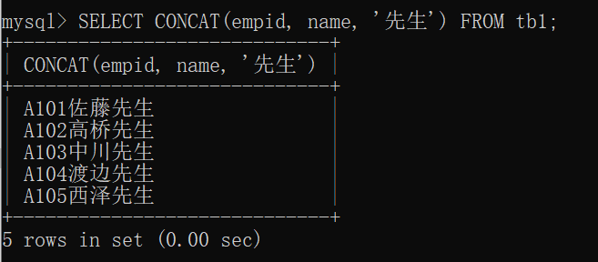

## 8.2.5 字符串操作中常用的函数

- RIGHT
  - 从右取出
- LEFT
  - 从左取出
  - 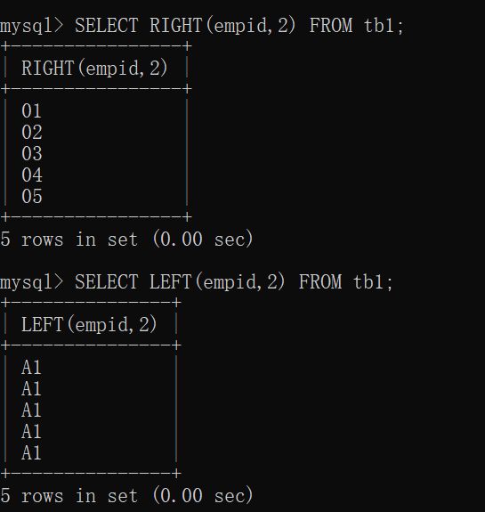
- SUBSTRING
  - 从指定的第 x 个字符开始截取 y 个字符
  - 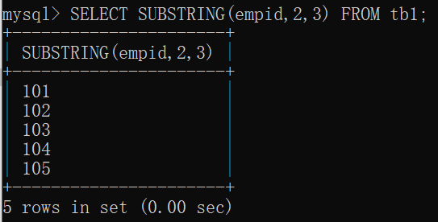
- REPEAT
  - 重复显示
  - 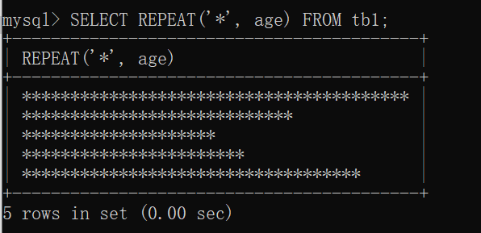
- REVERSE
  - 反转显示
  - 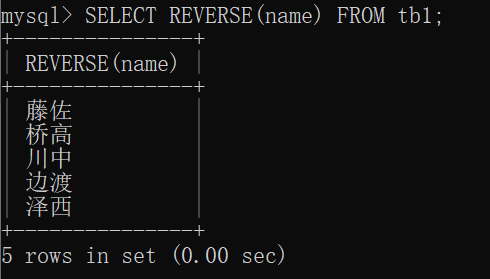

## 8.2.6 日期和时间函数

- NOW 函数
  - 用于返回当前日期和时间的函数
  - 如果想自动设置执行处理的日期和时间，可以使用 NOW()
  - 会返回日期和时间，最好将输入列设置为 DATATIME 类型
  - 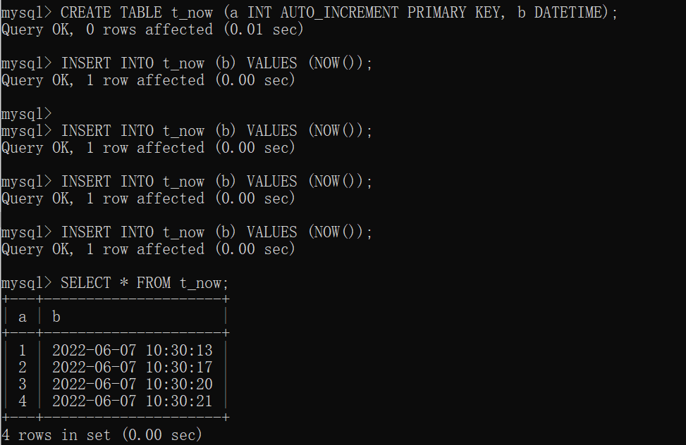

# 8.3 设置条件进行显示

## 8.3.1 确定记录数并显示

- 略

## 8.3.2 使用 WHERE 提取记录

- 略

## 8.3.3 比较运算符

- 略

## 8.3.4 使用字符串作为条件

- LIKE 模糊查询
  - 类似于正则匹配

|通配符|含义|
|----|----|
|%|任意字符串|
|_|任意一个字符|

- 示例
  - `SELECT * FROM tb1 WHERE name LIKE '%川%';`
  - 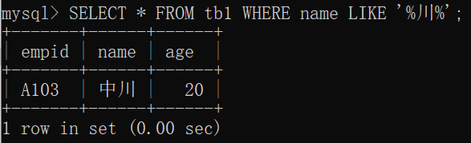
- NOT LIKE
  - 提取不包含某字符串的记录
  - `SELECT * FROM tb1 WHERE name NOT LIKE '%川%';`
  - 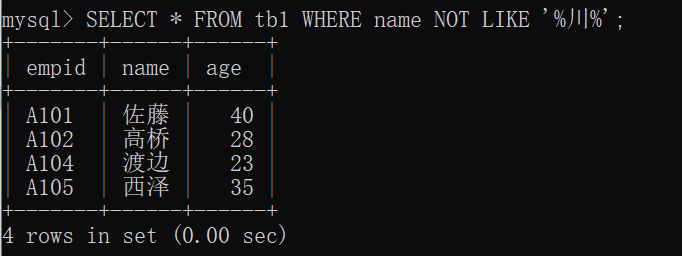

## 8.3.5 使用 NULL 作为条件

- IS NULL
  - 提取列值为 NULL 的记录
  - `SELECT * FROM tb1H WHERE age IS NULL;`
- IS NOT NULL
  - 提取列值不为 NULL 的记录
  - `SELECT * FROM tb1H WHERE age IS NOT NULL;`

[[专栏]] 删除多余的记录

- DISTINCT
  - 加在 SELECT 语句中，去除重复项

# 8.4 指定多个条件进行选择

## 8.4.1 使用 AND

- 略

## 8.4.2 使用 OR

- 略

## 8.4.3 使用多个 AND 或 OR

- 略

## 8.4.4 使用 CASE WHEN

- CASE WHEN

```mysql
CASE
    WHEN 条件1 THEN 显示的值
    WHEN 条件2 THEN 显示的值
    WHEN 条件3 THEN 显示的值
    WHEN 条件4 THEN 显示的值
...
ELSE 不满足所有条件时显示的值
END
```

- 示例

```mysql
SELECT empid, sales,
    CASE
        WHEN sales >= 100 THEN '高'
        WHEN sales >= 50 THEN '中等'
        ELSE '低'
    END AS '评价'
FROM tb;
```

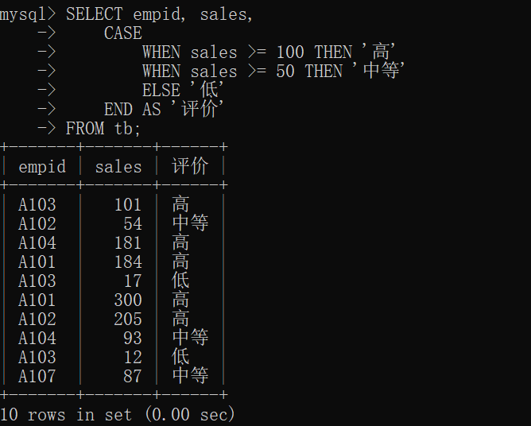

# 8.5 排序

## 8.5.1 按升序排序并显示

- 略

## 8.5.2 按降序排序并显示

- 略

## 8.5.3 指定记录的显示范围

- `SELECT 列名 FROM 表名 LIMIT 显示的记录数 OFFSET 开始显示记录的移位数;`
  - 开始显示记录的移位数 是指移动多少位后开始显示记录的数字
  - 如果设置 OFFSET 3 则会从第1条记录开始移动 3 位后，从第 4 条开始显示
  - 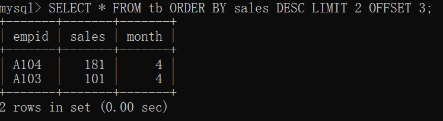

# 8.6 分组显示

## 8.6.1 分组显示

- 略

## 8.6.2 计算各组的记录数

- 略

## 8.6.3 显示各组的总和以及平均值

- 略

# 8.7 设置条件分组显示

## 8.7.1 按组处理

- HAVING
  - `SELECT 统计列 FROM 表名 GROUP BY 分组列 HAVING 条件;`
  - `SELECT empid, SUM(sales) AS '销售总额' FROM tb GROUP BY empid HAVING SUM(sales) >= 200;`
  - 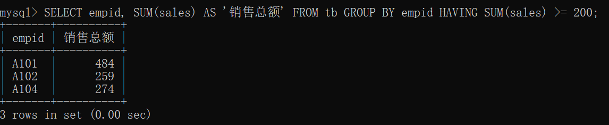

## 8.7.2 提取记录后分组

- GROUP BY 之前使用 WHERE 限定选中的记录

## 8.7.3 分组后排序

- GROUP BY 要在 ORDER BY 之前

## 8.7.4 分组方法总结

- 提取记录后分组
  - WHERE 子句，在 GROUP BY 之前
- 分组后提取记录
  - HAVING 子句，在 GROUP BY 之后

# 8.8 [[总结]]

- 介绍内容
  - 设置条件提取记录的方法
  - 使用函数提取记录的方法
  - 按照指定条件排序并显示的方法
  - 指定显示的记录数提取记录的方法
  - 设置多个条件提取记录的方法
  - 分组显示的方法
- 自我检查
  - 略
- 练习题
  - 略

[[专栏]] WHERE 和 HAVING

- 记述顺序
  - `SELECT ~ FROM ~ WHERE ~ GROUP BY ~ HAVING ~ ORDER BY ~`
- 执行顺序
  - `FROM ~ WHERE ~ GROUP BY ~ HAVING ~ SELECT ~ ORDER BY ~`
  - 也就是说，在通过 GROUP BY 分组之前会先执行 WHERE，而 HAVING 执行的对象是 GROUP BY 分组后的结果
  - ORDER BY 在最后重新排列了 SELECT 的结果
