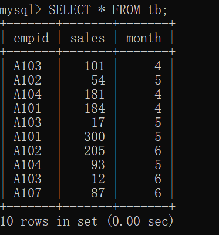

# 8.1 设计列的显示内容并执行 SELECT

## 8.1.1 准备表 tb

- 

## 8.1.2 改变列显示顺序

## 8.1.3 使用别名

# 8.2 计算列值或处理字符串之后显示列

## 8.2.1 使用列值进行计算并显示

## 8.2.2 使用函数进行计算

## 8.2.3 用于显示各种信息的函数

[[专栏]] 计算圆的面积

## 8.2.4 连接字符串

## 8.2.5 字符串操作中常用的函数

## 8.2.6 日期和时间函数

# 8.3 设置条件进行显示

## 8.3.1 确定记录数并显示

## 8.3.2 使用 WHERE 提取记录

## 8.3.3 比较运算符

## 8.3.4 使用字符串作为条件

## 8.3.5 使用 NULL 作为条件

[[专栏]] 删除多余的记录

# 8.4 指定多个条件进行选择

## 8.4.1 使用 AND

## 8.4.2 使用 OR

## 8.4.3 使用多个 AND 或 OR

## 8.4.4 使用 CASE WHEN

# 8.5 排序

## 8.5.1 按升序排序并显示

## 8.5.2 按降序排序并显示

## 8.5.3 指定记录的显示范围

# 8.6 分组显示

## 8.6.1 分组显示

## 8.6.2 计算各组的记录数

## 8.6.3 显示各组的总和以及平均值

# 8.7 设置条件分组显示

## 8.7.1 按组处理

## 8.7.2 提取记录后分组

## 8.7.3 分组后排序

## 8.7.4 分组方法总结

# 8.8 总结

[[专栏]] WHERE 和 HAVING
