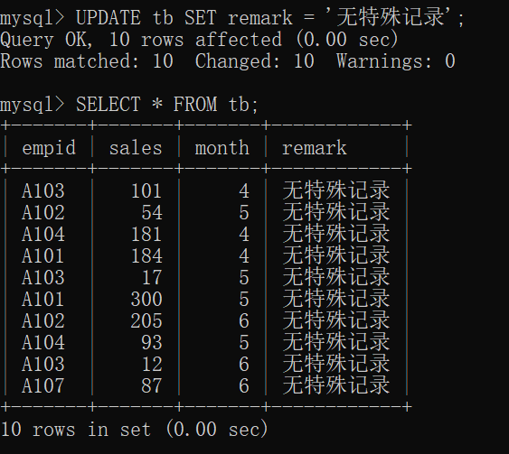
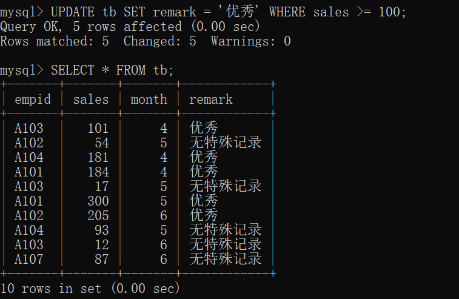
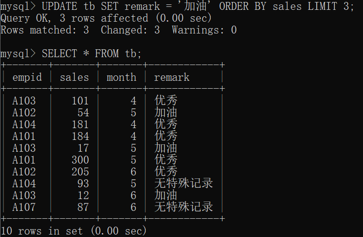
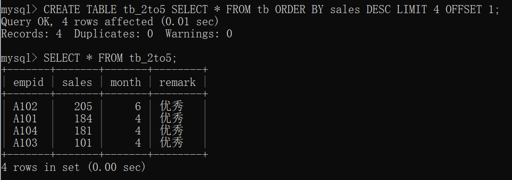
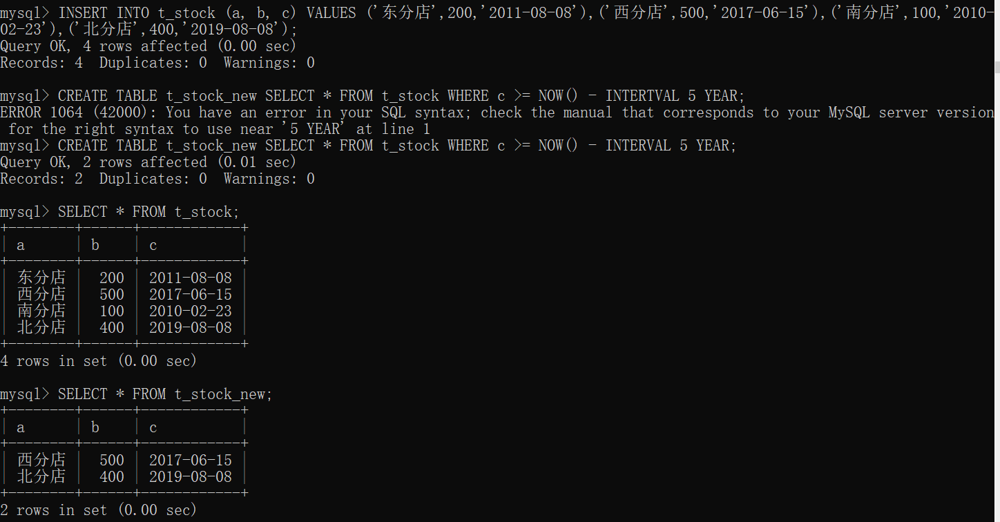

# 9.1 更新记录

## 9.1.1 瞬间更新列中所有的记录

- 修改列的所有记录
  - `UPDATE 表名 SET 列名 = 设置的值;`
  - UPDATE 命令通常在通过 WHERE 设置条件之后，以特定的记录为对象执行
    - 如果没有设置 WHERE 条件，则整列所有的值都会被替换
- 示例
  - `ALTER TABLE tb ADD remark VARCHAR(100);`
    - 添加一个新列
  - `UPDATE tb SET remark = '无特殊记录';`
  - 

[[专栏]] 防止意外执行 UPDATE 和 DELETE

- 为防止不小心把所有列值更新错了
- 在启动 MySQL 监视器的时候，加上 --safe -updates 选项
  - 如果没有 WHERE 条件则无法执行 UPDATE 和 DELETE

## 9.1.2 只修改符合条件的记录

- `UPDATE 表名 SET 列名 = 设置的值 WHERE 条件;`
  - 

## 9.1.3 将销售额最低的 3 条记录的备注修改为 “加油”

- `UPDATE tb SET remark = '加油' ORDER BY sales LIMIT 3;`
- 

# 9.2 复制符合条件的记录

## 9.2.1 仅复制指定记录

- `CREATE TABLE 新表 SELECT * FROM 旧表 WHERE 条件;`
  - 创建新表复制指定记录
- `INSERT INTO 已存在的表 SELECT * FROM 旧表 WHERE 条件;`
  - 向已存在的表中插入指定记录

## 9.2.2 排序后复制

- 上面的语句基础上加上 ORDER BY 、OFFSET
- `CREATE TABLE tb_2to5 SELECT * FROM tb ORDER BY sales DESC LIMIT 4 OFFSET 1;`
- 

# 9.3 删除符合条件的记录

## 9.3.1 删除所有记录（复习）

- 略

## 9.3.2 删除指定的记录

- 略

## 9.3.3 排序后删除

- 略

# 9.4 [[总结]]

- 介绍内容
  - 如何更新指定列的所有值
  - 如何更新符合条件的记录
  - 如何删除符合条件的记录
  - 如何在按照升序（降序）排列的记录中指定记录条数更新列值
- 自我检查
  - 略
- 练习题
  - 

[[专栏]] 数据库的运用方法

- 本书针对使用 MAMP 在 PC 上安装 MySQL、Apache、PHP，并在 localhost 环境下学习 MySQL 的读者编写的
- 实际工作中，主要有3种方法
  - 本地部署
    - 初期成本高
    - 操作和维护需要用到很多高级专业知识
    - 系统安全方面的问题也要兼顾
    - 设计的修改以及与其他系统合作等方面有较强的灵活性
  - 租赁服务器
    - 服务器的管理和维护由供应商负责，无需用到高级的专业知识
    - 初期成本大大缩减
  - 云
    - 可以根据数据量和访问次数轻松对规模和规格进行修改
    - 一般按照使用量付费，在很多情况下有利于节约成本
    - 有一些易于上手的服务，也包括一些需要具备云相关的专业知识才能使用的服务
