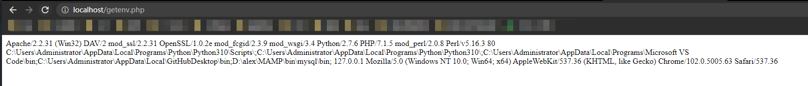
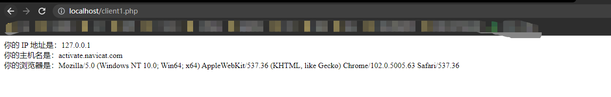
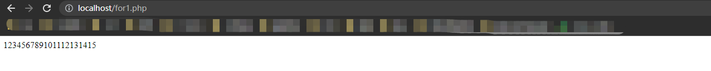

# 16.1 变量

## 16.1.1 什么是 PHP 变量

- `$a="欢迎光临！";`
  - 变量赋值表达式

## 16.1.2 变量名的规则

- 以 \$ 开头
- 对大小写敏感
- 有字母、数字和“_”组成
- \$ 后不能以数字开头

## 16.1.3 预定义常量

|常量|含义|
|----|----|
|M_PI|圆周率|
|PHP_VERSION|PHP 的版本|
|PHP_OS|运行的 OS|

## 16.1.4 变量的数据类型

- 可以根据输入的值决定相应的数据类型

# 16.2 字符串

## 16.2.1 连接字符串

- 在 PHP 中使用 “.” 连接字符串
- 字符串需要用 "" 或 '' 括起来

```php
$a="你好";
$b="欢迎光临！";
print $a.$b;    # . 连接字符串，输出 你好欢迎光临！
```

- 转义处理
  - 字符串中有 '' 或 "" 可以加上 \ 进行转义

## 16.2.2 " 和 ' 的用法

- 当使用 MySQL 创建 Web 应用程序时，会通过 PHP 脚本执行 SQL 语句
- 这种情况下，SQL 语句会作为字符串指定给 query 方法的参数

## 16.2.3 用 "" 和 '' 将变量括起来的区别

- " " 中的变量会被解析 `$a=123; print "$a";` 会显示 123
- '' 中的变量不会被解析 `$a=123; print '$a'` 会显示 $a

# 16.3 函数

## 16.3.1 本书涉及的 PHP 函数

|函数名|内容|
|:----|:----|
|date|返回当前日期和时间|
|exec|执行命令|
|phpinfo|显示 PHP 信息|
|n12br|在需要换行的情况下，插入 HTML 换行标签|
|preg_match|使用正则表达式执行模糊查询|
|htmlspecialchars|转换标签等特殊字符串|
|isset|检查是否设置了变量|
|getenv|获取环境变量|
|gethostbyname|通过主机名获取 IP 地址|
|gethostbyaddr|通过 IP 地址获取主机名|

## 16.3.2 通过 date 函数显示日期和时间

- `date(时间的格式)`
- date 函数指定的字符串

|时间的格式|返回值|
|----|----|
|g|12 小时制的小时|
|h|2 位数字表示的 12 小时制的小时|
|G|24 小时制的小时|
|H|2 位数字表示的 24 小时制的小时|
|j|日期|
|l|星期的英文字符串（返回 Saturday 等字符）|
|F|月份的名称（返回 January 等字符）|
|n|月份|
|m|2 位数字表示的月份|
|s|秒 （2位数）|
|Y|年份|
|y|2 位数字表示的年份|

- 使用 date 函数

```php
<?php
print "今天是" . date("Y"). "年".date("m")."月".date("j")."日"; 
?>
```

## 16.3.3 环境信息

- 通过 phpinfo 函数获取环境信息
- getenv 函数
  - 用于返回 环境变量的值
  - 指定特定的参数可以获取相应的信息
  - `getenv (想获取的信息项)`

|参数（想获取的信息项）|获取的信息|
|SERVER_SOFTWARE|Web 服务器软件|
|SERVER_PORT|使用的端口|
|PATH|服务器中设置的路径|
|REMOTE_ADDR|客户端的 IP 地址|
|HTTP_USER_AGENT|客户端的浏览器信息|

```php
<?php
print getenv ("SERVER_SOFTWARE")." ";
print getenv ("SERVER_PORT")." ";
print getenv ("PATH")." ";
print getenv ("REMOTE_ADDR")." ";
print getenv ("HTTP_USER_AGENT")." ";
?>
```



## 16.3.4 通过 gethostbyaddr 函数获取主机名

- `gethostbyaddr (主机的 IP 地址);`
- `gethostbyaddr (getenv ("REMOTE_ADDR"));` 可以嵌套函数

```php
<?php
print "你的 IP 地址是：";
print getenv("REMOTE_ADDR");
print "<br>"
print "你的主机名是：";
print gethostbyaddr(getenv("REMOTE_ADDR"));
print "<br>"
print "你的浏览器是：";
print getenv("HTTP_USER_AGENT");
print "<br>"
?>
```



# 16.4 比较运算符

- 略

# 16.5 循环处理

## 16.5.1 通过 for 实现循环

```php
fot (初始值; 循环条件; 增量){
    循环执行的处理
}
```

- 循环执行用 {} 括起来的处理
- 这部分处理可以使用多行来描述
- () 里设置了如何进行循环处理

```php
<?php
for ($i=1; $i<=15; $i += 1){
    print "$i";
}
?>
```



- for 执行流程
  - $i=1 变量 $i 的初始值是1
  - $i \<= 15 当 $i 小于等于 15 时进行循环
  - $i += 1 每次循环 $i 都增加1

## 16.5.2 通过 while 实现循环

```php
while(循环条件){
    循环执行的处理;
}
```

- while 中没有设置计数器变量初始值的部分，必须自己设置初始值
- 循环过程中又不符合循环条件的时候，则循环结束，否则无限循环

- 代码 略 类似于 python while 循环

## 16.5.3 通过 do ... while 实现循环

```php
do{
    循环的处理;
}while() # 英文释义 做某件事，当xx时，很好理解
```

- 在使用 while 的时候，会先进行条件判断，不满条件则不会执行循环，而是直接结束
- 但 do ... while 中会先执行循环，在判断

# 16.6 条件判断

## 16.6.1 通过 if 进行条件判断

```php
if (条件)
{
    复核条件时执行的处理;
}else{
    不符合条件时执行的处理
}
```

- else 部分可以省略，只有当条件符合时才执行 if 后的语句，其他情况不执行操作

## 16.6.2 三元运算符

- `(条件) ? 符合条件时的值 : 不符合条件时的值;`
- 简化了 if 的编写，便根据条件改变了值本身

```php
<?php
print (200>100)?"大" : "小";
?>
```

## 16.6.3 设置了多个条件的 if 的语法

- 设置多个条件的 if 语句的执行流程
  
```php
<?php
if (date("G") >= 18){
    print "晚上好"; # 如果时间大于18点，则显示晚上好
}elseif(date("G") >= 9){
    print "你好"; 
}elseif(date("G") >= 6){
    print "早上好"; 
}else{
    print "不困吗"; 
}
?>
```

## 16.6.4 使用 switch 的条件判断

- 当根据变量值执行不同处理时，可以使用 switch

```php
switch(变量){
    case 变量的值1:
        处理1;
        break;
    case 变量的值2:
        处理2;
        break
    ...
    default:
        不符合所有条件时进行的处理;
}
```

```php
<?php
switch(date("G")){
    case 10:
        print "10点的零食";
    case 15:
        print "3点的零食";
    default:
        print "这不是零食";
}
?>
```

# 16.7 数组

## 16.7.1 什么是数组

- 数组 可以存储多个值的特殊变量
- 数组需要声明
- `$m=array("老鼠","牛","兔子","Dragon")` 类似 python 列表
- 取值 `$m[0]`

## 16.7.2 给数组赋值的方法

- 直接赋值
  - `$m[1] = "哈哈"`    # 类似 python 给列表赋值
- 按顺序赋值
  - `$m[] = "老鼠"` `$m[] = "牛"`  [] 方括号内不加数字，可以按顺序赋值
- 数组 实际是一个以数字为键，以字符串等信息为值的数组，因此 乱用 `$m[888] = "x"` 的方式赋值，会造成内存浪费

## 16.7.3 关联数组

- 下标 除了可以使用表示顺序的数字之外，还可以使用自定义的字符串，这种即是 **关联数组** 类似 python 字典

```php
<?php
$t["English"]=73;
$t["Math"]=84;
$t["China"]=68;
print "总分是：";
print $t["English"] + $t["Math"] + $t["China"];
?>
```

- 类似使用字典

[[专栏]] 关联数组的下标即使不使用 "" 或 '' 括起来也能正常工作吗

- 能正常工作，但内部实际已经发送错误
- 不建议这样做

# 16.8 [[总结]]

- 介绍的内容
  - PHP 中变量的使用方法
  - PHP 中字符串的处理方法
  - PHP 函数的概况和一些常用函数
  - 比较运算符的使用方法
  - 循环处理的程序设计
  - 条件判断的程序设计
  - 数组的使用方法
- 自我检查
  - 略

[[专栏]] PHP 的文档

[php 的中文文档](http://php.net/manual/zh/index.php)
