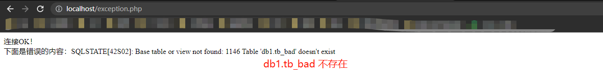

# 18.1 使用 PHP 脚本连接到 MySQL 服务器

## 18.1.1 从 PHP 连接到数据库的方法

- 在 PHP 中科院使用 mysqli 函数 或者使用 PDO 类来操作 MySQL
- PHP 支持很多数据库，但 mysqli 仅支持 MySQL
- mysqli 比 PDO 的处理速度更快
- 如果使用 PDO （PHP Data Object）那么无论哪种数据库，都可以使用相同的 PHP 脚本
- 本书介绍 PDO 操作 MySQL

## 18.1.2 什么是 PDO？什么是类？什么是方法？

- PDO
  - 标准数据库连接机制
  - 目的是更方便地利用数据库
  - 是用于管理数据库的“类”
  - 通过其“对象”（Object）来操作数据库
- 可以把类当做数据和操作的集合，也就是说， PDO 类中包含了许多用于处理数据库的数据和操作方法
- 在操作 MySQL 服务器的情况下，需要先通过 PDO 类创建一个用于操作数据库的 PDO 对象
- 方法是指从属于类的函数

## 18.1.3 使用 PDO 连接到 MySQL 服务器

- new 创建对象
  - `new PDO (数据源名称, 用户, 密码)`
  - 用户名 密码 是用于连接 MySQL 的用户名和密码
  - 数据源名称格式
    - 驱动名称：host=主机名
    - dbname=数据库名
    - 驱动名称取决于使用的数据库种类
  - `$s= new PDO ("mysql:host=localhost; dbname=db1", "root", "root");`
    - 页面显示连接成功，则说明数据库连接成功了

# 18.2 使用 PDO 执行 SQL 语句

- query 方法
  - `PDO 对象 ->query ("执行的sql语句")`
  - 执行方法时，要给变量加上符号 ->
  - 可以明确执行的是哪个对象的方法

## 18.2.1 向表中插入数据

```php
<?php
$s=new PDO("mysql:host=localhost;dbname=db1","root","root");        
$s->query("INSERT INTO tb1 VALUES('K777','豌豆太郎',20)"); 
# 发送了 INSERT 语句，因为 query 方法的参数是字符串，所以要用引号括起来
?>
```

## 18.2.2 在 PHP 中接收 SQL 语句的执行结果

- 要想把执行结果显示在浏览器上，就需要执行 SELECT 语句，并对其结果进行处理
- `$re= $s -> query("SELECT * FROM tb");`
  - 会将 query 方法返回的结果赋给变量 $re
  - fetch() 方法可以从作为 SELECT 语句结果的 PDOStatement 对象中取出使用 print 就能输出的记录
  - `PDOStatement对象 -> fetch()`
- fetch()
  - 没有参数，返回值是记录的数组
  - 执行第一次 fetch() 方法时，会输出第一条记录作为数组返回
  - 第二次执行会输出第2条记录
  - `$re -> fetch()` 会从 SQL 语句的结果返回一个数据数组，如果没有可读取的数据就会返回 FALSE

```php
$re=$s -> query("SELECT * FROM tb");

while($result=$re -> fetch()){
    print $result[0];
    print $result[1];
    print $result[2];
}
```

- 添加记录后理解显示结果
  - 在执行 SQL 语句 SELECT * FROM tb 之前执行 INSERT 语句，就可以立即确认添加记录后的结果
  - insert_expression.php

# 18.3 异常处理中的错误处理

- 在 PHP 中执行过程中发生的问题（错误）称为异常
- 异常处理是指在发生异常的情况下执行的处理
- 发送异常时，程序会根据错误种类自动生成各种各样的对象，所以我们可以使用该对象来编写异常处理
- 需要用到 `try ~ catch` 语句

```PHP
try(
    可能会发生异常的处理
)catch(异常名称 接收异常的变量){
    在发生异常的情况下执行的处理
}
```

- 在连接数据库失败的情况下会引发 PDOException 的异常
- getMessage 方法可以用来获取错误信息
- `PDOException 对象 -> getMessage()`

## 18.3.1 SQL 的错误处理

- 如果要执行 MySQL 连接失败以外的异常处理，就需要修改初始设置（属性）
- `PDO 对象 -> setAttribute (修改模式的属性, 设置的值)`
  - 错误相关的属性通过值 PDO:ATTR_ERRMODE 来表示
  - 将属性设置为 PDO:ERRMODE_EXCEPTION，发生错误时就会生成 PDOException 对象
  - `$s->setAttribute(PDO:ATTR_ERRMODE, PDO:ERRMODE_EXCEPTION);`

```php
<?php
try{
    $s=new PDO("mysql:host=localhost;dbname=db1","root","root");
    $s->setAttribute(PDO::ATTR_ERRMODE,PDO::ERRMODE_EXCEPTION);
    print "连接OK！<br>";
    $s->query('INSERT INTO tb1 VALUES("K888","岗村花子",555)');
    $re=$s->query("SELECT * FROM tb_bad");
    while($result=$re->fetch()){
    print $result[0];
    print " : ";
    print $result[1];
    print " : ";
    print $result[2];
    print "<br>";
    }
}catch(PDOException $e){
    print "下面是错误的内容：" .$e->getMessage();
}
?>
```

- 生成 PDO 对象后，通过 setAttribute 方式更改错误模式，以便在执行 SQL 时能进行异常处理
- 对不存在的表执行了 SELECT 语句，就会发生异常 （PDOException 对象）
- 

[[专栏]] 显示数据库中存在的表

- 使用 query 方法发送 SHOW TABLES 命令

```PHP
<?php
$s= new PDO ("mysql: host=localhost; dbname=db1", "root", "root");
$re = $s -> query("SHOW TABLES");
while($result=$re -> fetch()){
    print $result[0];
    print "<br>";
}
?>
```

# 18.4 [[总结]]

- 介绍的内容
  - 使用 PHP 连接数据库的方法
  - 使用 PHP 执行查询的方法
  - 使用 PHP 添加记录的方法
  - 使用 PHP 显示查询结果的方法
- 自我检查
  - 略
- 练习题

```php
<?php
$s= new PDO("mysql: host=loaclhost; dbname=db1", "root", "root");

$q <<<eot
SELECT empid, AVG(sales) FROM tb
WHERE sales >= 50
GROUP BY empid
HAVING AVG(sales) >= 120
ORDER BY AVG(sales) DESC;
eot;

$re= $s -> query($q);
while ($result=$re -> fetch()){
    print "员工号：";
    print $result[0];
    print "平均销售额：";
    print $result[1];
    print "<br>"
}
?>
```
