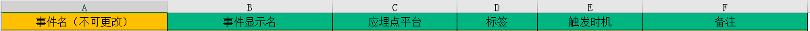
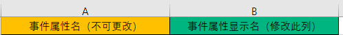
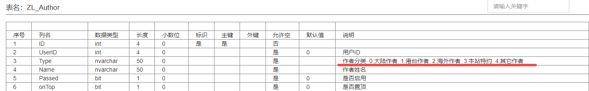
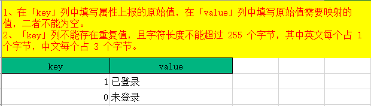

# 神策——产品应用环境配置

- 神策内部路径：神策分析系统 —— 元数据 —— 元数据管理
- 对 **元事件、事件属性** 进行语言转换

## 1. 技术语言转换成业务语言 —— 元数据管理

### 1.1 单一元事件或属性显示名修改

- 点击需要修改显示名的事件或属性 —— 点击【编辑】按钮，修改后点击【确认】提交即可

### 1.2 批量对元事件或属性显示名进行更改

- 点击右上角 【批量修改信息】按钮，下载模板文件[^1] 
  - 模板中需填写的字段有：事件名、事件显示名、应埋点平台、标签、触发时机、备注
    - 事件名：在数据采集需求文档中，【自定义埋点】与【全埋点事件表】中的事件名
    - 事件显示名：
      - 数据采集需求文档中，事件对应的中文名，
      - 如果下载的采集文档中没有，在【腾讯文档】中的采集方案中，有对应的中文名
      - 也可以建立团队文档，设置对应的数据
    - 应埋点平台：神策中 JavaScript 和 web 是一致的
    - 标签：为了方便管理，可以打上自定义标签
      - 可以建立团队文档，设置不同标签及标签说明
    - 触发时机：触发事件的时机，设计采集方案时，即有对应的文档
&nbsp;

- 下载下来后，字段【事件名】即为全部的元属性名，只需修改【事件显示名】、【应埋点平台】、【标签】、【触发时机】、【备注】即可。
- 在腾讯文档的 【数据采集方案】中，【自定义事件表】、【全埋点事件表】中有对应信息

*模板示例如下：*

&nbsp; 

> 事件属性、用户属性、物品属性，批量设置，步骤与元事件批量修改类似

*事件属性批量修改模板：*

- 下载下来后，字段【事件属性名】即为全部的属性名，只需将【事件属性显示名】中英文部分个修改为中文即可
- 在腾讯文档的 【数据采集方案】中，【自定义事件表】、【公共属性】、【全埋点事件表】中，有约定好的事件中文名

*用户属性批量修改模板：*

- 下载下来后，字段【用户属性名】即为全部的属性名，只需将【用户属性显示名】中英文部分个修改为中文即可
- 在腾讯文档的 【数据采集方案】中，【用户表】中，有约定好的用户属性中文名

*物品属性：*

- 属性较少，且已设置中文显示名，略过

> 备注：将事件含义，写入备注，在事件模型筛选时，鼠标悬停于事件，即可得知事件的具体含义

---

## 2. 设置虚拟事件备注（略）

- 【虚拟事件】：将元事件或可视化全埋点事件（支持可视化全埋点事件需要 SDG 版本：0.7.4865以上）进行拆解或者组合形成新的「虚拟事件」，从而减少每次在分析过程中反复对固定常用的事件进行筛选配置。
- 设置方式与元事件设置类似
- 尚未设置虚拟事件，故略过

> 在神策各个模型选择事件时，鼠标悬停在某一事件，即可展示已添加的「备注」信息，方便新用户 了解事件含义

---

## 3. 为阅读困难的属性值上传维度字典

- 简单理解，某些属性，有一些比较固定值，将其转化为简单易懂的语句
  - 如响应状态码 200 代表 连接成功
- 即为属性的值赋予不同含义，例如：
&nbsp;

  - 
&nbsp;

- 实操中，比如 is_login 通过上传 0 表示【未登录】，1 表示【已登录】
- 可以设置如下字典：
&nbsp;

  - 

> 字典无法批量设置，针对每个属性，只能单独设置

## 4. 将元事件/虚拟事件进行标签分类

- 埋点事件比较多的情况，为了便于快速找到需要的事件（按埋点排期标记等）
  - 可用添加标签的方法，管理元事件/虚拟事件。
  - 例如，将事件所属的平台类型作为标签进行管理。
&nbsp;

- 可以批量修改标
- 标签内容可以自定义，最好与业务结合起来

## 5. 隐藏不需要的事件和属性

- 对于前期不慎上传到正式环境的错误事件或属性，可以隐藏
- 对于产品迭代后不需要的事件和属性，可以隐藏
&nbsp;

> 实操中，由于先后有2个前端进行任务对接，此前的前端某些属性未按照【数据采集方案】中的属性命名，因此对这些错误上传的属性，进行隐藏

## 6. 停止接收已入库但不再需要接收数据的事件

- 对不需要再接收的元数据，点击编辑，选择【停止接收】即可
- 如后续再次需要接收，设置为接收即可
  - 期间未接收的数据不恢复

> 实操中，因大小写问题，将一个事件，分两次进行了上传，因此保留一个，对另一事件设置为 不可见，且不接收数据

## 7. 按需删除无数据上报且无需再使用的事件或属性

- 在【元事件/事件属性】模块，点击需要删除的事件的【操作栏】-【删除】进行删除
  - 仅针对【数据强校验模式】

> 实操中，并未选择数据强校验模式，对不需要的事件，选择不可见、不接收数据即可，尽量不删除数据，以避免出错

## 8. 利用虚拟事件配置常用指标

- 虚拟事件由多个元事件组合而来
  - 可以为虚拟事件的每个元事件设置过滤条件
  - 也可以为单个元事件设置过滤条件后形成虚拟事件

> 实操中，暂未用到，运营接入不多

## 9. 利用虚拟属性配置常用维度

- 通过 SQL 表达式对已入库的事件属性和用户属性进行二次加工，产生一个新的属性值，即创建【虚拟属性】的功能
- 比如 SQL 中聚合计算销售额，销售额可以称为新的属性
  - `SELECT data, SUM(sales) AS 'sales_day' FROM events GROUP BY data`
  - 将销售额按照天的维度聚合起来，生成每日销售额 

> 实操中，暂未用到，运营接入不多

## 10. 创建 session 进行会话分析

- “访问深度、平均交互深度、平均使用时长、页面平均停留时长、跳出率、页面退出率”需引入 Session 才能分析
- 点击【元数据】-【session 管理】-【创建 session】

> 实操中，暂未用到，运营接入不多

[^1]: 此模板文件是被保护的，接触需要密码，密码未知，创建新的excel文件，然后复制粘贴过来，再进行修改即可
[^2]: 已埋点的部分才显示，暂不埋点的不展示